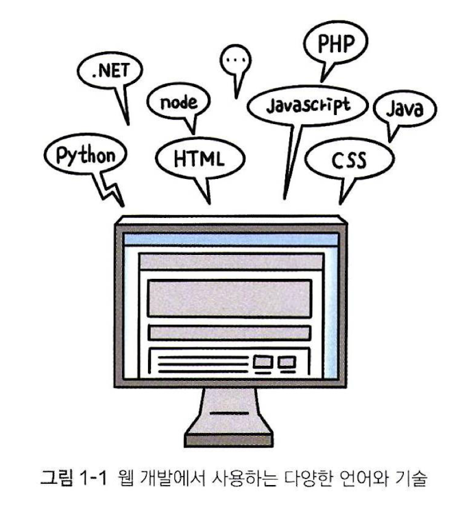

# chapter 1 : 웹 개발 시작하기

## 01 웹 개발 환경 만들기

* 웹 개발의 시작은 어디서부터 어디까지? 우선 필요한 HTML, CSS, 자바스크립트를 먼저 다뤄보자

### 01-1 웹 개발 알아보기

* 화면에 정해진 사이트의 내용만을 보여주는 사이트 : **정적사이트(static site)**
* 화면에 정해진 것 외에 기능성을 추가한 사이트 : **동적사이트(dynamic site)**

#### 서버와 클라이언트

* 서버 : 웹 사이트에 접속하면 보이는 데이터들을 저장하고, 보여주는 컴퓨터
* 클라이언트 : 웹 사이트를 접근하는 PC 등의 장치 
* (좁은 의미에서 클라이언트) : 웹 브라우저

#### 프론트엔드 개발과 백엔드 개발
* 프론트엔드(front-end) : 웹 사이트 디자인, 사용자 동작에 반응하는 기능을 만들 수 있다. 스마트폰, 태블릿 PC 에서 사용하는 모바일 환경 등을 위해선 해당 분야 이해가 필수. 다양한 웹 브라우저의 종류와 버전에 따라 작동할 수 있게 만드는게 중요. 
	* 키워드 : #HTML #CSS #자바스크립트
* 백엔드(back-end) : 사용자의 보이지 않는 영역에서 데이터베이스 설계, 저장, 처리와 같은 다양한 영역의 일을 진행한다. 
	* 키워드 : #자바, #PHP, #파이썬 등... 

<프론트엔드 개발의 중요성>
주고 받은 정보를 시각화 시키고, 소통할 수 있도록 만드는 것, 기술과 서비스가 인터넷 기반으로 발전하는 만큼 중요하다. 

---

### 01-2 웹 개발, 어디서부터 시작할까 

#### 웹 개발을 위해 공부해야 할 기술

#### 웹 개발의 기본 HTML, CSS, 자바 스크립트
**웹 문서의 뼈대를 만드는 HTML**

웹 브라우저 창에 웹 문서의 내용을 보여주는 데 필요한 약속. 제목과 본문, 이미지와 표 같은 웹 요소를 알려주는 역할을 하며, 이에 HTML에 맞는 표기법을 사용하는 것이 중요하다. 

**웹 문서를 꾸미는 CSS**

HTML로 작성된 내용을 사용자가 알기 쉽게 꾸미거나, 배치하는 용도로 사용됨. 특히 각 디바이스에 따라 화면이 바뀌는 반응형 웹 디자인을 만들려면 CSS 학습이 필요하다. 

**사용자 동작에 반응하는 자바 스크립트**
  
사용자가 클릭을 하거나 스크롤하거나 하는 동작에 반응하는 요소들을 만들 때 자바스크립트가 필요하다. 이때 규모가 큰 웹 사이트 개발에는 리액트(React), 뷰(Vue)와 같은 자바스크립트 프레임 워크를 사용한다. 당연히 자바 스크립트 이해도가 해당 라이브러리 사용을 쉽게 만든다.

#### 프론트엔드 개발을 위한 기술 
최근 웹 브라우저에서 표현할 수 있는 기술이 많아지고, 웹 사이트의 어플리케이션화는 점차 고도화 되어가고 있기에 이미 자바스크립트의 라이브러리와 프레임워크를 알아두면 좋다. 
#바닐라_자바스크립트 : 라이브러리나 프레임워크 없이 자바 스크립트 만으로 작성해 내는 개발 방식

* 라이브러리 도구와 프레임워크
	* 라이브러리 도구(toolkit)와 프레임워크의 가장 큰 차이는 개발 흐름의 주도권을 누가 쥐고 있는가에 달렸다. 
	* 라이브러리는 개발자가 해당 도구로 필요한 기능만을 사용하는 방식으로 되기에 주도권이 개발자에게 있다.
	* 프레임워크의 경우 개발 주도권이 프레임워크에 정해져 있고, 이를 따라야 한다. 

#### 백앤드 개발을 위한 기술
백앤드 개발의 경우 웹 브라우저 화면에 보이지 않는 영역을 담당한다
그렇기에 단순히 서버 만이 아니라, 클라이언트와 서버 사이의 정보를 저장, 관리하는 데이터 베이스(database) 등의 기본 개념을 알아야 한다.
서버 운영체제에 따라 사용되는 언어와 프레임워크가 달라질 수 있으니 이 역시 참고해야 한다. 

## 02 웹 개발 환경 만들기 

### 02-1 웹 브라우저와 웹 편집기

#### 웹 브라우저
우리 모두 잘 아니까...

#### 웹 편집기
HTML 이나 CSS, 자바 스크립트 소스를 편집하는 도구로 웹 편집기(web editor), 또는  코드 편집기(code editor)

### 02-2 웹 개발 환경 설정하기

~ vsc 기반으로 설명해줌. 딱히 기재는 안하고 필요한 내용만 정리 
1. 다운받기
2. 설치하기
3. 언어 변경하기 ~ 하면 마크다운 편집할 때 빡쳐서 안함~
4. 테마 바꾸기 
5. 작업 폴더 추가하기 (깃 쓰니까 노필요)
6. 간단한 웹 문서 만들기 
7. 폰트 설정 등등등... 