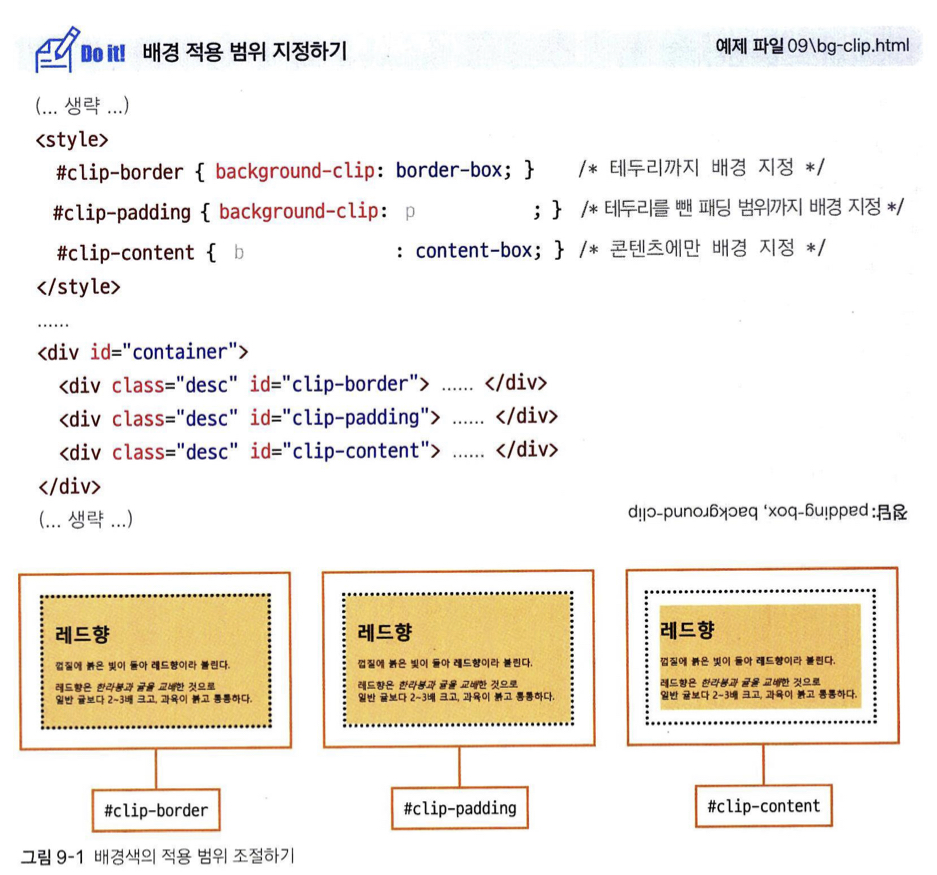

# front_chapter 3

## 06 CSS의 기본

### 06-1 웹 문서에 디자인 입히기
#### 왜 스타일을 사용할까?

웹 문서에서 스타일style이란 HTML 문서에서 자주 사용하는 글꼴, 생상, 정렬, 각 요소의 배치 방법과 같이 문서의 겉모습을 결정 짓는 것을 가리킵니다. 그렇다면 왜 따로 스타일을 사용하는가?

**웹 문서 내용과 상관없이 디자인만 바꿀 수 있습니다.**

* 내용과 디자인이 구분되어 있으면, 나용을 수정하더라도 디자인에 전혀 영향을 미치지 않아 편리합니다.
* 디자인만 바꿔서 완전히 다른 느낌 나는 문서로 만들수도 있습니다.


**다양한 기기에 맞게 탄력적으로 바뀌는 문서를 만들 수 있습니다.**

* 기존 HTML 문서는 웹 브라우저 화면이 기본으로 되어 있어서 인쇄하려면 용지에 맞게 따로 작성해야 했습니다.
* 하지만 CSS 활용을 하면 작성한 내용은 그대로 두고 CSS를 통해 여러 형태나 기기에서 볼 수 잇도록 만들 수 있습니다.
* 반응형 웹 디자인 : 웹 브라우저의 크기에 따라 화면 레이아웃을 자동으로 바꿔주는 디자인. 하나의 웹 문서에서 여러 상황에 대응하게 만드는 것을 의미합니다.


### 06-2 스타일과 스타일 시트

#### 스타일 형식 알아보기

* CSS 스타일의 형식은 다음과 같습니다.
  * 기본형 : 선택자 { 속성1: 속성값1; 속성2: 속성값2; }
* 선택자 : 어떤 `tag`에 적용할지를 알려줌
* 중괄호 { 속성: 속성값 } : 적용시킬 CSS 속성과 그 옵션을 지정함.
* `;`  <sub>세미콜른</sub> : 여러개의 스타일 규칙을 지정할 때 도움이 됨.


**스타일 규칙을 작성하는 방법 #css #rules**

* 다음과 같은 형태로 스타일 규칙을 지정해서 사용하는 것이 가능합니다.

```css
p {
	text-align: center;
	color: blue;
}

p { text-align: center; color: blue; }
```

**스타일의 주석을 표기하는 방법 #css #comment**

* `/* */` 사이에 내용을 넣으면 주석 처리가 됩니다.

**CSS 소스 경량화 #css #minify**

CSS 소스는 네트워크 상에서 파일을 내려 받게 되므로 파일크기가 작은것이 유리합니다. 따라서 소스가 길면 공백, 줄바꿈, 주석을 지우고 필요한 정보만 남겨서 파일을 만들어 사용합니다. 이를 CSS 소스 `경량화(minify)` 라고 합니다. 이를 위한 툴도 존재합니다.


#### 스타일 시트 알아보기

웹 문서 안에서 스타일 규칙을 여러개 사용합니다. 이런 스타일 규칙을 한 눈에 확인하고 필요할 때마다 수정하기도 쉽조록 한 군데 묶어 놓은 것을 `스타일 시트`라고 합니다. 스타일 시트는 다음과 같은 것들이 존재합니다.


**브라우저 기본 스타일**

CSS 를 사용하지 않은 웹 문서라도 웹 브라우저에서 사용하는 기본 스타일로 적용되어서 나옵니다. 이를 `브라우저 기본 스타일`이라고 합니다.

**간단한 스타일 정보를 적용하는 인라인 스타일**

간단한 스타일 정보라면 스타일 시트 사용하지 않고 적용할 대상에 직접 표시 합니다. 이런 방법을 `인라인 스타일`이라고 합니다. 한 마디로, 태그 내에 속성으로 넣는 것이며 이는 `style` 속성을 활용하면 됩니다.

```html
<h1>레드향</h1>
<p style="color: blue;">껍질에 붉은 빛이 돌아 레드향이라고 불린다.</p>
.
.
```


**스타일을 여러 곳에 적용할 때 쓰는 내부 스타일 시트**

웹 문서 안에서 사용할 스타일을 같은 문서 안에 정리한 것을 `내부 스타일 시트`라고 합니다. 모든 스타일 정보를 `<head>` 태그 안에 정의하고 `<style>`태그들 사이에 작성하면 됩니다.


**스타일 정보를 따로 저장해 놓은 외부 스타일 시트**

* 대부분의 디자인에 일관성이 있는 스타일을 여러 웹 문서에 적용해야 합니다. 따라서 웹 문서 내부 스타일 시트로 만들면 동일한 내용을 계속 수정해야 하며, 각 파일마다 이부분이 여분으로 들어가는 만큼 시간과 서버 내부 디스크 용량적 오버헤드를 발생시킵니다. 따라서 일반적으로 사이트를 제작할 때는 여러 웹 문서에서 사용할 스타일을 별도 파일로 저장해놓고 필요할 때마다 가져와서 사용하는 것이 일반적입니다. 이를 `외부 스타일 시트`라고 부르며 `*.css`파일 형태로 저장하고 사용합니다.
* 이러한 외부 스타일 시트 파일로 스타일을 적용시에는 `<link>`태그를 통해 적용합니다.
  * 기본형 : `<link rel="stylesheet" href="외부 스타일 시트 파일 경로">`

### 06-3 CSS 기본 선택자 알아보기

#### 전체 요소에 스타일을 적용하는 <span style="color: red;"><strong>전체 선택자</strong></span> #css #전체_선택자 #universal_selector

* 개념 : 스타일을 문서 모든 요소에 적용할 때 사용한다.
* 기본형 : `* { property: value; ... }`
* 전체 선택자 적용은 웹 브라우저의 기본 스타일을 초기화 할 때 사용하며, 대표적으로 마진, 패등과 같은 것들을 수정한다고 할 때 우선 기본적인 값을 0으로 지정하고 사용자가 추가로 바꾸면서 수정을 용이하게 만들 수 있습니다.


#### 특정 요소에 스타일을 적용하는 <span style="color: red;"><strong>타입 선택자</strong></span> #CSS #타입_선택자 #type_selector

* 개념 : 특정 태그를 사용한 모든 요소에 스타일을 적용합니다.
* 기본형 : `tag_name { property: value; ... }` &#x20


#### 특정 부분에 스타일 적용하는 <span style="color: red;"><strong>클래스 선택자</strong></span> #CSS #클래스_선택자 #class_selector

* 개념 : 같은 태그라도 일부 다른 스타일을 사용하고 싶은 경우 사용하는, 특정 부분을 위한 스타일 적용 방식
* 기본형 : `.class_name { property: value ; ... }`
* class 명이 정해지게 되면 `<span>` 태그를 사용해서 만든 class 태그명을 지정해주면 적용됩니다.
* 어떤 요소 하나에 클래스 스타일을 2개 이상 적용도 가능합니다. 이 경우 적용 시 공백으로 구분해서 스타일 명을 적으면 됩니다.
>  <strong><big>써보니 알게 된점!</big></strong>
>  해당 태그는 단순히 한두번 사용하기 위한 용도가 아니라, 웹 컨텐츠를 꾸미는 과정에서 공통적으로 적요오디어야 하는 속성일 때 진가를 발휘한다. 
>  예를 들면 원 3개를 만들어야 할 때, 그런 경우 클래스 선택자로 공통 요소를 묶고, 나머지만 id 선택자나 클래스로 구분하여 사용한다면(혹은 인라인 스타일도 좋을듯) 개발 과정이 덜 복잡해지고 손쉬워 진다. 
>  

```html
/* 클래스 선택자 사용하기 + 두 개 class 적용해보기 */
<!DOCTYPE html>
<html lang="ko">
<head>
	<meta charset="UTF-8">
	<title>상품 소개 페이지</title>
	<style>
		p {
			font-style: italic;
		}
		.accent {
			border: 1px solid #000;
			padding : 5px;
		}
		.bg {
			background-color: #ddd;
		}
	</style>
</head>
<body>
	<div>
		<h1 class="accent bg">레드향</h1>
		<p>껍질에 붉은 빛이 돌아 <span class="accent bg">레드향</span></p>
		<p>레드향은 한라봉과 귤을 교배한 것으로 ...</p>
		.
		.
		.
	</div>
</body>
</html>
```


#### 특정 부분에 스타일을 한 번만 적용할 수 있는 <span style="color: red;"><strong>id 선택자</strong></span>#CSS #id_selector

* 개념 : 웹 문서에서 특정 부분을 선택해서 스타일을 지정할 때 사용합니다. 마침표 대신 `#`을 사용한다는 차이점이 있고, 사용시 `id=아이디 명` 형태로 지정해서 사용할 수 있습니다.
* 기본형 : `#id_name { property: value; }`
* \#클래스\_선택자 선택자와의 차이점은 클래스 선택자는 문서 내에서 여러번 적용이 됩니다. 하지만 id 선택자는 중복해서 적용은 불가능하고, _한 번만_ 적용할 수 있습니다.
* 이는 문서 레이아웃과 같은 스타일 적용시 지정하거나, 웹 요소에 자바 스크립트 프로그램을 사용하면서 요소를 구별할 때 사용합니다.
> 해당 선택자를 사용함은, 여기저기 적용이 가능하나, 해당 속성만을 무조건 넣어야 하므로, 어떤 컴포넌트인지를 알 수 있고 선택할 수 있다. 
> 한 마디로, 관리면에서 대단히 용이하게 작동한다고 볼 수있다. 


[추가 학습 사이트 : id와 class 차이](https://kkangsg.tistory.com/10) [추가 학습 사이트 : id, class 선택자](https://kkangsg.tistory.com/9)

#### 같은 스타일 규칙을 사용하는 요소들을 묶어주는 그룹 선택자 #CSS #group_selector

* 개념 : 선택자를 이용해 정의시 같은 규칙을 동시에 여러 선택자에서 사용할 때 이를 공통적으로 지정하는 방식으로 쓰는 선택자 입니다. 핵심은 여러 선택자들을 `,(콤마)`로 묶어 주는 것입니다.
* 기본형 : `selector1, selector2 { property: value; ... }`

```css
h1 {
	text-align: center;
}
p {
	text-align: center;
}

/* 기존의 타입 선택자를 묶어서 하나로 만든다. */
h1, p {
	text-align: center;
}
```

### 06-4 캐스케이딩 스타일 시트 알아보기

#### 캐스케이딩의 의미

* CSS에서 C는 캐스케이딩cascading의 줄임말 입니다. 스타일 시트에서 적용하는 룰들의 우선순위가 '계단식'으로 적용된다는 의미로 사용합니다.
* 즉 CSS란 우선순위가 있는 스타일 시트 정도로 해석할 수 있고, 이를 통헤 웹 요소에서 둘 이상의 스타일이 적용될 때 우선순위 따라 적용됨을 의미합니다.
* 캐스케이딩은 스타일끼리 충돌을 막는 중요한 개념이며, 충돌하지 않는 방법에는 두가지가 있습니다.
  * 스타일 우선순위 : 스타일 규칙의 중요도와 적용 범위에 따라 우선 순위가 결정되며, 우선순위에 따라 위에서 아래로 스타일이 적용됩니다.
  * 스타일 상속 : 태그의 포함 관계에 따라 부모요소의 스타일이 자식요소로 위에서 아래로 전달됩니다.

#### 스타일 우선순위

* 캐스케이딩에서 우선순위는 가장 중요하며, 다음 3가지 개념에 따라 지정됩니다.

**얼마나 중요한가?**

스타일에서는 세 가지의 종류가 있으며 이것들의 중요도가 결정되어 있습니다. 아래의 순서가 우선순위라고 보면 됩니다.

1. 사용자 스타일 : 사용자가 직접 지정한 스타일
2. 제작자 스타일 : 웹 문서 제작자가 지정한 스타일
3. 브라우저 기본 스타일 : 브라우저 자체적으로 기본값으로 지정한 스타일

**적용 범위는 어디까지인가?**

스타일 적용 범위가 좁을 수록, 적용 요소가 한정적일수록 스타일 우선순위가 상승하게 됩니다. 아래의 순서가 우선순위라고 보시면 됩니다.

1. `!important` : 어떤 스타일보다 우선 적용하는 속성 같은 것입니다.
2. 인라인 스타일 : 태그 안에 스타일 속성을 사용해 해당 태그만 스타일을 적용하는 경우
3. id 스타일 : 지정한 부분에만 적용하는 스타일이지만 한 문서에 한 번만 적용할 수 있습니다. (이름 앞에 #)
4. 클래스 스타일 : 웹 문서에서 지정한 부분에만 적용되는 스타일, 한 문서에서 여러번 적용 가능합니다.(선택자 앞에 온점(.))
5. 타입 스타일 : 웹 문서에서 특정 태그에 스타일을 스타일을 똑같이 적용합니다.

**소스 코드의 작성 순서는 어떠한가?**

스타일 시트에서 중요도와 적용범위가 같다면 그 다음은 스타일 정의한 소스 순서로 우선순위가 정해집니다. 나중에 작성한 스타일이 먼저 작성한 스타일에 덮어씌어 집니다.


#### 스타일 상속

웹 문서에서 여러 태그들은 서로 포함 관계가 있습니다. 포함하는 태그를 부모 요소, 포함된 태그를 자식 요소라고 합니다. 스타일 시트에서는 자식 요소에서 별도록 스타일을 지정하지 않으면 부모 요소 스타일 속성들이 자식요소로 전달되는데, 이를 `스타일 상속`이라고 합니다. #스타일상속

예를 들어 `<body>` 태그가 있고, 하위에 태그들이 나열되어 있다고 할 때 `<body>`에 글자색이나 글꼴을 지정하면 해당 스타일은 하위 태그들이 있는 웹 문서 부분에 적용될 수 있습니다.

***


## 07 텍스트를 표현하는 다양한 스타일

### 07-1 글꼴 관련 스타일
#### 글꼴을 지정하는 font-family 속성

* 개념 : 웹 문서에서 사용하는 글꼴을 지정하는 역할을 합니다. 보통 `<body>`태그를 비롯해 `<p>`, `<hn>` 태그 처럼 텍스트 사용하는 요소에서 주로 사용합니다.
* 기본형 : `font-family: <글꼴 이름> | [<글꼴 이름>, <글꼴 이름>]`
* 한 가지 글꼴만 선택하기도 하지만 없는 경우를 생각해 복수로 지정하는 경우, 쉼표를 넣어 구분할 수 있습니다.


#### 글자 크기를 지정하는 font-size 속성

* 개념 : 글자 크기를 지정하는 속성
* 기본형 : `font-size: <절대 크기> | <상대 크기> | <크기> | <백분율>`

> 1. 절대크기 : 브라우저에서 지정한 글자 크기
> 2. 부모 요소의 글자 크기를 기준으로 상대적인 글자 크기를 지정
> 3. 브라우저와 상관없이 글자 크기를 직접지정
> 4. 부모 요소의 글자 크기를 기준으로 백분율로 표시

**키워드를 사용하여 글자 크기를 지정하기**

글자 크기로 사용가능한 키워드 중에서 하나를 사용할 수 있습니다.

xx-small < x-small < small < medium < large < x-large < xx-large

**단위를 사용하여 글자 크기 지정하기**

* 절대 크기 단위인 px, pt를 많이 사용했으나, 요즘은 모바일 기기까지 고려해야하는 요즘에는 상대크기 단위인 em, rem을 많이 사용합니다.
* 백분율로 계산하려면 부모 요소의 글꼴 크기가 지정되어 있어야 합니다.&#x20;


#### 이탤릭체로 글자를 표시하는 font-style 속성

* 개념 : 글자를 이탤릭체로 표시할 때 사용하는 속성.
* 기본형 : `font-style: normal | italic | oblique`
  * normal : 기본값. 일반적인 형태 표시를 위해 사용.
  * italic | oblique : 이탤릭체 표시, 주로 italic 속성값을 사용.
  * 차이 : italic 은 기울어진 글꼴이 처음부터 디자인 되어 잇는 것을 쓰는 거지만, oblique는 원래 글꼴을 억지로 기울이는 방식입니다. 당연히 italic 속성이 없지 않다면 italic을 쓰는 게 더 낫습니다.

#### 글자 굵기를 지정하는 font-weight 속성

* 개념 : 글자의 굵기를 지정하며, 100 \~ 900 사이로 굵기를 지정할 수 있습니다. 이때 400이 normal, blod 체가 700에 해당합니다. 예약어 대신 숫자값을 입력시 더 세밀하게 조절할 수 있습니다.
* 기본형 : `font-weight: normal | bold | bolder | lighter | 100 ~ 900`


### 07-2 웹 폰트 사용하기
#### 웹 폰트란

사용자 시스템에서 없는 글꼴을 다른 글꼴로 대체하는 것이 아니라 그대로 보여주는 방법은 없는가? 이에 대한 것으로 CSS3 에서 웹 폰트web font를 표준으로 채택하면서 번거롭게 폰트를 여러개로 대응하도록 하거나 웹 페이지 다운로드 시키도록하는 작업등을 하지 않아도 되게 되었습니다.

웹 폰트를 사용한 사이트에 사용자가 접속하면, 웹 문서를 내력 받으면서 웹 폰트도 사용자 시스템으로 다운로드 됩니다. 사용자 시스템에 없는 글꼴이라도 제약없이 사용이 가능해지며, 웹 제작자가 의도한대로 텍스트를 보여줄 수 있습니다.

#### 웹 폰트 업로드하고 사용하기

이때, 구글에서 웹 폰트를 지원해주는 등의 경우라면 상관 없지만, 그렇지 않다면 자신의 TTF 폰트를 변환해서 직접 업로드하여 사용이 가능합니다.

단, 웹에 사용하기엔 `*.ttf` 타입은 너무 파일 크기가 커서 사용하기 적합하지 않아, EOTembedded open type, WOFFweb open font format, WOFF2 파일 형식을 주로 사용합니다.

```css
/* 웹 폰트 사용 기본형 */

@font-face {
	font-family: <글꼴 이름>;
	src: <글꼴 파일>[<글꼴 파일>, <글꼴 파일>, ......];
}
```


### 07-3 텍스트 관련 스타일
#### 글자색을 지정하는 color 속성

* 개념 : 웹 문서에서 텍스트 글자색을 바꾸는 속성입니다. 속성값은 16진수의 rgb(rgba), hsl(hsla) 로 설정해 줄 수 잇습니다.
* 기본형 : `color: <색상>;`

**16진수로 표현하는 방법**

16진수 값으로 색상을 표현할 수 있습니다.

* 기본형 : `#RRGGBB`
  * 각 영어 글자별로 해당 색상의 값을 나타내며 정수로 흰색부터 검정색까지 표현이 가능합니다.
  * 만약 색상 값중 같은 색상 표현 값이 동일한 글자라면, 하나로 줄여서 출력도 됩니다. 예시 ) `#0000ff` => `#00f`

**hsl 과 hsla로 표현하는 방법**

css3에서 hsl 생상 표기 방법이 추가되었습니다. 해당 방식은 다음과 같은 구성요소로 이루어져 있습니다.&#x20;


* hue(색상) : 0º(빨간색) \~ 360º(빨간색)
* saturation(채도) : 0% \~ 100%(원색)
* lightness(명도) : 0% \~ 100%(가장 밝음)
* alpha(불투명도) : 0.0 \~ 1.0(불투명)

**색상을 영문으로 표현하는 방법**

잘 알려진 색상의 경우 지정된 매크로처럼 영문명으로 색상을 사용할 수도 있습니다.

```css
h1 {
	color: #0000ff;
}
p {
	color: green;
}
.accent {
	color: hsl(0, 100%, 50%);
}
```

**rgb와 rgba로 표현하는 방법**

rgb, rgba 방식으로 표현하는 경우, 하나도 섞이지 않으면 0, 가득 섞이면 255로 표시할 수 있습니다.

* rgb 표기법 : `h1 { color: rgb(0, 0, 255); }`
* rgba 표기법 : `h1 { color: rgb(0, 0, 255, 0.5); }`

#### 텍스트를 정렬하는 text-align 속성

* 개념 : 문단의 텍스트 정렬 방법을 지정합니다.
* 기본형 : `text-align: start | end | left | right | center | justify | match-parent`
* 정렬 방법을 지정하지 않으면 왼쪽 정렬이 기본 정렬입니다.


#### 줄 간격을 조절하는 line-height 속성

* 개념 : 한 문단이 두 줄을 넘어가기 시작하면 줄 사이 간격이 생기고, 그 간격을 조정합니다.
* 이때 글자 크기를 기준으로 되는 것입니다. 따라서 12px 인 문단의 줄간격을 2.0으로 하면 실제 줄 간격은 글자 크기의 2.0 배인 24px 이 됩니다.
* 기본형 : `line-height: px | 0.0 | %`
  * px : 고정 크기 지정
  * 0.0(소수값) : 글자 크기 기준으로 상대적으로 지정 합니다.
  * 백분율 : 소수값과 동일한 방식으로 작동합니다.
* 해당 속성을 응용해서 해당값을 추가해서 영역의 높이를 나타내는 height 와 똑같이 지정하면, 글자를 세로 정렬 시키는 것이 가능합니다. &#x20;


#### 텍스트의 줄을 표시하거나 없애 주는 text-decoration 속성

* 개념 : 텍스트의 밑줄 , 취소선등을 입력하거나 하이퍼링크 적용시 생기는 밑줄을 제거하는 것도 가능한 속성입니다.
* 기본형 : `text-decoration: none | underline | overline | line-thought`

#### 텍스트에 그림자 효과를 추가하는 text-shadow 속성

* 개념 : 강조해야할 글자에 사용하면 눈에 띄게 만들 수 있습니ek.
* 기본형 : `text-shadow: none | <가로거리> <세로거리> <번짐 정도> <색상>`
* 이때 가로, 세로 값만 지정해주면 나머지는 기본값으로 그림자 표현도 가능하다.&#x20;


#### 텍스트의 대소 문자를 변환하는 text-transform 속성

* 개념 : 영문자 표기할 때 대소 문자를 원하는 데로 바꾸는 속성&#x20;


#### 글자 간격을 조절하는 letter-spacing, word-spacing 속성

* 개념 : 자간을 조절하고, 단어 사이 간격을 조절하는 역할을 합니다. 두 속성은 px, em 과 같은 단위나 백분율로 크기를 조절할 수 있습니다.


### 07-4 목록 스타일
#### 불릿 모양과 번호 스타일을 지정하는 list-style-type 속성

* 개념 : 해당 속성으로 불릭 요소의 모양이나 번호, 스타일을 지정할 수 있습니다.&#x20;


#### 불릿 대신 이미지를 사용하는 list-style-image 속성

* 개념 : 해당 속성은 원하는 이미지로 바꾸는 역할을 하는데, 이 경우 불릿 만큼 이미지 크기가 작은게 좋습니다.
* 기본형 : `list-style-image: <url(이미지 파일 경로)> | none`

#### 목록을 들여쓰는 list-style-position

* 개념 : 불릭이나 번호 위치를 들여쓰기가 가능합니다. inside 속성값을 사용하면, 현재 기준에서 좀더 들여쓰기 효과가 적용됩니다.
* 기본형 : `list-style-position: inside | outside;`

#### 목록 속성을 한꺼번에 표시하는 list-style 속성

* 개념 : 지금까지 설명한 목록 속성 요소들을 전부다 한 꺼번에 적용이 가능해서 한번에 손쉽게 줄여서 적용이 됩니다.
* 기본형 :

```css
/* 불릿 없애기 */
ul {
	list-style-type: none;
}
ul {
	list-style: none;
}
/* 소문자 목록 만들고 들여쓰기 */
ol {
	list-style-type: lower-alpha;
	list-style-position: insde;
}
ol{
	list-style: lower-alpha inside;
}
```


### 07-5 표 스타일
#### 표 제목의 위치를 정해주는 caption-side 속성

* 개념 : 캡션은 기본적으로 표 위쪽에 표제목으로 활용할 수 있지만, 해당 속성을 쓰면 표 아래로 옮길 수 있습니다.
* 기본형 : `caption-side: top | bottom`

#### 표에 테두리를 그려주는 속성 border 속성

* 개념 : 표의 바깥 테두리와 셀 테두리를 각각 지정하는 역할을 합니다. 내외부 서로 간격이 존재하므로, 그냥 설정하면 표 전체 바깥 테두리, 셀 테두리로 이중의 테두리가 작성됩니다.
* 기본형 : `border: px line-shape color`

#### 셀 사이의 여백을 지정하는 border-spacing 속성

* 개념 : 표와 셀 따로 테두리 지정시 셀과 셀 사이 여백이 기본적으로 있고, 이를 조절하는 속성입니다.
* 기본형 : `border-spacing: 수평거리 수직거리`

#### 표와 셀 테두리를 합쳐 주는 border-collapse 속성

* 개념 : 해당 속성을 사용하면 아예 셀과 셀 사이 여백을 합쳐서 표시하는 태그입니다. table 태그로 지정된 스타일에만 사용이 가능합니다.
* 기본형 : `border-collapse: collapse | separate`
  * collapse : 표와 셀 테두리를 합쳐서 한 줄로 보이게 만든다.
  * separate : 표와 셀 테두리를 따로 표시합니다. (기본값)

***


## 08 레이아웃을 구성하는 CSS 박스 모델
### 08-1 CSS와 박스 모델

박스 모델에는 마진과 패딩, 테두리 등 박스가 여러 겹 들어 있습니다. 이 개념은 CSS 에서 자주 사용되는 개념으로 반드시 기억해야 합니다. 

#### 블록 레벨 요소와 인라인 레벨 요소 
박스모델은 블록 레벨 요소인지 인라인 레벨 요소 인지에 따라 나열 방법이 달라집니다. 

* 블록 레벨 요소<sup>block-level element</sup> : 태그를 사용해 요소를 삽입했을 때 혼자 한줄을 차지하는 태그들입니다. 즉 해당 요소의 너비<sub>width</sub> 가 100% 라는 뜻입니다. 
	* 대표적인 태그 : `<h1>`, `<div>`, `<p>` … etc
* 인라인 레벨 요소<sup>inline-level element</sup> : 한 줄을 차지하지 않고, 콘텐츠의 영역 만큼만을 차지하는 요소입니다. 
	* 대표적인 태그 : `<span>`, ``, `<strong>` … etc


#### 박스 모델의 기본 구성
웹 문서의 블록 레벨 요소는 모두 박스 형태를 가집니다. 
* 박스 모델 요소<sup>box model eleent</sup> : 스타일 시트에서 박스 형태인 요소들을 말합니다. 해당 요소에 대한 이해도가 웹 요소들을 어떻게 배치할 지, 요소 요소 사이 형태 등을 만드는데 지대한 영향을 주기에 잘 기억해야할 요소 입니다. 
	* 구성요소 
		* 콘텐츠 영역 
		* 패딩<sup>padding</sup> : 콘텐츠를 감싸는 경계와 콘텐츠 사이의 공간
		* 테두리<sup>border</sup> : 콘텐츠를 감싸고, 외부와의 경계
		* 마진<sup>margin</sup> : 경계와 외부 사이의 여백 
	* ‘검사’ - ‘개발자 도구’ - ‘Computed’ 탭 : 현재 요소의 형태를 확인할 수 있습니다. 
	* 개별적으로 CSS 속성 값이 지정이 되어 있지 않으면 브라우저의 기본 CSS 특성대로 요소가 지정됩니다. 


#### 콘텐츠 영역의 크기를 지정하는 width, height

박스 모델에서 콘텐츠 영역의 크기를 지정할 때 너비는 width, 높이는 height  속성을 사용합니다. 

<table style=“border-colapse:colapse;” border=“1px solid white;”>
	<tr style=“border-colapse:colapse;” border=“1px solid white;”>
		<th style=“box-sizing:border-box; width:20px;”>종류</th>
		<th >설명</th>
	</tr>
	<tr>
		<th>크기</th>
		<td>너비나 높이의 값을 px 이나 em 단위로 지정합니다.</td>
	</tr>
	<tr>
		<th>백분율</th>
		<td>박스 모델을 포함하는 부모 요소를 기준으로 너빗값이나 높이값을 백분율로 지정합니다.</td>
	</tr>
	<tr>
		<th>auto</th>
		<td>박스 모델의 너빗값과 높잇값이 콘텐츠 양에 따라 자동으로 결정됩니다. 기본 값입니다. </td>
	</tr>
</table>

#### 박스 모델의 크기를 계산하는 box-sizing 속성 

* width, height 속성은 박스 모델에서 오로지 콘텐츠 영역의 크기만을 가리킵니다. 따라서 웹 문서에서 여러 요소 배치 시 실제 박스 모델의 크기가 제대로 반영되는 형태는 아닙니다. 
* <span style="background-color: yellow; color: black;">다양한 콘텐츠를 배치할 때마다 매번 패딩과 테두리의 값을 계산해서 박스 모델의 크기를 넣어야 한다면 정신 없기 때문에, box-sizing 속성이 필요합니다.</span>
* box-sizing 속성값 
	* border-box : 테두리까지 포함해서 너빗값을 지정합니다.
	* content-box : 콘텐츠 영역만 너빗값을 지정합니다. 기본값입니다. 

#### 박스 모델에 그림자 효과를 주는 box-shadow 속성

* 포토샵과 같은 프로그램 없이 그림자 효과를 줄수 있습니다. 
* 기본형 : `box-shadow: <수평 거리> <수직 거리> <흐림 정도> <번짐 정도> <색상> inset`
	* 수평, 수직거리는 반드시 지정되어야 합니다. 
	* 속성값
		* 수평 거리 : 그림자가 가로로 얼마나 퍼졌는지, 양수는 오른쪽, 음수는 왼쪽 그림자를 만듭니다. 필수 속성
		* 수직 거리 : 그림자가 세로로 얼마나 퍼졌는지, 양수는 아래쪽, 음수는 위쪽에 그림자를 만듭니다. 필수 속성
		* 흐림 정도 : 이 값을 생략하면 0인 기본값으로 진한 그림자를 표시합니다. 값이 커질 수록 부드러운 그림자를 표시, 음수값은 사용 불가.
		* 번짐 정도 : 양수값으로는 모든 방향으로 그림자가 퍼지나, 음숫값은 모든 방향에서 그림자가 축소되어 보입니다. 기본값은 0입니다.
		* 색상 : 기본값은 검은색
		* inset :  그림자를 내부 그림자로 바꿀 수 있습니다. 

### 08-2 테두리 스타일 지정하기

박스 모델을 사용해 웹 문서에 배치 시 박스 모델의 스타일을 고려해야 합니다. 

#### 박스 모델의 방향 살펴보기

* 박스 모델엔 4 방향이 존재하며, 각 방향마다 마진, 테두리, 패딩 등을 지정할 수 있습니다. 
* 핵심은 해당 방향이 항상 위<sup>top</sup> ➡ 오른쪽<sup>right</sup> ➡ 아래<sup>bottom</sup> ➡ 왼쪽<sup>left</sup>, 시계 방향순서로 설정들이 구성되어 있음을 기억해야 합니다. (속성들 입력시 항상 이 순서대로 적용됩니다. )


#### 테두리 스타일 지정하는 border-style 속성 

* 해당 속성은 테두리 선의 스타일을 지정하며, 기본적으로 none 으로 값이 없는 상태 입니다. 
* border-style 속성값
	* none : 테두리 없음. 기본값
	* hidden : 테두리를 감춥니다. 
		* border-collapse: collapse 속성 있을 시 : 다른 테두리도 표시 되지 않습니다.
	* solid : 테두리를 실선으로 표시합니다. 
	* dotted : 테두리를 점선으로 표시합니다. 
	* dashed : 테두리를 짧은 직선으로 표시합니다.
	* double : 테두리를 이중선으로 표시합니다. 두 선 사이 간격이 `<border-width>` 값이 됩니다.
	* groove : 테두리를 창에 조각한 것처럼 표시합니다. 홈이 파인듯 입체적 느낌을 냅니다.
	* inset :
		* border-collapse: seperate 속성 있을 시 : 전체 박스 테두리가 창에 박혀 있는 것처럼 표시됩니다.
		* border-collapse: collapse 속성 있을 시 : groove와 똑같이 표시됩니다. 
	* outset
		* border-collapse: seperate 속성 있을 시 : 전체 박스 테두리가 창에서 튀어나오듯 표시됩니다.
		* border-collapse: collapse 속성 있을 시 : ridge 와 똑같이 표시됩니다.
	* ridge : 테두리를 창에서 튀어나온 것처럼 표시됩니다. 

#### 테두리 두께를 지정하는 border-width 속성

* 테두리의 두께를 지정하는 속성입니다.
* 기본형 : `border-width: <크기> | thin | medium | thick`
* 크기는 직접적인 사이즈를 말하는 것이며, 나머지는 지정된 예약어 입니다. 
* 해당 속성은 상하좌우 4 방향 지정이 가능합니다. 
	* 속성값 1개 : 4개 방향을 하나의 값으로 적용합니다.
	* 속성값 2개 : 첫번째 값이 위와 아래를, 두번째 값이 좌우에 적용됩니다. 
	* 속성값 3개 : 첫번째 값이 위에, 두번째 값이 좌우, 마지막 값이 아래에 적용됩니다. 
	* 속성값 4개 : 전체 4방향이 4개의 값에 매칭됩니다. (순서는 위에서 언급한데로)

#### 테두리 색상을 지정하는 border-color 속성

* 박스 모델에서 테두리 색상을 지정할 수 있습니다. 4개 방향을 한 꺼번에 할 수도 있고(순서 동일) 개별적으로 설정하는 것도 가능 합니다. 

#### 테두리 스타일을 묶어 지정하는 border 속성 

* 테두리 스타일과 두께, 색상을 한꺼번에 표현하는 용도로 사용합니다. 
* 각 테두리를 따로 할 때는 `border-{direction}` 의 형태로 속성을 지정하면 됩니다. 
* 테두리 두께, 색상, 스타일의 속성값 순서는 상관 없습니다. 
```css
h1 {
	border-bottom: 3px; solid rgb(75, 70, 70);
}
p {
	padding: 10px;
	border: 3px dotted blue;
}
```

#### 둥근 테두리를 만드는 border-radius 속성 

* 해당 속성을 사용하면, 꼭지점 부분에 원이 있다고 가정하고 둥글게 처리합니다. 
* 원의 반지름<sup>radius</sup>을 이용하면 둥근 정도를 나타낼 수 있습니다. 
* 기본형 : `border-radius: <크기> | <백분율>`
	* 크기 : 반지름 크기, px, em 의 단위와 함께 수치를 표시합니다. 
	* 백분율 : 현재 요소의 크기를 기준으로 비율(%)로 지정합니다. 
* 원으로 만드는 방법 : 이미지 요소의 너비와 높이를 똑같이 만든 후에, border-radius 의 반지름 값이 너비나, 높이의 `50%`로 지정하면 원이 됩니다. 


* 다음 예제는 너비와 높이가 각각 300 px 이고 테두리를 둥글게 처리한 것입니다. 이때 이를 원으로 만들고 싶다면 반지름을 150 px 로 하거나 50% 로 해버리면 원의 형태의 이미지를 만들 수 있습니다. 

#### 꼭짓점마다 따로 둥글게 처리하기

* border 와 radius 사이에 위치를 나타내는 예약어를 넣으면 됩니다. 

###### 꼭짓점을 타원으로 만들기

* 반지름 대신 타원의 가로 반지름과, 세로 반지값을 넣으면 됩니다. 이때 핵심이 슬래시(/)로 값을 구분한다는 점입니다. 
* 기본형 : `border-radius: <가로 반지름> / <세로 반지름>;`
	* 그냥  `/` 없이는 위치에 맞춰 반지름이 정해집니다.
* 특정 위치 : `border-{directions}-radius : <가로 반지름> <세로 반지름>;`

### 08-3 여백을 조절하는 속성
#### 요소 주변의 여백을 설정하는 margin 속성

* 마진이란 콘텐츠를 감싸는 경계(border)를 기준으로 외부와 구분하는 여백을 의미합니다. 요소와 요소 사이 간격을 조절하는 역할을 합니다. 
* 기본적으로 margin 이라는 속성에, 다른 속성처럼 하이픈(-)과 4방향 예약어를 넣음으로써 특정 방향에만 지정할 수도 있습니다.
* 기본형 : `margin: <크기> | <백분율> | auto`
* 속성값
	* 크기 : 너빗값이나 높잇값을 px 나 em 같은 단위와 함께 수치로 지정합니다. 
	* 백분율 : 부모 요소를 기준으로 백분율(%)로 지정합니다.
	* auto : display 속성에서 지정한 값에 맞게 적절한 값으로 자동 지정합니다. 

#### margin 속성을 사용하여 웹 문서를 가운데 정렬하기

* 화면 중앙에 배치하기 위해선 배치할 요소의 너빗값이 정해진 상태에서, `margin-left`, `margin-right`의 속성값을 `auto`로 지정하면 됩니다. 

#### 마진 중첩 이해하기

* 박스모델에서 특히나 조심해야 하는 지점으로, 마진을 세로로 배치한다고 할 때, 마진이 서로 만난다고 해서 마진 값 * 2 가 되지 않는 다는 점입니다. 
* 이러한 현상을 마진 <span style="background-color:darkred;">중첩<sup>margin overlap</sup> 또는 마진 상쇄<sup>margin collapse</sup></span> 라고 합니다. 
* 이는 요소들을 배치할 때 마진 중간의 값이 더 커지는 것을 막기 위한 것으로, 사이 마진 중에 서로 만나는 요소들 중 큰 마진값인 쪽 값을 기준으로 벌어집니다. 

#### 콘텐츠와 테두리 사이의 여백을 설정하는 padding 속성

* 패딩<sup>padding</sup> : 콘텐츠 영역과 테두리 사이의 여백입니다. 
* 다른 여백 속성처럼 하이픈 및 방향 예약어를 넣으면 특정 방향만 설정이 가능하며, 그렇지 않으면 일괄 적용됩니다. 


### 08-4 웹문서의 레이아웃 만들기

#### 배치 방법을 결정하는 display 속성

* 해당 속성을 사용시 서로 다른 특성의 요소들의 성질을 바꿀 수 있는 역할을 합니다. 웹 문서의 네비게이션을 만들면서, 메뉴 항목을 가로로 배치할 때 주로 사용하며, 이미지를 표 형태로 배치할 수도 있습니다. 
* 해당 속성에서 사용할 수 있는 값은 많이 있으며, 주로 사요하는 것 만을 우선적으로 설명하면 다음과 같습니다. 
* 속성값 : 
	* block : 인라인 요소를 블록 레벨 요소로 만든다. 
	* inline : 블록 레벨 요소를 인라인 레벨 요소로 만듭니다. 
	* inline-block : 양 속성을 모두 가지고, 마진, 패딩 지정이 가능해집니다.
	* none : 해당 요소를 화면에 표시하지 않습니다. 

#### 왼쪽이나 오른쪽으로 배치하는 float 속성

* 문단 왼쪽이나 오른쪽에 이미지를 나란히 표시해야할 경우가 발생합니다. 이런 경우 사용하는 속성이 바로 float 속성입니다. 
* 속성값 : 
	* left : 해당 요소를 문서의 왼쪽에 배치합니다. 
	* right : 해당 요소를 문서의 오른족에 배치합니다. 
	* none : 좌우 어느쪽에도 배치하지 않습니다. 기본값입니다. 


#### float 속성을 해제하는 clear 속성 

* float 속성을 사용하여 왼쪽이나, 오른쪽으로 배치하고 나면, 그 다음 요소에도 동일 속성이 전달됩니다. 따라서 float 속성이 더이상 필요하지 않은 경우 명시적으로 float 속성을 꺼줘야 합니다. 해당 기능을 하는 것이 clear 속성입니다.
* 속성값 : 
	* left : float: left 속성을 해제합니다. 
	* right : float: right 속성을 해제합니다.
	* both : 양 속성을 모두 해제 합니다. 

##### display: inline-bock 과 float: left 속성은 어떻게 다른가?
* 수평 네비게이션을 만들 때 display: inline-block 을 사용해서 목록을 가로로 배치했습니다. 
* 여기서 float: left 속성을 사용해도 동일하게 왼쪽 정렬이 된 것처럼 보이게 됩니다. 
* 그러나 차이는 display: inline-block 의 경우 가로로 배치되면서 기본 마진과 패딩이라는 속성을 갖게 되지만, float: left 의 경우 기본 마진과 패딩이 존재하지 않으며, 필요시 지정해야 하는 차이가 있으며, 그렇기에 clear 속성을 사용해 float 을 해제해야 개발자 의도에 맞게 웹 레이아웃을 만들 수 있습니다. 

### 08-5 웹 요소의 위치 지정하기

해당 속성을 사용하면 웹 문서의 요소의 위치를 자유롭게 정해줄 수 있습니다. 동시에 잘 못 사용하기 쉬운 부분이니 꼼꼼하게 이해해야 합니다.

#### 웹 요소의 위치를 정하는 left, right, top, bottom 속성

* position 속성으로 기준 위치를 정한뒤 요소의 위치를 지정하는 것이 4개의 속성값입니다. 
* 각 속성 설명 : 
	* left : 기준 위치와 요소 사이에 왼쪽으로 얼마나 떨어져 있는지를 지정합니다. 
	* right : 기준 위치와 요소 사이에 오른쪽으로 얼마나 떨어져 있는지를 지정합니다. 
	* top : 기준 위치와 요소 사이에 위쪽으로 얼마나 떨어져 있는지를 지정합니다. 
	* bottom : 기준 위치와 요소 사이에 아래쪽으로 얼마나 떨어져 있는지를 지정합니다. 

#### 배치 방법을 지정하는 position 속성

* 배치 방법을 지정하는 속성으로 HTML 과 CSS 로 웹 문서를 만들 때 매우 중요합니다. 
* 속성값 : 
	* static : 문서의 흐름에 맞게 배치합니다. 기본값입니다. 
	* relative : 위치값을 지정할 수 있다는 점을 제외하면 static 과 같습니다. 
	* absolute : relative 값을 사용한 상위 요소를 기준으로 위치를 지정해야 합니다. 
	* fixed : 브라우저 창을 기준으로 위치를 지정합니다. 
* 해당 속성에서 기억해야할 점은 absolute 속성값을 사용하고난 이후에는 relative 를 사용하면 요소를 기준으로 위치를 결정하고, 이때 부모 요소나 상위요소를 찾게 되는데 결국 어떤 요소가 position: relative 요소를 제대로 지정해야 원하는 대로 배치가 가능하다는 점입니다. 

- - - 


## 09 이미지와 그라데이션 효과로 배경 꾸미기 
웹 문서에서 특정 부분이나 글자 여러 요소에 배경을 넣을 수 있습니다. 이는 단순한 색상이나 이미지를 사용하거나, 그라데이션, 투명도 조절 등으로 다양한 스타일을 만들 수도 있습니다. 

### 09-1 배경색과 배경 범위 지정하기
#### 배경색을 지정하는 background-color 속성
- 배경색을 지정하는 것으로 앞서 설명한 16진수를 활용한 rgb, rgba 값을 활용하여 지정이 가능합니다. 
- 해당 속성의 경우 상속되지 않는 속성이므로, 하나의 특정 요소만 적용됩니다. 

#### 배경색의 적용 범위를 조절하는 background-clip 속성
- 박스 모델 관점에서 적용 범위를 조절할 수 있습니다. 가장 외곽인 테두리, 아니면 패딩 범위까지 적용할지, 아니면 내용 부분에만 적용할지 선택할 수 있습니다.
- background-clip 속성값 
	- border-box : 박스 모델의 가장 외곽인 테두리까지 적용합니다. 기본값.
	- padding-box : 테두리를 뺀 패딩 범위까지 적용합니다.
	- center-box : 내용(콘텐츠) 부분에만 적용합니다.


### 09-2 배경 이미지 지정하기
배경 이미지는 웹 요소에 이미지를 넣거나 목록의 불릿 이미지를 대신하여 아이콘과 같은 이미지를 넣을 때도 사용합니다. 그만큼 관련 속성이 많으므로, 익숙해질 필요가 있습니다. 

#### 웹 요소에 배경 이미지를 넣는 background-image 속성
- 기본적으로 이미지를 삽입하는 속성이며 url 뒤에 파일 경로를 넣어서 사용이 가능합니다. 
- 기본형 : `background-image: url(’이미지 경로’)`
- 파일 경로는 작은 따옴표, 큰 따옴표 어느것을 붙여도 됩니다.
- 만약 사이즈 대비 이미지 크기가 작으면, 기본적으로 이미지 가로와 세로로 반복하여 요소의 배경을 가득 채웁니다. 

#### 배경 이미지의 반복 방법을 지정하는 background-repeat 속성
- 해당 속성을 사용하면, 어느 방향으로 반복할지 혹은 반복하지 않도록 할지를 지정할 수 있습니다. 
- background-repeat 속성값
	- repeat : 브라우저 화면에 가득 찰 때까지 가로와 세로로 반복합니다. 기본값입니다.
	- repeat-x : 화면 너비에 가득 찰 때까지 반복합니다. 
	- repeat-y : 화면 높이에 가득 찰 때까지 반복합니다. 
	- no-repeat : 한 번만 표시하고 반복하지 않습니다. 

#### 배경 이미지의 위치를 조절하는 background-position 속성
- 해당 속성은 배경의 이미지의 수평 위치나 수직 위치 값을 지정할 수 있습니다. 
- 기본형 : `background-position: 수평위치 수직위치`
- 수평 위치 : ==left | center | right | 백분율 | 길이값==
- 수직 위치 : ==top | center | bottom | 백분율 | 길이값==
- 키워드 : 가장 많이 사용하는 것이 이미 값으로 지정된 단어들입니다.
	- 만약 수직, 수평 모두 center 로 한다고 하면 background-position: center 로 한번만 적어도 적용이 됩니다. 
- 백분율(%) : 요소가 있는 해당 위치에 배경 이미지의 위치를 백분율로 계산하여 맞춘다는 뜻입니다. 만약 30% 60% 라고 위치를 지정하면, 이미지 넣을 요소의 왼쪽 모서리부터 가로 30% 세로 60% 위치에 이미지를 맞춰 줍니다. 
- 크기 : 특정 값으로 지정하게 되면, 해당 위치에서 배경 이미지의 왼쪽 상단 모서리를 맞추게 됩니다. 

#### 배경 이미지의 적용 범위를 조절하는 background-origin 속성 
- 박스 모델에 패딩, 테두리가 있다면 배경 이미지를 패딩까지 표시하거나 테두리까지 포함해서 사용하는 것도 가능합니다. 
- background-origin의 속성값
	- center-box : 내용 부분에만 배경 이미지를 표시합니다. 기본값
	- padding-box : 패딩까지 배경 이미지를 표시합니다.
	- border-box : 테두리까지 배경 이미지를 표시합니다.
<span style="background-color: rgb(255, 204, 220); display:inline-block; color: black;">
- background-clip vs background-origin??<br>
	- clip 속성은 요소의 배경이 테두리, 안쪽 여백, 콘텐츠 상자 중 어디까지를 차지할지를 지정합니다. 즉, 해당 지정 범위를 넘어서는 이미지는 잘려나갑니다. 
	- origin 속성은 요소의 배경이 배경의 원점(시작 지점)을 테두리 시작점, 테두리 내부, 안쪽 여백 내부 중 하나로 지정합니다. 
	- 해당 두 속성은 사실상 image든 color든 상관없이 background의 요소라면 적용 된다고 보면 됩니다! 
</span>

#### 배경 이미지를 고정하는 background-attachment 속성
- 해당 속성을 활용하면 화면이 움직일 때 배경 이미지도 함께 이동합니다. 따라서 배경 이미지가 고정된 것처럼 만들 수 있습니다.
- background-attachment 의 속성값
	- scroll : 화면 스크롤하면 배경 이미지도 스크롤 됩니다. 기본값
	- fixed : 화면 스크롤하면 배경 이미지가 고정되고, 내용만 스크롤 됩니다. 
	- local : 배경을 콘텐츠에 대해 고정합니다. 요소에 스크롤이 존재하면, 배경은 콘텐츠와 함께 스크롤 됩니다. 

#### background 속성 하나로 배경 이미지 제어하기
- 지금까지 배운 속성들은 내용들을 하나의 속성 background 로 줄여서 작성하는 것이 가능합니다. 
- 사용 예시
```css
/* before */
body {
 background-image: url(‘images/bg4.png’);
 background-repeat: no-repeat;
 background-position: center bottom;
 background-attachment: fixed;
}

/* after */
background: url(‘images/bg4.png’) no-repeat center bottom fixed;
```
속성 값이 다르므로 순서 상관 없습니다.

#### 배경 이미지 크기를 조절하는 background-size 속성
- 배경으로 쓸 이미지가 해당 요소에 비해 너무 작거나 큰 경우 해당 속성을 사용해서 크기를 조절할 수 있습니다. 특히나 화면에 가득 채우는 용도로 쓸 때 유용합니다.
- 속성값이 하나라면, 그 값은 너비로 인식하고, 높이는 원래 이미지에서 비율로 자동 계산 됩니다. 
- background-size의 속성 값
	- auto : 원래 이미지 크기 만큼 표시합니다. 기본값
	- contain : 요소 안에 배경 이미지가 다 들어오도록 이미지를 확대-축소 합니다.
	- cover : 배경 이미지로 요소를 모두 덮도록 이미지를 확대-축소합니다.
	- 크기 : 직접적으로 지정합니다. 하나만 값을 넣으면 너비값으로 인식하며, 세로값을 자동 계산합니다.
	- 백분율 : 배경 이미지가 들어갈 요소의 크기를 기준으로 백분율로 이미지를 확대-축소 합니다.

### 09-3 그라데이션 효과로 배경 꾸미기
#### 선형 그라데이션
- 수직, 수평 또는 대각선 방향으로 일정하게 그라데이션이 나타나는 것을  말합니다. 
- 기본형 : `linear-gradient(to <방향> 또는 <각도>, <색상 중지점>, [<색상 중지점>, … ]);`
- 방향 : 그라데이션 방향을 지시할 때 사용하며 방향을 나타내는 예약어나, 수치를 적을 수 있습니다.
	- 예약어 : left right top bottom 
	- 예약어 2개를 사용할 경우 순서는 상관 없습니다. 두 개를 동시에 사용하면 다음과 같이 두개의 경우가 합쳐져서 표시됩니다. 
	- `left right` 이런 식으로 같은 방향성을 가진 경우 예약어를 두개 붙이는게 아니라 색상 중지점 1번째를 기준으로 이어진다고 생각하면 된다. 
```plain
1. to left blue white
2. to right blue white
3. to top blue white
4. to bottom blue white
```


- 각도 : 
	- 색상이 바뀌는 방향을 알려주는 방법이며, 값은 `deg`로 표기합니다. 
	- 맨 윗 부분이 0도이며, 시계방향으로 돌면서 각도가 표시 됩니다.

- 색상 중지점 : 
	- 2가지 색 이상의 선형 그라데이션을 만들시에는, 이러한 색이 바뀌는 <strong>색상 중지점<sup>color-stop</stop></strong> 라고 합니다. 여러개를 동시에 지정할 때는 쉼표(,)로 구분합니다. 
	- 또한 시작 위치에서 얼마나 차지할 지는 퍼센티지로 지정할 수 있습니다. 
  

#### 원형 그라데이션
- 원 또는 타원의 중심에서 동심원을 그리며 바깥 방향으로 색상이 바뀝니다. 
- 색상이 바뀌기 시작하는 원의 중심과 크기를 지정하고 그라데이션 모양을 선택합니다.
- 기본형 : `radial-gradient(<모양> <크기> at <위치>, <색상 중지점, [<색상 중지점>, … ]);`
- 모양 : circle, ellipse 두 가지가 있으며, 모양을 지정하지 않으면 기본 타원형(ellipse)로 인식합니다. 
- 크기 : 원의 모양과 크기를 키워드 값을 함께 쓰면 됩니다. 크기에서 사용할 수 있는 값은 다음과 같습니다.(해당 내용에 대해 이해하려면 실습 필요!)

- 선형 그라데이션처럼 사용이 가능합니다. 색상, 어느 부분에서 바꿀지를 지정할 수 있습니다. 

#### 그라데이션을 사용한 패턴 만들기
- 그라데이션 속성을 복합적으로 이용하면 패턴을 만들 수 있습니다. 
- 선형 그라데이션 : `repeating-linear-gradient`
- 원형 그라데이션 : `repeating-radial-gradient`
- 해당 기능을 그냥 작성하게 되면, 끝나는 부분과 패턴이 시작하는 부분이 부드럽게 나오지 않을 수 있습니다. 이경우 색상의 중지점 위치를 적절히 조절해줘야 부드러운 패턴을 만드는 것이 가능합니다. 


## 10 CSS 고급 선택자
소스가 길어지면 스타일을 지정할 때마다 id, class 가 늘어납니다. 이 경우 이름을 기억하기 쉽지 않은 많큼 연결 선택자, 속성 선택자등의 고급 선택자를 활용하면 특정 요소를 쉽게 선택하여 적용이 가능합니다. 

### 10-1 연결 선택자
#### 하위 요소에 스타일을 적용하는 하위 선택자와 자식 선택자
- 하위 요소 : 특정 요소를 기준으로 그 안에 포함된 요소
- 자식 요소 : 하위 요소 중, 현재 요소 기준으로 바로 한 단계 아래 요소
- 손자 요소 : 자식 요소 기준으로 한 단계 아래 요소 

##### 하위 선택자
- 하위 선택자<sup>descendent selector</sub> : 부모 요소에 포함된 하위 요소를 모두 선택함. 그렇기에 `자손 선택자` 라고도 부릅니다. 
- 해당 선택자의 특징은, 자식뿐 아니라 손자 혹은 그 이하의 요소들까지 모든 하위 요소에 적용이 되며, 하위 선택자와 상위 선택자 구분은 `공백`으로 구분합니다.
- 기본형 : `상위요소 하위요소 {}`
- 예시


##### 자식 선택자
- 자식 선택자<sup>child selector</sup> : 하위 선택자가 하위 요소 전체를 다 적용하는 구조 였다면 '자식 요소'에만 적용하는 선택자
- 기본형 : `부모 요소 > 자식 요소 {}`
- 하위 선택자와 차이를 명확하게 기억할 필요가 있으며, 자식 선택자의 경우 특정 요소의 바로 아래에 있는 경우에만 적용하는 만큼, 좀더 세밀하게 적용이 가능하다. 
- 예시 


#### 형제 요소에 스타일을 적용하는 인접 형제 선택자와 형제 선택자
부모 요소가 같은 요소들 간에는 `형제 관계`라고 합니다. 여기서 순서 상 먼저 나오는 요소가 `형 요소` 나중 나오는 요소가 `동생 요소`라고 합니다. 

##### 인접 형제 선택자
- 인접 형제 선택자<sup>adjacent selector</sup> : 첫 번째 동생 요소만을 선택하여 적용하는 것. 기준이 되는 요소와 동일한 레벨의 가장 먼저 오는 요소 2에만 적용됩니다. 
- 기본형 : `요소1 + 요소2 {}`
- 예시


##### 형제 선택자
- 형제 선택자<sup>sibiling selector</sup> : 형재 요소를 구분하지 않고, 요소 1, 요소 2를 모두 선택하여 적용하는 방식입니다. 
- 기본형 : `요소1 ~ 요소2 {}`
- 예시 


### 10-2 속성 선택자
태그 안에 사용하는 속성 값에 따라 요소를 선택하는 역할을 하며, 속성 값으 조건에 따라 특정 부분만 선택하기 쉽고, 상황에 맞는 스타일을 지정하는 설계가 가능합니다. 

#### 특정 속성이 있는 요소를 선택하는 `[속성]` 선택자
- 속성 선택자 : 특정 속성값에 따라 원하는 요소를 선택하는 가장 기본적인 방법
- 예시
```html 
/* 생략 */
<style>
a [href] {
	background: yellow;
	border: 1px solid #ccc;
	font-weight: normal;
}
</style>
...
<ul>
	<li><a>메인 메뉴 : </a></li>
	<li><a href="#">메뉴 1</a></li>
	<li><a href="#">메뉴 2</a></li>
	<li><a href="#">메뉴 3</a></li>
	<li><a href="#">메뉴 4</a></li>
</ul>
```


#### 특정 속성값이 있는 요소를 선택하는 `[속성=속성값]` 선택자
- 주어진 속성과 속성값이 일치하는 요소를 찾아서 스타일을 지정하는 방법입니다. 
- 해당 값이 유일하게 적용된 경우에만 작동한다고 보면 됩니다. 
- 예시


#### 여러 값 중에서 특정 속성값이 포함된 속성 요소를 선택하는 `[속성~=값]` 선택자
- 설명처럼 하나의 속성이 복수의 속성값을 가질 때, 그 중 특정 값을 가지는 경우에 적용하는 선택자 입니다. 
- 단, 이 선택자의 경우 값이 정확하게 일치하는 경우가 속할 때 그것을 적용하는 역할을 하며, button 이라는 값을 지정한다고 할 때, flat-button 이라던가, buttons 와 같은 다른 글자가 포함되면, 선택되지 않습니다. 
- 예시
```html
<head>
	<meta charset="utf-8">
	<title>속성 선택자</title>
	<style>
	(... 중략 ...)
			a[class ~="button"] {           
				box-shadow: rgba(0,0,0,0.5) 4px 4px; /* 그림자 지정 */
				border-radius: 5px;  /* 테두리를 둥글게 */
				border: 1px solid #222;
			}
	</style>
</head>
<body>
	<ul>
		<li><a href="#" class="flat">메뉴 1</a></li>
		<li><a href="#" class="flat">메뉴 2</a></li>
		<li><a href="#" class="button">메뉴 3</a></li>
		<li><a href="#" class="flat button" >메뉴 4</a></li>
	</ul>
  </body>
```


#### 특정 속성 값이 포함된 속성 요소를 선택하는 `[속성|=값]` 선택자
- 위에서 사용한 `[속성~=값]` 선택자의 경우 하이픈등으로 연결된 단어 스타일에 대해선 적용하지 않기 때문에, 그러한 속성이 비슷한 값이 있는 경우에도 확인하는 선택자 입니다. 
- 지정한 값이 포함되는 경우 선택자가 작동하게 됩니다. 
- 예시
```html
<head>
(... 생략 ...)
<style>
   ul { list-style:none; }
	 li {
		 display:inline-block;
		 margin:10px;
	 }
		li a {
			padding: 5px 20px;
			font-size: 14px;
			color: blue;
			text-decoration: none;
		}
	a[title |="us"] {  
		background: url(images/us.png) no-repeat left center;
	}
	a[title |="jap"] { 
		background: url(images/jp.png) no-repeat left center;
	}
	a[title |="chn"] { 
		background: url(images/ch.png) no-repeat left center;
	}
</style>
</head>

<body>
	<ul>
		<li>외국어 서비스 : </li>
		<li><a href="#" title="us-english">영어</a></li>
		<li><a href="#" title="ja">일본어</a></li> /* jap 가 아니므로 속성 설정이 안된다. */
		<li><a href="#" title="chn">중국어</a></li>
	</ul>
</body>
(... 생략 ...)
```


#### 특정 속성값으로 시작하는 속성 요소를 선택하는 `[속성^=값]` 선택자
- 속성값이 정확하게 일치하지 않더라도 지정한 속성값으로 **시작하는 요소**를 찾는다면, 이 선택자를 사용하면 됩니다. 
- 예시 
```html
<head>
(... 중략 ...)
<style>
   ul {
		 list-style: none;
   }
	 li {
		 display: inline-block;
		 margin: 10px;
	 }
		li a {
			padding: 5px 20px;
			font-size: 14px;
			color: blue;
			text-decoration: none;
		}
		a[title ^="eng"] {  /* 속성값이 "eng"로 시작하는 요소를 찾는 선택자 */
			background: url(images/us.png) no-repeat left center;
			padding: 5px 25px;
		}
		a[title ^="jap"] {  /* 속성값이 "jap"로 시작하는 요소를 찾는 선택자 */
			background: url(images/jp.png) no-repeat left center;
			padding: 5px 25px;
		}
		a[title ^="chin"] {  /* 속성값이 "chn"로 시작하는 요소를 찾는 선택자 */
			background: url(images/ch.png) no-repeat left center;
			padding: 5px 25px;
		}
</style>
</head>
<body>
	<ul>
		<li>외국어 서비스 : </li>
		<li><a href="#" title="english">영어</a></li>
		<li><a href="#" title="japanese">일본어</a></li>
		<li><a href="#" title="chinese">중국어</a></li>
	</ul>
</body>
(... 중략 ...)
```


#### 특정한 값으로 끝나는 속성 요소를 선택하는 `[속성$=값]` 선택자
- 지정한 속성 값으로 끝나는 요소를 선택합니다. 
- 예시

```html
<head>
	<meta charset="utf-8">
	<title>속성 선택자</title>
	<style>
		ul {
			list-style: square;
		}
			li a {
				line-height: 30px;
				font-size: 14px;
				color: blue;
				text-decoration: none;
			}
		a[href$=hwp] { /* 연결한 파일의 확장자가 hwp인 링크 */
			background: url(images/hwp_icon.gif) center right no-repeat; 
			/* 배경으로 hwp 아이콘 표시 */
			padding-right: 25px; 
			/* 아이콘을 표시할 수 있도록 오른쪽에 25px 여백 */
		}

		a[href$=xls] { /* 연결한 파일의 확장자가 hwp인 링크 */
			background: url(images/excel_icon.gif) center right no-repeat;
			/* 배경으로 hwp 아이콘 표시 */
			padding-right: 25px; /* 아이콘을 표시할 수 있도록 오른쪽에 25px 여백 */
		}
	</style>
</head>
<body>
	<h3>회사 소개 파일 내려받기</h3>
	<ul>
		<li><a href="intro.hwp">hwp 파일</a></li>
		<li><a href="intro.xls">엑셀 파일</a></li>
	</ul>
  </body>
```

#### 일부 속성값이 일치하는 요소를 선택하는 `[속성*=값]` 선택자
- 속성 값이 어느 위치든 지정한 속성값이 포함되면 해당 요소를 선택하는 선택자입니다.
- 예시
```html
<head>
	<meta charset="utf-8">
	<title>속성 선택자</title>
	<style>
		ul {
			list-style:circle;
		}
		li {
			padding: 5px 30px;
		}
		li a {
			font-size: 16px;
			color: black;
			text-decoration: none;
		}
		a[href *= "w3"] {  /* href 속성값 중에 w3가 있는 a 요소를 찾는 선택자 */ 
		background:blue;
		color:white;		 
		}
	</style>
</head>
<body>
	<h1>HTML5 참고 사이트 </h1>
	<p>(아래 링크 중 파란색 배경의 링크는 W3C 사이트로 연결됩니다.)</p>
	<ul>
		<li><a href="https://html.spec.whatwg.org/">HTML 표준안 사이트</a></li>
		<li><a href="https://caniuse.com/">HTML 지원 여부 체크</a></li>
		<li><a href="https://www.w3.org/TR/css3-mediaqueries">미디어쿼리</a></li>		
	</ul>
</body>
```


### 10-3 가상 클래스와 가상 요소
지금까지의 선택자로도 스타일 지정이 어려운 대상이 있을 때가 있습니다. 예를 들어 메뉴 몇 번째 항목을 지정하거나, 단락의 첫 번째 글자만을 지정할 경우입니다. 이럴 때는 가상요소를 사용하면 해결할 수 있습니다. 

#### 사용자 동작에 반응하는 가상 클래스 
- 사용자가 지정하는 특정 동작을 할 때 스타일이 바뀌도록 만들고 싶을 때 사용합니다. 
1.  `:link` : 방문하지 않은 링크에 스타일을 적용한다. 
2.  `:visited` : 방문한 링크에 스타일을 적용한다. 
3.  `:hover` : 마우스 포인터를 올려 놓을 때 스타일을 적용합니다. 서브 메뉴가 나타나는 효과를 만들 수도 있습니다. 
4.  `:active` : 웹 요소가 활성화 했을 때 스타일을 적용한다. 즉, 클릭 했을 때 스타일을 지정합니다. 
5.  `:focus` : 웹 요소에 초점이 맞추어졌을 때 스타일을 적용합니다. 

#### 요소 상태에 따른 가상 클래스 
- 웹 사이트나 애플리케이션 화면에서 요소의 상태에 따라 스타일을 적용하는 방법입니다. 

##### 앵커 대상에 스타일을 적용하는 :target 가상 클래스 선택자 
- 앵커<sup>anchor</sup> : 같은 문서 안에서 다른 위치로 이동할 때 사용하는 것. 이를 위해 사용하는 것이 :target 선택자 입니다. 
- 예시 


##### 요소의 사용 여부에 따라 스타일을 적용하는 `:enabled` 와 `:disabled`
- 해당 요소가 사용할 수있는 상태일 스타일을 지정하려면 `:enabled` 선택자를 사용합니다. 
- 반대인 경우 `:disabled` 선택자를 사용합니다. 

##### 선택한 항목의 스타일을 적용하는 `:checked` 선택자
- 폼의 라디오 박스, 체크 박스에서 선택된 항목에는 `checked` 라는 속성이 추가되고, 이 속성이 존재할 때 사용하는 선택자입니다. 
- 예시


##### 특정 요소를 제외하고 스타일을 적용하는 `:not` 선택자 
 - not 이란 `괄호 안에 있는 요소를 제외한` 이라는 의미를 가집니다. 예시를 통해 이해하시면 편합니다. 
 - 예시 : 텍스트와 전화번호 필드, 라디오 버튼이 존재한다고 할 때, 라디오 버튼을 제외하고 텍스트, 전화번호 필드에 스타일을 적용하려고 합니다. 


```html
(... 생략 ...)
<style>
#signup input[type=text], input[type=tel] {
	border: 1px solid #ccc;
	border-radius: 3px;
	padding: 5px;
	width: 200px;
}
</style>
(... 생략 ...)
```

- 이때 스타일을 적용하려고 하는 필드를 나열하는 것보다 적용하지 않는 필드가 더 적습니다. 따라서 라디오 버튼만 '제외'하는 것이 더 효율적인 것입니다. 이에 맞춰서 작성하면 다음과 같습니다. 

```html
(... 생략 ...)
<style>
#signup input:not[type=radio] {
	border: 1px solid #ccc;
	border-radius: 3px;
	padding: 5px;
	width: 200px;
}
</style>
(... 생략 ...)
```

#### 구조 가상 클래스 
구조 가상 클래스란 웹 문서의 구조를 기준으로 특정 위치에 있는 요소를 찾아 스타일을 적용할 때 사용하는 가상 클래스 선택자 입니다. 

##### 특정 위치의 자식 요소 선택하기
웹 문서에서 특정 클래스나 id로 지정하지 않고도 스타일을 지정할 요소가 몇 번째인지를 따져서 스타일을 적용할 수 있습니다. 
- `:only-child` : 부모 안에 자식 요소가 하나 뿐일 때 자식 요소를 선택합니다. 
- `A:only-type-of` : 부모 안에 A 요소가 하나 뿐일 때 선택합니다. 
- `:first-child` : 부모 안에 있는 모든 요소 중에서 첫 번째 자식 요소를 선택합니다. 
- `:last-child` : 부모 안에 있는 모든 요소 중에서 마지막 자식 요소를 선택합니다.
- `A:first-of-type` : 부모 안에 있는 A 요소 중에서 첫 번째 요소를 선택합니다. 
- `A:last-of-type` : 부모 안에 있는 A 요소 중에서 마지막 요소를 선택합니다. 
- `nth-child(n)` : 부모 안에 있는 전체 요소 중 n 번째 지식 요소를 선택합니다. 
- `:nth-last-child(n)` : 부모 안에 있는 전체 요소중 끝에서 n 번째 자식 요소를 선택합니다. 
- `A:nth-of-type(n)` : 부모 안에 있는 A 요소 중에서 n 번째 요소를 선택합니다. 
- `A:nth-last-of-type(n)` : 부모 안에 있는 A 요소 중에서 끝에서 n 번째 요소를 선택합니다. 
- 예시 : 


##### 수식을 사용해 위치 지정하기
- 수식으로 지정하여 사용하는 방법이 가장 많이 쓰일 수 있다! 
- 기본 형 : `:nth-child(an + b)`
- 짝수번 만 설정하기 : `nth-child(even)`
- 홀수번 만 설정하기 : `nth-child(odd)`
- 예시


#### 가상 요소

##### 첫 번째 줄, 첫 번째 글자에 스타일을 적용하는 `::first-line`요소, `::first-letter`요소
- 지정한 요소의 첫 글자나 라인에 스타일을 적용할 수 있습니다. 
- `::first-letter` : 요소는 해당하는 첫 줄의 첫 글자를 가리키는 데, 반드시 첫번째 줄이 있어야 합니다. 만약 `<br>` 태그가 있거나 하여 첫 글자가 아래로 밀려버리면 적용이 안될 수 있습니다. 

##### 내용 앞뒤에 콘텐츠를 추가하는 `::before`요소, `::after`요소
- 지정한 요소의 내용 앞 뒤에 스타일을 넣을 수 있습니다. 
- 예시 : 일부 요소에 new 라는 문구 붙이기 


## 11 트랜지션과 애니메이션
- 자바 스크립트 안쓰고, 애니메이션 동작 구현하기..!!

### 11-1 변형 알아보기
- CSS 변형을 이용하면 사용자의 동작에 반응해 텍스트나 이미지 등을 움직이게 할 수 있다. 

#### transform 과 변형함수
- transform : 가장 기본적으로 변형시키기 위해선 변형할 함수 이름과 함께 적어야 합니다. 
- 기본형 : `transform: 함수`

##### 2차원 변형과 3차원 변형
- 2차원 변형 : 웹 요소를 평면에서 변형합니다. x좌표는 오른쪽으로 갈 수록 커지며, y좌표는 아래로 내려갈수록 값이 커집니다. 
- 3차원 변형 : 웹 요소를 원근감을 주는 z축을 추가해서 변형합니다. 

##### 2차원 변형 함수 
- `translate(tx, ty)`: 지정한 크기 만큼 x, y축으로 이동합니다. 
- `translateX(tx)`: 지정한 크기 만큼 x축으로 이동합니다.
- `translateY(ty)`: 지정한 크기 만큼 y축으로 이동합니다.
- `scale(sx, sy)`: 지정한 크기만큼 x, y축으로 확대 혹은 축소 합니다.
- `scaleX(sx)`:  지정한 크기만큼 x축으로 확대 혹은 축소 합니다. 
- `scaleY(su)`: 지정한 크기 만큼 y축으로 확대 혹은 축소 합니다. 
- `rotate(degree)`: 지정한 각도만큼 회전합니다. 
- `skew(ax, ay)`: 지정한 각도만큼 x, y 축으로 왜곡합니다. 
- `skewX(ax)`: 지정한 각도만큼 x축으로 왜곡합니다.
- `skewY(ay)`: 지정한 각도만큼 y축으로 왜곡합니다. 

##### 3차원 변형 함수
- 2차원 변형 함수에 z축을 추가 하면 됩니다. 
- `translate3d(tx, ty, tz)`: 지정한 크기만큼 x, y, z축으로 이동합니다. 
- `translateZ(tz)`: 지정한 크기만큼 z축으로 이동합니다. 
- `scale3d(sx, sy, sz)`: 지정한 크기만큼 x, y, z 축으로 확대, 축소합니다.
- `scaleZ(sz)`: 지정한 크기만큼 z축으로 확대, 축소합니다.
- `rotate(rx, ry, degree)`: 지정한 각도만큼 회전합니다.
- `rotate3d(rx, ry, rz, degree)`: 지정한 각도만큼 회전합니다.
- `rotateX(degree)`: 지정한 각도만큼 x축으로 회전합니다.
- `rotateY(degree)`: 지정한 각도만큼 y축으로 회전합니다.
- `rotateZ(degree)`: 지정한 각도만큼 z축으로 회전합니다.
- `perspective(length)`: 입체적으로 보일 수 있도록 깊이 값을 지정합니다. 

#### 웹 요소를 이동시키는 translate() 함수
- 지정한 요소가 지정한 크기 만큼 이동합니다. 
- 기본형 : 설명은 위에서 언급한것과 동일합니다. 값이 주어지지 않으면, 0으로 간주합니다. 
	1.  `transform: translate(tx, ty)` 
	2. `transform: translate3d(tx, ty, tz)` 
	3. `transform: translateX(tx)` 
	4. `transform: translateY(ty)` 
	5. `transform: translateZ(tz)` 
- 예시 


#### 요소를 확대, 축소하는 scale() 함수 
- 지정한 크기 만큼 확대나 축소 합니다. 괄호 안의 값이 1보다 크면 확대되며, 1보다 작으면 축소 됩니다. 
- 값이 하나 뿐이면 하나 뿐인 값으로 다른 한쪽이 동일하게 적용됩니다. 
- 기본형
	- `transform: scale(sx, sy)`
	- `transform: scale3d(sx, sy, sz)`
	- `transform: scaleX(sx)`
	- `transform: scaleY(sy)`
	- `transform: scaleZ(sz)`
- 예시 
```css
#scalex:hover{
  transform: scaleX(2);  /* x축으로(가로) 2배 확대 */ 
}
#scaley:hover{
  transform: scaleY(1.5);  /* y축으로(세로) 2배 확대 */ 
} 
#scale:hover{
  transform: scale(0.7);  /* x, y축으로(가로, 세로) 0.7배 확대 */ 
}
```


#### 요소를 회전시키는 rotate() 함수 
##### 2차원 rotate() 함수
- 기본형 : `transform: rotate(degree)`
	- `transform: rotate(rx, ry, degree)`
	- `transform: rotate3d(rx, ry, rz, degree)`
	- `transform: rotateX(degree)`
	- `transform: rotateY(degree)`
	- `transform: rotateA(degree)`
- degree 안에는 보통 일반적인 각도<sup>degree</sup>, 래디안<sup>radian</sup>을 사용이 가능합니다. (1 래디안 = 180도 / 파이)
- `perspective`속성을 함께 사용하여 원근감을 주면 회전 형태를 입체적으로 표현하는 것이 가능합니다. 
	- `perspective`속성은 사용하는 값이 0보다 커야 하며, 값이 클 수록 사용자로부터 멀어집니다. 
	- 단, 해당 속성은 변형하는 속성이 아닌, 변형하는 요소의 **`부모`** 요소에 정의 해야 합니다. 
- 예시 


- 해당 예시의 경우 동일하게 55도 씩을 지정해서 주었으나, perspective 속성을 주지 않으면 모양이 다소 찌그러질 뿐이며, 해당 속성을 주니, 원근감이 발생하게 됩니다. 
- **질문사항** : 원근감이라는 것을 픽셀로 지정할 때 그 의미는? 

##### 3차원 rotate() 함수
- 기본형 
	- `transform: rotate(rx, ry, degree)`
	-  `transform: rotate3d(rx, ry, rz, degree)`
	-  `transform: rotateX(rx)`
	-  `transform: rotateY(ry)`
	-  `transform: rotateZ(rz)`
- `persipective`속성을 사용하면 원근감으로 회전 형태를 입체적으로 표현 할 수 있습니다. 
- `perspective`속성을 함께 사용하여 원근감을 주면 회전 형태를 입체적으로 표현하는 것이 가능합니다. 
	- `perspective`속성은 사용하는 값이 0보다 커야 하며, 값이 클 수록 사용자로부터 멀어집니다. 
	- 단, 해당 속성은 변형하는 속성이 아닌, 변형하는 요소의 **`부모`** 요소에 정의 해야 합니다. 
	  
- 3차원 회전 예시


#### 요소를 비틀어 왜곡하는 skew() 함수
- 지정한 각도만큼 비틀어 양쪽 뱡으로 비틀거나 한 쪽 방향으로만 비틀 수 있습니다. 
- 기본형 :
	- `transform: skew(x각도, y각도)`
	- `transform: skewX(x각도)`
	- `transform: skeY(y각도)`


### 11-2 트랜지션 알아보기
#### 트랜지션이란
- 앞에 요소들은 회전이나 왜곡등 비교적 단순한 변형이었으나, 이번에 배우는 트랜지션은 하나의 스타일을 완전히 다른 스타일로 바꾸는 것을 의미하고, 이를 통해 자바 스크립트 없이 애니메이션 효과를 줄 수 있습니다. 
- 트랜지션<sup>transition</sup> : 시간에 따라 웹 요소의 배경색을 바꾸거나, 테두리를 바꾸는 등 스타일 속성을 바꾸는 것을 말합니다. 
- 마이크롯프트 엣지와 인터넷 익스플로러 10이상의 브라우저는 모두 지원합니다. 

#### 트랜지션과 속성
- CSS 트랜지션을 사용하기 위해선 다음 여러 속성을 사용해야 합니다. 
- `transition-property` : 트랜지션의 대상을 지정합니다.
- `transition-duration` : 실행 시간을 지정합니다.
- `transition-timing-function` : 실행 형태를 지정합니다. 
- `transition-delay` : 지연시간을 조정합니다. 
- `transition` : 위의 속성을 한꺼번에 정리합니다. 

##### 트랜지션의 대상을 지정하는 속성 
 - 기본형 : `transition-property: all | none | <속성이름>`
	 - all : 속성을 적지 않거나, all을 사용하면 모든 요소의 속성이 트랜지션 대상이 됩니다. 기본값입니다.
	 - none : 트랜지션을 하는 동안 아무 속성도 바뀌지 않습니다. 
	 - 속성 이름 : 특정 효과를 지정합니다. 속성이 여럿이면, 쉼표(,) 로 구분하여 나열합니다. 

##### 트랜지션의 진행시간을 지정하는 속성
- 기본형 : `transition-duration: <시간>`
- 시간은 초, 밀리초를 입력하면 됩니다. 
- 복수 입력시 쉼표로 구분하여 작성이 가능합니다. 

##### 트랜지션의 속도 곡선을 지정하는 속성
- 기본형 : `transition-timing-funtion: linear | ease | ease-in | ease-out | ease-in-out | cubic-bezier(n, n, n, n)`
	- ease : 천천히 시작해 빨라지다, 천천히 마무리 합니다. (기본값)
	- linear : 시작부터 끝까지 똑같은 속도로 진행합니다. 
	- ease-in : 느리게 시작합니다. 
	- ease-out : 느리게 끝냅니다. 
	- ease-in-out : 느리게 시작하고 느리게 끝납니다. 
	- cubic-bezier(n, n, n, n) : 베지에 함수를 정의해서 사용합니다. 이때 n의 값은 0~ 1사이만 사용할 수 있습니다.
- 이 속성은 효과의 시작, 중간, 끝에서 속도를 지정해 전체 속도 곡선을 만들 수 있습니다. 
- 베지에 곡선은 n개의 점을 이용한 n-1 차 곡선을 만들어내는 함수입니다. 


##### 트랜지션의 지연시간을 설정하는 속성
- 기본형 : `transition-delay: <시간>`
- 초(s), 밀리초(ms)를 넣을 수 있으며, 기본값은 0입니다. 
- 이 속성이 작동하면 트랜지션 효과가 언제부터 시작할 것인지를 설정합니다. 

##### 트랜지션의 속성을 한꺼번에 표기하는 속성
- 기본형 : `transition: <transition-property 값> | <transition-duration 값> | transition-timing-function 값> | <transition-delay 값>`
- 한꺼번에 정리하는 방식이므로 편의성이 늘어납니다. 
- 속성값 순서는 상관 없으나, 시간값을 사용하는 속성이 2개(진행시간, 지연시간)이므로 앞에 오는 속성이 duration, 뒤에오는 값을 delay 로 간주합니다. 


### 11-3 애니메이션 알아보기
- 트랜지션 보다 쉽게 애니메이션을 만드는 방법입니다. 

#### CSS 애니메이션에서 사용하는 속성 
- 자바 스크립트 사용 없이 웹 요소에 애니메이션 요소를 추가할 수 있습니다. 
- 특징은 특정 지점에서 스타일을 바꾸면서 애니메이션을 만드는데, 이렇게 애니메이션 중간에 스타일이 바뀌는 지점을 키프레임<sup>keyframe</sup>이라고 합니다. 
- 키프레임 속성을 정의하고, animation 속성과 그 하위 속성을 이용해서 실행 시간, 반복 여부 등을 지정합니다. 
- animation 속성
	- @keyframes : 애니메이션이 바꾸는 지점을 지정합니다. 
	- animation-delay : 애니메이션의 시작 시간을 지정합니다. 
	- animation-direction : 애니메이션을 종료한 뒤 처음부터 시작 혹은 역방향 진행인지를 지정합니다. 
	- animation-duration : 애니메이션 실행시간을 지정합니다. 
	- animation-iteration-count : 애니메이션 반복 횟수를 지정합니다. 
	- animation-name : @keyframes로 설정해놓은 중간 상태를 지정합니다.
	- animation-timing-funtion : 키 프레임의 전환의 형태를 지정합니다. 
	- animation : 속성들을 한꺼번에 묶어서 지정합니다. 

##### 애니메이션의 지점과 이름을 설정하는 속성 
- 기본형 : 
	```css
	@keyframes <이름> {
		<선택자> { <스타일> }
	}
	```
- 웹 문서에서는 애니메이션을 여러개 정의할 수 있으므로, **이름** 으로 이를 구별해야 합니다. 이때 animation-name 속성으로 어떤 애니메이션을 사용할지 이름으로 구분합니다. 
	- 기본형 : `animation-name: <키프레임 이름> | none`

##### 애니메이션의 실행시간을 지정하는 속성 
##### 애니메이션의 방향을 지정하는 속성 
##### 반복 횟수를 지정하는 속성 
##### 애니메이션의 속도 곡선을 지정하는 속성
##### 애니메이션 속성을 한꺼번에 표기하는 속성 

## 12 반응형 웹과 미디어 쿼리

### 12-1 반응형 웹 알아보기

### 12-2 미디어 쿼리 알아보기

### 12-3 그리드 레이아웃 알아보기

### 12-4 플렉스 박스 레이아웃 알아보기

### 12-5 CSS 그리드 레이아웃 사용하기
