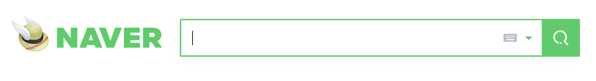

**웹개발 동적사이트 정적사이트 서버 클라이언트 프론트엔드 백엔드 HTML CSS Javascript 라이브러리 프레임워크**

웹 개발은, 웹 사이트를 만드는 것입니다. 그러면, 웹 사이트란 무엇일까요? 

웹 사이트 역시 기본적으로 정보입니다. 이 정보를 주는 쪽을 서버라고 하고, 받는 쪽을 클라이언트라고 합니다. 이렇게 정보를 주고 받는 방법에 대한 규약이 HTTP 프로토콜입니다. 저희의 관심사는 정보 그 자체이지 그걸 주고 받는 방법은 아니지만, 그래도 나중에 공부해 두면 좋을 것 같습니다.

그럼 이제 주고 받을 정보를 만드는 과정을 웹개발이라고 해도 될 것 같습니다. 그러면, 무슨 정보를 만들어야 하나요? 네이버라는 웹 사이트를 만든다고 합시다. 네이버 시작 페이지에 담긴 정보가, 네이버가 가진 정보의 전부인가요? 

시작 페이지 처럼 눈에 보이는 정보를 만드는 과정을 프론트엔드 개발이라고 합니다. 아래와 같은 검색창이라는 정보를 만드는 과정입니다.

이 때, 이 위치에 NAVER라는 글자와, 검색창과, 버튼들이 있다는 것을 알려주는 뼈대를 작성하는 것이 HTML입니다. 더불어 NAVER라는 글자가 www.naver.com으로 연결된다는 것도 알려줍니다.

그리고, 이 글자의 색깔은 무엇이고, 폰트 크기는 어떻고, 검색창의 위 아래 정렬은 어떻게 되고, 버튼들은 어디에 어떻게 위치하는지 같은 디자인을 만드는 것은 CSS입니다.

그리고, 검색버튼 옆의 초록색 삼각형을 클릭하면 최근 검색어를 띄워줍니다. 이 새로운 정보를 띄울 때, 마치 동판화 그리듯이 HTML과 CSS를 다시 작성해서 또 띄울수도 있지만 딱 봐도 효율적이지는 않아 보입니다. 따라서, 이러한 정보의 변화를 동적으로 보여줄수 있는 도구가 필요합니다. 이럴 때 Javascript를 사용합니다. 

지금까지 쓰인 HTML, CSS, Javascript는 프론트엔드 삼신기라고 하는, 프론트엔드 개발의 가장 기본적인 요소입니다.

기본적인 요소가 있다면, 기본적이지 않은 요소도 있을 것입니다. 삼신기에 더하여, 프론트엔드 개발을 돕는 도구들이 있습니다. 

라이브러리: jQuery, D3.js, Bootstrap

프레임워크: React, Angular, Vue

이러한 도구들은, 삼신기와 더불어 웹 사이트 개발을 더 쉽고 편리하게 만들어주는 역할을 합니다. 삼신기와 달리 없어도 웹 사이트를 만들수는 있지만, 굉장히 번거롭기 때문에 추천되지 않습니다. 

- Javascript와 HTML, CSS의 차이?

HTML,CSS와 Javascript의 차이는 앞의 두개는 동적인 표현이 불가능하고, Javascript는 가능하다는 것입니다. 쉽게 말해서, HTML과 CSS로 작성한 정보가 종이책이라면, 여기 Javascript가 추가되면 종이의 특정부분을 문질렀을 때 새로운 정보가 나타나는 것이 가능해집니다. 이러한 차이는 HTML과 CSS는 프로그래밍 언어가 아니지만(각각 마크업 언어, Style Sheet 언어로 분류됩니다), JS는 그렇다는 한 마디로 정리할 수 있습니다. 프로그래밍 언어의 명확한 정의 역시 저희의 관심사가 아니기 때문에 넘어가도 될 것 같습니다.

지금까지 눈에 보이는 정보를 다루는 프론트 엔드를 알아보았습니다. 그러면, 눈에 보이지 않는 정보도 있으니까 굳이 프론트라고 이름을 붙이지 않았을까요? 당연히, 눈에 보이지 않는 정보를 다루는 백엔드라는 개발 분야도 있습니다.

네이버에서 눈에 보이지 않는 정보란 뭐가 있을까요? 가장 간단한 예시는, 로그인 정보가 있습니다. 네이버에 아이디와 비밀번호를 치고 로그인을 할 때, 정보가 맞다면 로그인된 시작 페이지를 띄울 것이고 그렇지 않다면 로그인 실패 창을 띄울 것입니다. 이 때 이 정보가 맞는지를 확인해야 하는데, 이 때 네이버 서버에 등록된 아이디 -  비밀번호 순서 쌍 중 들어온 정보와 일치하는 것이 있는지 확인을 해야 합니다. 당연히, 이 과정을 함부로 사용자에게 보여줘서는 안될 것입니다. 다른 사람의 아이디와 비밀번호까지 노출될 수 있기 때문입니다. 또한 네이버 서버가 가진 막대한 정보 중, 사용자가 요청한 부분만 추려서 프론트엔드 페이지로 넘기고 이 속도를 빠르게 하는 작업 역시 사용자에게는 보이지 않는 부분입니다. 이러한 부분을 다루는 것이 백엔드입니다.

백엔드는 프로그래밍 언어를 이용해 개발하게 됩니다. 프론트엔드와 달리 정해진 기본기가 없습니다. 사용하고 싶은 언어와, 프레임워크를 선택하면 됩니다.

언어: Node.js(Javascript), Java, Python, PHP, Ruby, etc……

프레임워크: 익스프레스, 스프링, 장고, 코드이그나이터, ruby on rails, etc……

- Node.js는 프로그래밍 언어인가?
