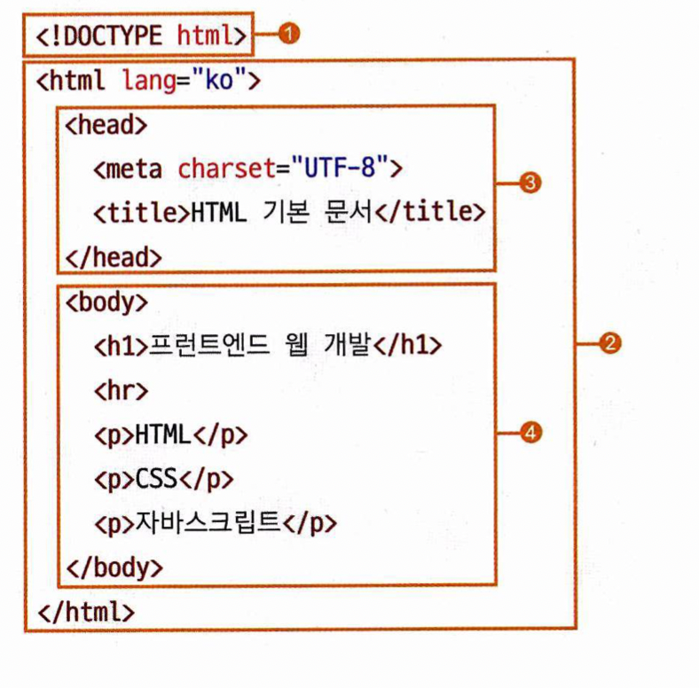
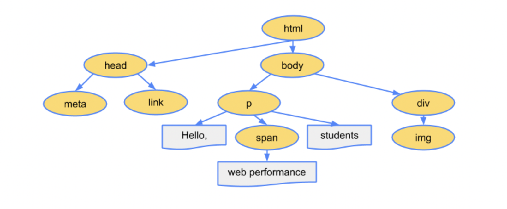

1. HTML이란?

*이 때, 이 위치에 NAVER라는 글자와, 검색창과, 버튼들이 있다는 것을 알려주는 뼈대를 작성하는 것이 HTML입니다. 더불어 NAVER라는 글자가 www.naver.com으로 연결된다는 것도 알려줍니다.*

처음 HTML에 대해 소개 할 때, 이렇게 설명하였습니다. 더불어, HTML은 프로그래밍 언어가 아니라 마크업 언어라고도 하였습니다.

HTML은 Hyper Text Markup Language의 줄임말입니다. Hypertext는 문서를 서로 연결해주는 링크를 의미합니다. 그리고, Markup Language 즉 마크업 언어란 텍스트, 이미지, 영상등의 위치를 표시하는 언어를 의미합니다. www.naver.com으로 연결되는 걸 알려주는 것이 Hypertext 이고, 글자와 검색창, 버튼들이 어디에 있다는 걸 알려주는 부분이 Markup 인 것입니다.

1. HTML의 구조
    
    
    

HTML의 구조는, 크게 위와 같이 구분됩니다. 

1. <!DOCTYPE html>: 현재 문서가 html이다
2. <html></html>:웹 문서의 시작과 끝을 표시
3. <head></head>:웹 브라우저가 웹 문서를 해석하는데 필요한 정보
    1. <meta>: 인코딩 정보, 키워드, 제작자 정보등의 메타 데이터가 담김
    2. <title>: 브라우저 새창이나 탭에 표시되는, 문서 제목
    3. (다른 태그들도 들어갈 수 있습니다)
4. <body></body>:실제로 웹 브라우저 상에 나타나는 내용

여기서, <~>, </~>는 태그라고 하며 HTML상에서 기능상의 분류를 나타내는 역할을 합니다. 모든 태그는 시작과 끝이 존재해야 합니다. 즉, 
가 있다면 어딘가에는 
가 있어서 분류 단위의 끝을 알려주어야 합니다. (meta 태그 처럼 내용이 없는 일부 태그의 경우 생략이 가능하기도 합니다)

 이 트리는, DOM 구조라고도 하며 위에서 나온 HTML의 구조, 즉 문법을 트리로 표현한, 일종의 syntax tree라고도 볼 수 있습니다. DOM에 대해서는 나중에 더 자세하게 배울 것이며, 지금은 그저 구조를 한 눈에 보는 용도로만 사용합니다.

- Live Server 오류 관련
    
    html 파일명이나, 폴더에 한글이 포함되어 있으면 live server로 브라우저가 열리지 않는다.
    
- 자동완성이 안되요
    
    ! + tab을 했을 때 자동완성이 안되는 경우, html: 5를 입력하고 tab을 하면 된다.
