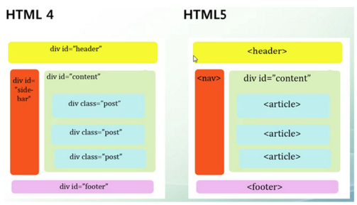
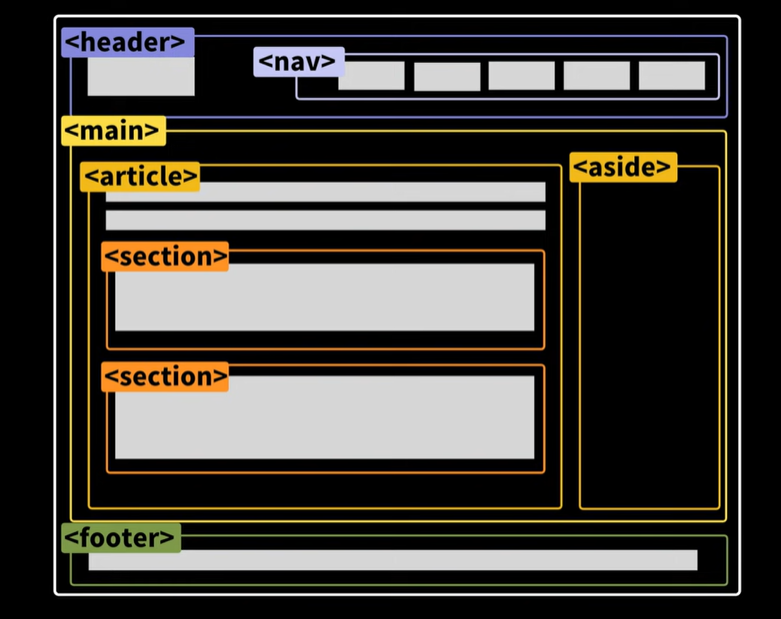

시멘틱 태그란?

시멘틱 태그(sementic tag)란, 이름만 보아도 의미를 알 수 있는 태그라는 뜻입니다. 아니 그러면 이름을 보면 의미를 알 수 없는 태그도 있나요? 사실 저 의미만 가지고는, 시멘틱 태그의 역할을 제대로 설명하기 어렵습니다. 

시멘틱 태그의 중요성

시멘틱 태그는 html 5부터 적용된 개념입니다. html 4까지는, 시멘틱 태그 없이도 웹 사이트를 잘 만들었습니다. 그리고, 초창기에는 중구난방이었지만 점차 시간이 지나면서 웹 사이트를 구성하는 html 구조가 어느정도 수렴 진화하는 경향이 생겼습니다. 위에 정보와 사이트 이름, 여러가지 메뉴가 있고, 내용은 몇가지의 article로 구분이 되고, 맨 밑에는 법인 및 개발자 정보등이 있고, 옆에는 사이드 메뉴가 있고…… 물론 100% 일치할리는 없지만 큰 틀에서는 비슷할 것입니다.

문제는, 시멘틱 태그의 등장 이전에는 이런 각각의 요소들을 구분하는 방법은 
태그에 임의의 id를 부과하는, 위의 그림과 같은 방법 뿐이었다는 것입니다. 이런 구조의 문제는, (물론 대부분 어느 정도 통일성을 따르긴 했지만) id를 이름 짓는 법이 개발자 마음대로라는 것이었습니다. 이러면, 개발자 입장에서 요소의 id를 네이밍하고 문서 구조를 스스로 만들어야 하며, 다른 개발자가 작성한 코드를 한 눈에 알아보기도 어려워 유지보수도 어려워 진다는 단점이 생겨버립니다.

html 5를 제작하면서, 이런 문제점을 해결하기 위해 도입된 것이 시멘틱 태그입니다. 시멘틱 코드는 단순히 저런 요소들의 이름을 대신 지어주는 차원을 넘어서, 웹 페이지 구조의 표준을 제시하고 거기에 맞춰서 개발을 할 수 있는 가이드라인을 작성했다는 의의를 가집니다.

시멘틱 태그의 종류

1. <header>
    
    말 그대로 사이트의 헤더를 의미합니다. 네이버의 경우, 
    
    
    

이 부분이 헤더에 해당합니다. 

1. <nav>
    
    다른 페이지 또는 현재 페이지의 다른 부분과 연결되는 네비게이션 링크(navigation links)들의 집합을 정의할 때 사용합니다. 헤더 태그 내부에 포함해서 사용하는 경우도 있고, 독립해서 사용하는 경우도 있습니다. 위의 그림에서는 포함하여 사용한 경우입니다. 네이버에서는, 
    
    
    
    이 부분이 해당합니다(물론, 이것만 있지는 않습니다).
    
2. <main>
    
    해당 문서의 <body> 요소의 주 콘텐츠(main content)를 정의할 때 사용합니다. 각 문서에서 한번만 사용할 수 있습니다. 
    
3. <article>
    
    웹에서 실제로 보여주고 싶은, 완전히 독립된 내용(article)이 담긴 부분을 정의할 때 사용합니다. 
    
4. <section>
    
    보통 완전히 독립된 내용 안에서, 논리적인 주제(section)별로 내용을 구분하기 위해 사용합니다. 
    
5. <aside>
    
    본문의 왼쪽이나 오른쪽, 아래쪽에 사이드바를 만드는 태그입니다. 네이버 블로그의 사이드 메뉴에 해당합니다. 광고를 넣을 수도 있습니다.
    
6. <footer>
    
    사이트 제작 정보, 저작권 정보, 연락처 등이 들어갑니다. 네이버에서
    
    
    
    이 부분에 해당합니다.