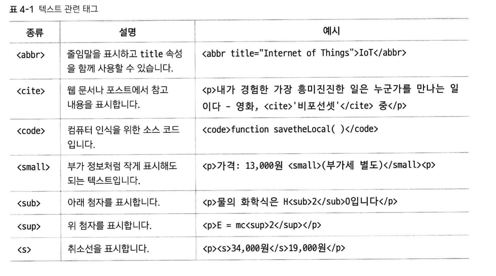
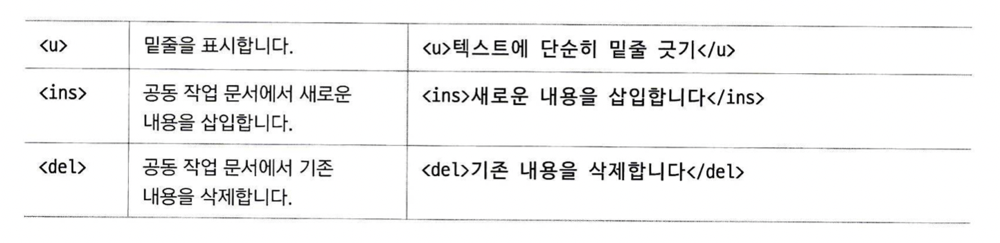

**`
`    ` `    `<blockquote>`    `<strong>`    `<b>`    `<em>`    `<i>`    `<abbr>`    `<cite>`    `<code>`    `<small>`    ``    ``    `<s>`    `<u>`    `<ins>`    `<del>`**

1. `
`, ` `
    
    `
``
`는 단락, 문단(paraphrase)을 의미합니다. 
    
    ` `는 줄바꿈(break)를 의미합니다. (닫는 태그 `</b>`가 없어도 됩니다)
    
    그렇다면 굳이 `
``
`로 구분하지 않고 ` `로 단락을 구분하거나, 또는 ` `로 줄바꿈 안하고 새로운 `
`를 시작해 버리는 식으로 쓰면 안되나요??
    
    → 이렇게 쓸 경우, 겉보기에는 문제가 없지만 나중에 CSS에서 텍스트 단락 스타일을 적용할 때 `
`로 단락을 구분하기 때문에 문제가 생깁니다. 이 태그 뿐만 아니라, 특정 기능을 가진 태그들은 해당 태그를 쓰지 않고도 단지 그렇게 보이도록 할 수는 있습니다. 하지만, CSS나 javascrip를 쓸 때, 혹은 화면 낭독기를 이용할 때 해당 태그를 이용해 특정 기능에 대해 어떤 행동을 할 것인지를 결정하기 때문에, 정말 불가피하지 않다면 주어진 기능에 맞는 태그를 쓰는것이
    
    좋습니다.
    
2. `<blockquote>`
    
    `<blockquote>``</blockquote>` 태그 안의 내용은, 다른 사람의 말이나 책의 내용을 인용하기 위해 사용됩니다. 이 내용들은 다른 텍스트보다 약간 들여 써집니다(왜 “”로 감싸는 게 아니라 들여쓰는지는 의문입니다). 화면 낭독기도 해당 태그를 다른 텍스트와 구분하여 읽습니다.
    

1. `<strong>`, `<b>`
    
    `<strong>``</strong>`과 `<b>``</b>`는 모두 특정 텍스트를 bold체로 표시합니다. 하지만 `<strong>`의 경우 경고, 주의 등 강조하고 싶은 내용을 굵게 표시 할 때 쓴다면, `<b>`는 단순히 시각적으로 굵은 효과를 주고 싶을 때 사용합니다. 역시나 아무거나 쓰면 안되나 싶지만, 1에서 말한 이유과 같은 이유로 기능에 맞춰 쓰는 것이 좋습니다. 예를 들어 대부분의 화면 낭독기는 `<strong>`태그 속 내용을 강조하여 읽어주는 (주의: ~~ 같은 식으로) 기능이 있지만, 이걸 귀찮다고 `<b>` 속에 넣어버리면 문제가 발생할 것입니다.
    

1. `<em>`, `<i>`
    
    `<em>``</em>`은 특정 텍스트를 강조(emphasis)하기 위해 사용됩니다. 텍스트를 이탤릭체로 바꿉니다.`<strong>`도 강조한다 그랬는데, 무슨 차이일까요? 
    
    `<strong>`의 경우, 긴급성, 심각성을 포함하는, 객관적인 강조를 위해 사용: 예를 들어 주의 사항, 필수 정보같이 모르면 안되는 정보를 나타낼 때
    
    `<em>`의 경우, 단순히 글쓴이의 주관적인 강조, 강세를 나타내기 위해 사용된다고 합니다. 이것만 보면 뭔가 말장난 같기도 하지만, 확실히 기능 상의 구분이 있는 것 같습니다.
    
    `<i>``</i>`는 역시 단순히 시각적 효과를 주기 위한 용도로 사용됩니다. 텍스트를 이탤릭체로 바꿉니다.
    
    1. 기타 텍스트 요소를 위한 태그들
    
    
    
    
    
    - `<abbr>` 태그의 경우, title 속성을 통해 태그 속에 해당 줄임말이 무엇의 줄임말인지를 알려주는 정보를 포함할 수 있습니다.