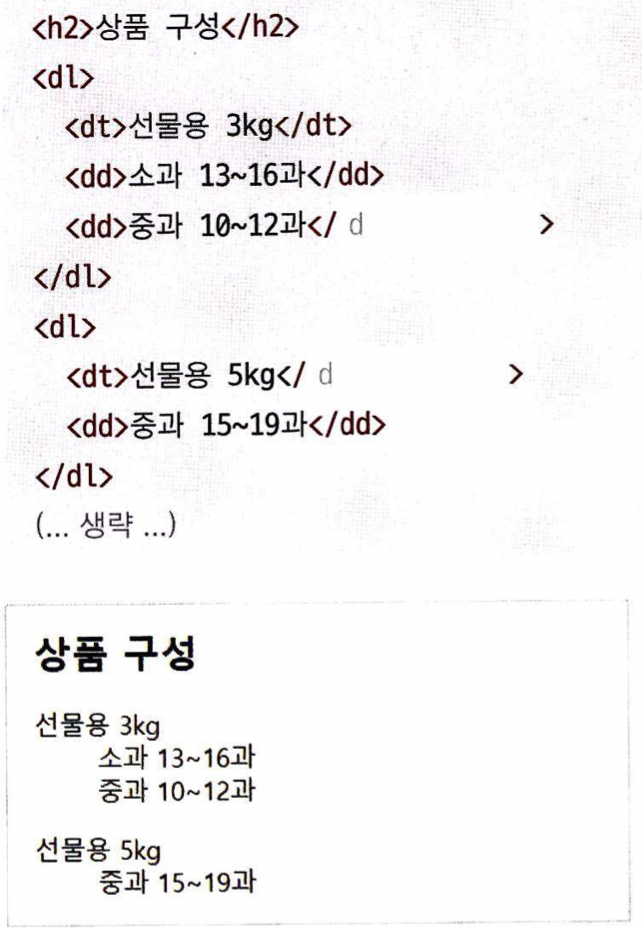

**`<ol>`    `<ul>`    `<li>`    `<dl>`    `<dt>`    `<dd>`**

1. `<ol>`, `<li>`
    
    `<ol>``</ol>` 태그는 순서 있는 리스트(ordered list)를 생성하는 태그입니다. 리스트 내의 각각의 항목은, `<li>``</li>`를 이용해 표시합니다. 
    
    `<ol>`태그는, type과 start라는 속성을 사용할 수 있습니다. 
    
    type의 경우 리스트의 순서를 숫자로 표시할지, 알파벳이나 로마자로 표시할 지 등을 지정할 수 있습니다. 
    
    start는 리스트가 몇 번 부터 시작될지를 지정하며, type이 숫자인지에 상관없이 숫자만 지정할 수 있습니다. type=”a” start=”2”인 경우 리스트가 b부터 시작할 것입니다. 
    
    둘 다 지정하지 않을 시 기본 값은 1입니다.
    
    해당 태그들은, 다음 예시와 같이 사용합니다:
    
    `<ol type=”a” start=”1”>`
    
    `<li>`list1`</li>`
    
    `<li>`list2`</li>`
    
    `</ol>`

  
2. `<ul>`
    
    `<ul>``</ul>`태그는, 순서 없는 리스트(unorderd list)를 생성합니다.
    
    `<ol>`태그와 똑같은 형식으로 사용하는데, 각 항목의 맨 앞에 순서가 아닌, 불릿(bullet)이라고 부르는 작은 원이나 사각형을 붙여서 구분합니다.
    
    이 불릿의 모양 역시, ul태그의 type 속성으로 바꿀 수 있습니다. 
    
    type의 종류
    
    disc: ●
    
    circle: ○
    
    square: ■
    
    ul의 type 속성으로 바꾸면, 하부의 모든 항목에 대해 적용됩니다. 또한, li 역시 동일한 type속성을 적용할 수 있습니다. 특정 항목만 바꾸고 싶다면, 해당 li의 type 속성을 수정해 주면 됩니다.
    
    Q. 저거 말고 다른 모양은 못 쓰나요?
    
    → 쓸 수 있습니다. 다만, type 속성 값이 아니라 css를 이용하여 바꿔주어야 합니다. 

   
3. `<dl>`, `<dt>`, `<dd>`
    
    이 태그는, 사전처럼 이름(name)과 값(value)의 형태로 되어 있는 목록을 말합니다.
    
    `<dl>``</dl>` 내부의 `<dt>``</dt>`(description title)태그와 `<dd>``</dd>`(desciption detail)태그가 각각 이름과 값을 의미합니다. 실제 사전처럼, dt밑에 여러개의 dd가 올수는 있지만 하나의 dd가 여러개의 dt를 가질 수는 없습니다. 
    
    (해당 태그 들의 사용 예시)
	