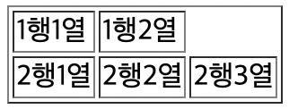

**`<table>`    `<caption>`    `<tr>`    `<td>`    `<th>`**
  
  
1. 표의 구성 요소: 행(row), 열(column), 셀(cell)
    
    행은 가로 줄, 열은 세로 줄, 셀은 행과 열이 만나서 이루는 하나의 칸을 의미합니다.
  
     
2. 표의 생성: `<table>`, `<caption>`
    
    `<table>``</table>`은 표의 시작을 의미합니다. `<table>` 바로 밑에 `<caption>``</caption>`태그를 달아 표의 제목을 표시할 수 있습니다.
    
  
  
3. `<tr>`, `<td>`, `<th>`: 행과 셀 만들기
    
    HTML에서 표의 생성은 행을 기준으로 이루어집니다. 즉, 행을 먼저 생성한 후, 각 행이 몇개의 셀을 가지는 지를 지정합니다. 이런 식으로 셀의 갯수가 각각 다른 행들을 만들 수 있습니다. 
    
    `<tr>`: 행을 만드는 태그, table row
    
    `<td>`: 셀을 만드는 태그, table data
    
    `<th>`: 제목(header)셀을 만드는 태그, table header
    
    여기서 제목 셀이란, 내부 텍스트가 가운데 정렬, 볼드(bold)처리된 셀을 말합니다. 
    
    행마다 셀의 갯수가 다르면, HTML은 어떻게 표시하나요??
    
    
    
    (이렇게 나타납니다)
    
    표에 테두리가 없는데요??
    
    → table 태그에는, border와 bordercolor등 표의 디자인에 관한 속성을 지정할 수 있습니다. 이 중 border 속성은 기본값이 0이라, 따로 지정을 안해주면 표의 테두리가 제대로 나오지 않습니다.
  
     
4. 표의 구조 지정하기: `<thead>`, `<tbody>`, `<tfoot>`

표의 각 행을, `<thead>``</thead>`, `<tbody>``</tbody>`, `<tfoot>``</tfoot>`, 으로 감싸서 제목(head), 본문(body), 요약(foot)으로 구조화할 수 있습니다. 시멘틱 태그와 비슷하게 표를 구조화 한다고 보면 될 것 같습니다.

실제로 보이는 내용에는 차이가 없지만, 이렇게 구조화를 함으로써

a. 시각장애인도 화면 낭독기를 통해 표의 구조를 쉽게 이해할 수 있습니다.
b. CSS를 이용한 스타일 적용시 각 부분별로 다른 스타일을 적용할 수 있습니다.
c. Javascript를 통한 제어가 용이해집니다. 예를 들어, 표의 본문이 길어 화면의 길이를 넘어가는 경우, 자바스크립트를 이용해 head와 foot태그는 가만히 두고 body 부분만 스크롤을 할 수 있도록 만들 수 있습니다.
  
  
5. 셀 합치기: rowspan, colspan 속성
    
    말 그대로 엑셀의 셀 합치기 기능을 합니다. 따라서, 실제 셀을 뜻하는 `<td>`, `<th>` 태그의 속성입니다. 
    
    rowspan=”n” 속성을 주면 해당 셀을 포함해 밑으로 n개의 행에 있는 셀을 합칩니다.

		→ 각 행에서 rowspan이 있는 셀을 제외한 나머지 셀 태그들은 지워주어야 합니다.

	colspan=”n” 속성을 주면 해당 셀을 포함해 오른쪽으로 n개의 열에 있는 셀을 합칩니다.

		→ 행 내부에서 colspan이 있는 셀을 제외한 나머지 셀 태그들은 지워주어야 합니다.

	(→로 표시한 부분이 무슨 뜻인지 이해하려면, 챕터 4 마지막에 있는 퀴즈2를 풀어보는 것을 추천)
  
  
6. 열 그룹화 하기: `<col>`, `<colgroup>` 태그
    
    `<col>`태그는, 닫는 태그 없이 사용되며 열의 스타일과 속성을 지정할 때 사용됩니다. 그러면, 어떤 열을 지정할지는 어떻게 정할까요? 웃기게도, 직접적으로는 정할 수가 없습니다. 이 태그는 매우 제한된 조건 하에 사용됩니다.
    
    a. 반드시 `<colgroup>``</colgroup>` 태그 내부에서 사용할 것
    b. 반드시 표의 총 열의 갯수만큼 있어야  할 것
        
        → 항상 
        
        `<colgroup>`
        
        `<col>`
        
        `<col>`
        
        `</colgroup>`
        
        같은 식으로 사용되어야 합니다. 그리고, 열이 2개라면 `<col>`태그도 2개, 20개라면 20개가 있어야 합니다. 즉, 첫번째 태그 말고는 속성을 지정할 생각이 없더라도 아무 속성이 없는 `<col>`이 19개가 있어야 한다는 뜻입니다. 이런 제약을 통해, 어떤 `<col>`태그가 어떤 열을 가리키는지가 특정됩니다.
        
        물론 `<col>`을 19개를 다 쓰는건 너무 공간 낭비입니다. 따라서, span 속성을 이용해 이걸 줄일 수 있습니다. col 태그에서 span=”n” 속성의 경우, 아래로 n개의 열에 해당하는 col 태그에 똑같은 속성을 부여합니다.
        
        *예시: `<col span=”19” style=”width:150px;”>`*
        
    c. 반드시 `<caption>` 태그 뒤에 위치 할 것
        
        표의 내용이 나오기 전, 속성을 미리 지정해 놓아야 한다는 뜻입니다.
        
    
    전 20개 안쓰고 그냥 세개만 넣을 건데요? 그러면 내용이 어떻게 나오나요?
    
    → 왼쪽에서 부터 세 개의 열에 적용되고, 그 다음부터는 적용되지 않습니다. 물론 띄엄 띄엄 적용한다던지, 처음과 마지막에만 적용한다던지. 1~3 적용하고 10~끝까지 적용한다던지 등의 옵션은 고려할 수 없습니다.