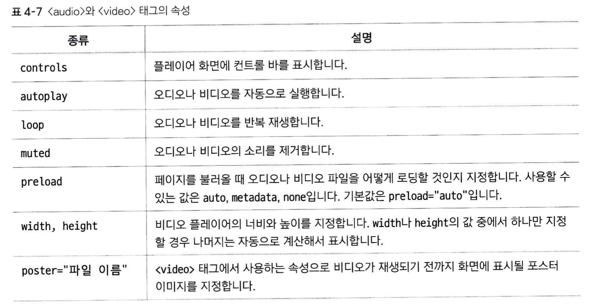

**<object>    <embed>    <iframe>    <audio>    <video>**

1. <object> 태그
    
    <object>태그는 오디오, 비디오, pdf등의 멀티미디어 파일을 문서에 삽입할 수 있습니다. 기본 사용형태는 다음과 같습니다:
    
    <object width=”너비" height=”높이" data=”파일"></object> (img, embed와 달리 닫는 태그가 있습니다)
    
    여기서 heigth, width는 “플레이어"의 크기를 나타냅니다. 플레이어는 단순히 멀티미디어 파일을 보여주는 매체로, 오디오의 경우 오디오 플레이어, 동영상은 동영상 플레이어, pdf는 pdf리더가 있습니다. 
    
    태그의 사이에는, object 태그가 혹시나 지원되지 않는 브라우저를 위해 대체 텍스트를 넣어주는 것이 좋습니다. (ex; “현재 사용 중인 브라우저는 object 요소를 지원하지 않습니다!”)
    
2. <embed> 태그
    
    <embed> 태그 역시 멀티 미디어 파일을 삽입할 수 있습니다. 기본 사용형태는 다음과 같습니다:
    
    <embed src=”파일 경로" width=”너비" height=”높이"> (닫는 태그 없음)
    
    역시 마찬가지로 width, height는 플레이어의 크기를 나타냅니다.
    
    - object, embed 태그의 차이?
        
        두 태그가, 처음부터 기능 상의 차이를 염두에 두고 동시에 만들어 진 태그는 아닙니다. 원래 HTML4 이하의 웹 표준은 object 태그였고, embed는 비록 비표준이지만 많은 브라우저에서 지원하면서 object와는 별개로 살아남은 태그입니다. 해당 태그의 장단점을 정리하기에는, 하술할 이유로 두 태그 모두 iframe의 태그와 HTML5의 도입 이후로는 사장되고 있기 때문에 굳이 정리할 이유는 없을 것 같습니다.
        
    1. <iframe> 태그
        
        HTML 4.01부터 등장하여, 대부분의 브라우저에서 지원되는 태그입니다. 이후로는  embed 태그나 object 태그 둘 다 퇴화 태그로 간주되어 iframe 태그를 사용할 수 없는 경우에만 사용이 권장되었습니다(하지만 매우 짜증나게도, HTML5 환경에서는 이 iframe 태그조차 남용이 권장되지 않습니다). 기본 사용형태는 다음과 같습니다;
        
        <iframe src=”파일경로"></iframe>
        
        태그의 사이에는, object와 마찬가지로 iframe이 혹시나 지원되지 않는 브라우저를 위해 대체 텍스트를 넣어주는 것이 좋습니다.
        
        이 태그는, frame 태그라는 것과 함께 제공되었었습니다(iframe이 inline - frame의 약자입니다). 원래 이 태그들은 미디어 파일을 삽입하는 용도 말고도, 이름 그대로 웹 페이지의 구조를 frame화 시켜서 관리할 수 있게 해주는 용도로 쓰였습니다. 하지만 모바일 시장이 커지고, 이러한 방식이 반응형 웹을 만드는데 있어서 매우 어렵다는 치명적인 단점으로 인하여 frame 태그는 HTML5 이후로는 아예 표준에서 빠져버렸습니다. iframe 태그만 다른 html 문서를 특정 프레임 안에서 보여주거나 오디오와 비디오가 아닌 다른 멀티미디어 파일들을 임베드 하는 등의 제한적인 용도로만 쓰이고 있습니다.
        
    
    After HTML 5
    
    HTML 5의 발표 이후 가장 많이 바뀐 부분이, 이 멀티미디어 파일을 삽입하는 부분입니다. 
    
    기존의 object나 embed, iframe 태그를 사용하여 비디오나 오디오를 재생하는 경우, 해당 플레이어는 외부 플러그인으로 제공되었습니다. 즉, 표준 없이 중구난방으로 선택할 수 있었다는 의미입니다. 옛날 인터넷 환경에서 네이버에서 동영상을 보려면 기본은 윈도우 미디어 플레이어 플러그인을 쓰고, 네이버 비디오 플러그인을 따로 설치하고, 또 다음에서는 다음팟 플러그인을 따로 설치하던 것을 생각하면 됩니다. 이 시절에 쓰던 object의 경우 classid 속성을, embed 의 경우 type 속성을 지정하여 어떤 플러그인을 쓸지 지정했습니다. 또한 object의 param 속성과 같은 것들을 통해 사용하는 플러그인의 인자값을 결정했는데, 당연히 사용하는 플러그인마다 필요한 인자값이 모두 달랐기 때문에 웹 개발에 큰 장애로 작용하였습니다. 
    
    HTML5를 제정하면서, 이러한 방식 대신 브라우저마다 어떤 플레이어를 쓸 것인지, 어떤 속성을 통해 플레이어를 제어하는지에 대한 표준화된 방식을 제공하는 audio, video 태그라는 것들이 등장하였습니다.
    
    1. <audio>, <video> 태그
        
        두 태그의 기본적인 사용형태는 다음과 같습니다:
        
        <audio src=”오디오 파일 경로"></audio>
        
        <video src=”비디오 파일 경로"></video>
        
        또한 아래와 같은 다양한 속성들을 사용합니다(두 태그에서 사용하는 속성이 거의 일치하기 때문에, 한번에 기술되었습니다)
        
        
        
        (audio, video 같은 태그를 도입함으로써 얻게 된 가장 큰 장점은, 기존에는 사용하는 플러그인마다 저러한 특성을 나타내는 속성의 이름들이 모두 달랐다면(플러그인에 따라 존재조차 안할 수 있습니다), 이제는 하나로 표준화가 되었다는 점입니다)
        
        # preload 속성의 auto는 페이지가 로드될 때 비디오도 자동으로 로드되는 것이고, metadata는 비디오의 크기, 트랙목록, 재생시간 등 메타 데이터만 로드하며, none은 아무것도 로드하지 않는 것입니다