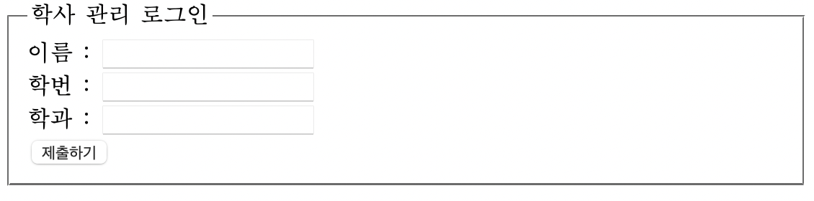

# 폼이란?
로그인: 아이디, 비밀번호 입력  
회원가입: 사용자 정보 입력  
등과 같이, 웹 사이트로 정보를 보낼 수 있는 네모나 입력칸 등의 요소를 폼이라고 한다.  
단, 이런 양식 속에 들어가는 데이터는 데이터베이스를 기반으로 처리해야 하기 때문에, HTML에서 다루지는 않는다. HTML은 오직 겉으로 드러나는 양식만 처리한다.

## `<form>` 태그
폼을 만드는 가장 기본적인 태그. 다음과 같은 양식으로 사용한다:  
`<form [속성="속성값"]> 폼 요소 </form>`
여기서 폼 요소는 실제 폼이 어떤 형태를 가지는지를 정의하는데, 다양한 속성들이 들어갈 수 있다. 참고로 저 폼 요소 부분에 그냥 텍스트만 딸랑 써 놓으면, 그 텍스트만 뜨고 폼으로써 사용할 수 없다. 아래에 나오는 태그들을 사용해야 실제 폼으로써 사용할 수 있다.
* mehod 속성과 get, post 방식


## `<fieldset>, <legend>` 태그
`<fieldset>` 태그는 form 태그 내부에서 연관된 요소를 하나의 그룹으로 묶을 때 사용한다. 해당 태그로 묶인 요소들은, 주위에 박스 모양의 선이 그어진다. 

(예시)
`<legend>` 태그는 fieldset으로 묶인 태그에 캡션을 제공한다. 위의 예시에서 학사 관리 로그인으로 나타난 부분이다. legend는 전설이 아니라, 범례라는 뜻으로 사용되었다.

## `<label>` 태그
label 태그는, 어떤 텍스트와 특정 폼 요소를 연결하기 위해 사용된다. 기본형은 다음과 같다:  
`<label> 레이블명 <폼요소></label>`
혹은 폼 요소에 id를 지정할 수 있는 경우, 다음과 같이도 쓸 수 있다.  
`<label for="id명"> 레이블명 <폼 요소 id="id명’></label>`
이렇게만 보면 이걸 왜 쓰는지 잘 모르겠다. 위에서 fieldset 태그를 설명할 때 쓴 예시를 다시 들고와 보자.

이 예시의 코드는 다음과 같다:
```
	<fieldset>
        <legend>학사 관리 로그인</legend>
        이름 : <input type="text" name="st_name"><br>
        학번 : <input type="text" name="st_id"><br>
        학과 : <input type="text" name="department"><br>
        <button type="submit">제출하기</button>
    </fieldset>
```
여기서 이름 부분을, 다음과 같이 바꿔보자:
```
<label>이름 : <input type="text" name="st_name"><label><br>
혹은 
<label for="user-id">이름 : <label><input type="text" name="st_name", id="user-id"><br>
```
이렇게 바꿔도, 겉보기로는 바뀌는것은 없다. 그러면 뭐하러 굳이 label안에 넣어서 쓸까??:  
텍스트를 label 태그 안에 넣는 경우, 해당 텍스트를 클릭했을 때 바로 폼에 입력할 수 있게 이동하거나, 체크가 되거나, 체크를 해제할 수 있다. 만약 텍스트와 폼이 멀리 떨어져있다면 해당 폼으로 바로 이동할 수도 있다. 이러한 UI 차원에서의 편의성을 위해 쓴다.