# input 태그: 사용자 입력 받기
로그인 화면이나 검색 창 등 사용자 입력을 받는 양식은 모두 `<input>` 태그를 사용하여 만들어진다.
어떤 식으로 입력을 받을 것인지는, type 속성을 지정하여 정할 수 있다.
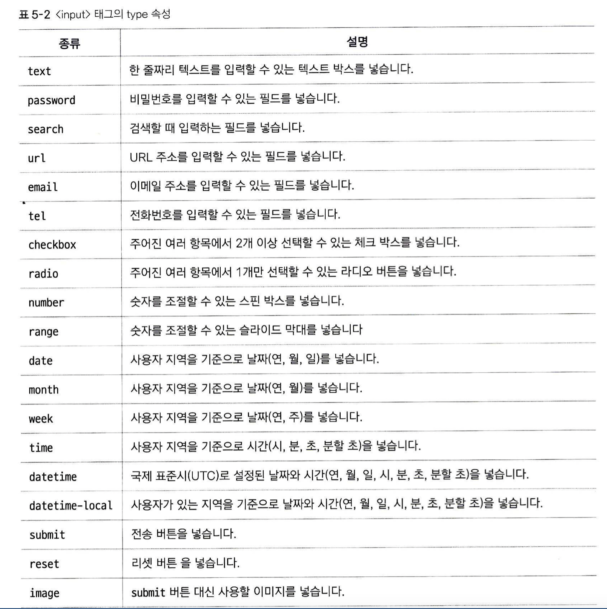
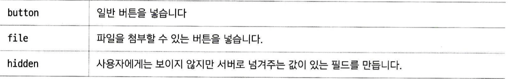  

## type="text", type="password"
두 속성 다 텍스트를 입력하는데 무슨 차이가 있나 싶은데, 실제로 브라우저에서 나타나는 모양이 조금 다르다.
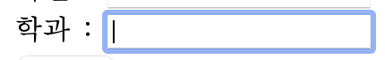
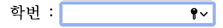
위 그림이 text, 아래 그림이 password. password의 경우 새로운 암호 제안이나, 암호 기억 같은 기능을 브라우저 차원에서 제공한다. 또한 passowrd 창에 뭔가를 입력하면 기본적으로 *로 표시되며 내용을 보여주지 않는다.

## size, value, maxlength 속성
type속성에 text, password 값을 준 폼에서 주요하게 사용되는 속성이다.   

size의 경우, 입력창의 길이와 몇 글자를 보여줄 것인지를 지정한다. 5로 지정할 때보다 10으로 지정하면 창 길이가 두 배로 늘어나고, 보여지는 글자 수도 10개가 된다 (단, 10개만 쓸 수 있는건 아니고 더 쓸 수 있다. 단지 보여지지 않을 뿐이다. 화살표로 옮겨가면서 안 보이는 내용을 볼 수 있다).  

value는, 처음에 기본으로 폼 안에 띄울 내용을 지정한다. 이 내용은 지우고 다시 쓸 수 있다.  

maxlength는 최대 몇 자까지 쓸 수 있는지 지정한다. 

## type="search", type="url", type="email", type="tel"
셋 다 텍스트를 입력한다는 점에서 text나 password와는 동일하지만, 역시 html 태그를 통해 특정 기능을 한다는 사실을 브라우저에 전달한 다는 것이 중요하다.  

예를 들어 search 폼의 경우, 브라우저에서 폼 왼쪽의 x를 누르면 입력한 내용이 지워지는, 우리가 흔히 아는 검색창의 기능들을 지원해 준다.  

또한, url이나 email이 없던 시절에는 자바스크립트를 이용해 입력한 내용을 파싱하여 이게 url인지 email인지 직접 구분해야 했지만, 저런 기능을 도입하면서 이런 고생을 할 필요가 없어졌다. 입력값이 지정된 형식에 맞지 않으면 오류를 띄워주기도 한다.  

tel의 경우 모바일에서 여기다 입력한 값을 누르면, 바로 전화를 연결할 수도 있다.  
* 이러한 세분화된 기능들은 특히 모바일에서 중요하게 쓰인다.

## type="checkbox", type="radio"
체크박스와 라디오버튼 기능을 제공한다.
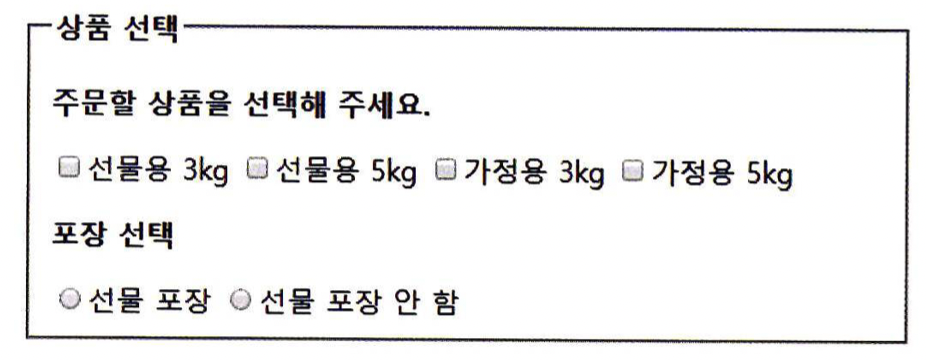
네모가 체크박스, 동그라미가 라디오 버튼이다. 체크박스는 중복 체크가 가능하고, 라디오버튼은 중복이 불가능하다는 차이가 있다. 항목의 내용을 적으려면, label로 묶어주어야 한다.

value속성을 여기서도 쓸 수 있는데, 선택한 박스를 서버에 넘길 때 어떤 값으로 넘겨줄 지를 지정한다. 예를 들어 선물 포장을 선택했다면 서버에 "선물 포장"이라는 텍스트를 넘길 수도 있고 1이라는 값을 넘길 수도 있다.  

checked 라는 속성도 이용할 수 있는데, 기본값은 아무것도 선택하지 않는 것이지만, 처음부터 어떤 항목이 선택되어 있을 지를 정할 수 있다.

* 주의: radio 타입을 사용할 때, 항상 name 속성과 함께 사용되어야 한다. 그냥 radio만 쓸 경우, 중복 체크가 된다는 문제가 있다. 여기서 중복인지를 판별하는 기준은, 같은 name을 가졌는지 이기 때문이다. name 속성 값이 다르거나 설정이 안 되어 있는 radio 끼리는, 중복 체크가 된다.

## type="number", type="range"
스핀박스와, 슬라이드 바를 지원한다.
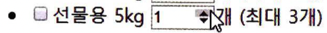
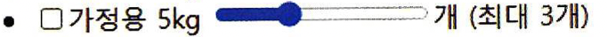
다음과 같은 속성을 쓸 수 있다.
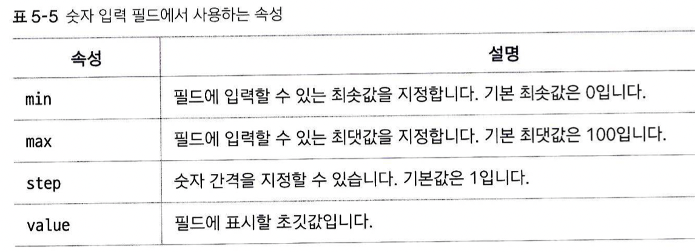

## type="date", type=’’month", type="week"
날짜를 입력받을 수 있다.  
date는 연-월-일을 입력받는다.  
month는 연-월만 입력받는다.
(사파리는 지원 안한다)
week는 연-주만 입력받는다.
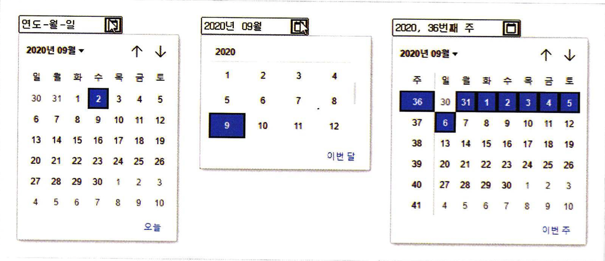

## type="time", type="datetime" type="datetime-local"
시간을 입력받을 수 있다.  
time은 pm/am-시간-분을 입력받는다.  
datetime은 날짜 + pm/am-시간-분을 입력받는다. 
* datetime이 달력으로 선택하는게 아니라 그냥 입력하는 창만 뜨는데, 왜 그런 것인가?
-> html5부터 표준에서 삭제됨. 해당 속성은 무시되는 경우가 많으므로 datetime-local을 쓰는 것이 좋다.
datetime-local은 timezone 정보를 같이 넘겨준다.
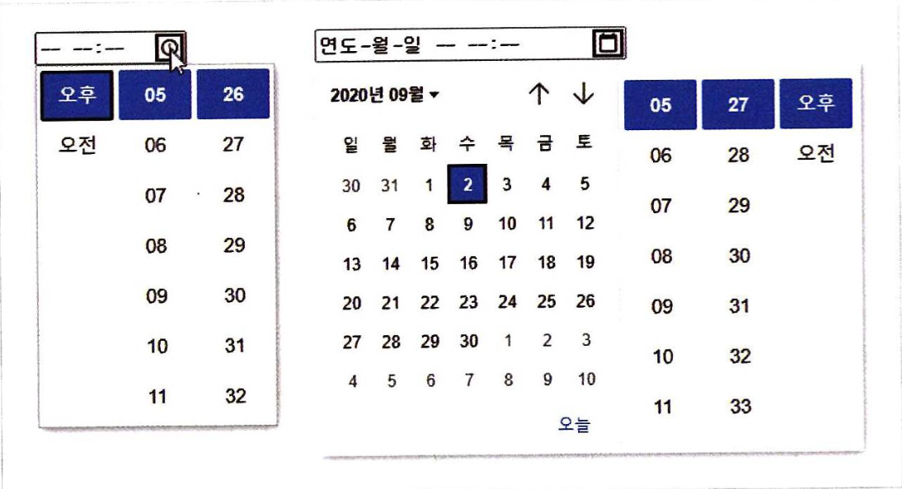

## type="submit", type="reset"
submit 버튼과 reset버튼을 지원한다. 인풋에 입력된 모든 값을 서버로 보내거나, 지운다. 
만약 해당 type이 fieldset 안에서 쓰였다면, 해당 fieldset 안의 입력값만 제출하거나 리셋한다.
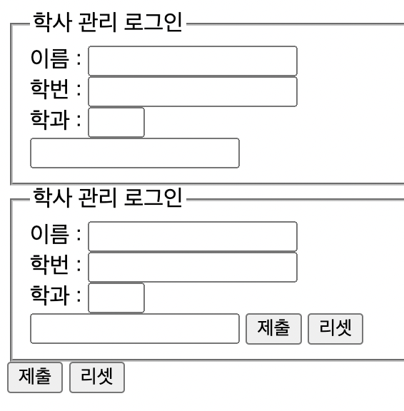

## type="image"
submit 과 정확히 같은 기능을 하는데, 기본 버튼 대신 사용할 이미지를 지정한다.
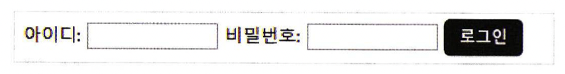

## type="button"
특정 기능이 없는 기본 버튼을 삽입한다. 이 버튼의 기능은 주로 자바스크립트로 넣는다.

## type="file"
파일첨부 버튼을 지원한다. 누르면 익히 아는 그 파일 첨부 창이 나타난다.
* 이 기능이 파일을 서버에 보내주지는 않는다. 이것도 자바스크립트로 한다.

## type="hidden"
화면에 직접 보이지는 않지만, submit버튼을 눌렀을 때 input에 입력된 값들과 함께 서버로 넘겨지는 정보를 입력한다.  
예를 들어, 자동 로그인인지, 직접로그인인지, 로그인 실패인지 따위의 정보를 히든 타입으로 넘길 수 있다.

* datetime이나 month 속성의 예에서 보이듯 갑자기 표준에서 빠져서 안되는 것들이 빈번하게 나타나는데, 뭐가 안되고 뭐가 되는지를 일일히 외우기 보다는 그냥 그때 그때 안되는 것이 있으면 해당 기능이 표준에 아직 있는지 확인해 보고 아니면 대안을 찾아보는 식으로 공부하는것이 더 좋지 않을까?