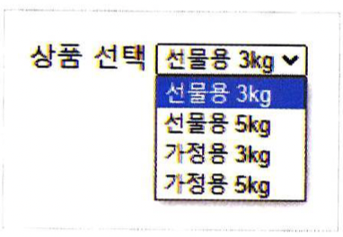
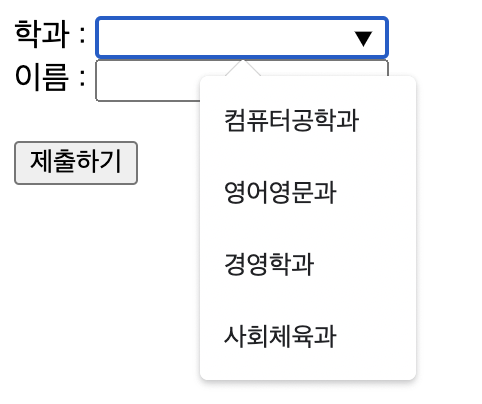
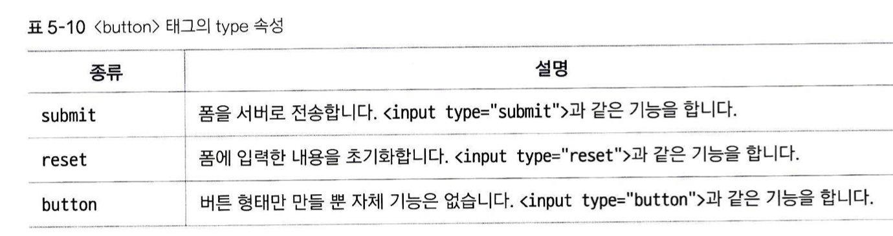

# input외의 다른 태그들
## `<textarea>` 태그
텍스트를 여러 줄 입력할 수 있습니다. 자기소개서 작성 페이지의 본문 부분이 대표적인 예시입니다.  

cols 속성으로 창의 너비를 지정할 수 있습니다.  

rows 속성으로 텍스트를 몇 줄 보여줄 지 정할 수 있습니다 (단, 이 것이 텍스트의 길이를 제한하지는 않습니다. type 태그의 size 속성처럼, 단지 몇 줄을 보여줄 지만 정합니다.)

## `<select>`, `<option>` 태그
선택 가능한 목록을 표시하는 드롭박스를 만들 수 있습니다. 다음과 같은 형식으로 사용합니다:  
```
<select>
	<option value="값:L">내용:l</option>
	<option value="값2">내용2</option>
</select>
```
즉, select 태그로 드롭박스의 처음과 끝을 나타내고 option  태그로 어떤 목록이 들어갈 지를 정해줍니다.


select 태그 속성  

size 속성으로 옵션 몇 개를 표시할 것인지 지정하고  
muptiple 속성으로 두 개 이상의 항목을 선택할 수 있게 할 수 있습니다 (윈도우는 ctrl, 맥은 command로 복수 선택 가능).

option 태그 속성  
value 속성을 지정하여 해당 항목을 선택했을 때 서버로 넘길 값을 지정합니다  
selected 속성이 지정되면, 드롭박스에서 화살표를 클릭하지 않았을 때 보여지는 항목을 지정할 수 있습니다.

## `<datalist>` 태그
드롭박스와 비슷하게, 선택 가능한 목록을 표시합니다. 하지만 select와 달리, 이것만 입력하면 화면상에는 아무것도 보이지 않습니다. 이 태그는, 다음과 같은 식으로 사용합니다:
 ```
 <input type="text" list="데이터 목록 id"> 		
<datalist id="데이터 목록 id">
	<option value="서버로 넘길 값">선택 옵션1</option>
	<option value="서버로 넘길 값2">선택 옵션2</option> 
</datalist>
 ```
즉 datalist라는 리스트를 만들고, list id를 지정하면, 이 선택 항목을 어떤 input 에서 가져다가 쓸 수 있습니다. 실제 사용 예는 다음과 같습니다:



## `<button>` 태그
버튼을 만들고, 기능을 지정합니다. type 속성을 통해 다음과 같은 기능을 지정할 수 있습니다.

(기본 속성은 submit)

* button vs input
input 태그 중 버튼을 생성하는 속성 (submit, reset 등)은 대부분 HTML5부터는 button이라는 태그에서도 똑같이 사용할 수 있습니다. 하지만 대부분은 버튼을 써야하는 상황에서는 button 태그를 쓰는 것을 권장합니다.
why?
input 태그는 닫는 태그가 없지만, button은 닫는 태그가 있습니다. 따라서 `<span>`, ``등의 하위 요소를 가질 수 있습니다. 이러면 css를 이용할 때 디자인적인 측면에서 자유도와 활용성이 더 높아질 수 있습니다.
