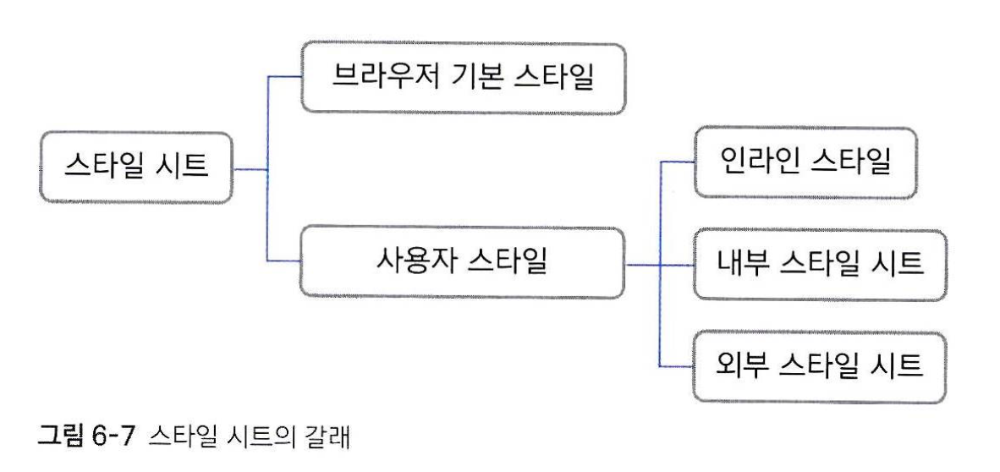

# 스타일과 스타일 시트

## 스타일

CSS 소스에서 한 줄이 하나의 스타일에 해당합니다. 이 스타일의 형식은 다음과 같습니다:  

```
선택자 {속성1: 속성값1; 속성2: 속성값2; }
```

선택자는 스타일을 어디에 적용할지를 가리킵니다.  

속성과 속성값은 디자인 속성(ex. 폰트)과 속성값(ex. 맑은고딕)을 가리킵니다.  

속성과 속성값의 쌍을 스타일 규칙이라고 하며, 세미콜론(;)으로 구분되어 여러개의 스타일 규칙을 적용할 수 있습니다.  


## 스타일 시트
위와 같은 스타일들을 모아 놓은 집합을 스타일 시트라고 합니다. 이 스타일 시트는, 다음과 같은 분류로 나뉩니다.


### 브라우저 기본 스타일
브라우저 기본 스타일은, 사용자가 CSS로 디자인을 저 적용하지 않았을 경우 기본으로 적용되는 스타일입니다. HTML을 작성할 때 기본적으로 나타나는 디자인이 이 브라우저 기본 스타일입니다.  
<br>

### 인라인 스타일
인라인 스타일은, HTML 태그의 속성값으로써 적용되는 스타일을 뜻합니다. 사용자가 아주 간단한 스타일 정보를 적용할 때, HTML 태그의 style속성을 지정할 수 있습니다. 기본 형태는 다음과 같습니다:  
```
style="속성: 속성값;"
```
사용 예시
```
<p style="color: blue;>내용</p>
```
<br>

### 내부 스타일 시트
HTML 문서 내부에서 해당 문서에 사용할 스타일을 정리해 놓는 것을 내부 스타일 시트라고 합니다. 이러한 내부 스타일 시트는, `<head>`태그 안에서 `<style></style>`를 정의 하고 그 안에서 작성합니다.  
사용 예시
```
<head>
	<meta charset="UTF-8">
	<title>제목</title>
	<style>
		h1 {color: blue;}
	</style>
<head>
```
<br>

### 외부 스타일 시트
HTML 문서 외부에, 해당 문서에 사용할 스타일을 .css로 끝나는 별개의 파일로 만드는 것을 외부 스타일 시트라고 합니다. 해당 파일을 HTML문서에 연결하기 위해, HTML 문서의 head 태그 안에 `<link>` 태그를 사용합니다. 
사용 예시
```
<head>
	<meta charset="UTF-8">
	<title>제목</title>
	<link rel="stylesheet" href="css 파일 경로">
<head>
```
(rel 속성은 연결하는 파일이 이 HTML문서와 어떤 관계인지를 나타냅니다)