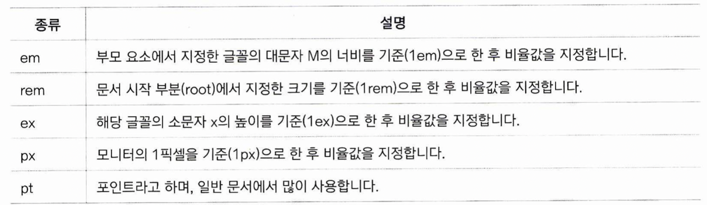

# 글꼴 관련 스타일

## font-family
폰트 스타일을 지정합니다. font-family 속성으로 지정할 수 있습니다. 기본형은 다음과 같습니다:  
```
font-family: <글꼴 이름>
```
해당 글꼴은, 사용자 시스템에 설치된 글꼴이어야 합니다. 해당 글꼴이 없을 수도 있기 때문에, 다음과 같이 사용할 수도 있습니다:
```
font-family: <글꼴1>, <글꼴2>, ...
```
이 때, 글꼴1이 없다면 글꼴2를, 글꼴2도 없다면 그 뒤의 글꼴을 지정합니다.  
* 만약 글꼴 이름이 맑은 고딕 처럼 두 글자라면, "맑은 고딕" 처럼 큰 따옴표로 묶어서 넣어야 합니다.

## font-size
폰트의 크기를 지정합니다.
```
font-size:<값>
```
여기서 값으로 세 가지를 사용할 수 있습니다:
1. 키워드  
	미리 절대 크기가 px단위로 지정되어 있는 키워드를 사용합니다. 크기 순으로 나열하면 다음과 같습니다.  
	xx-small x-small small medium large x-large xx-large
2. 단위  
	
	
	* em의 경우, 정확히는 해당 단위를 사용하는 요소의 font-size를 기준으로 합니다. em을 font-size의 값으로 사용하는 경우는 동어반복이라 말이 안되기 때문에 부모 요소의 font-size 기준이라고 했지만, 만약 em을 font-size가 아닌 다른 요소(width)에서 사용할 경우는 해당 요소의 font-size가 기준입니다.
	* rem의 root란, html에서는 `<html>` 태그를 의미합니다.
	* html 태그에서 font-size가 따로 지정이 안되 있는 경우 브라우저 마다 다르지만 대개 16px, 12pt를 기본값으로 합니다. 따라서 html태그나 부모 요소에 font-size 지정이 따로 안되어 있다면 1rem, 1em은 16px, 12pt가 됩니다.
	* 예전에는 px, pt 같은 절대 크기 단위를 많이 사용했지만, 모바일 환경을 고려해야 하는 요즘은 상대 크기 단위인 em, rem을 많이 사용하는 추세입니다.
3. 백분율  
em과 근본적으로 같지만, 단지 100을 곱했다는 점만이 다릅니다. 부모 요소의 font-size를 기준으로한 백분율 값을 의미합니다.

## font-style
글꼴의 스타일을 지정합니다.
```
font-style:<값>
```

값으로 세 가지를 사용할 수 있습니다.
1. normal  
	아무런 변화를 주지 않습니다.
2. italic  
	글씨를 이탤릭체로 표시합니다.
3. oblique  
	글씨를 기울입니다.
* 글씨를 기울이는거나 이탤릭체로 표시하는거랑 무슨 차이인가요?  
대부분의 글꼴에는, 글씨를 기울인 이탤릭체 글꼴이 따로 디자인 되어 있습니다. 이런 경우는 italic을 쓰면 됩니다.  
하지만 만약 이탤릭체가 따로 없는 글꼴인 경우는 oblique를 쓰는데, 이건 단순히 포토샵으로 글자를 기울이듯 무식하게 기울이는 것입니다. 글꼴을 디자인할 때, 이탤릭체는 따로 심미성을 고려하여 디자인하기 때문에 단순히 기울인 것과는 차이가 있습니다. 따라서 이탤릭 글꼴이 없는 경우가 아니라면 italic 속성을 쓰는 것이 좋습니다.
* font-style은 사실상 이탤릭체를 쓰기 위한 스타일이라고 볼 수 있습니다.

## font-weight
글꼴의 굵기를 지정합니다.
```
font-weight:<값>
```
1. 절대 굵기: 숫자 100부터 900 사이의 값을 지정할 수 있습니다.
2. 상대 굵기
Thin(100), Normal(400), Bold(700), Heavy(900)의 네 가지 키워드를 쓸 수 있습니다. 또한, 부모 요소 글꼴의 굵기를 기준으로 bolder, lighter 키워드를 쓸 수 있습니다.

* 저 4개 외에도 100 단위로 모두 키워드가 존재하지만, bolder와 lighter는 저 4개를 기준으로 계산됩니다.
* CSS Fonts Level 4 부터 1 ~ 1000까지 지원 가능하게 바뀌었으며, 가변 글꼴 기능이 지원됩니다. 자세한 내용은 다음 문서를 참조:  
https://sorto.me/docs/Web/CSS/font-weight