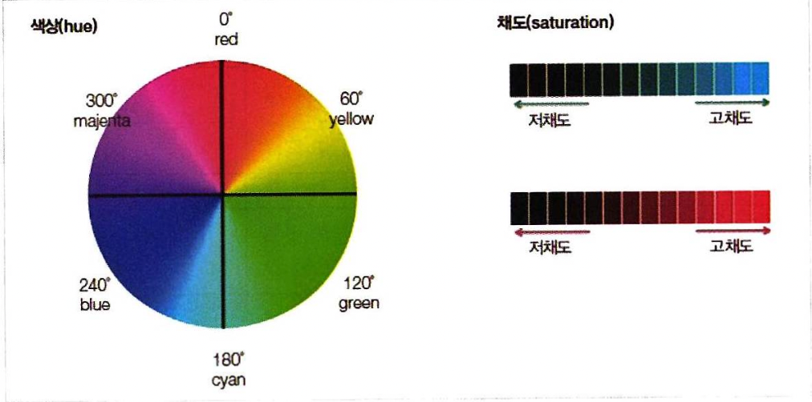
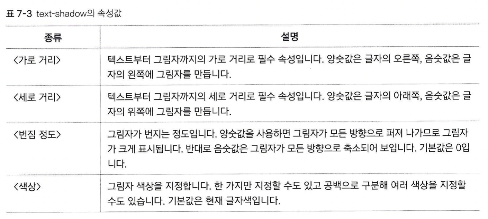

# 텍스트 관련 스타일

## color 속성
글자색을 지정할 수 있습니다. 기본형은 다음과 같습니다:
```
color: <색상>
```
색상을 표기하는 3가지의 방법이 있습니다.
1. 영문명으로 색상 표시  
red, yellow, black 처럼 잘 알려진 색상 이름으로 색깔을 지정합니다. 대략 147개 정도의 색상을 인식할 수 있습니다.

2. 16진수 표현법  
`#ffff00` 과 같이 #뒤에 16진수로 표현하는 방법입니다. 앞에서 부터 두 자리씩 R(빨강), G(초록), B(파랑)의 3원색이 얼마나 섞여 있는지를 0부터 255(ff)까지 나타낼 수 있습니다.  

3. RGB 표현법  
16진수 표현법과 본질적으로 같습니다. 단지 rgb(0, 0, 255); 같은 식으로 3원색을 나타냅니다. 이는 #0000ff, blue와 같습니다.

4. hsl, hsla 표현법  

다음과 같은 색상환을 기준으로 h(hue, 색상), s(saturation, 채도), l(lightness, 명도), a(alpha, 투명도)의 4가지 속성을 조절하여 색상을 표현합니다. 기본 표현형은
```
color: hsl(0, 100%, 50%)
```
또는  
```
color: hsla(0, 100%, 50%, 0.5)
```
(투명도만 %단위가 아닌 점에 유의)  


## text-align
텍스트의 정렬 상태를 지정할 수 있습니다. 기본형은 다음과 같습니다:
```
text-align: <속성>
```
속성값으로 다음의 값들이 올 수 있습니다.  
1. start: 현재 텍스트 줄의 시작 위치에 맞추어 정렬
2. end: 현재 텍스트 줄의 끝 위치에 맞추어 정렬
3. left: 왼쪽 정렬
4. right: 오른쪽 정렬
5. center: 가운데 정렬
6. justify: 양쪽 정렬
7. match-parent: 부모 요소에 따라 문단 정렬  
(값을 따로 지정하지 않으면 left가 기본으로 설정됩니다.)

## line-height
줄 간격을 지정할 수 있습니다. 기본형은 다음과 같습니다:
```
line-height: <줄 간격>
```
줄 간격의 크기는  
1. 12px 같은 식으로 절대 크기로 지정할 수 있고
2. 100%, 0.5 같은 식으로 문단의 글자 크기를 기준으로 지정할 수도 있습니다.

## text-decoration
텍스트에 밑, 윗줄을 긋거나 취소선을 그을 수 있습니다.
```
text-decoration: <속성>
```
속성값
1. none
2. underline: 밑줄
3. overline: 윗줄
4. line-through: 취소선

## text-shadow
텍스트에 그림자를 추가할 수 있습니다.
```
text-shadow: <가로 거리> <세로 거리> <번짐 정도> <색상>
```


## text-transform
텍스트의 대소문자를 원하는 대로 바꿀 수 있습니다. 한글에는 적용되지 않고 오직 영문에만 적용됩니다.
```
text-transform: <속성>
```
속성값
1. capitalize: 첫번째 문자를 대문자로 바꿉니다.
2. uppercase: 모든 문자를 대문자로 바꿉니다.
3. lowercase: 모든 문자를 소문자로 바꿉니다.
4. full-width: 가능한 모든(??) 문자를 전각문자로 전환합니다
* CSS 영문 문서 어디에도 as many as possible이라는 말은 없고, 단지 asian ideographic character(한자)와 자연스럽게 어울리도록 alphabet을 변형해 준다는 내용만 있습니다. 아마도 한자나 가타카나 옆의 알파벳을 전각문자(정사각형 안에 꽉차는 형태의 글자)로 바꾸어준다는 이야기를 하고 싶었던게 아닐까 싶습니다.

## letter-spacing, word-spacing
글자간 간격, 단어간 간격을 조절합니다.
```
letter(word)-spacing: <값>
```
값의 단위로 px, em과 %를 사용합니다. 
* 자간의 기본값이 0이기 때문에, 0 이상의 양수값을 넣는 경우 무조건 자간이 벌어집니다.
* em과 %는 본질적으로 같은 단위로, 현재 요소의 font-size를 기준으로 합니다.