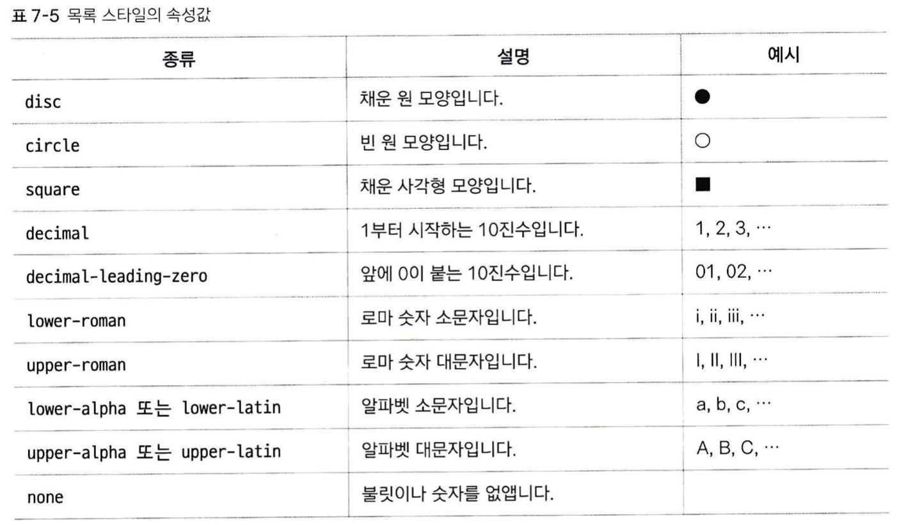

# 목록 스타일

순서 있는 목록(ol)과 순서 없는 목록(ul)의 스타일을 지정합니다. `<ol>, <ul>` 태그에 연결하여 사용합니다. 혹은 목록의 특정 부분에만 적용하고 싶다면 `<li>`에 연결해서 사용할 수도 있습니다.

## list-style-type
순서 없는 목록의 불릿(bullet)과, 순서 있는 목록의 번호 스타일을 지정합니다.
```
list-style-type: <속성>
```

* 이 스타일은 ul, ol 여부와 상관없이 적용됩니다. ul 태그에 list-style-type: lower-roman 스타일을 적용해도 그대로 적용되어 겉보기에는 순서 있는 리스트가 되며, ol에 disc를 적용할 수도 있습니다.

## list-style-image
위에서 지정한 형식 대신, 사용자 지정 이미지를 끌어올 수 있습니다.
```
list-style-image: <url(이미지 파일 경로)>
```
* 마찬가지로, ol에도 적용할 수 있습니다.

## list-style-position
목록을 들여쓰기 할 때 사용합니다.
```
list-style-position: <속성>
```
1. outside: 기본값
2. inside: 들여쓰기

## list-style
지금까지 나온 세 속성: list-style-type, list-style-image, list-style-position의 속성값들은 list-style에서 한번에 사용할 수 있습니다(중복되는 속성값이 없기 때문)
ex.
```
list-style lower-alpha inside
```