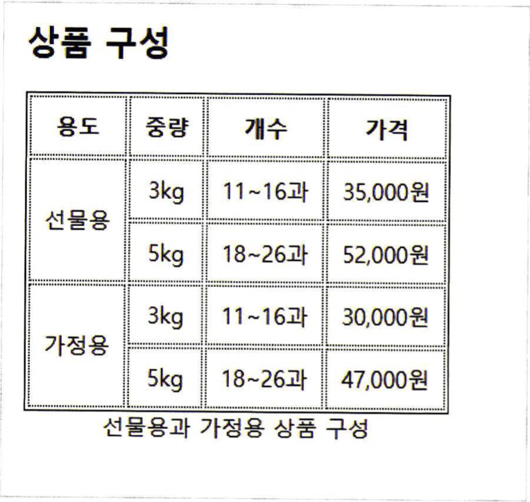

# 표 스타일

## caption-side
표의 제목(`<caption>`)의 위치를 지정합니다. `<table>` 태그의 스타일로 지정하여 사용합니다.
```
caption-side: <속성>
```
1. top: 기본값
2. bottom: 제목을 표 아래쪽으로 옮깁니다.

## border
표에 테두리를 지정합니다.  
`<table>`의 스타일로 지정하는 경우 표 바깥의 테두리를 지정합니다.  
`<td>, <th>`의 스타일로 지정하는 경우 셀의 테두리를 지정합니다.  
`<tr>`의 스타일로 지정할수는 없습니다. 지정한 경우 무시합니다.

(표 바깥 테두리와 셀 테두리의 차이)
```
border: <테두리 굵기> <테두리 형식> <테두리 색상>
```
1. 테두리 굵기는 px단위로 표시합니다(ex. 1px)
2. 테두리 형식으로 solid(실선), dotted(점선) 등을 사용할 수 있습니다.
3. 테두리 색상은 07-03에서 언급된 색상 표시법(키워드, rgb, hsl)을 모두 사용할 수 있습니다.

## boder-spacing
셀 테두리를 지정하는 경우 테두리 사이에 여백이 생기는데, 이 여백의 크기를 조정할 수 있습니다. `<table>` 태그의 스타일로 사용합니다.
```
border-spacing: <가로 여백 크기> <세로 여백 크기>
```
* 가로 여백 크기와 세로 여백의 크기가 같다면, 하나만 써도 됩니다.

## border-collapse
셀 테두리 사이의 여백을 없앨지 그냥 둘지를 결정합니다. `<talbe>` 태그의 스타일로 사용합니다. `<td>, <tr>` 등의 스타일로 사용할 경우 무시합니다.
```
border-collapse: <속성값>
```
속성값  
1. collapse: 여백을 없앱니다
2. seperate: 기본값  

* boder-collapse와 border-spacing의 차이
border-spacing의 값을 0으로 주어도 여백을 없앨 수 있지만, 이 경우 단순히 여백이 없어지는 것이 아니라 테두리가 합쳐지므로, 예를 들어 테두리 두깨가 1px이면 2px인 선으로 합쳐집니다. border-collapse로 없애는 경우, 여백만 없애주고 테두리의 두깨는 1px로 유지시킵니다.