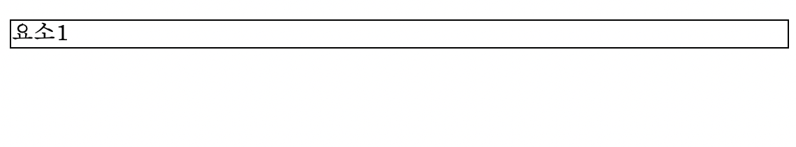
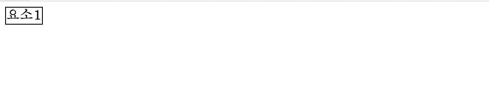
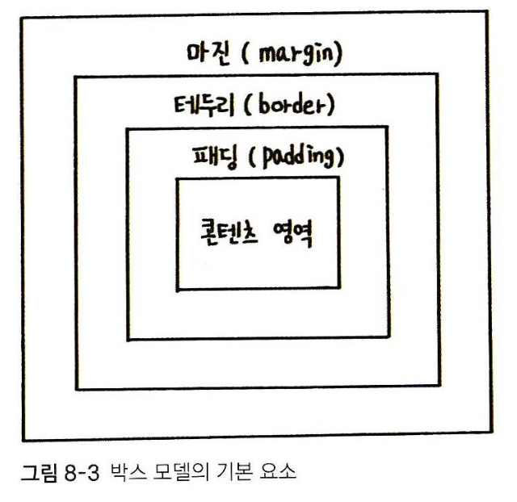
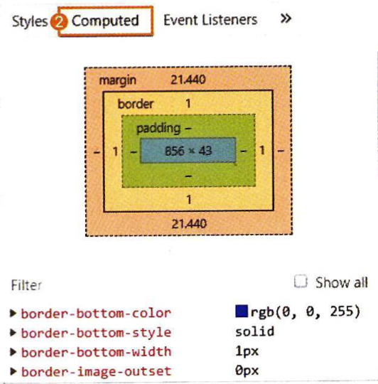
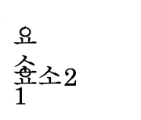
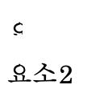
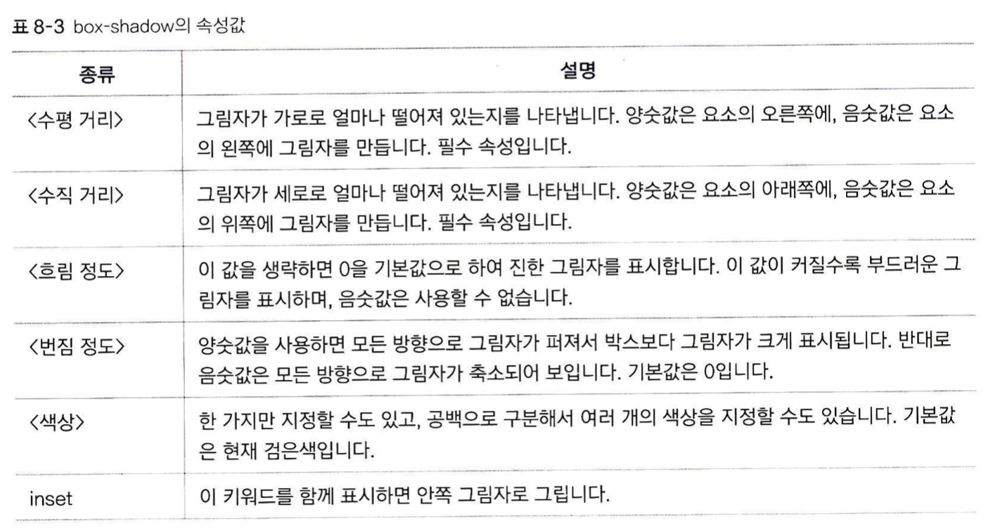

# 박스 모델이란?
## 블록레벨(block-level) 요소, 인라인레벨(inline-level)요소
HTML의 요소(element)란, 곧 태그를 의미합니다. 하지만 이 문단에서 요소란, `<body>` 태그 안에서 쓰이는 태그를 의미합니다. 눈에 어떻게 보여지는지를 다루기 때문입니다.  
블록 레벨 요소란, 한 줄을 통째로 차지하는 태그를 말합니다. 한 줄을 통째로 차지한다는건, 빈 공간까지 모두 요소로 취급한다는 뜻입니다. 직관적으로, 다음과 같은 태그에 테두리를 씌워보겠습니다:
```
<p style="border=1px solid black">요소1</p>
```

`<p>` 태그는 블록 레벨 요소입니다. 따라서 글자가 없는 부분까지, 한 줄이 통째로 요소로 취급되어 테두리가 그어졌습니다. 
<br><br>
이번에는 다음 태그에 테두리를 씌워보겠습니다:
```
<span style="border=1px solid black">요소1</span>
```

인라인 레벨 요소란, 컨텐츠의 내용 만큼만 차지하는 태그를 뜻합니다. 따라서, 요소1라는 글자가 없는 부분은 요소로 취급되지 않아 테두리가 그어지지 않습니다.

## 박스 모델
박스 모델이란, 요소들을 배치하는 모델입니다.

다음과 같이 4개의 박스를 겹쳐놓은 듯한 모양을 하고 있습니다.  
박스 모델의 구성 요소는 다음과 같이 4개로 이루어집니다
1. 콘텐츠 영역: 실제로 콘텐츠가 들어있는 , 맨 첫번째 박스 부분
2. 패딩: 콘텐츠 영역과, 두 번째 박스 사이의 여백
3. 테두리: 두 번째 박스와 세 번째 박스 사이의 여백. 이 세 번째 박스가 실질적으로 블록 레벨 요소입니다. 그리고 이 테두리를 여백이라고 표현했는데, 직관적으로는 하나의 블록 레벨 요소를 감싸는 테두리의 두께를 의미합니다.
4. 마진: 세 번째 박스와 네 번째 박스 사이의 여백. 각각의 블록 레벨 요소들 사이의 간격을 의미합니다.  

이 네번째 박스 (하나의 블록 레벨 요소 + 마진) 가 하나의 독립적인 박스이며, 웹 문서는 이 박스들로 구성되어 있습니다.  
<br>

* 박스 모델 확인하기  
웹 브라우저의 개발자 도구에서, 각 요소를 클릭하고 'Computed' 탭을 클릭하면 해당 요소가 박스 모델 상으로 어떻게 표현되는를 볼 수 있습니다.


<br><br><br>

이제 각각의 요소들을 어떻게 조절하고 배치하는지 볼 차례입니다.
## 콘텐츠 영역
### width, height
콘텐츠 영역의 크기를 조절하려면, 해당 태그의 스타일로 width, height 속성을 지정합니다. 속성값으로:  
1. px, em 등의 절대 크기
2. %: 박스 모델을 포함하는 부모 요소의 크기에 대한 백분율
3. auto: 콘텐츠의 크기에 따라 자동으로 결정(기본값)
* 부모 요소의 크기??  
부모 요소의 크기란, 해당 "박스"를 포함하는 또 다른 "박스"의 크기를 의미합니다. 블록 레벨 요소의 부모 요소가 인라인 레벨 요소일 수는 없습니다(인라인 레벨 요소는 오직 같은 인라인 레벨 요소만 포함할 수 있습니다. 따라서 span 태그 안에 p태그를 넣으면 겉보기에는 차이가 없지만, css 적용이 안되는 등의 오류가 발생합니다). 따라서 블록 레벨 요소의 부모는 항상 블록 레벨 요소이거나, `<body>` 즉 웹 문서 전체가 됩니다. `<body>`태그 바로 밑에 있는 `<p>`태그에 width: 50%를 적용한 경우, 웹 브라우저의 크기에 따라 `<p>`의 컨텐츠 영역 크기도 달라지게 됩니다. 
* 컨텐츠 영역의 크기가 실제 컨텐츠보다 작다면?
```
<p style="width: 10px; height: 10px">요소1</p>
<p>요소2</p>
```
다음과 같이 억지로 요소1의 콘텐츠 영역 크기를 줄이면, 담기지 못한 콘텐츠가 넘쳐서 다른 박스의 컨텐츠를 침범하는 현상이 일어납니다.   

이런 경우는 
```
<p style="width: 10px; height: 10px; overflow: hidden">요소1</p>
<p>요소2</p>
```
다음과 같이 overflow: hidden 속성을 통해 넘치는 부분을 감출 수 있습니다. 그러면 다음과 같이 보여집니다:  


### box-sizing
width와 height는 컨텐츠 영역의 크기만을 결정합니다. 하지만 css를 사용하다보면, 컨텐츠 영역 + 패딩 + 테두리의 크기를 한번에 조절하고 싶을 수 있습니다. 이게 불가능하다면, width, height, 패딩, 테두리 두께를 각각 따로 조절해야 합니다. 이 때 
```
box-sizing: border-box
```
를 지정해 주면, 컨텐츠 영역 + 패딩 + 테두리두께를 한꺼번에 조절할 수 있습니다. content-box로 지정하면 기본값(컨텐츠 영역만 조절)입니다.

### box-shadow
테두리 주위에 그림자 효과를 추가합니다.
```
box-shadow: <수평 거리> <수직 거리> <흐림 정도> <번짐 정도> <색상> inset
```
