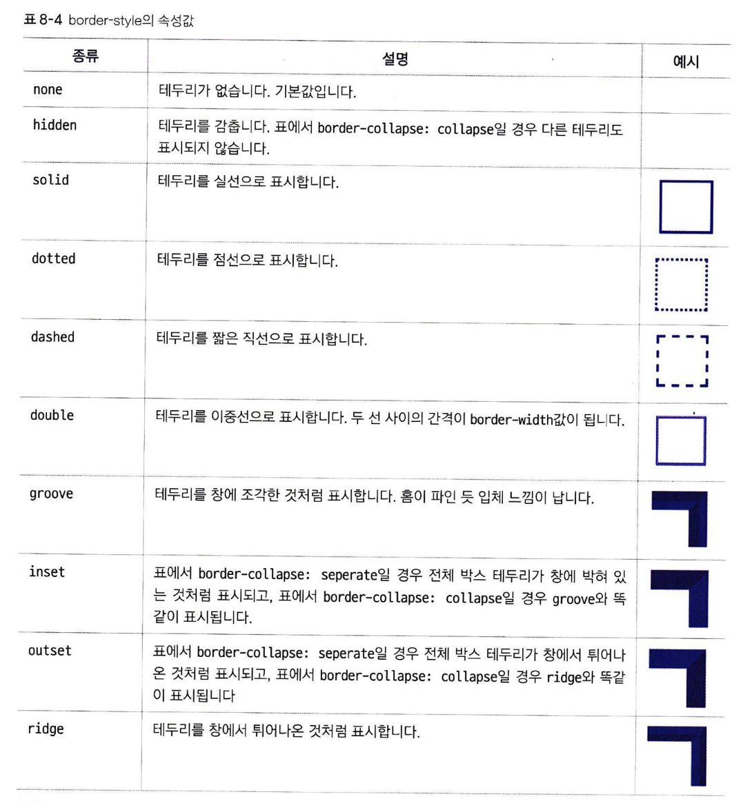
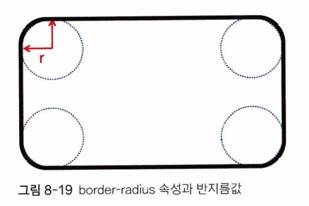
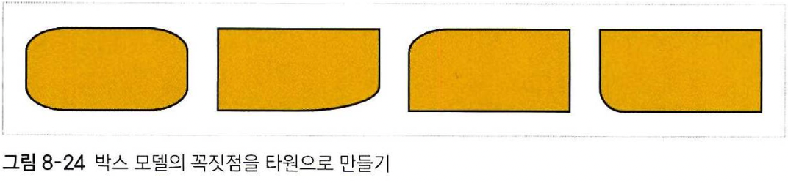

# 테두리 스타일

## border-style
테두리의 모양을 지정합니다. 사용 가능한 속성값은 다음과 같습니다:

<br><br>

## border-width
테두리 두께를 지정합니다.
```
border-width: <크기> | thin | medium | thick
```
속성값으로 px단위로 크기를 지정하거나, thin, medium, thick 같은 예약어를 지정할 수 있습니다.
<br><br>

## border-color
테두리 색상을 지정합니다. 색상은 키워드, 16진수, rgba, hsla 를 역시 사용할 수 있습니다.
<br><br>

## border-radius
이 속성은, 둥근 테두리를 만들기 위해 사용합니다. 구체적으로는 각 꼭지점 마다 원이 있는 것 처럼 처리가 됩니다.

이 때 반지름 값 r을 조정하면, 둥근 정도를 조절할 수 있습니다. 이 r값은
```
border-radius: r
```
처럼 속성값으로 지정해서 사용합니다. 이 때 r값으로 px, em을 쓸 수도 있고, %값을 쓸 수도 있습니다. %를 쓰면, 해당 박스의 너비에 대한 백분율을 의미합니다. 만약 50% 이상의 값을 넣으면, 이미지가 원형이 됩니다.
<br>

다음과 같이도 쓸 수 있습니다
```
border-radius: r1 / r2
```
이 경우, 모서리에 원이 아니라 타원이 있는 것 처럼 그려집니다.

이 때 r1은 타원의 가로축, r2는 세로축 길이를 의미합니다.
<br><br>

## 박스 모델의 방향
박스 모델에서, 사각형의 각 방향을 나타내는 예약어가 있습니다:  
top, left, bottom, right  
이러한 예약어는 언제 사용할까요? 테두리 스타일을 4 방향 마다 따로 적용하고 싶을 때 사용합니다. 이 때 두가지 방법을 쓸 수 있습니다.
1. border-top-style
2. border-style: solid dotted dashed double
1번 방식은, -(방향)-을 추가하여 각각의 테두리 마다 따로 스타일을 적용합니다.  
2번 방식은, 하나의 스타일 내부에서 같은 속성을 4번 지정하면 각각 top-left-bottom-right(시계방향)으로 따로 따로 적용됩니다. 3개를 적용하면 top-left-bottom이 적용되고, 적용 되지 않은 부분은 마주보는 방향의 속성이 적용됩니다. 만약 bottom이 비어 있다면 top에 적용된 속성이 적용되고, right가 비어있다면 left에 적용된 속성이 적용됩니다.  
* border-radius의 타원 속성은 어떻게 2번 방식으로 따로 따로 적용하나요?
```
border-radius: w1 w2 w3 w4/ h1 h2 h3 h4
```
각각 순서대로 top의 타원 가로축 - right - bottom - left / top의 타원 세로축 - right - bottom - left 순으로 적용됩니다.
<br><br>


## 테두리 스타일 한번에 적용하기
위에서 나온 3가지 속성은, border 속성의 스타일로 묶어서 정의할 수 있습니다.
```
border: 3px solid black;
```
단, 이렇게 묶어서 사용하는 경우 테두리 방향 마다 따로 스타일을 적용할 때 두 번째 방법을 적용할 수 없습니다. 즉,
```
border: 3px solid black 5px dotted red;
```
이런 식으로 적용해도 top과 right에 따로 따로 적용되지 않고 그냥 무시됩니다. 이런 식으로 쓰고 싶다면
```
border-top: 3px solid black;
border-right: 5px dotted red;
```
이렇게 써야 합니다.
<br><br>
