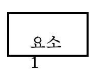
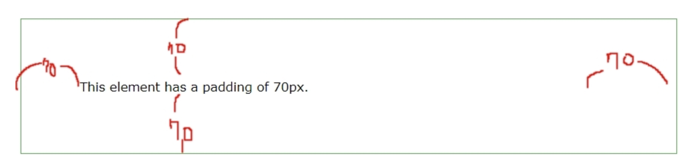

# padding, margin 스타일
이 파트는, 여백에 대해 다룹니다. 컨텐츠와 테두리 사이의 여백은 padding, 박스와 박스 사이의 여백은 margin 입니다.

## margin 속성
요소 주변의 여백을 의미합니다.
```
margin: <크기> | <백분율> | auto
```
px, em 같은 절대값이 올 수도 있고, 박스를 포함한 부모 요소의 크기(08-01: 부모 요소의 크기 참고)의 백분율로 표시할 수도 있습니다. 
또한, 4방향의 마진을 예약어를 이용해서 따로 적용할 수도 있습니다. 마찬가지로, margin-top 처럼 사용할 수도 있고, margin: top right bottom left 의 형식으로 사용할 수도 있습니다.
* auto 속성
해당 속성은, 마진 값을 "적절히" 지정합니다. 예를 들어, margin: 0 auto를 통해 left와 right를 모두 auto로 지정한 경우, 브라우저는 각 방향의 마진을 
(브라우저 넓이 - 요소의 너비) / 2로 균등하게 맞춥니다.  
하지만, 다양한 상황에 대해 이 auto 키워드가 어떻게 계산을 하는지는 확실하지 않습니다. 예를 들어, 
```
<p style="border: 2px solid black; box-sizing: border-box; width: 50px; margin: 10px 0 0 0">요소1</p>
<p style="border: 2px solid black; box-sizing: border-box; width: 50px; margin: auto 0 10px 0">요소2</p>
```
이런 경우 브라우저는 아래쪽 요소의 margin-top을 자동으로 0으로 계산하지만 그것이 어떤 원리에 의해서인지는 모르겠습니다. 단지 이 속성이 거의 대부분 아래쪽에 소개될 가운데 정렬을 위해 사용되기 때문에 세세한 작동 원리에 대한 설명이 부족한 것으로 보입니다.

* margin 상쇄  
margin은, 상하로 상쇄됩니다. 만약 어떤 블록 요소의 margin-bottom이 10px, 그 아래 블록 요소의 margin-top이 15px이라면, 두 요소 사이의 간격은 25px이 아니라, 15px이 됩니다. 즉, 더 큰 값의 마진이 다른 마진을 상쇄합니다. 이러한 상쇄는 좌우 마진끼리는 발생하지 않습니다.

## margin 으로 가운데 정렬하기
텍스트 요소를 가운데 정렬하려면 text-align: center 속성을 쓰면 되지만, 해당 텍스트(컨텐츠)를 포함한 박스 전체를 가운데 정렬하고 싶을 수 있습니다. 이 때 margin의 속성을 적절히 이용하여 박스를 가운데 정렬 할 수 있습니다.
```
margin: 0 auto
```
이러면 top과 bottom의 margin은 0, left와 right의 margin은 auto로 설정됩니다. top, bottom 값을 0으로 주기 싫다면, 
```
margin-left: auto
margin-right: auto
```
이렇게 해도 됩니다.
* 이 방법이 시각적으로 효과를 보기 위해서는
```
box-sizing: border-box; width: 50px;
```
의 두 설정이 적용되어 있어야 합니다. border-box 설정이 없거나 있어도 width 값이 따로 적용이 안되면, 블록 레벨 요소이기 때문에 기본 width값이 브라우저의 전체 넓이와 같아지기 때문입니다. 즉 인라인 요소의 margin은 auto 속성값을 사용할 수 없습니다.
* 이 방법은 오직 블록 레벨 요소에만 적용할 수 있습니다. 인라인 레벨 요소에는 적용되지 않습니다. 인라인 레벨 요소의 경우 width를 지정할 수 없는데, auto를 통한 계산은 width를 필요로 하기 때문입니다.

<br><br>
 
## 패딩 속성
padding으로 테두리와 컨텐츠 사이의 여백을 지정할 수 있습니다. padding의 크기를 늘릴 경우 컨텐츠 영역이 좁아지는 것이 아니라, 테두리의 크기(즉 width와 height) 자체가 커집니다.
* 블록의 크기가 고정된 상태에서 padding을 늘릴 경우?  
padding-right와 padding-bottom을 무시하고, top과 left를 기준으로 컨텐츠가 움직입니다.  
  
패딩을 계속 키우다 보면 다음과 같이 테두리 바깥으로 컨텐츠가 넘어가 다른 요소를 침범하게 되는데, overflow: hidden으로 감출 수 있습니다.


# 블록 요소 vs 인라인 요소
## 블록 요소
1. 사용 가능한 최대 가로 넓이를 사용(기본 width: 100%): 컨텐츠 영역의 오른쪽 여백이 쭉 잡아늘려진 형태가 된다.  
  
padding: 70px을 적용할 시 위와 같은 꼴이 된다.
2. 요소들이 수직으로 쌓임
3. width, height값 지정 가능
4. margin과 padding에 top right bottom left 모든 키워드 사용 가능
5. margin의 기준: 부모 요소 컨텐츠 영역의 위쪽 끝(부모 요소가 없다면, 브라우저의 맨 위 가장자리) or 바로 위의 블록 요소의 margin-bottom
6. 레이아웃 작업 용도

<br><br>

## 인라인 요소
1. 컨텐츠 영역 + 상하좌우 적절한 간격 + 테두리 두께만큼의 넓이를 사용. 즉 블록 요소 처럼 옆으로 늘어지지 않고 해당 컨텐츠 영역만을 깔끔하게 감싸는 형태의 박스가 나온다.
2. 요소들이 수평으로 쌓임; 좌우 마진이 없어도 기본적으로 간격이 생김
3. width, height값 무시
4. margin에 right, left 키워드만 사용 가능; padding에는 모두 사용 가능
5. margin의 기준: 부모 요소 컨텐츠 영역의 왼쪽 끝(부모 요소가 없다면, 브라우저의 맨 왼쪽 가장자리) or 바로 옆 인라인 요소의 margin-right
6. 텍스트 작업 용도