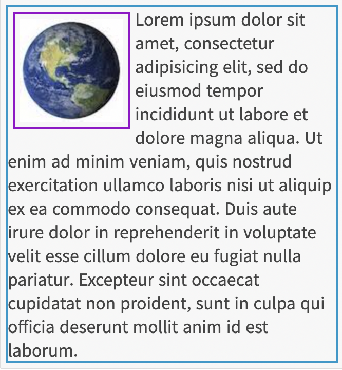

# 웹 문서 레이아웃

## display 속성
해당 속성은 요소를 어떻게 보여줄 것인지를 결정합니다.
1. block: 인라인 요소를 블록 요소처럼 보여줍니다.
2. inline: 블록 요소를 인라인 요소처럼 보여줍니다.
3. inline-block: 인라인 레벨 요소와 블록 레벨 요소의 속성을 모두 가지고 있습니다-> 인라인 요소인데, width와 height를 지정하고 margin의 top과 bottom을 설정할 수 있습니다. width와 height를 따로 지정하지 않는 경우 인라인 요소인것처럼 너비와 높이가 결정됩니다.

## float 속성
해당 속성은 속성이 적용된 요소를 "떠있게" 만듭니다. 무슨 소리입니까?  
블록 요소는 수직으로 쌓이고, 인라인 요소는 수평으로 쌓입니다. float속성이 적용되면, 그 다음으로 오는 요소가 쌓이지 않고 마치 그 위에 겹치듯이 나타납니다(그래서 떠있다고 표현한 것 같습니다). 또한 해당 요소의 컨텐츠 영역이 마치 float 속성이 적용된 요소를 감싸듯이 나타납니다. 즉 css의 일반적인 구조를 무시하고 배치할 수 있습니다.  
* 이 속성은 기본적으로 블록 요소에만 적용할 수 있습니다. 블록 요소에 적용할 경우 마치 인라인 요소처럼 컨텐츠 + 테두리 영역이 좁아집니다. 그리고 float이 적용된 블록 요소가 연속으로 올 경우 마치 인라인 요소처럼 수평으로 쌓이는 것을 볼 수 있습니다.
* 속성값으로 left, right가 올 수 있습니다. 좁아진 요소를 왼쪽 구석에 넣을 것인지, 오른쪽 구석에 넣을 것인지를 결정합니다.
* 왼쪽 구석, 오른쪽 구석이 무슨 말인가요? 어느 정도 구석을 말하는 건가요?  
  -> float 요소의 기본 위치는, 부모 요소의 컨텐츠 영역의 왼쪽(오른쪽) 상단 모서리입니다. float이 적용된 요소에 marin을 줄 경우 이 위치를 기준으로 계산됩니다.

   
이 속성은 원래, 다음 그림처럼 이미지와 텍스트의 배치를 위해 사용되었습니다.
   
하지만 최근에는, 레이아웃 용도로 많이 쓰이고 있습니다. 예를 들어 다음과 같은 구조를 만들 때, float 속성은 유용하게 사용될 수 있습니다:
   

## clear 속성
float 속성을 적용한 요소가 있으면, 해당 요소는 그 다음으로 오는 모든 요소들 위에 떠있듯이 배치됩니다. 하지만 다음으로 오는 요소에 clear 속성을 지정하면, 해당하는 요소 이후로는 float 요소 밑으로 "가라앉지" 않고 다시 통상적인 css 구조에 따라 쌓이게 됩니다. 
```
<p style="border: 2px solid black; float: left; padding: 25px">요소1</p>
<p style="border: 2px solid black">요소2</p>
<p style="border: 2px solid black">요소3</p>
<p style="border: 2px solid black; clear: left">요소4</p>
```
  
