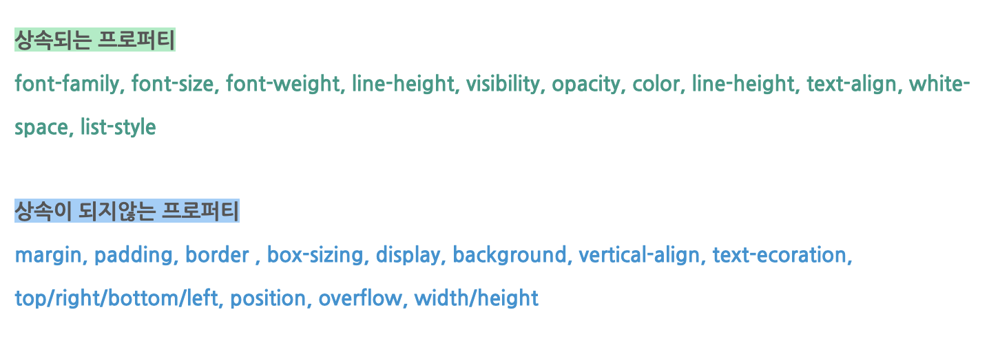

# 부모 자식 관계에서의 박스 모델
## 블록 - 블록
가능합니다. 블록 요소가 블록 요소 안에 있는 것 처럼 보입니다. 자식 블록이 여러 개라면, 부모 블록 요소 안에서 수직으로 쌓입니다(주의: p태그가 자식이라면, 부모 요소 안으로 들어가지 않고 그냥 밑으로 쌓입니다).
## 블록 - 인라인
가능합니다. 그리고 인라인 요소가 블록 요소 안으로 들어간 것 처럼 나옵니다. 자식 인라인이 여러 개라면, 부모 블록 요소 안에서 수평으로 쌓입니다.  
이 경우, 인라인 요소 마진의 기준은, 만약 왼쪽에 다른 형제 인라인 요소가 없는 경우, 부모인 블록 요소의 컨텐츠 영역의 왼쪽 가장자리가 됩니다. 따로 마진과 패딩을 주지 않는 경우, 첫 번째 자식 요소의 위치는 부모 요소의 컨텐츠 영역의 왼쪽 상단 모서리입니다.
## 인라인 - 블록
불가능합니다. 인라인 블록은 블록 요소를 자식 요소로 가질 수 없으며 이렇게 만들 시 자식 블록 요소는 그냥 일반적인 블록 요소 처럼 아래로 쌓입니다.
## 인라인 - 인라인
가능합니다. 자식 인라인 요소가 부모 인라인 요소의 안으로 들어간 것 처럼 보여집니다. 마진의 기준은 블록 - 인라인 케이스와 같습니다.
## 상속
박스 모델에서 쓰이는 대부분의 속성은, 상속이 되지 않습니다. 
 