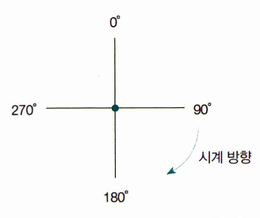
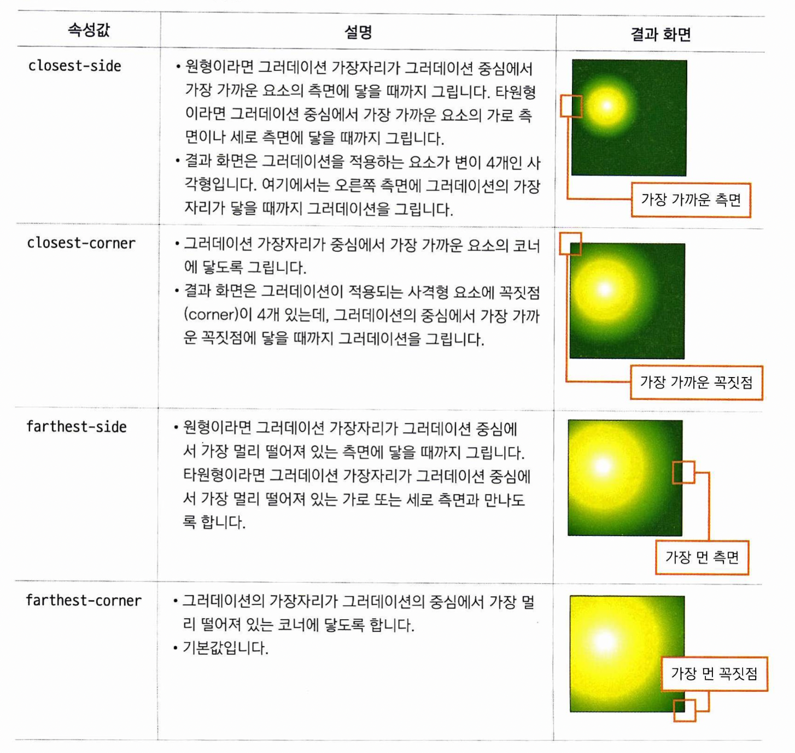

# 그라데이션 만들기

## 선형 그라데이션
```
linear-gradient(<값>)
```
<값> 부분을 어떻게 지정할지에 따라, 두 가지 방법이 있습니다.
1. 방향 지정법
to 키워드와 방향 예약어를 함께 사용합니다. 그리고 색상을 2개 이상 지정하여 그라데이션을 표시합니다.
```
linear-gradient(to right bottom, blue, white);
```
```
linear-gradient(to right bottom, blue, white 30%, blue);
```
만약 색상 옆에 %가 있다면, 시작 위치로 부터 언제 색상이 바뀔 지를 지정합니다.

2. 각도 지정법
 


## 원형 그라데이션
원형 그라데이션을 만듭니다. 
```
radial-gradient(<모양> <크기> at <위치>, <색상 중지점>, [〈색상 중지점>, ........])
```

1. 모양
그라데이션의 모양을 지정합니다. circle(원형)과 ellipse(타원)을 쓸 수 있으며, 타원이 기본값입니다.

2. 크기
원의 크기를 지정할 수 있습니다. 반지름을 지정할 것 같지만, 키워드로 지정합니다.
 

3. 위치
그라데이션이 시작하는 원의 중심의 위치를 지정합니다. left, center, right, 백분율 중 하나로 가로 위치를 지정하고, top, center, bottom, 백분율 중 하나로 세로 위치를 지정합니다.

4. 색상 중지점
마찬 가지로 색상을 두 가지 이상 지정하여 그라데이션을 넣을 수 있으며, 색상과 백분율을 함께 넣어 언제 부터 색상이 바뀔 지를 지정할 수 있습니다.

# 그라데이션 패턴 만들기
위의 두가지 키워드 (linear-gradient, radial-gradient) 앞에 repeating-를 붙여주면 그라데이션 패턴을 줄 수 있습니다.