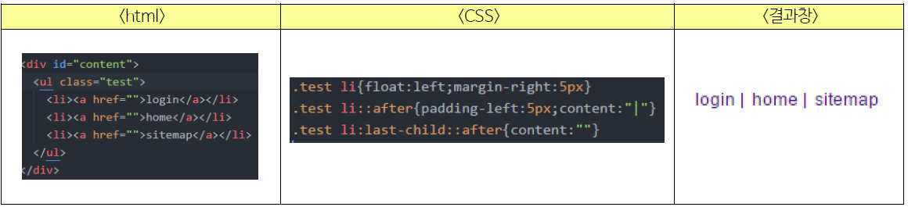

# 가상 클래스

특정한 이벤트나 요소의 상태에 따라 스타일을 다르게 적용하고 싶을 때, 요소 이름 뒤에 :(콜론)과 미리 정의된 키워드를 붙인 가상 클래스를 이용할 수 있습니다.  
* 만약 요소 이름을 제외하고 :키워드 이런 식으로만 쓰면, 해당 상태에 있는 모든 요소에 대해 적용됩니다.
* 여러 개의 가상 클래스를 쓸 수도 있습니다(ex. span:first-child:hover)

## 사용자 동작에 반응하는 가상 클래스
1. :link -> 방문하지 않은 링크에 스타일을 적용
2. :visited -> 방문한 링크에 스타일을 적용
3. :hover -> 특정 요소에 마우스 포인터를 올려 놓으면 스타일을 적용
4. :active -> 웹 요소를 활성화(클릭)했을 때 스타일을 적용
5. :focus -> 웹 요소에 초점이 맞춰 졌을 때(포인터를 올려놓았을 때, Tab키로 커서를 이동했을 때 등 등)

* link, visited, hover, active는 다중 선택자를 사용할 때, 이 순서대로 사용하지 않으면 제대로 적용되지 않습니다.

## 요소 상태에 따른 가상 클래스
1. :target -> 앵커 대상에 스타일을 적용합니다
* 앵커??  
```
<a href = "#intro">
```
이런 식으로 링크를 달면, 해당 아이디를 가진 요소로 "문서 내에서" 이동합니다. 이렇게 문서 내에서 이동하는 링크를 앵커라고 합니다. 이런 경우 :target 요소를 사용하면 아이디가 intro인 요소에 스타일이 적용됩니다.    

2. :enabled, :disabled -> 해당 요소가 사용할 수 있을 떄, 없을 때 각각 스타일을 적용합니다
* 사용할 수 없는 상태가 뭔가요??  
예를 들어 textarea에 disabled 속성을 적용하면, 사용자가 입력을 할 수 없습니다.  

3. :checked -> 체크 박스 등에서, 선택된 항목에만 스타일을 적용합니다.  

4. :not() -> 괄호 안에 들어간 선택자가 가리키는 요소를 제외하고 스타일을 적용합니다. 괄호 안의 특정 요소는, p 처럼 직접 지정할 수도 있지만, 지금까지 배운 고급 선택자를 선택할 수도 있습니다.
ex)  
```
input:not([type="radio"])
```
```
body:not()
```
사실 고급 선택자를 주로 쓰는 것이 맞는게, 기본 선택자를 쓴 두 번째 예시를 보면 알 수 있듯 의미가 없는 경우가 많기 때문입니다.

## 구조 가상 클래스
1. :only-child -> 해당 요소가 부모 안에 유일한 자식 요소일 때, 선택합니다.  
2. :only-type-of -> 해당 요소가 부모 안에 유일한 A 요소일 때 선택합니다.
3. :first-child -> 어떤 요소가 형제들 중 첫 번째 자식 요소일 때 선택합니다.
4. :last-child -> 어떤 요소가 헝제들 중 마지막 자식 요소일 때 선택합니다.
5. :first-of-type -> 어떤 요소가 형제들 중 첫 번째 A요소일 때 선택합니다.
6. :last-of-type -> 어떤 요소가 형제들 중 마지막 A요소일 때 선택합니다.
7. :nth-child(n) -> 어떤 요소가 형제들 중 n번째 요소일 때 선택합니다. 괄호안의 n값으로 원하는 숫자를 넣습니다.
8. :nth-last-child(n) -> 어떤 요소가 형제들 중 끝에서 n번째 요소일 때 선택합니다.
9. :nth-of-type(n) - > 어떤 요소가 형제들 중 n번째 A요소일 때 선택합니다.
10. :nth-last-of-type(n) - > 어떤 요소가 형제들 중 n번째 A요소일 때 선택합니다.
* 이 가상 클래스는, 부모 요소가 아니라 자식 요소에 붙여서 사용합니다.
* 위에서 n의 값으로 숫자를 넣어도 되지만, 그냥 n이 포함된 다항식을 넣은 수식을 쓸 수 있습니다. n은 0부터 시작합니다. 예를 들어, nth-child(n)은 모든 자식 요소를 의미하고 nth-child(2n+1)은 홀수 요소를 의미합니다.
* 짝수 요소와 홀수 요소의 경우 2n, 2n+1 대신 even, odd 키워드를 쓸 수 있습니다.  
  
  
# 가상 요소
가상 클래스가 여러 요소 중 특정한 요소를 선택한다면, 가상 요소는 요소 이름 뒤에 ::(더블 콜론)과 정해진 키워드를 붙여 해당하는 모든 요소의 좁은 범위를 특정합니다.  
1. ::first-line, ::first-letter -> 요소의 첫 줄, 첫 글자를 특정합니다. 만약 첫 글자가 첫 번째 줄에 없다면, 적용되지 않습니다.  
2. ::before, ::after -> 내용의 앞 뒤로 컨텐츠를 추가합니다. 
```
li.new::after { content: "NEW!!"};
```
new 클래스에 속한 리스트의 뒤에 NEW 라는 텍스트를 추가해줍니다.  
* 이 텍스트는 인라인 요소로 취급됩니다.  
* content 속성은 필수로 함께 사용됩니다. 들어가지 않으면 의미가 없기 때문입니다.
* 그냥 태그를 추가하면 되지 뭐하러 이런 짓을 하나 싶은데, 쓰는 예시를 찾아봅시다.  

a. 플로팅 해제 할때
```
.something::after{
	content='';
	display:table;
	clear:both;
}
```
이런 식으로, 다음 요소가 당장 없는데 플로팅을 해제하려고 할 때 쓸 수 있습니다.  

b. 네비게이션 메뉴에 구분선 넣을 때
 