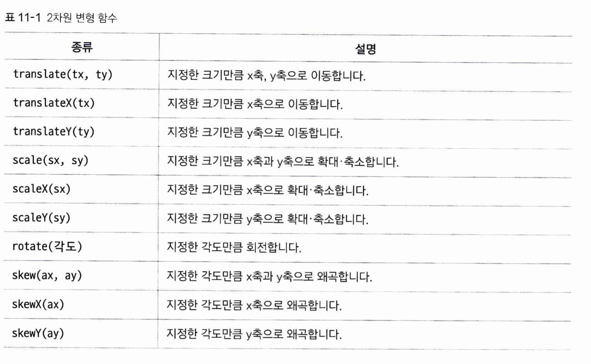
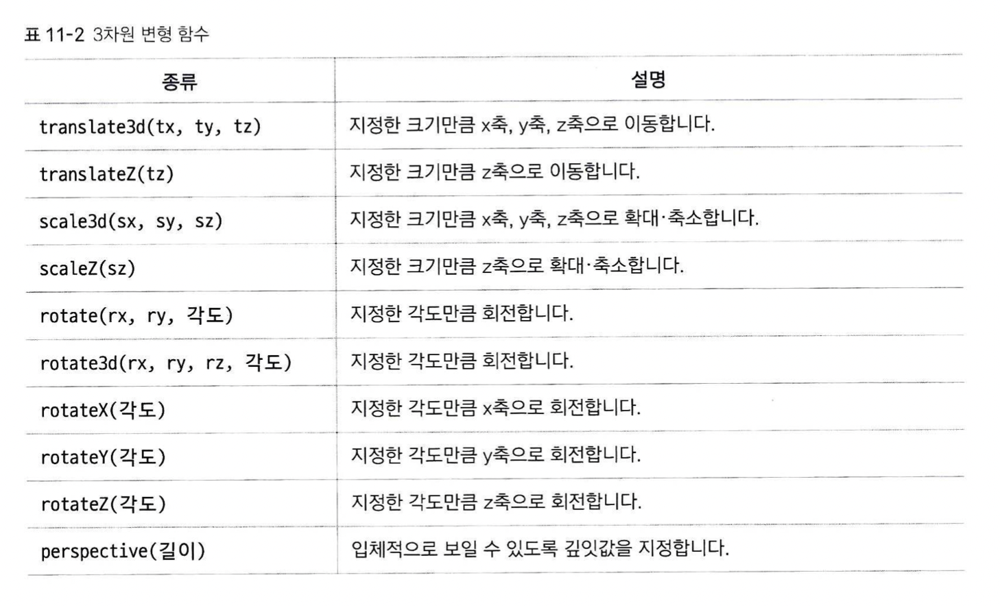
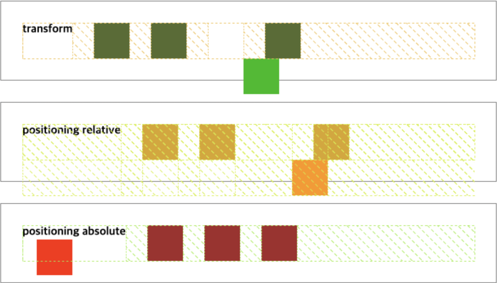

# 트랜스폼 속성
요소에 tranform 속성을 적용하면, 사용자의 동작에 반응하여 요소를 움직이게 할 수 있습니다.  
속성값으로는 변형 함수를 사용하는데, 2차원, 3차원에서 사용할 수 있습니다.
 
 

* 이동 거리는 px, em등으로 지정합니다.
* 컴퓨터 화면은 2차원인데, 3차원 변형은 어떻게 하나요??  
3차원 변형 함수를 쓴다고 해서, 바로 3차원으로 회전이 되거나 변형이 되는 것은 아닙니다. 변형하고 싶은 요소의 부모요소에서, perspective 속성을 이용해 원근감을 주어야 합니다. 이 perspective 속성이 설정이 되어 있어야 3D 변형이 가능합니다.  
* 원근감이란 객체로 부터 사용자가 얼마나 멀리 떨어져 있는지를 나타냅니다. 단위는 px, em 으로 지정할 수 있습니다. 값이 클 수록, 멀리서 보기 때문에 눈에 보이는 변형의 정도가 작아집니다.  
  
  
## position 이나 widht, height 속성을 조절해서 바꾸면 안되나요?
1. position의 경우, relative가 아니라면 position이 적용되면서 문서 레이아웃이 변하지만, translate의 경우는 그런 것 없이 그 요소만 순수하게 움직여 줍니다.  
2. position을 변경하면 웹브라우저에서 레이아웃을 다시 잡지만, transform의 경우는 말 그대로 위치만 옮겨 줍니다. 즉, 애니메이션 효과가 아닌 레이아웃 용도로 transform을 사용하는 것은 적절치 않을 수 있습니다.
 
3. translate 등 transform 속성의 값으로 사용되는 함수들의 화면 출력은 GPU에서 담당하며, position을 통한 위치 변경 및 레이아웃 재배치는 CPU에서 담당합니다. 따라서 레이아웃 용도가 아닌, 애니메이션 연출을 위해 position을 사용하면 성능적으로 손해를 볼 수 있습니다.