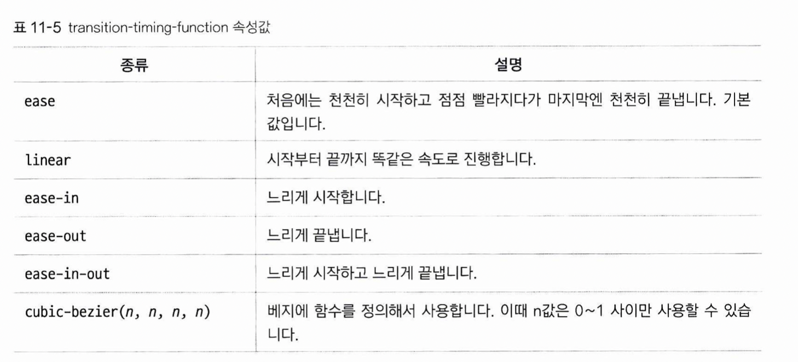

# 트랜지션
요소에 트랜지션을 적용하면, 사용자의 반응이나 시간이 지남에 따라 스타일의 속성을 바꿀 수 있습니다. 마우스를 올리면 색깔이 바뀌거나, 시간이 지나면 이미지가 변하는 경우가 있습니다.

## transition-propoerty
요소의 어떤 속성에 트랜지션을 적용할지 지정합니다.
1. all: 모든 속성에 적용합니다. 기본값입니다(transition-property를 생략한 경우).
2. none: 아무 속성도 바뀌지 않습니다.
3. 속성 이름: 트랜지션 효과를 적용할 대상을 지정합니다. 속성이 여럿일 경우 쉼표로 구분하여 나열합니다.

## transition-duration
트랜지션이 얼마나 진행될지를 s(초), ms(밀리초) 단위로 지정합니다. transition-property에서 지정한 속성이 여러개라면, 마찬가지로 쉼표로 구분하여 동시에 적용할 수 있습니다.

## transition-timing-fuction
트랜지션 진행의 속도 곡선을 조절할 수 있습니다.


## transition-delay
얼마나 기다렸다가 트랜지션이 시작될지를 s, ms 단위로 지정합니다.

## transition
위의 네가지 속성을 한 꺼번에 지정할 수 있습니다. 순서는 상관 없지만, 시간값이 2개 이상 오는 경우 앞의 것은 transition-duration, 뒤의 것은 transition-delay의 값으로 간주합니다.

## transition으로 바뀔 스타일은 어디에 지정하나요?
예를 들어 hover를 쓰는 경우, 
```
p:first-child span:first-child:hover {background-color: red}
```
다음 과 같이 :hover에 대한 스타일 시트를 하나 더 작성하여 바뀌게 될 스타일을 지정합니다.  
transition은 자동으로 발동되지 않으며, 가상 클래스 선택자(hover)나 자바스크립트의 부수적인 액션과 함께 발동합니다.