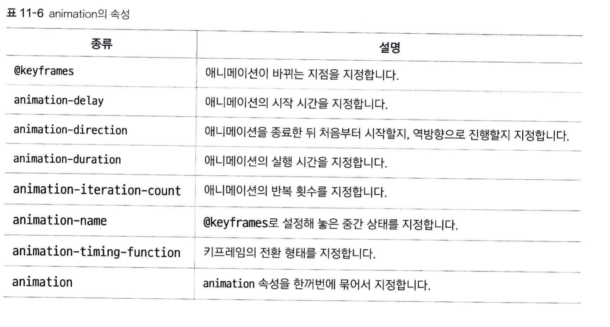

# 애니메이션
transition보다 쉽게 애니메이션을 구현하기 위해 도입된 속성입니다. 정말 세세하게 조절할 게 아니라면, 이걸 쓰면 됩니다.



```
#box1 {
	background-color: #4cff00;
	border: 1px solid transparent;
	animation-name: shape;
	animation-duration: 3s;
	animation-iteration-count: 2;
	animation-delay:
	animation-direction: reverse
	animation-timing-function:
}
@keyframe shape{
	from {border: 1px solid transparent; }
	to{
		border: 1px solid #000;
		border-radius: 50%;
	}
}
```

## animation-name, @keyframe
anmation-name으로 특정 태그에 적용할 애니메이션의 이름을 지정하고, @keyframe + 선택할 애니메이션 이름으로 적용할 애니메이션을 지정합니다.  
@keyframe태그 내부에서, 언제 언제 애니메이션을 사용할지 지정할 수 있습니다. 위와 같이 from, to 키워드로 묶인 중괄호는 처음과 끝을 의미합니다.  
여러 번에 걸쳐 애니메이션을 만들고 싶다면, %를 사용합니다. 예시를 들면  
```
@keyframes identifier {
	0% { top: 0; left: 0; }
	30% { top: 50px; }
	68%, 72% { left: 50px; }
	100% { top: 100px; left: 100%; }
}
```
다음과 같이 사용할 수 있습니다. 0%, 100%만 있다면 각각 from과 to와 같은 말입니다.  

## animation-duration
애니메이션의 지속시간을 지정합니다. s, ms 등의 단위를 지정할 수 있습니다. 기본값은 0이므로 지정하지 않으면 애니메이션이 실행되지 않습니다.

## anmation-direction
애니메이션의 진행방향을 지정합니다.  
1. normal: from에서 to방향으로 지정합니다. 기본값입니다.  
2. reverse: to에서 from으로 지정합니다.  
3. alternate: 홀수 번째는 normal로, 짝수 번째는 reverse로 진행합니다. 여기서 홀수, 짝수 번째는 iteration 속성으로 지정한 반복 횟수에서의 홀수, 짝수 번째를 의미합니다.  
4. alternate-reverse: 홀수 번째는 reverse로, 짝수 번째는 normal로 진행합니다.  

## animation-iteration-count
애니메이션의 반복 횟수를 지정합니다.  
1. 숫자: 횟수 지정
2. infinite: 무한 반복합니다.

## animation-timing-function  
애니메이션 재생의 속도 곡선을 만들 수 있습니다. transition의 그것과 정확히 같습니다.

