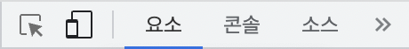
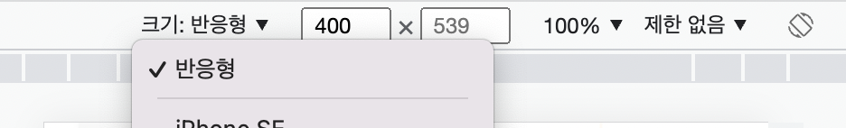

# 반응형 웹
다양한 화면 크기와 특성을 가진 기기들의 환경에 맞추어 반응하는 웹 페이지를 디자인 하는 일을 뜻합니다.

# 뷰포트
뷰포트의 정의  
컴퓨터 그래픽스에서, 뷰포트(viewport)는 현재 화면에 보여지고 있는 다각형(보통 직사각형)의 영역을 뜻합니다. CSS상에서 뷰포트란, 현재 작성하고 있는 페이지를 렌더링 하는 가상의 화면을 의미합니다. 예를 들어 이 뷰포트의 크기를 320px * 640px로 고정한다면, 이 크기를 가진 화면을 기준으로 박스 모델 기준의 프레임이 짜여집니다. 하지만 실제로 이 페이지가 뜨는 화면에 640px * 980px 이라면, 화면의 크기에 맞춰서 커지지 않고 작게 나올 것입니다.  

## 뷰포트 속성
이러한 불상사를 피하기 위해, 뷰포트와 속성값을 지정합니다. 기본형은 다음과 같습니다;  
```
<meta name="viewport" content="속성 1=값1, 속성2=값2, .......">
```
이 meta 태그는 head 태그 영역의 내부에 작성합니다. 속성값으로 다음이 올 수 있습니다.  
1. width: px단위의 크기 혹은 device-width를 쓸 수 있습니다. device-width는 현재 디바이스의 디스플레이 가로 길이를 자동으로 잡아오므로, 위에서 나온 불상사를 피하기 위해 써야 하는 속성입니다. 기본값은 브라우저에서 지정한 기본값을 사용하는데, 크롬의 경우 980px로 지정되어 있습니다.  
2. height: widht와 동일한 방법으로 뷰포트의 가로 길이를 지정합니다.  
3. user-scalable: yes / no로 확대, 축소 가능 여부를 지정할 수 있습니다. 기본값은 yes입니다.  
4. initial-scale: 초기 확대/축소 비율을 지정합니다. 기본값을 1로 가지며, 1부터 10까지 값을 지정하여 기본값의 몇 배를 확대하여 보여줄지를 정할 수 있습니다.  
  

## 뷰포트 단위  
뷰포트를 기준으로 하는 단위입니다.  
1. vw: 1vw는 뷰포트 너비의 1%와 같습니다.  
2. vh: 1vh는 뷰포트 높이의 1%와 같습니다.  
3. vmin: 뷰포트 너비와 높이 중 작은 값의 1%와 같습니다.  
4. vmax: 뷰포트 너비와 높이 중 큰 값의 1%와 같습니다. 


## 반응형 웹 디자인하기 - 디바이스 모드  
PC로 개발을 하는데 모바일에서도 잘 보이는지 확인해야 할 필요가 있습니다. 이 경우 옆에 핸드폰을 갖다 놓을 필요 없이, 크롬 개발자 도구의 디바이스 모드를 활용할 수 있습니다. 
개발자 도구의 왼쪽 최상단에서  

두 번째 아이콘이 디바이스 모드 아이콘입니다. 클릭하여 들어가면  
 다음과 같은 메뉴를 볼 수 있는데, 여기서 뷰포트의 크기를 직접 지정하거나 특정 기기를 선택하여 해당 화면에서 내 웹 페이지가 어떻게 보이는 지를 볼 수 있습니다.