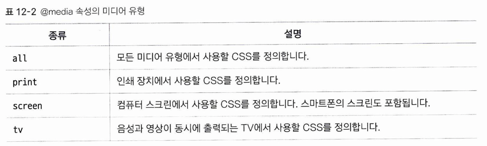
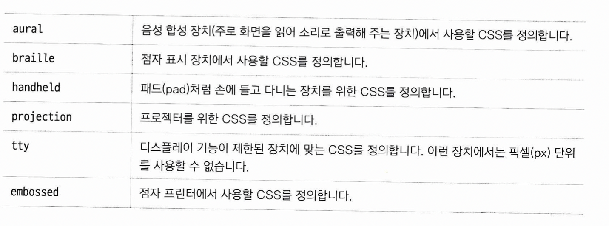

# 미디어 쿼리  
뷰포트가 특정화면을 기준으로 웹 페이지를 디자인 할 수 있는 기준이라면, 미디어 쿼리는 서로 다른 뷰포트에서 서로 다른 CSS를 적용할 수 있게 해주는 도구입니다.  기본 사용 예시는 다음과 같습니다:  
```
@media only all and (조건문) {실행문}
```  
1. @media: 미디어 쿼리가 시작됨을 선언합니다.  
2. only: 미디어 쿼리를 지원하는 경우에만 이 구문을 해석하라는 의미입니다. 생략 시 기본값이 only이기 때문에 일반적으로는 작성하지 않습니다. only 대신 not 키워드를 쓸 수 있는데, 뒤에 오는 모든 구문을 부정하는 연산을 수행합니다. not screen {......} 은 screen 매체에 대하여 뒤에 오는 모든 스타일을 적용하지 말고, 나머지 모든 매체에 대해 적용하라는 의미입니다.  
3. all은 미디어 쿼리를 적용할 대상 미디어를 지정합니다.  


4. (조건문): 미디어 쿼리는 해당 조건문이 참일 때 {실행문}을 처리합니다. 여러 개의 조건문은 and 또는 ,(콤마 - or를 의미)가 를 통해 연결할 수 있습니다.  
5. {실행문}: {}안에 실제 CSS 구문들을 넣습니다.  
  
  
실제 사용례
```
@media not screen and (min-width: 768px) , (max-width: 1439px) { ...... }
```  

## 조건문에 들어갈 수 있는 속성  
1. 웹 문서의 가로 너비와 세로 너비  
	width, height: 웹페이지의 가로 세로 너비가 여기 해당하면 css를 적용합니다.  
	min-width, min-height: 웹페이지의 가로 세로가 최소 이 값 이상이면 적용합니다.  
	max-width, max-height: (위와 같음)  

2. 단말기의 가로 너비와 세로 너비
	device-width, device-height, min-device-width, min-device-height, max-device-width, max-device-height
* 웹문서의 크기와 단말기의 크기는 무슨 차이인가??  
뷰포트의 크기와 디바이스 디스플레이 크기가 다를 수 있다. 만약 뷰포트 속성이 device-width라면, 두 속성은 무차별 할 것이다.  
3. 화면 회전 속성  
	orientation: portrait -> 단말기가 세로 모드일 때 적용합니다.  
	orientation: landscape -> 단말기가 가로 모드일 때 적용합니다.  
  


## 미디어 쿼리의 중단점  
미디어 쿼리를 작성할 때, 화면 크기에 따라 서로 다른 css를 적용하는 분기점을 중단점이라고 합니다. 세상에 존재하는 모든 기기에 맞추어 서로 다른 css를 적용할 수 있지만 현실적으로 불가능 하기에, 보통 모바일, 태블릿, 데스크탑 정도로 구분합니다. 어 경우 중단점은 2개가 됩니다.  

* mobile first  
보통 미디어 쿼리 중단점을 만들 때, 모바일 페이지는 미디어 쿼리를 적용하지 않고 기본 css로 제작합니다. (이렇게 하면, 모든 기기에 대하여 해당 기능이 적용됩니다). 그리고, 태블릿, PC 순으로 더 많은 기능을 추가하거나 변경하는 식으로 디자인을 합니다. 모바일의 평균 사양이 가장 떨어지기 때문에 이런 디자인 기법을 사용합니다. 이런 기법을 모바일 퍼스트(mobile first) 기법이라고 합니다.  

* 중단점을 어떻게 선정하나?  
모바일: 기본 css  
태블릿: 세로 크기가 768px 이상일 때. 가로 크기는 데스크탑과 같이 1024	px  
데스크탑: 화면 크기가 1024px 이상

## 미디어 쿼리 적용 방법  
위에서 나온 @media를 이용한 방법만 있는 것은 아닙니다.  
1. 외부 css파일로 적용하기 1 
```
<head>
	<link rel="stylesheet" media="not screen and (min-width: 768px) , (max-width: 1439px)" href="css 파일 경로">
</head>
```
head 태그 안에 link 태그를 넣어서 적용합니다.  

2. 외부 css파일로 적용하기 2  
```
<style>
	@import url(css파일 경로) not screen and (min-width: 768px) , (max-width: 1439px);
</style>
```
style 태그 안에 import 구문을 넣어서 적용합니다.  

3. 웹 문서에 직접 정의하기 1
```
<style media="not screen and (min-width: 768px) , (max-width: 1439px)">
{......}
<style>
```
style 태그에 media 속성을 넣어서 적용합니다.

4. 웹 문서에 직접 정의하기 2
```
<style>
@media not screen and (min-width: 768px) , (max-width: 1439px) {......}
<style>
```
가장 먼저 설명한 기본 형태입니다.