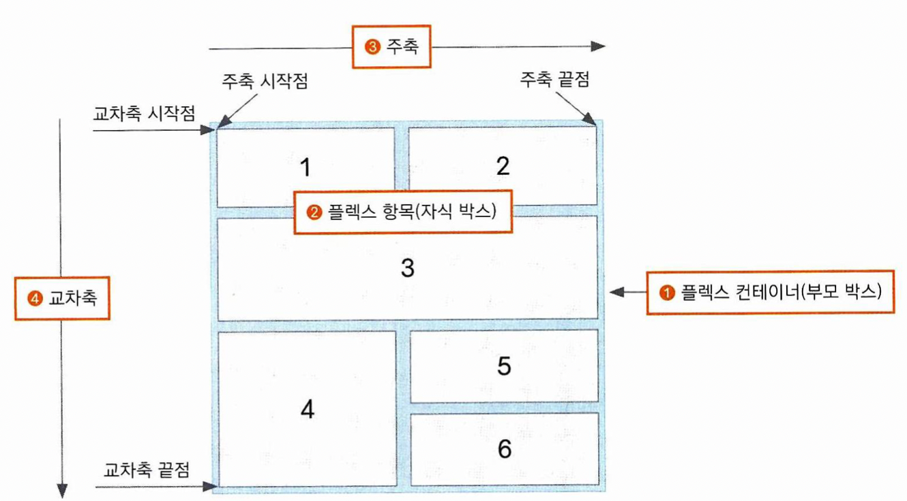
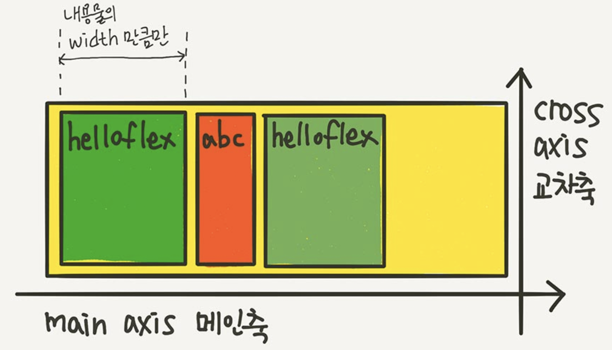
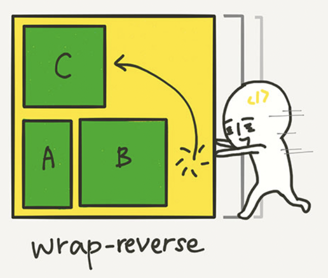
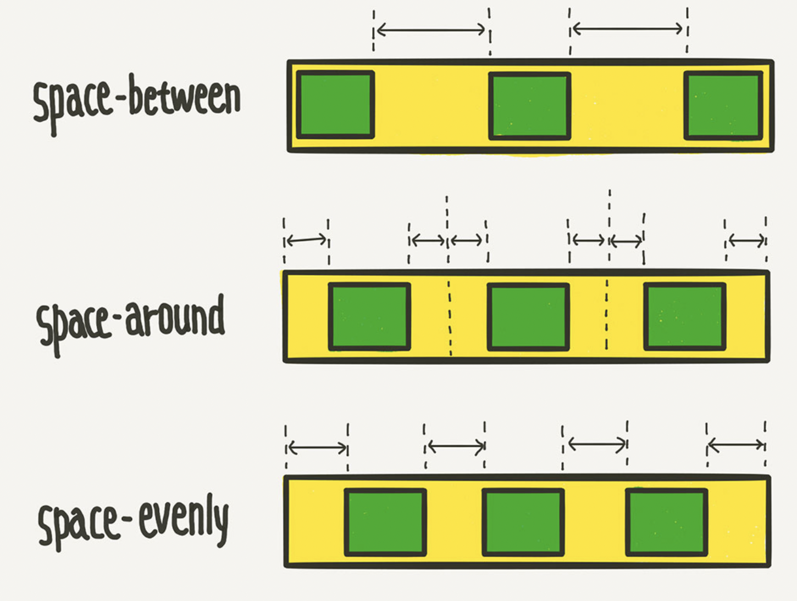
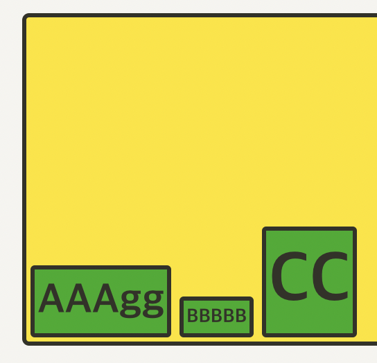
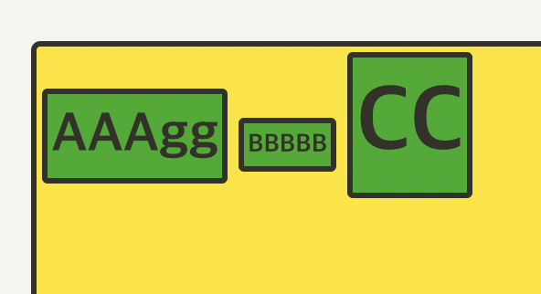
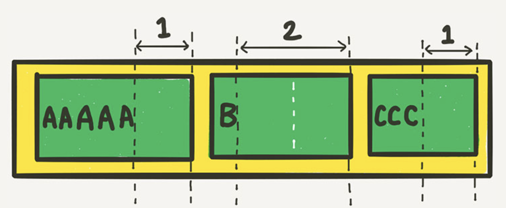

대부분의 출처: https://studiomeal.com/archives/197

# Flex - 플렉스 박스 레이아웃  
우선 플렉스 레이아웃에서 쓰는 용어를 알고 가야 합니다.  
  
1. 플렉스 컨테이너: 플렉스 레이아웃을 적용할 대상을 묶는 요소입니다.
2. 플렉스 아이템(항목): 컨테이너의 구성 요소로, 레이아웃의 구성 요소입니다.
3. 주축: 플렉스 항목에 컨테이너 내부에서 배치되는 기본 방향으로, 기본적으로 왼쪽에서 오른쪽 수평방향입니다.
4. 교차축: 주축과 교차하는 방향으로, 기본은 위에서 아래 수직 방향입니다.

## 컨테이너에 적용하는 속성들
### display
컨테이너에 이 속성을 적용하면, 하위 항목들은 모두 다음과 같이 배치됩니다
  
만약 속성값으로 flex가 오면, 따로 설정이 없다면 모든 요소가 인라인 요소처럼 나타납니다. 블록 요소라도 예외는 없습니다.  
속성값으로 inline-flex가 오면, 모든 요소를 inline-block 요소처럼 취급합니다.  
각 항목의 높이(flex-direction이 column이라면 너비)는 컨테이너의 높이에 맞추어 자동으로 조정됩니다.  

### flex-direction
항목들의 구성 방법을 결정합니다. 
1. row: 왼 - 오 수평방향으로 쌓습니다. 기본값입니다.
2. row-reverse: 오 - 왼 수평방향으로 쌓습니다.
3. column: 위 - 아래 수직방향으로 쌓습니다.
4. column-reverse: 아래 - 위 수직방향으로 쌓습니다.  

### flex-wrap 
컨테이너가 항목을 담을 공간이 부족할 때, 줄바꿈을 어떻게 할지를 지정합니다.
1. nowrap: 줄바꿈을 하지 않습니다. 항목들의 width길이의 합이 컨테이너보다 길다면, 마지막 항목은 컨테이너 밖으로 삐져나갑니다.
2. wrap: 줄바꿈을 합니다.
3. wrap: 줄바꿈을 하는데, 역순으로 바꿉니다. 만약 A, B, C가 있고 C가 마지막 항목이라면, C를 밑으로 내리는게 아니라 위로 올립니다.
  

### flex-flow
flex-direction과 flex-wrap을 한번에 지정할 수 있습니다.  
ex. flex-flow: row wrap;  


## 컨테이너에 적용하는 속성들 - 정렬방법
justify, allign의 두 가지 방법이 있습니다. justify는 주축 방향의 정렬, align은 교차축 방향의 정렬로 기억해 두고 갑시다.  
### justify-content
1. flex-start: 시작점을 기준으로 아이템을 정렬합니다. 기본값입니다.
2. flex-end: 끝점을 기준으로 아이템을 정렬합니다.
3. center: 아이템을 가운데에 정렬합니다.
4. space-between, space-around, space-evenly
  

### align-itmes
1. stretch: 아이템들이 교차축 방향으로 쭉 늘어나서 맞춰집니다. 기본값입니다.
2. flex-start: 아이템을 시작점에서부터 정렬합니다. 위의 stretch와 달리, 아이템들의 height가 그대로 유지됩니다.
3. flex-end: 아이템을 끝점에서부터 정렬합니다.
  
4. center: 아이템을 가운데에 정렬합니다.
5. baseline: 아이템을 텍스트의 베이스라인 기준으로 정렬합니다.
  
다음 예시에서, 가장 낮게 있는 베이스라인(박스 CC의 텍스트 베이스라인)을 기준으로 정렬됩니다.

### align-content  
flex-wrap이 설정이 된 경우, 컨테이너를 벗어나는 경우 줄바꿈이 일어나 2개 이상의 줄이 생기게 되는데, 이 줄들의 정렬 기준을 정합니다.  
1. strecth: 줄의 갯수에 맞추어 적절하게 항목의 높이가 조절됩니다. 3개의 줄이 생기는 경우 전체 화면 넓이를 3개로 분할하여 꽉 차게 들어갑니다.
2. flex-start: stretch같이 맞춰짐 없이 그냥 정렬됩니다.
3. flex-end: 끝점에서 부터 정렬됩니다. 단, 정렬방향과 상관없이 줄바꿈은 flex-wrap에 명시된 대로 일어납니다(column-reverse인 경우에도 flex-wrap이 wrap이라면 아래로 줄 바꿈이 일어납니다).
4. center: 가운데 정렬
5. space-between, space-around, space-evenly: justify-content와 같습니다.


## 아이템에 적용하는 속성들
### flex-basis  
항목의 넓이를 지정합니다. px, em, vw등 width의 값으로 쓰는 단위를 모두 쓸 수 있으며, 기본값은 해당 항목의 width입니다. widht와 다른 점은, 단지 최소 길이를 지정한다는 점입니다. 100px이 안되는 항목들은 100px로 늘려주지만, 100px을 넘는 경우는 100px로 줄여주지 않습니다.
### flex-grow  
이 속성을 설정하면, 항목의 크기가 컨테이너의 크기와 다른 항목들의 flex-grow 속성에 맞추어 유연하게 커집니다. 기본값은 0으로, 0이면 아무 변화도 없습니다. 숫자값을 지정할 수 있는데, 이 숫자값은 컨테이너 내부의 다른 항목들이 여백을 나누어 갖는 비율입니다. 예를 들어
```
.item:nth-child(1) { flex-grow: 1; }
.item:nth-child(2) { flex-grow: 2; }
.item:nth-child(3) { flex-grow: 1; }
```
  
이런 식으로, flex-basis를 제외한 여백의 크기를 나누어 갖습니다.

### flex-shrink
이 속성을 설정하면, 항목의 크기가 컨테이너의 크기와 다른 항목들의 flex-grow 속성에 맞추어 유연하게 작아집니다. 위의 flex-grow와는 달리, 기본값이 1로 설정이 되어 있기 때문에 컨테이너의 크기를 줄이면 각 항목의 크기도 작아집니다. 하지만 만약 특정 항목에 flex-shrink: 0을 설정하면, 컨테이너를 아무리 줄여도 너비가 flex-basis에서 설정한 값으로 유지됩니다. 만약 컨테이너 너비가 이보다 작아지면 삐져나옵니다.

### align-self
위에서 살펴본 align-items와 똑같은 속성과 속성값을 가집니다. 컨테이너 내의 모든 아이템에 적용되지 않고 특정 아이템에만 적용된다는 차이가 있습니다.

