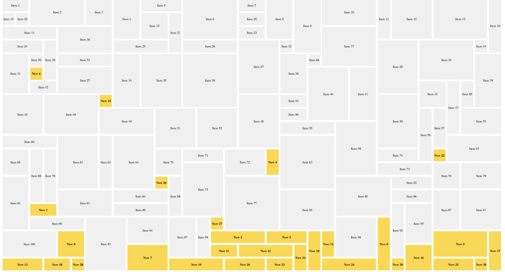

# 그리드 레이아웃
박스모델에 의거한 지금까지의 레이아웃 방식은, 단순한 페이지를 만들때는 상관이 없지만, 복잡한 디자인을 적용하려고 할 때 굉장히 비효율적으로 느껴집니다.  

이런 레이아웃을 블록, 인라인, float만 가지고 만들어야 한다고 생각해봅시다. 
  
컴퓨터 그래픽스가 아닌, 디자인 철학의 영역으로 넘어오면, 그리드 레이아웃은 위의 그림같은 격자구조, 그리고 이 구조를 구성하는 행과 열, 모듈 등의 구성 요소를 갖는 디자인 철학입니다. 전통적인 책, 신문등의 많은 요소에서 오랜 시절 사용해온 방식이기도 합니다.  

박스 모델은 이런 그리드 레이아웃 철학을 적용하기 몹시 곤란합니다. 따라서, CSS에서도 그리드 레이아웃을 쓸 수 있는 다양한 꼼수와 프레임워크가 개발되어 왔습니다(ex. 컬럼 레이아웃, Bootstrap)  

하지만 모던 CSS는, 언어 차원에서 이러한 그리드 레이아웃을 지원하기 시작했습니다.  

Flex와 Grid라는 두 가지 방법이 있는데, Flex는 1차원으로 수평, 수직 영역 중 하나의 방향으로만 레이아웃을 나눌 수 있지만, Grid는 2차원으로 수평, 수직을 동시에 영역을 나눌 수 있습니다.

https://yamoo9.gitbook.io/css-grid/css-grid-term