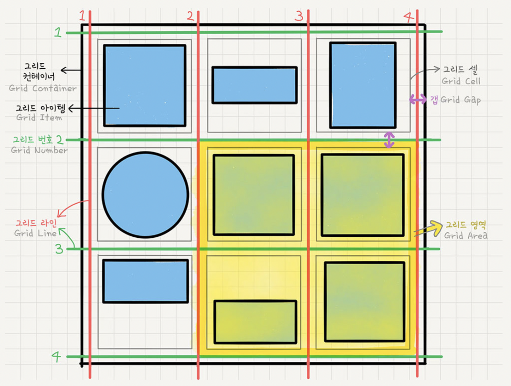

대부분의 출처: https://studiomeal.com/archives/533

# Grid - CSS 그리드 레이아웃
플렉스와 마찬가지로, 그리드 레이아웃을 이루는 용어를 정리하고 가야 합니다.
 
1. 그리드 컨테이너: 그리드 레이아웃이 적용되는 부모 태그입니다.
2. 그리드 아이템: 레이아웃 내부의 각각의 항목을 의미합니다.
3. 그리드 트랙: 그리드의 행 또는 열을 의미합니다.
4. 그리드 셀: 그리드의 한 칸을 의미합니다.
5. 그리드 라인: 그리드 셀을 구분하는 선입니다.
6. 그리드 번호: 그리드 라인의 각 번호입니다.
7. 그리드 갭: 그리드 셀 사이의 간격입니다. 박스 모델의 마진과 비슷합니다.
8. 그리드 영역: 그리드 라인으로 둘러쌓인 영역으로, 그리드 셀과 그리드 갭의 집합을 의미합니다.

## 컨테이너에 적용하는 속성들
### display
속성값으로 grid를 적용하면, flex와는 달리 따로 설정이 없다면 모든 요소가 블록 요소처럼 나타납니다. 즉, 아이템들이 수직 방향으로 쌓입니다. 인라인 요소도 마찬가지 입니다.  
속성값으로 grid-flex를 적용하면 inline-block 요소처럼 정렬됩니다.

### grid-template-rows, grid-template-columns
그리드 트랙의 크기와 트랙이 포함할 셀의 갯수를 지정합니다. 만약 따로 지정하지 않으면, 그냥 컨테이너의 너비 / 높이를 통째로 차지하는 하나의 행 / 열이 됩니다.
```
grid-template-rows: 200px 1fr 2fr
```
1. 기존의 단위를 쓸 수도 있고, 새롭게 fr이라는 단위를 쓸 수 있습니다. 위와 같은 코드는, row 트랙을 3개의 셀로 나누고, 첫 번째 셀의 너비(grid-template-columns인 경우는 높이)는 200px로 고정, 나머지 두개는 남은 공간을 1:2의 비율로 유연하게 나눈다는 뜻입니다(컨테이너 크기가 줄어들 경우 첫번째 셀의 너비는 고정되고, 나머지 셀들은 비율에 맞추어 변화합니다).  

2. 속성 값으로 minmax함수를 쓸 수 있습니다.
```
grid-template-rows: 200px 1fr minmax(100px, auto)
```
함수의 첫번째 인자는 최솟값, 두번째 인자는 최대값을 의미합니다.
이때, 3번째 셀의 너비는 내용이 적으면 100px로 고정되고, 내용이 많아 100px이 넘어가면 내용에 맞추어 늘어납니다. auto 대신 값을 지정하면, 내용에 맞추어 늘어나되 최대 그 값 까지만 늘어납니다.

3. 만약 셀을 한 100개 만들고 싶다면, 속성 값으로 repeat 함수를 쓸 수 있습니다.  
```
grid-template-columns: repeat(100, 1fr);
```
이때 첫번째 인자는 반복횟수를 의미합니다.  
이 횟수를, auto-fill으로 설정하면 100px의 셀로 해당 트랙을 가득 채울 때까지 반복합니다. 단, 780px같이 100px보다 작은 값이 남는다면 그 공간은 비워둡니다.  
auto-fit로 설정하면 똑같이 가득 채우되, "가능하다면" 빈 공간은 채웁니다.  
가능하다는 말은, 지정된 너비가 고정값이 아닐 떄를 의미합니다. 예를 들어, repeat(auto-fit, 200px)의 경우는 auto-fill과 차이가 없습니다. 하지만 만약 repeat(auto-fit, minmax(200px))의 경우는 지정된 크기가 '최소' 200px이기 떄문에, 공간이 남는 경우에는 적절히 각 셀의 크기가 늘어나서 화면을 꽉 채우게 됩니다.


### row-gap, column-gap, gap
행간, 열간 갭을 지정합니다. gap을 통해 행 - 열 순서로 한꺼번에 지정할 수도 있습니다.

* grid-gap?  
초기에는 이 속성의 이름이 grid-row-gap, grid-column-gap, grid-gap이었습니다. 하지만 현재는 grid-를 떼도 적용됩니다.


### grid-template-area
각 영역에 이름을 붙이고, 그 이름을 이용하여 각 아이템들을 배치하는 방법입니다. 아이템의 배치에 관한 속성이지만, 컨테이너의 속성으로 사용합니다.  
 
다음과 같은 형태로, 각자 차지하는 셀의 갯수만큼 영역의 이름을 써 주면 됩니다. 가로로 셀과 셀 사이는 공백으로 구분합니다.  
저 이름은, 해당하는 요소의 속성으로 grid-area를 지정하여 정해주면 됩니다. 위에서 header로 만들고 싶은 요소에
```
grid-area: header;
```

### grid-auto-flow
아이템들의 자동정렬이 옵션을 지정합니다.  
1. row: row를 기준으로 오른쪽으로 순서대로 배치되다가 들어갈 자리가 없으면 그 칸은 비워두고 아래로 row가 바뀌면서 정렬됩니다.
2. column: column을 기준으로 아래로 배치되다가 들어갈 자리가 없으면 옆에서 다시 시작합니다.
3. dense, row dense, column dense: 기본적으로 빈 공간을 채우는 알고리즘을 적용합니다. 

### align-items
아이템들의 세로 방향 정렬을 지정합니다.
1. stretch
2. start
3. center
4. end
* 플렉스의 그것과 같습니다.

### justify-items
아이템들의 가로 방향 정렬을 지정합니다.
1. stretch
2. start
3. center
4. end

### place-itmes
align과 justify를 동시에 쓸 수 있습니다. align, justify 순서로 작성하고, 하나만 쓰면 둘 다 적용됩니다.


### align-content
아이템 그룹의 세로 방향 정렬을 지정합니다(???)

### justify-content
아이템 그룹의 가로 방향 정렬을 지정합니다(???)


## 아이템에 적용하는 속성들
### grid-column-start, grid-column-end, grid-row-start, grid-row-end
이 네 속성은 항상 같이 따라 다닙니다. 위에서 grid-template- 속성을 통해 행, 열을 지정하면 그리드 라인과 그리드 번호가 생기게 되는데, 이 번호를 이용하여 어떤 아이템이 몇 번째 셀 부터 몇 번째 셀을 먹을 것인지를 결정합니다. 라인을 이용해 커다란 사각형을 만들고 아이템을 거기에 끼워 넣는다고 생각하면 됩니다.  

### grid-column, grid-row
위에서 처럼 시작과 끝을 모두 지정하지 않고도, 영역을 지정할 수 있습니다. 이 키워드는 슬래시(/)를 이용합니다. 
```
grid-column: 1 / 4
```
이 코드는 첫번째 세로줄 부터 4번째 세로줄 사이의 영역을 의미합니다.
```
grid-column: 1 / span 4
```
이렇게 span과 함께 쓰면, 1번째 줄 부터 4개의 셀을 차지한다는 뜻입니다.

### align-self
개별 아이템의 세로 방향 정렬을 지정합니다.

### justify-self
개별 아이템의 가로 방향 정렬을 지정합니다.
