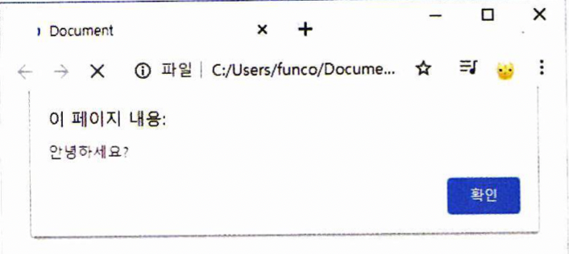
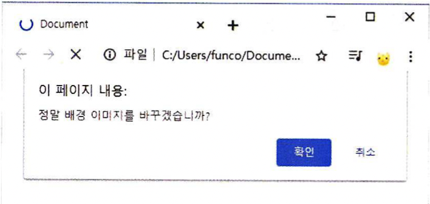
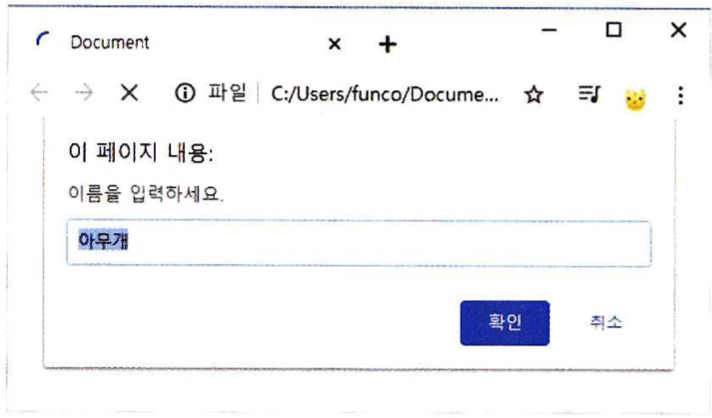
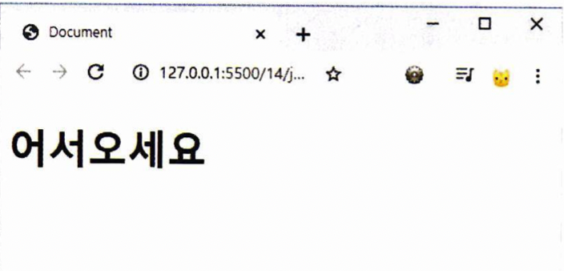
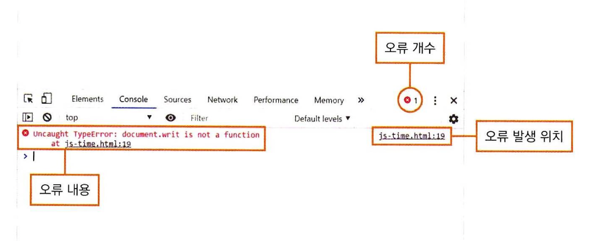

# 자바 스크립트의 기본 입출력
* 식(expression), 문(statement)
식은 사칙연산이나 비교식, 리터럴 값 등, 어떤 값을 만들어 내는 문장을 의미합니다. 변수에 저장될 수 있습니다.  
문은 위의 식을 포함하는, 하나의 독립된 명령문입니다. 컴퓨터에게 어떤 작업을 수행하라는 명령을 내리는 문장이며, ;(세미콜론)으로 구분됩니다.  

1. 알람 창 출력하기  
```
alert(메시지);
```
브라우저에서 작은 팝업 창을 띄워 메시지를 표시하는 출력 기능입니다.
  

2. 확인 창 출력하기  
```
confirm(메시지);
```
똑같이 팝업 창을 띄워 메시지를 출력하지만, 확인과 취소 두 개의 버튼 중 하나를 선택할 수 있습니다.
  

3. 프롬프트 창으로 입력받기  
```
prompt(메시지);
```
또는
```
prompt(메시지, 기본값);
```
메시지와 함께, 텍스트 필드가 있는 작은 창을 띄웁니다. 이 필드에 입력한 값을 가져와 프로그램에서 사용할 수 있습니다.
  
만약 두 번째 인자로 기본값을 지정하면, 텍스트 필드에 기본값이 입력된 상태로 출력됩니다.

4. document.write  
```
document.write(메시지);
```
위의 3개 방식이 팝업 창을 띄워 입출력을 한다면, 이 문구는 웹 문서에 직접 내용을 띄워줍니다. 따옴표로 구분된 문자열을 넣으며, html태그를 넣는 것도 가능합니다.  
  

5. console.log
```
console.log(메시지);
```
메시지를 콘솔 창에 표시합니다. 콘솔 창은 개발자 도구에서 디버깅과 변수 값 확인을 위해 제공되는 출력창입니다.
* 콘솔로 디버깅 하기
만약 내가 쓰는 에디터나 IDE에 자바스크립트 문법 관련 확장 기능이 없다면, 콘솔에서 문법 오류를 잡아낼 수 있습니다.
  