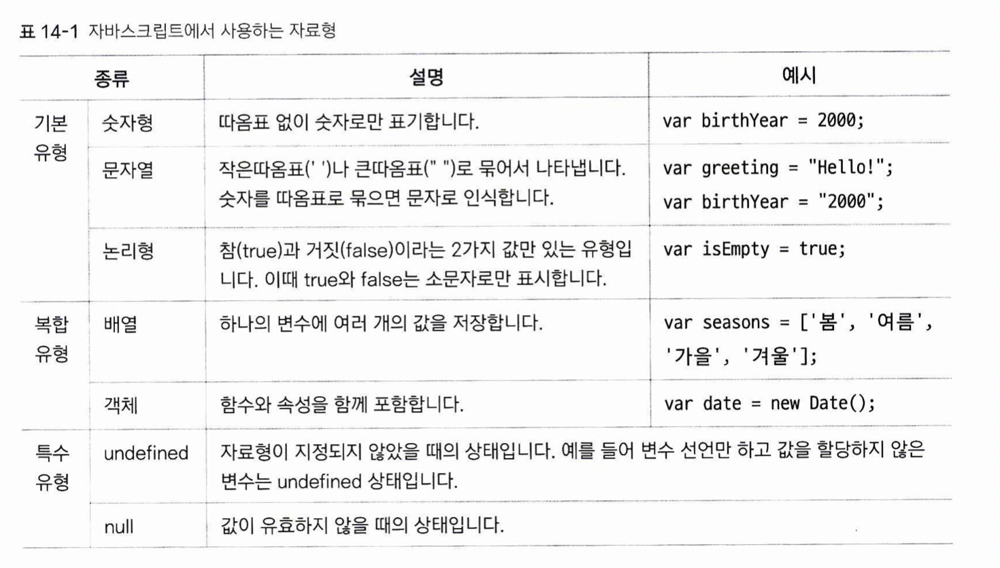

# 자바스크립트 기본 문법

## 변수 
프로그램을 실행하는 동안 값이 여러번 달라질 수 있는 데이터입니다. 특정 스코프(scope)에서만 사용하는 지역변수와, 모든 스크립트에서 사용할 수 있는 전역변수로 나뉩니다.

## 자료형 

1. 원시타입  
위의 기본 유형 + 특수 유형 + symbol등의 유형을 합쳐서 원시타입이라고 합니다. 원시타입은 값에 의한 호출를 하는 타입입니다. 따라서, 어떤 원시타입 변수를 다른 변수에 할당하는 경우 해당 변수의 값을 복사하여 붙여넣습니다. 따라서, 복사본의 값을 다시 설정해도 원본에 영향을 끼치지 않습니다.
2. 참조타입
위의 복합유형 + 함수를 합쳐서 참조타입이라고 합니다. 해당 타입의 데이터 자체는 heap 영역에 저장되며, 해당 타입의 변수에는 데이터가 아니라 데이터를 가리키는 주소를 담게 됩니다. 이 같은 방식을 참조에 의한 호출이라고 합니다. 참조타입을 다른 변수에 할당하면, 주소가 복사되기 때문에 두 변수가 같은 데이터를 가리키게 됩니다. 따라서 복사본의 내용을 수정하면 원본의 내용 역시 바뀌게 됩니다.  

* 객체  
객체란, 이름(name)과 값(value)으로 구성된 프로퍼티(property)의 정렬되지 않은 집합입니다. 일종의 해시테이블과 비슷한 구조를 띄고 있습니다. 단, 다른 언어의 해시테이블과 달리 값으로 함수가 올 수도 있습니다. 원래 객체 지향 언어가 아닌 함수형 언어로 출발한 JS가 해시테이블을 이용해 객체 지향의 클래스를 구현한 느낌 정도로 받아들이면 될 것 같습니다.
* 배열
자바스크립트의 배열은 C-family 계열의 언어에서 일반적으로 정의된, "동일한 크기의 메모리 공간이 빈틈없이 연속적으로 나열된 자료 구조"와는 다릅니다. 서로 다른 자료형을 요소로 가질 수 있기 떄문입니다. 내부 구현을 볼 때, JS의 배열이란 다른 언어의 배열의 동작을 흉내낸 특수한 객체입니다.  

* undefined, null  
만약 변수를 선언만 하고 값을 따로 할당하지 않는다면, 이 변수는 undefined로 분류됩니다.  
이 변수의 값이 "존재하지 않음"이라는 상태를 나타내고 싶을 때, null을 사용합니다. 

## 연산자
1. 산술연산자: +, -, *, /, %, ++, --  
2. 할당연산자: =, +=, -=, *=, /=, %=  
3. 연결연산자: + (문자열의 연결에 사용합니다)  
4. 비교연산자: ==, ===, !=, !==, <, <=, >, >= (문자열 끼리도 비교할 수 있습니다)  
5. 논리연산자: ||, &&, !

## 조건문
1. if, else if, else  
2. (조건) ? true시 명령문 : false시 명령문 -> 3항 연산자
3. switch문

## 반복문
1. for문  
2. while, do~while문

* 실제 자바스크립트 코드에서 조건문과 반복문은 거의 사용되지 않습니다. 함수형 프로그래밍을 지향하여 제작된 언어이기 때문에, 이러한 구문들의 역할을 수행하는 함수를 제작하여 사용합니다. 자바스크립트의 함수에 대하여 다음 장 부터 공부합니다.