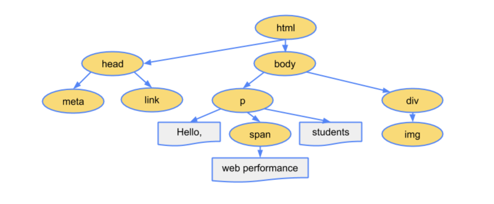

# 이벤트

자바스크립트의 이벤트란, "웹 문서"의 영역 안에서 일어나는 모든 이벤트를 지칭하는 일종의 키워드입니다.

## 마우스 이벤트  
1. click: HTML 요소를 클릭  
2. dbclick: HTML 요소를 더블 클릭  
3. mousedown: HTML 요소 위에서 마우스 버튼을 눌렀을 때 (눌렀다 떼야 클릭이라고 합니다.)
4. mousemove: HTML 요소 위에서 마우스를 움직일 때  
5. mouserover: HTML 요소 위로 마우스가 옮겨졌을 때  
6. mouseout: 마우스가 요소를 벗어날 때  
7. mouseup: mosedown 상태에서 손을 뗐을 때  

## 키보드 이벤트
1. keydown: 사용자가 키를 누르고 있을 때  
2. keypress: 사용자가 키를 눌렀다 뗐을 때  
3. keyup: 사용자가 키에서 손을 뗄 때  

## 문서 로딩 이벤트  
1. abort: 문서가 완전히 로딩되기 전에 불러오기를 멈췄을 때  
2. error: 문서가 정확히 로딩되지 않았을 때  
3. load: 문서 로딩이 끝났을 때  
4. resize: 문서 화면 크기가 바뀌었을 때  
5. scroll: 문서 화면이 스크롤되었을 때  
6. unload: 문서에서 벗어날 때  

## 폼 이벤트
1. blur: 폼 요소가 포커스를 잃었을 때  
2. change: 목록이나 체크 상태가 변경됐을 때  
3. focus: 폼 요소에 포커스가 놓였을 때  
4. reset: 폼이 리셋되었을 때  
5. submit: submit 버튼을 클릭했을 때  
  


# 이벤트 처리기  
사실 위의 내용보다 중요한 것은, 자바스크립트가 저런 이벤트를 어떻게 처리한다는 것이냐는 것.  
이벤트 처리기란, 저런 이벤트가 발생하면 자바스크립트가 실행하는 함수를 의미합니다.  
딱히 정해져 있는 것은 아니고, 임의의 함수를 등록할 수 있습니다.  

## HTML에서 이벤트 처리하기
```
태그 on이벤트명 = "함수명"
```
예를 들면  
```
<a href="#" onclick="alert(' 버튼을 클릭했습니다.’)">
```
이러한 함수는, href 태그에 click이라는 이벤트가 일어났을 때, alert 함수를 실행한다는 의미입니다.  

## Javascript에서 이벤트 처리기 사용하기
자바스크립트 코드 상으로도, 저렇게 이벤트 처리기를 사용할 수 있습니다. 이를 위해, 먼저 HTML 태그를 자바스크립트 상에 불러와야 합니다. 다양한 방법이 있지만, 주로 querySelector()라는 함수를 이용합니다.  
```
document.querySelector("#change").onclick = changeColor;
```
이 함수의 구조는, 다음과 같습니다.
1. document 객체의 querySelector라는 함수를 실행  
2. document 객체 내부의 change라는 id를 가진 태그의 객체를 불러온다  
3. change 객체의 onclick이라는 이벤트에 changeColor라는 함수를 등록  

* document객체? 태그의 객체?  
자바스크립트는, 전체 웹 문서를 하나의 객체로 가공합니다. 각각의 태그를 비롯한 요소들은 객체로 가공됩니다. 이런 식으로 웹 문서와 요소를 객체로 관리하는 모델을 문서 객체 모델(DOM, Document Object Model),이라고 합니다. 웹 문서의 내용을 파싱하여 객체로 만드는 과정에서 만들어지는 자료구조가 DOM Tree입니다.  

