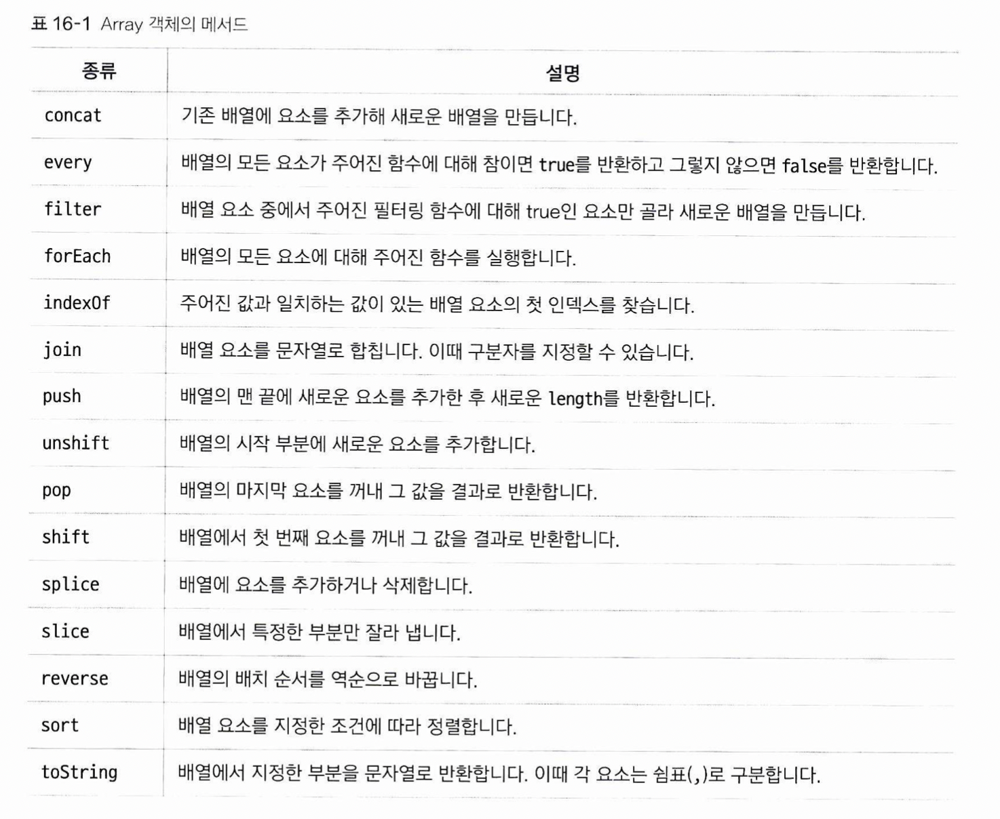
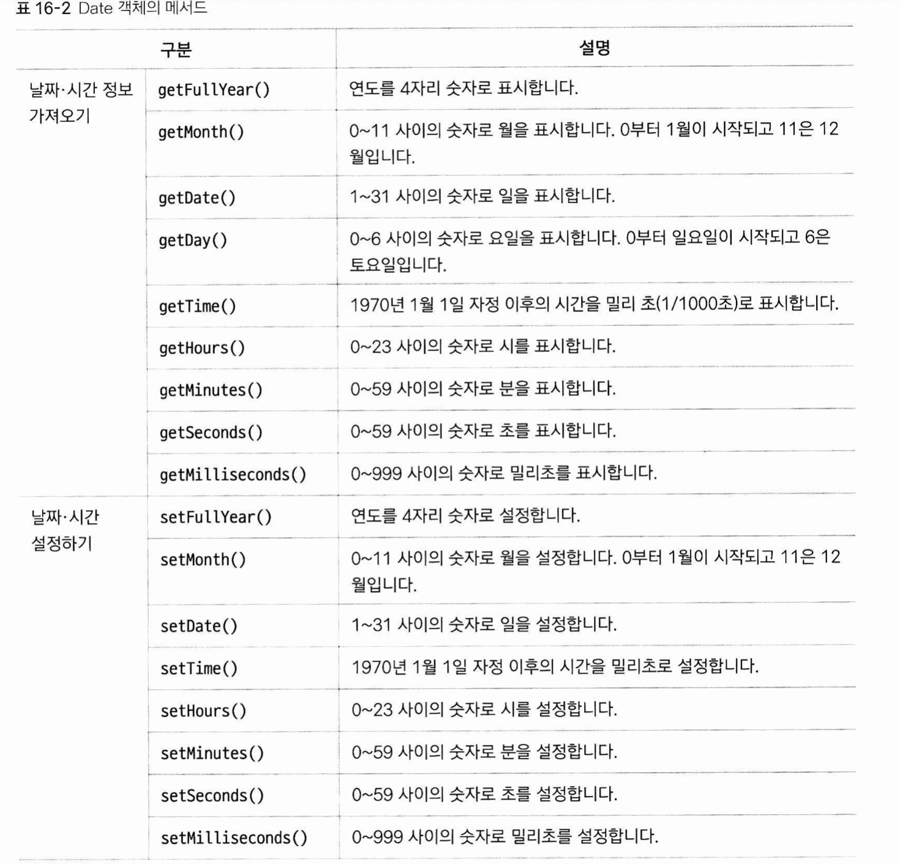

# 내장 객체 알아보기

## Array
배열을 흉내낸 객체입니다. 두 가지 방법으로 생성할 수 있습니다.  
1. 배열 리터럴: const numbers = [1, 2]  
2. 생성자 함수 호출: const nubmers = Array(1, 2);  
  

## Date  
현재 시간이나, 원하는 날짜를 형식에 맞추어 객체로 생성한 후 이를 출력할 수 있습니다.  
  

## Math  
수학 관련 계산을 할 수 있는 프로퍼티와, 메소드들을 제공합니다. 예를 들어, 원주율을 나타내는 PI 프로퍼티와, 거듭제곱을 해주는 pow()메소드 등이 포함되어 있습니다.  

* 왜 내장 객체들은 new로 호출하지 않는가?  
교재 557p 맨 밑을 보면, new 없이 Array를 호출하고 있습니다. Date 역시 new 없이 호출해도 멀쩡히 사용할 수 있습니다.
	When Array is called as a function rather than as a constructor, it creates and initialises a new Array object. Thus the function call Array(...) is equivalent to the object creation expression new Array(...) with the same arguments.  
(출처: https://stackoverflow.com/questions/6893273/what-happens-if-you-declare-an-array-without-new-in-javascript)  
정리하면, Array 함수는 new 없이 호출될 경우 알아서 new Array를 호출합니다. 객체의 new.target이라는 속성에서 new로 호출했는지 여부를 알 수 있는데, 아마 이걸 쓰지 않았나 생각합니다. Date도 마찬가지 입니다.  
Math의 경우는 원하는 값을 넣어 찍어내는 게 아니라 이미 있는 값들만 쓰면 되기 때문에, 생성자 함수가 아니라 객체 리터럴로 선언이 되어 있으므로, 굳이 인스턴스화 시킬 필요가 없습니다.
