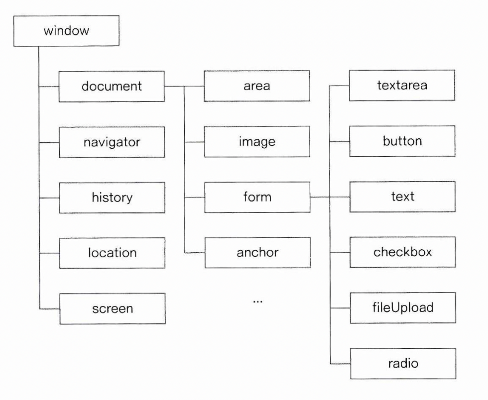
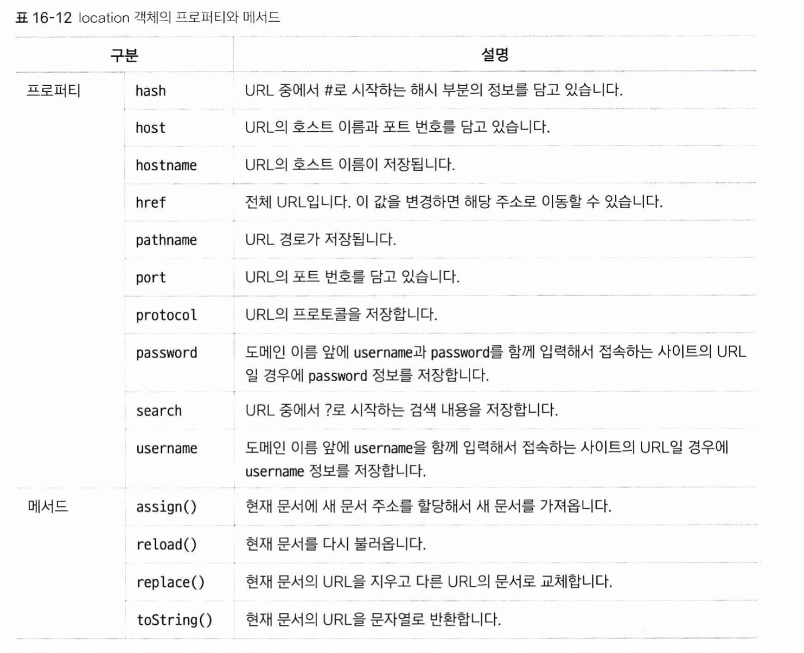
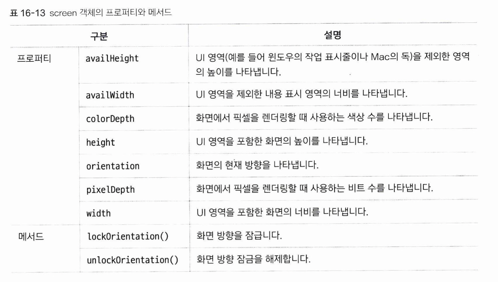

# 웹 브라우저 관련 객체들
이 객체들은, 웹 브라우저에 대한 정보를 담고 있는 객체들입니다. 익숙한 document 객체도 여기 속합니다.  
  

* 어떻게 불러오는가?  
자바스크립트가 연결된 html문서가 브라우저로 열리는 순간, 브라우저는 html을 읽어들여 이러한 브라우저 관련 객체들을 자동으로 생성한 후 자바스크립트가 사용할 수 있게 던져줍니다. 따라서, 예를 들어 document 객체를 사용하고 싶다면 그냥 document라고 치기만 해도 사용할 수 있습니다.  

만약 자바스크립트에 연결된 html문서가 없다면, 즉 node를 이용해 바로 실행하는 경우는 이러한 객체들이 정의되지 않기 때문에, console.log로 찍어보면 not defined 되었다는 경고 메시지를 볼 수 있습니다.

## window 객체
### 프로퍼티  
(주로 사용하는 중요한 프로퍼티만 정리)
1. document  
2. frameElement: 현재 창이 어떤 객체에 포함된 경우 해당 객체를 반환합니다. window를 포함할 수 있는 객체로 iframe이나 object 객체가 있습니다. 만약 해당 window가 최상위 객체라면, null을 반환합니다.  
3. innerHeight, innnerWidth  
4. localStorage: 웹 브라우저가 데이터를 저장하는 로컬 스토리지의 객체를 반환합니다.  
5. name: 브라우저의 이름  
6. sessionStorage: 웹 브라우저에서 세션 스토리지 객체를 반환합니다.  

* 로컬 스토리지, 세션 스토리지, 쿠키
더 공부 ㄱㄱ  

### 메소드
1. alert()  
2. open(경로, 창 이름, 창 옵션)  
훨씬 더 많은 메소드들이 있지만, 두 개만 정리했습니다. 중요한 특징은, window는 기본(전역)객체이기 때문에, 이 메소드들을 window.alert()이 아니라 그냥 alert()과 같은 식으로 사용할 수 있다는 점입니다.  

* open 함수의 경우, 팝업창을 띄우는데 사용합니다. 만약 웹 브라우저가 팝업을 차단했다면 null을 반환합니다. 이를 이용하여 사용자에게 팝업이 차단되었음을 알릴 수 있습니다.  
* 최근에는 팝업창을 새 브라우저창을 띄우는 방식이 아니라, 하나의 브라우저 창 안에 레이아웃을 통해 만듭니다. 

## navigator 객체  
웹 브라우저의 버전, 플러그인 설치 정보등의 정보가 담겨있습니다. 사용자가 수정할 수 없습니다.

1. userAgent: 사용자 에이전트 문자열을 의미합니다. 기본적이고 전반적인 정보가 담겨 있습니다.  
```
"Mozilla/5.0 (Windows NT 10.0; Win64; x64) AppleWebKit/537.36 (KHTML, like Gecko) Chrome/81.0.4044.138 Safari/537.36”
```
(chrome userAgent 예시)    


## history 객체  
뒤로가기 / 앞으로 가기 / 방문한 사이트 등의 목록이 배열의 형태로 저장됩니다. 보안 문제로 읽기 전용으로 설정되어 있습니다(writable 프로퍼티가 false로 설정되어 있습니다).
1. length: 방문한 사이트의 갯수가 저장되는 프로퍼티 입니다.  
2. back(), forward(): 이전 페이지 혹은 다음 페이지를 현재 화면으로 불러오는 메소드입니다.  
3. go(): 현재 위치를 기준으로 상대적인 위치의 페이지를 불러옵니다. go(1)은 forward()와 같고, go(-2)는 back()을 두 번 호출한 것과 같습니다.  


## location 객체
현재 브라우저의 주소창에 있는 주소에 대한 정보를 담고 있으며, 주소의 상태를 변경할 수 있습니다(= 다른 페이지로 이동하거나 새로고침을 할 수 있습니다).  
  

## screen 객체
사용자의 화면 크기와 관련한 정보를 담고 있습니다.  
  
