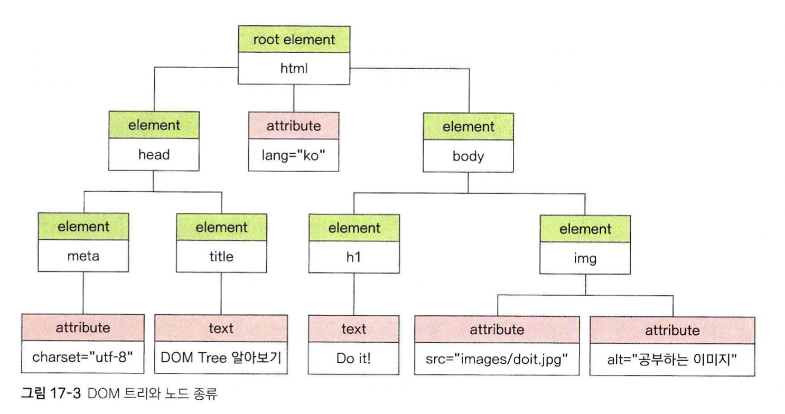

# 문서 객체 모델
전 장에서 웹 브라우저 관련 객체들을 공부했습니다. 그 중, 한 가지 객체를 빼먹었습니다 - document 객체입니다. 왜 빼먹었을까요? 가장 중요한 객체이기 때문입니다.  
  
  
이 객체는 문서의 구조 - 요소들을 하위 객체로 파싱하여 트리의 형태로 담고 있는 객체입니다. 이런 식으로 문서를 관리하는 방법을 문서 객체 모델이라고 합니다.
특히 요소 노드와 속성 노드, 텍스트 노드가 구분되는데, 이 구분을 머리에 새겨야 합니다.

 

## DOM 요소 노드에 접근하기

1. getElementByID  
	해당 id를 가진 요소를 반환합니다. 없으면 null을 반환합니다.  

2. getElementByClassName  
	해당 클래스이름을 가진 요소"들"을 HTMLCollection 배열의 형태로 반환합니다.
3. getElementByTagName  
	해당 태그 요소"들"을 HTMLCollection 배열의 형태로 반환합니다. 
4. querySelector
	주어진 조건에 맞는 요소를 반환합니다. 만약 조건에 해당하는 요소가 여러개라면, 맨 첫번째 요소를 반환합니다. #은 id, .은 class를 의미하며 이 외에도 여러가지 조건을 표현할 수 있습니다.  
5. querySelectorAll
	주어진 조건에 맞는 요소"들"을 NodeList의 형태로 반환합니다.

* HTMLCollection vs NodeList
자바 스크립트에서 제공하는 "유사배열"입니다. 배열과 비슷하게 접근할 수 있지만, forEach, map 등의 메서드들은 사용할 수 없습니다. 따라서 둘 다 받아 온 후 배열로 변환하여 사용하는 것이 권장됩니다.

HTMLCollection은, Live DOM Collection입니다. 즉, DOM 트리의 변화 상태를 실시간으로 반영합니다. 만약 getElementsByTagName으로 p태그들에 대한 배열을 받아온 후, 후술 할 노드 추가를 통해 DOM에 p태그를 추가하면, 우리가 받아온 HTMLCollection 배열에도 이 변화가 반영됩니다. 
또한, HTMLCollection은 오직 요소 노드만 포함할 수 있습니다.

NodeList는 non-Live DOM Collection입니다. 위와 같은 실험을 할 경우, 우리가 받아온 NodeList 배열에는 변화가 적용되지 않습니다.  
그리고, NodeList는 요소노드와 하위의 속성노드, 텍스트 노드를 모두 포함할 수 있습니다. (솔직히 무슨 이야기인지 잘 와닿지가 않는다)

## DOM의 텍스트, 속성 노드에 접근하기
우선 요소 노드를 불러온 후, 해당 노드의 메소드를 통해 하위의 텍스트, 속성 노드에 접근할 수 있다.  
1. innerText, innerHTML  
	innerText는 눈에 보이는 텍스트만 긁어오지만, innerHTML은 태그와 속성을 포함한 모든 텍스트를 긁어옵니다.  
2. getAttribute, setAttribute  
	get으로 속성값을 얻어오고, set으로 변경할 수 있습니다.  

## CSS요소에 접근하기
document.getElementById("p").style.backgroundcolor 같은 식으로, .style을 통해 css 요소를 불러올 수 있습니다.  

* 가끔씩 null을 반환하는 이유?
브라우저는 html 요소를 생성하는 작업과, 자바 스크립트 코드 리딩을 동시에 수행합니다. 이 과정에서 해당 요소 객체 생성보다 코드 리딩을 통한 참조가 먼저 일어나는 경우 null이 뜰 수 있습니다.

* 속도를 위해 코드를 최대한 빨리 실행(body 태그의 맨 위에서 실행)하면서도, 생성되지 않은 요소를 참조하는 것을 막는 방법?
https://mesonia.tistory.com/68