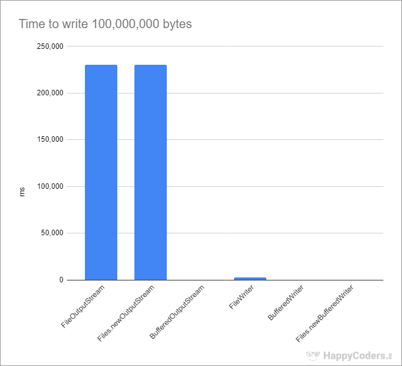
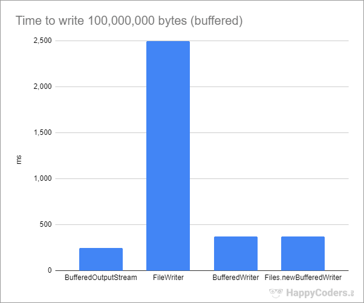

# 파일 입력
FileInputStream FileReader BufferedReader  
  
1. FileInputStream  
	내용을 바이트 단위로 읽는다. 내부적으로 버퍼 없이 그냥 1글자씩 읽기 때문에, 성능이 가장 떨어진다.
2. FileReader  
	내용을 2바이트(캐릭터)단위로 읽는다.
3. BufferedReader  
	콘솔 입출력의 그 클래스이다. 표준입력을 받기 위해 "InputStream을 인자로 받는 InputStreamReader"를 인자로 받아 만들었면, 여기서는 위의 FileReader 를 인자로 받는다.

	
# 파일 출력

FileOutputStream Filewriter BufferedWriter PrintWriter

1. FileOutputStream  
	FileInputStream과 유사하게 바이트 단위로 쓴다. 첫번째 인자로 쓰고 싶은 문자열, 두번째 인자로 true를 넣으면, 해당 파일이 존재할 시 내용을 이어서 쓰게 된다(추가모드). 두 번째 인자가 없다면 기본값은 false이며, 파일이 존재한다면 기존 파일을 지우고 새로 만든다(덮어쓴다).  

2. FileWriter  
	내용을 2바이트(캐릭터)단위로 파일에 쓴다. 내부적으로 버퍼를 사용한다. 마찬가지로 첫 번째 인자로 쓰고 싶은 문자열을 넣으며, 두번째 인자가 true인 경우 추가모드로 쓰게 된다.

3. BufferedWriter  
	내부적으로 버퍼를 사용한다. 출력 후, flush와 close를 이용하여 버퍼를 비우고 스트림을 닫는 작업을 추가로 해 주어야 하지만, 가장 속도가 빠르다. write를 호출하면 덮어 쓰기를 하며, append를 호출하면 추가로 쓴다. 인자로 FileWriter를 받는다.

4. PrintWriter  
	그냥 파일을 쓸 때 '\n'도 붙여서 쓴다.
