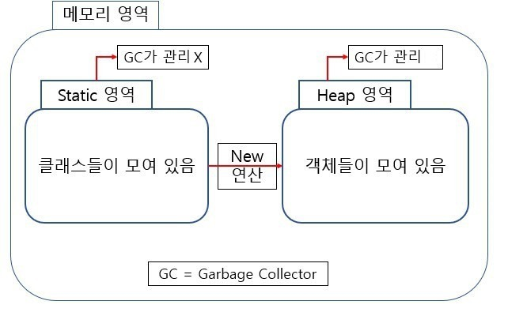

# static 메소드와 싱글톤 패턴  

## static 변수, static 메소드?
  
보시다 시피, 개별 객체에 대한 정보는 heap 영역에, 클래스 자체에 대한 정보는 static 영역에 존재한다. static 변수와 메소드는, 클래스 정보 영역에 포함되어 해당 클래스의 모든 인스턴스가 공유한다고 생각할 수 있다.   
1. 어떤 인스턴스이건 동일한 값을 공유한다.  
2. 인스턴스를 생성하지 않아도 메소드나 변수에 접근할 수 있다.  

## 싱글톤 패턴 구현하기
싱글톤 패턴이란, 어떤 객체의 인스턴스가 오직 한 번만 생성될 수 있도록 강제하는 패턴을 의미한다.  
1. 생성자를 private으로 선언한다.  
2. 생성자를 호출하는 static 메소드를 public으로 선언한다.  
3. static 변수 one = 0을 선언하고, 위의 생성자 호출 메소드 내부에서 one = 1로 변경한다.  