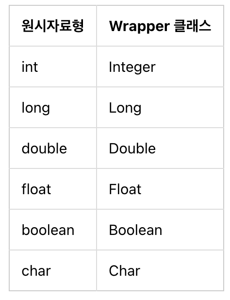

# Jump to JAVA
## Week One

## 자바 환경 설정

### JDK 설치

### 자바소스와 컴파일

#### 'javac'와 'java' 명령어

`javac`는 `java compiler`의 약어이다. 즉, 자바파일을 컴파일할 때 사용하는 것이 바로 javac 파일이다.

그렇다면 자바파일은 무엇일까?

바로 우리가 작성해야할 자바 프로그램을 말한다. 이 자바프로그램은 `.java`라는 확장자를 가진 파일로 저장하게 되는데, 이렇게 저장되는 `.java`파일을 자바파일 또는 자바소스라고 한다.

우리가 `myProgram.java`라는 자바 파일을 작성했다고 가정하자. 이 파일을 실행하기 위해서는 두 번의 단계를 거쳐야하는데, 하나는 예상했다시피 컴파일 단계이고, 하나는 `.class`파일을 실행하는 단계이다. 컴파일 단계에서는 `.java`파일을 `.class`파일로 바꾸어준다. 아래의 그림을 통해 자세히 알아보자.


1. 소스코드(myProgram.java)를 작성한다.
2. 컴파일러(Compiler)는 자바 소스코드를 이용하여 클래스 파일을 생성한다. 컴파일 된 클래스 파일은 Java VM이 인식할 수 있는 바이너리 파일이다.
3. Java VM은 클래스 파일의 바이너리 코드를 해석하여 프로그램을 수행한다.
4. myProgram의 수행 결과가 컴퓨터에 반영된다.

왜 자바는 컴파일을 하고나면 exe(또는 a.out) 파일이 아닌 class라는 것을 만드는 걸까?

c나 c++와 같은 언어는 컴파일 된 실행 파일을 모든 운영체제에서 동일하게 사용하는 것이 불가능하다. 이는 자바의 JVM과 같은 중간 단계의 역할을 수행하는 것이 없기 때문인데, 이 부분에서 서로의 장단점이 나뉜다.

c, c++등의 언어에서 만들어진 실행파일은 JVM같은 중간단계를 거치지 않기 때문에 빠른 속도로 수행된다. 하지만 운영체제마다 별도의 실행파일을 작성해야 한다는 단점이 있다. 반대로 자바는 JVM이라는 중단단계가 있으므로 C등의 언어보다 속도가 느리다. 하지만 한 번 작성한 클래스 파일은 어떤 OS에서라도 사용할 수 있다는 장점이 있다. 한 번 작성한 것을 널리 재활용하는 것이 자바의 가장 큰 특징이자 큰 장점이라고 할 수 있다.

### `"Hello World"` 프로그램 작성하기

#### main 메소드

HelloWorld.class를 실행하기 위해 main 메소드를 작성해보자. 

```java
public class HelloWorld {
    public static void main(String[] args) {
        System.out.println("Hello World");
    }
}
```

간단한 키워드들에 대해서 알아보자.

- public: 메소드들의 접근제어자, public은 누구나 이 메소드에 접근할 수 있다는 의미이다.
- static: 메소드에 static이 지정되어 있는 경우 이 메소드는 인스턴스 생성없이 실행 할 수 있음을 의미한다.
- void: 메소드의 리턴값이 없음을 의미한다.
- String[]: 문자열을 나타내는 자바의 자료형이다.
- args: String[] 자료형에 대한 변수명이다.
- System.out.println: 표준 출력으로 데이터를 보내는 자바의 내장 메소드로 문자열을 화면에 출력한다.

### 구구단 프린트하기

```java
public class GuGu {
    public void dan(int n) {
        for (int i = 1; i < 10; i++)
            System.out.print(n * i + " ");
        System.out.print("\n");
    }
    public static void main(String[] args) {
        GuGu gugu = new GuGu();
        for (int i = 1; i < 10; i++)
            gugu.dan(i);
    }
}
```

프로그램을 작성하며 알게된 사실
1. 메서드에 static 키워드를 붙이면 클래스 생성 없이도 메서드를 사용할 수 있다.
2. `sout`를 누르면 `system.out.println();`이, `souf`를 누르면 `System.out.printf("");`가 자동완성 된다.
3. `system.out.println();`는 무조건 개행이 포함되어 프린트된다.


## 자바 소스코드의 구조

보통 일반적인 자바 소스코드는 다음과 같은 형태로 만들어진다.

*클래스명.java*

```java
/* 클래스 블록 */
public class 클래스명 {

    /* 메소드 블록 */
    [public | private | protected] [static] (리턴자료형 | void) 메소드명1(입력자료형 매개변수, ...) {
        명령문(statement);
        ...
    }

    /* 메소드 블록 */
    [public | private | protected] [static] (리턴자료형 | void) 메소드명2(입력자료형 매개변수, ...) {
        명령문(statement);
        ...
    }

    ...
}
```

클래스내에는 이러한 메소드들이 여러개 올 수 있다.

### 소스코드의 예

다음의 가장 간단한 샘플로 실제 소스코드의 구조에 대해서 자세히 알아보자.

*Sample.java*
```java
public class Sample {
    public static void main(String[] args) {
        System.out.println("Hello java");
    }
}
```

#### 클래스 블록

소스코드의 가장 바깥쪽 영역인 클래스 블록을 보자.

```java
public class Sample {
    (... 생략 ...)
}
```

> 
> 이 클래스의 클래스명은 Sample이다.


소스코드의 가장 바깥쪽은 클래스(class) 블록이다. 그리고 클래스 블록은 중괄호로 둘러싸야한다.

public은 자바의 접근제어자로 어디서든 이 클래스에 접근할 수 있음을 의미한다. class는 클래스 블록을 만드는 키워드이다.

#### 메소드 블록

클래스 블록 안에는 다음과 같은 메소드 블록이 있다.
```java
public class Sample {
    public static void main(String[] args) {
        (...)
    }
}
```

> 이 메소드의 메소드명은 main이다.

메소드 블록 역시 중괄호로 영역을 구분한다. 클래스 블록 안에는 여러개의 메소드 블록이 있을 수 있다. 메소드 블록에 사용된 `public`, `static`, `void`등에 대해서는 뒤에서 더 자세히 다룰 것이다.

- static - 메소드에 static 키워드가 붙을 경우 이 메소드는 클래스의 메소드가 되어 객체를 만들지 않아도 `클래스명.메소드명`형태로 호출이 가능하다.
- void - 메소드의 리턴타입 중 하나로 void라는 리턴값이 없음을 의미한다.
- String[] args - 메소드의 매개변수이다. args 변수는 `String[]`배열 자료형임을 의미한다. args는 인수를 의미하며 관례적인 이름이다.

#### 명령문

마지막으로 메소드 블록 안에는 명령문이 있다.

```java
public class Sample {
    public static void main(String[] args) {
        System.out.println("Hello java");
    }
}
```

위와 같이 컴퓨터에 무언가 일을 시키는 문장을 명령문이라고 한다. 명령문은 반드시 세미콜론을 붙여야한다.

## 변수와 자료형

이번에는 자바의 변수와 자료형에 대해서 알아보자.

### 변수명

변수명의 규칙
1. 변수명은 숫자로 시작할 수 없다.
2. `_`와 `$` 문자 이외에 특수문자는 사용할 수 없다.
3. 자바의 키워드는 변수명으로 사용할 수 없다.

*참고 자바의 키워드*

```java
abstract  continue  for         new        switch
assert    default   goto        package    synchronized
boolean   do        if          private    this
break     double    implements  protected  throw
byte      else      import      public     throws
case      enum      instanceof  return     transient
catch     extends   int         short      try
char      final     interface   static     void
class     finally   long        strictfp   volatile
const     float     native      super      while
```

### 자료형 (Type)

### 변수에 값 대입하기

### 자주 쓰이는 자료형

자바에서 가장 많이 사용되는 자료형에는 다음과 같은 것들이 있다.

- int
- long
- double
- boolean
- char
- String
- StringBuffer
- List
- Map
- Set

### 사용자 정의 자료형

사용자가 직접 자료형을 만들 수도 있다.

예를 들어 다음과 같이 Animal 이라는 클래스를 만들면,
```java
class Animal {
}
```

다음과 같이 Animal 자료형 변수를 만들 수 있다.
```java
Animal cat;
```

## 명명 규칙

자바 코드 작성시 개발자에게 가장 많은 고민을 안겨주는 순간은 바로 클래스, 메소드, 변수 등의 이름을 짓는 때이다. 하지만 이름을 지을 때에도 관례적으로 지켜야 하는 규칙이 몇 가지 있다. 이번에는 그 규칙들에 대해서 알아보자.

### 클래스 명

자바 프로그램은 클래스단위이기 때문에 자바 프로그램을 만드는 것은 자바 클래스를 만드는 것과도 같다. 자바 클래스를 만들려면 먼저 자바 클래스에 대한 이름을 지어야한다. 자바 클래스의 이름은 사실 아무렇게나 지어도 괜찮지만 관행적으로 여겨지는 규칙이 있다.

- 클래스명은 명사로 한다.
- CamelCase를 이용한다.

### 메소드 명

한 개의 클래스 안에는 메소드가 여러개 존재할 수 있다. 메소드명은 보통 다음과 같은 관례를 따른다.

- 메소드명은 동사로 한다.
- 클래스명과 마찬가지로 여러개의 단어가 섞이는 경우 각 단어의 첫번째 문자는 대문자여야 한다. 단, 처음 시작하는 문자는 항상 소문자로 시작한다.

### 변수 명

변수명은 보통 다음과 같은 관례를 따른다.

- 변수 이름은 짧지만 의미가 있어야 한다. (변수명을 통해 변수의 사용 의도를 알 수 있어야한다.)
- 순서를 의미하는 임시적인 정수의 변수명은 i, j, k, m, n을 사용한다. (문자의 경우 c, d, e 등을 사용한다.)
- 변수명에 `_`, `$` 기호를 사용할 수 있지만, 시작 문자로 사용하지 않는다.

## 주석

### 두 가지 주석

#### 블록 주석

`/*`, `*/`를 이용한 주석이다.

#### 라인 주석

`//`을 이용한 한 줄만 있는 주석이다.

### 주석이 적은 코드, 많은 코드, 어떤 게 더 좋은 코드인가?

주석이 없는 코드가 좋은 코드라고 하지만, 이는 "주석이 없는 코드가 아니라 주석이 있을 필요가 없을 정도로 이해하기 쉽고 누가봐도 명확한 코드"를 뜻하는 것이다. 

이상적인 코드와 달리 내용도 불분명하고 도저히 이해불가한 코드에 주석은 필수적이다. 또는 헷갈리기 쉬운 부분도 주석은 꼭 필요하다.

### 적절하지 못한 주석

누구나 알고 있는 뻔한 내용의 주석을 다는 것은 소스코드를 지저분하게 만들 뿐이다.

### 주석 사용 시 주의할 점

주석 사용 시 주의할 점이 있다. 그것은 주석의 내용도 소스코드가 변경되면 업데이트되어야 한다는 점이다. 소스코드는 업데이트 되었는데 주석문은 수정을 안하는 경우, 소스코드를 읽는 다른 이에게 업청난 혼란을 주게 된다.

### 임시 백업

주석을 사용하는 다른 이유에는 현재 작성한 소스코드의 특정 부분을 잠시 사용하지 않게 만들고 싶은 경우가 있다. 

## 자료형

### 정수

자바의 정수를 표현하기 위한 자료형은 `int`, `long`이다. (byte, short 등도 있지만 잘 사용하지 않는다.)

long 변수에 값을 대입할 때, 대입하는 숫자 값이 `int`자료형의 최대값보다 큰 경우 `L` 접미사를 붙여 주어야 한다.

만약 큰 숫자에 이 접미사를 누락하면 컴파일 에러가 발생한다.

### 실수

자바의 실수를 표현하기 위한 자료형은 `float`, `double`이다.

자바에서 실수형은 디폴트가 `double`이므로 `float` 변수에 값을 대입할 때에는 `F`잡미사를 붙여 주어야 한다. 

또는 과학적 지수 표현식으로 다음과 같이 사용할 수 있다.

```java
double d1 = 123.4;
double d2 = 1.234e2; // 1.234e2 == 123.4
```

### 8진수와 16진수

8진수와 16진수는 int 자료형을 사용하여 표시한다.

0으로 시작하면 8진수, 0x로 시작하면 16진수가 된다.

### 숫자연산 ( +, -, *, /, % )

자바의 사칙연산은 실생활에서 일반적으로 사용하는 사칙연산과 다를 바가 없다. 

### 증감연산 (--, ++)

## 불 (boolean)

참 또는 거짓의 값을 갖는 자료형을 불 자료형이라고 한다. 자료형의 명칭은 `boolean`이다. 불 자료형에 대입되는 값은 참 또는 거짓만 가능하다.

### 불 연산

### 조건문

불 연산은 보통 조건문의 판단 기준으로 많이 사용한다.

```java
int i = 3;
boolean isOdd = i % 2 == 1;
System.out.println(isOdd);  // true 출력
```

## 문자 (char)

한 개의 문자 값에 대한 자료형은 `char`를 이용한다.

## 문자열 (String)

> **리터럴 표기**
> `String a = "happy java"` 와 `String a = new String("happy java")`는 같은 값을 갖게 되지만 완전히 동일하지는 않다. 첫번째 방식을 리터럴(literal) 표기라고 하는데 객체 생성없이 고정된 값을 그대로 대입하는 방법을 말한다. 위 예에서 리터럴 표기법은 "happy java" 라는 문자열을 intern pool 이라는 곳에 저장하고 다음에 다시 동일한 문자열이 선언될때는 cache 된 문자열을 리턴한다. 두번째 방식은 항상 새로운 String 객체를 만든다.

## 원시(primitive) 자료형

int, long 등을 자바는 원시(primitive) 자료형이라고 부른다. 이런 자료형은 `new`키워드로 그 값을 생성할 수 없다.

이 자료형들은 리터럴(literal)로만 값을 세팅할 수 있다.

#### 원시 자료형의 `Wrapper` 클래스

원시 자료형은 다음과 같이 각각에 대응하는 `Wrapper`클래스들이 존재한다.



원시 자료형 대신 Wrapper 클래스를 이용하면 값 대신 객체를 주고 받을 수 있어 코드를 객체 중심적으로 작성하는데 유리하다. 또한 멀티스레딩 환경에서 동기화를 지원하기 위해서는 Wrapper 클래스가 반드시 필요하다.

### 문자열 내장 메소드

String 자료형의 내장 메소드 중에서 자주 사용되는 것들에 대해서 알아보자.

#### equals

equals는 두 개의 문자열이 동일한지를 비교하여 결과값을 리턴한다.

```java
String a = "hello";
String b = "java";
String c = "hello";
System.out.println(a.equals(b)); // false 출력
System.out.println(a.equals(c)); // true 출력
```

문자열 a와 문자열 b는 "hello"와 "java"로 서로 같지 않다. 따라서 equals 메소드 호출 시 false를 리턴한다. 문자열 a와 문자열 c는 "hello"로 동일하다. 따라서 true 리턴

문자열의 값을 비교할 때는 반드시 `equals`를 사용해야 하낟. `==` 연산자를 사용할 경우 다음과 같은 경우가 발생할 수 있다. 

```java
String a = "hello";
String b = new String("hello");
System.out.println(a.equals(b));  // true
System.out.println(a == b);  // false
```

문자열 a와 b는 모두 "hello"로 같은 값이지만 `equals`를 호출했을 때는 `true`를 `==`연산자를 사용했을 때는 `false`를 리턴한다. a와 b는 값은 같지만 서로 다른 객체이다. `==`은 두 개의 자료형이 동일한 객체인지를 판별할 때 사용하는 연산자이기 때문에 `false`를 리턴한다.

#### indexOf

`indexOf`는 문자열에서 특정 문자가 시작되는 위치(인덱스)를 리턴한다. 

```java
String a = "Hello Java";
System.out.println(a.indexOf("Java"));  // 6 출력
```

#### contains

`contains`는 문자열에서 특정 문자열이 포함되어 있는지의 여부를 리턴한다.

```java
String a = "Hello Java";
System.out.println(a.contains("Java"));  // true 출력
```

#### charAt

`charAt`은 문자열에서 특정 위치의 문자를 리턴한다.

```java
String a = "Hello Java";
System.out.println(a.charAt(6));  // "J" 출력
```

#### replaceAll

replaceAll은 문자열 중 특정 문자열을 다른 문자열로 바꾸고자 할 때 사용한다.

```java
String a = "Hello Java";
System.out.println(a.replaceAll("Java", "World"));  // Hello World 출력
```

#### substring

substring은 문자열 중 특정 부분을 뽑아낼 경우에 사용한다.

```java
String a = "Hello Java";
System.out.println(a.substring(0, 4));  // Hell 출력
```

#### toUpperCase

toUpperCase는 문자열을 모두 대문자로 변경할 때 사용한다.(반대는 toLowerCase)

#### split

split 메소드는 문자열을 특정 구분자로 분리하는 메소드이다.

```java
String a = "a:b:c:d";
String[] result = a.split(":");  // result는 {"a", "b", "c", "d"}
```

#### 문자열 포매팅

##### 문자열 포매팅 예시

```java
System.out.println(String.format("I eat %d apples.", 3));  // "I eat 3 apples." 출력
```

```java
System.out.println(String.format("I eat %s apples.", "five"));  // "I eat five apples." 출력
```

```java
System.out.println(String.format("I have %s apples",  3));  // "I have 3 apples" 출력
System.out.println(String.format("rate is %s", 3.234));  // "rate is 3.234" 출력
```

#### 포맷 코드와 숫자 함께 사용하기

1. 정렬과 공백
2. 소수점 표현하기

#### System.out.printf

`String.out.printf`메소드는 포매팅된 문자열을 리턴한다. 따라서 포매팅된 문자열을 출력하려면 다음처럼 `System.out.println`메소드를 함께 사용해야 한다.

```java
System.out.println(String.format("I eat %d apples.", 3));  // "I eat 3 apples." 출력
```

`String.format` 과 `System.out.printf`의 차이는 전자는 문자열을 리턴하는 메소드이고 후자는 문자열을 출력하는 메소드라는 점이다. 상황에 맞게 선택하여 사용하자.

## StringBuffer

`StringBuffer`는 문자열을 추가하거나 변경 할 때 주로 사용하는 자료형이다. `StringBuffer`의 메소드들을 살펴보면서 `StringBuffer`의 사용법에 대해서 알아보자. 

### append

다음은 `StringBuffer` 객체를 생성하고 문자열을 생성하는 예제이다. 

```java
StringBuffer sb = new StringBuffer();  // StringBuffer 객체 sb 생성
sb.append("hello");
sb.append(" ");
sb.append("jump to java");
String result = sb.toString();
System.out.println(result);
```

결과값은 다음과 같다.

> hello jump to java

`StringBuffer` 자료형을 `append` 메소드를 사용하여 계속해서 문자열을 추가해 나갈 수 있다. 그리고 위 예제와 같이 `toString()`메소드를 이용하면 String 자료형으로 변경할 수 있다.

위 예제를 String 자료형만 가지고 표현하면 다음과 같이 작성할 수 있다.

```java
String result = "";
result += "hello";
result += " ";
result += "jump to java";
System.out.println(result);
```

> hello jump to java

두 개 예제의 결과는 동일하지만 내부적으로 객체가 생성되고 메모리가 사용되는 과정은 다르다.

첫 예제의 경우 StringBuffer 객체는 한 번만 생성된다. 두 번째 예제는 String자료형에 `+`연산이 있을 때마다 새로운 String 객체가 생성된다. 두 번째 예제에서는 총 4개의 String 자료형 객체가 만들어지게 된다.

String 자료형은 한 번 값이 생성되면 그 값을 변경할 수가 없다. 이렇게 값을 변경할 수 없는 것을 immutable 하다고 한다. trim, toUpperCase 등의 메소드를 보면 문자열이 변경되는 것 처럼 생각 될 수도 있지만, 해당 메소드 수행 시 또 다른 String 객체를 생성하여 리턴할 뿐이다. 하지만 StringBuffer는 이와 반대로 값을 변경할 수 있다. (mutable) 즉 한 번 생성된 값을 언제든지 수정할 수 있다.

**그렇다면 무조건 StringBuffer를 사용하는 것이 좋을까?**

그것은 상황에 따라 다르다. StringBuffer 자료형은 String자료형보다 무거운 편에 속한다. `new StringBuffer()`로 객체를 생성하는 것은 일반 `String`을 사용하는 것보다 메모리 사용량도 많고 속도도 느리다. 따라서 문자열 추가나 변경등의 작업이 많을 경우애는 StringBuffer를, 문자열 변경 작업이 거의 없는 경우에는 그냥 String을 사용하는 것이 유리하다.

> **StringBuilder**
> StringBuffer와 비슷한 자료형으로 StringBuilder가 있다. StringBuilder의 사용법은 StringBuffer의 사용법과 동일하다. 
> ```java
> StringBuilder sb = new StringBuilder();
> sb.append("hello");
> sb.append(" ");
> sb.append("jump to java");
> String result = sb.toString();
> System.out.println(result);
> ```
> StringBuffer는 멀티 스레드 환경에서 안전하다는 장접이 있고 StringBuilder는 StringBuffer보다 성능이 우수한 장점이 있다. 따라서 동기화를 고려할 필요가 없는 상황에서는 StringBuffer 보다는 StringBuilder를 사용하는 것이 유리하다.

### insert

insert 메소드는 특정 위치에 원하는 문자열을 삽입할 수 있다.

```java
StringBuffer sb = new StringBuffer();
sb.append("jump to java");
sb.insert(0, "hello ");
System.out.println(sb.toString());
```

결과값은 다음과 같다.

> hello jump to java

### substring

`substring`메소드는 String 자료형의 substring 메소드와 동일하게 작동한다.

## 배열

예시

```java
int[] odds = { 1, 3, 5, 7, 9 };

또는

int[] odds = new int[5];
```

배열은 자료형 타입 바로 옆에 `[]`기호를 사용하여 표현한다. 

### 배열의 길이는 고정되어 있다.

### 배열의 값은 어떻게 접근할 수 있을까?

### 배열의 길이

### 빈번한 배열의 오류

> ArrayIndexOutOfBoundsException

## 리스트

리스트는 배열과 비슷한 자바의 자료형으로 배열보다 편리한 기능을 많이 가지고 있다.

리스트와 배열의 가장 큰 차이는 크기가 정해져 있지 않고 동적으로 변한다는 점이다.