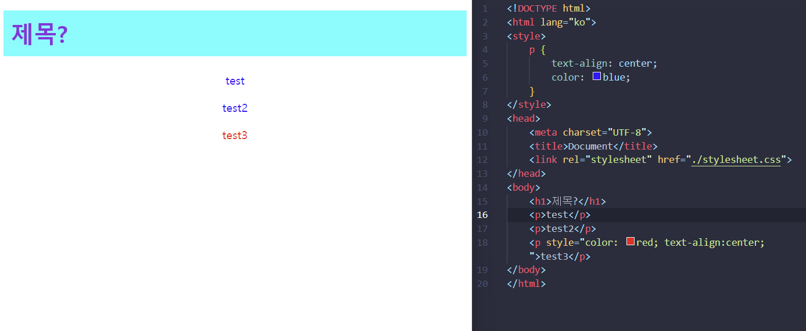
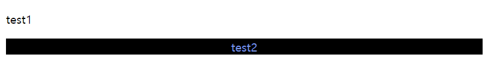
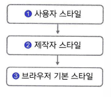
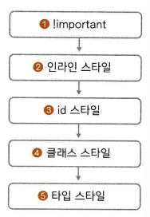
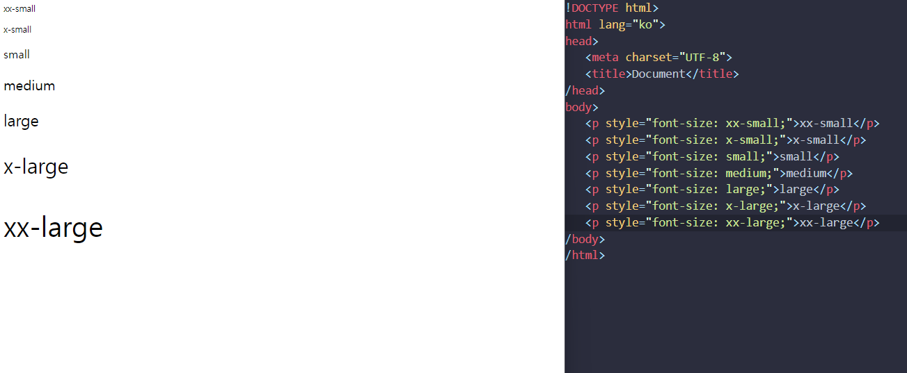

## CSS 웹 문서에 디자인 입히기
- 일상생활에서 스타일이라는 말을 사용하듯이 웹 문서에도 스타일 있습니다. 다만 웹에서는 미리 약속한 스타일 속성을 입력해 디자인하죠. 여기에서는 웹 문서에 왜 스타일이 필요한지, 그리고 어떻게 사용하는지 살펴보겠습니다.

### 스타일과 스타일 시트

### 스타일 형식
- CSS 소스에서 한 줄이 하나의 스타일에 해당하고, 조금 더 들여다보면 줄마다 형태가 비슷하다는 걸 알게 될 것입니다. CSS 스타일의 형식은 다음과 같습니다.
~~~
	기본형 선택자 { 속성1 : 속성값1; 속성2: 속성값2; }
~~~
- 맨 앞의 선택자는 스타일을 어느 태그에 적용할 것인지 알려 주는 것이고, 중괄호 { } 사이에는 스타일 정보를 넣습니다. 속성과 값이 하나의 쌍으로 이루어진 것을 스타일 규칙이라고 하며, 세미콜론(;) 으로 구분해서 스타일 규칙을 여러 개 지정할 수 있습니다. 예를 들어 텍스트 단락의 글자를 가운데로 정렬하고 글자색을 파랑으로 지정하고 싶다면 다음과 같이 작성한다
```css
p {
	text-align: center;
	color: blue;
}
```

- 선택자를 p로 지정했기 때문에 모든 p태그에 스타일이 적용된다.
```css
p { test-align: center; color: blue; }
```
- 한줄로도 표현 가능하다
- CSS 소스 경량화
  - CSS 소스에 주석을 넣거나 줄 바꿈하는 것은 웹 사이트 작성자가 알아보기 쉽도록 하는 것일 뿐 웹 브라우저에는 아무 의미가 없다. 웹 브라우저에서 CSS소스를 읽을 때는 선택자와 속석, 그리고 속성값만 의미가 있다. 하지만 CSS 소스는 네트워크를 이용해 파일을 내려 받으므로 되도록이면 파일 크기가 작은 것이 좋다. 그래서 CSS 소스가 길면 주석이나 줄 바꿈, 공백 등을 제거하고 꼭 필요한 정보만 남겨서 파일을 작게 만들어 사용한다. 이것을 소스 경량화 라고 한다.

### 스타일 시트
- 웹 문서 안에서는 스타일 규칙을 여러 개 사용한다. 이런 스타일 규칙을 한눈에 확인하고 필요할 때마다 수정하기도 쉽도록 한군데 묶어 놓은 것을 스타일 시트라고 한다. 스타일 시트는 크게 웹 브라우저에 기본으로 만들어져 있는 브라우저 기본 스타일과 사이트 제작자가 만드는 사용자 스타일로 나눌 수 있다. 사용자 스타일은 다시 인라인 스타일과 내부 스타일 시트, 외부 스타일 시트로 나뉜다.
- 

#### 브라우저 기본 스타일
- CSS를 사용하지 않은 웹 문서라 하더라고 웹 브라우저에 표시할 때는 기본 스타일을 사용하는데, 이것을 브라우저 기본 스타일 이라고 한다. 
#### 인라인 스타일
- 간단한 사트일 정보라면 스타일 시트를 사용하지 않고 스타일을 적용할 대상에 직접 표시한다. 이런 방법을 인라인 스타일이라고 한다. 스타일을 적용하고 싶은 부분이 있다면 해당 태그에 style 속성을 사용해 style="속성: 속성값;" 형태로 스타일을 바꿀수 있다
```css
<p style="color: red; text-align:center;">test3</p>
```
#### 내부 스타일
- 웹 문서 안에서 사용할 스타일을 같은 문서 안에 정리한 것을 내부 스타일 시트라고 한다. 스타일 정보는 웹 문서를 브라우저 화면에 표시하기 전에 결정해야 하므로 모든 스타일 정보는 \<head>태그 안에서 정의하고 \<style>과 \<style>태그 사이에 작성한다
```css
<style>
    p {
        text-align: center;
        color: blue;
    }
</style>
```
#### 외부 스타일 시트
- 웹 사이트를 만들 때 하나의 웹 문서로 끝나는 경우는 거의 없다. 대부분 디자인에 일관성이 있도록 같은 스타일을 여러 웹 문서에 사용한다. 그런데 그때마다 웹 문서를 똑같은 내부 스타일 시트로 만든다면 서버 공간을 물론 문서를 내려받는 시간까지 낭비한다. 따라서 사이트를 제작할 때는 여러 웹 문서에서 사용할 스타일을 별도 파일로 저장해 놓고 필요할 때 마다 가져와서 사용하는 것이 일반적이다. 이렇게 따로 저장해 놓은 스타일 정보를 외부 스타일 시트라 하고 \*.css 라는 파일 확장자를 사용한다.
- 외부 스타일 시트 파일에 스타일을 작성할 때는 \<style>태그를 사용하지 않는다. 그리고 이렇게 만든 외부 스타일 시트는 웹 문서에 연결해야 스타일이 문서에 적용된다. 외부 스타일 시트를 연결할 때 사용하는 태그는 \<link> 태그이다.
```html
	<link rel="stylesheet" href="외부 스타일 시트 파일 경로">
```

- \<h1> 태그의 스타일은 내부에 정의 되어 있지 않지만 \<link>태그를 이용해서 외부스타일 시트를 가져와서 적용시켰다.


### CSS 기본 선택자

### 전체 선택자
- 전체 선택자는 말 그대로 스타일을 문서의 모든 요소에 적용할 때 사용한다. 주로 모든 하위 요소에 스타일을 한꺼번에 적용할 때 사용한다. 전체 선택자로는 다음과 같이 \*(별표)를 사용한다.
```css
	* {속성: 값;}
```
- 전체 선택자는 웹 브라우저의 기본 스타일을 초기화할 때 자주 사용한다. 예를 들어 웹 문서 내용을 브라우저 창에 바짝 붙지 않도록 문서 내용과 브라우저 테두리 사이에 여백을 약간 두는데 이것을 마진과 패딩이라고 한다. 이런 여백 때문에 디자인이 깔끔하지 않을 경우 전체 선택자를 이용하여 웹 문서 전체에 마진과 패딩 여백을 0으로 지정할 수 있다.

### 타입 선택자
- 타입 선택자는 특정 태그를 사용한 모든 요소에 스타일을 적용한다. 다시 말해 타입 선택자를 사용해 스타일을 지정하면 해당 태그를 사용한 모든 요소에 적용된다.
```
	태그명 { 스타일 규칙 }
```

### 클래스 선택자
- 타입 선택자를 지정하면 그 태그를 사용한 모든 요소에 스타일을 적용할 수 있다. 그런데 같은 태그라도 특정 부분만 선택해서 스타일을 적용하려면 클래스 선택자를 사용한다.
- 클래스 선택자는 클래스 이름을 사용해서 다른 선택자와 구별하는데, 이때 클래스 이름 앞에 마침표(.)를 반드시 붙여야 한다.
```
	.클래스명 { 스타일 규칙 }
```
클래스 선택자를 사용해 만든 스타일을 클래스 스타일이라고 하는데, 이미 만들어 둔 클래스 스타일을 적용할 때는 태그 안에 class="클래스명" 처럼 class속성을 사용해서 지정한다. 클래스 스타일은 여러 곳에 적용할수 있다
```html
<!DOCTYPE html>
<html lang="ko">
<head>
    <meta charset="UTF-8">
    <title>Document</title>
    <style>
        .abc {
            color: cornflowerblue;
            background-color: black;
            text-align: center;
        }
    </style>
</head>
<body>
    <p>test1</p>
    <p class="abc">test2</p>
</body>
</html>
```


#### id 선택자
- id 선택자도 클래스 선택자와 마찬가지로 웹 문서의 특정 부분을 선택해서 스타일을 지정할 때 사용한다. 마침표(.)대신 # 기호를 사용한다. 그리고 id 스타일을 웹 요소에 적용할 때는 id="아이디명"처럼 사용한다.
```html
	#아이디명 { 스타일 규칙 }
```
- 클래스 선택자와 id 선택자의 가장 큰 차이는 클래스 선택자가 문서에서 여러 번 적용할 수 있는 반면, id 선택자는 문서에서 한 번만 적용할 수 있다는 것이다.

#### 그룹 선택자
- 선택자를 이용해 스타일을 정의하다 보면 여러 선택자에서 같은 스타일 규칙을 사용하는 경우가 있다. 이럴 때는 쉼표(,)로 구분해 여러 선택자를 나열한 후 스타일 규칙을 한번만 저의하면 된다.
```
	선택자1, 선택자2 { 스타일 규칙 }
```

## 캐스케이딩
- CSS에서 'C'는 캐스케이딩(cascading)의 줄임말이며 스타일 시트에서는 우선순위가 위에서 아래, 즉 계단식으로 적용된다는 의미로 사용한다.  CSS에서는 웹 요소에 둘 이상의 스타일을 적용할 때 우선순위에 따라 적용할 스타일을 결정한다. 캐스케이딩은 스타일끼리 충돌하지 않도록 막아주는 중요한 개념이다. 스타일이 충돌하지 않게 하는 방법으로 다은 2가지 방법이 있다.
   - 스타일 우선순위 : 스타일 규칙의 중요도와 적용 범위에 따라 우선순위가 결정되고, 그 우선순위에 따라 위에서 아래로 스타일을 적용한다.
   - 스타일 상속 : 태그의 포함 관계에 따라 부모 요소의 스타일을 자식 요소로, 위세서 아래로 전달한다.
#### 스타일 우선순위
- 스타일 우선순위는 캐스케이딩에서 가장 중요하다. 이때 우선순위란 어떤 스타일을 먼저 적용할 것인지 결정하는 규칙을 말한다. 그리고 우선순위는 다음 3가지 개념에 따라 지정된다.
	- 중요도
	  - 웹 브라우저에 내용을 표시할 때에는 단순히 CSS 소스의 스타일만 적용되는 것이 아닙니다. 컴퓨터 사용자가 지정한 스타일과 웹 문서를 제작한 제작자의 스타일, 그리고 웹 브라우저 browser가 기본으로 정해 놓은 스타일 이 렇게 으가지 스타일을 함께 사용합니다.
	  - 
	  - 적용 범위
	    - 중요도가 같은 스타일이라면 스타일 적용 범위에 따라 우선순위를 정할 수 있다. 스타일 적용 범위가 좁을수록 우선운쉬가 높아진다. 스타일 규칙에 !important를 붙이면 그 스타일은 다른 스타일보다 우선순위가 높아진다
	    - 
	- 소스 코드의 작성 순서
		- 스타일 시트에서 중요도와 적용 범위가 같다면 그 다음은 스타일을 정의한 소스 순서로 우선순위가 정해진다. 소스에서 나중에 작성한 스타일이 먼저 작성한 스타일을 덮어쓴다
#### 스타일 상속
- 웹 문서에서 사용하는 여러 태그는 서로 포함 관계가 있다. 이때 포함하는 태그를 부모 요소, 포함된 태그를 자식 요소라고 한다. 스타일 시트에서 자식 요소에서 별도로 스타일을 지정하지 않으면 부모 요소의 스타일 속성들이 자식 요소로 전달되는데 이것을 스타일 상속이라고 한다.

## 스타일

### 글꼴 관련 스타일

#### font-family
- 웹 문서에서 사용할 글꼴은 font-family 속성으로 지정한다
```
	기본형 font-family:<글꼴 이름> | [<글꼴 이름>, <글꼴 이름>]
```
- 웹 문서의 텍스트는 사용자 시스템의 글꼴을 이용해 웹 브라우저 화면에 표시된다. 웹 문서에서 지정할 글꼴이 사용자 시스템에 설치되어 있지 않다면 웹 문서에서 의도한 글꼴이 아닌 글꼴로 표시된다. 따라서 쉡 문서에서 글꼴을 지정할 때는 한 가지 글꼴만 선택하기도 하지만 글꼴이 없을 경우를 대비해서 두 번째, 세 번째 글꼴까지 생각해야 한다.

#### font-size
- 글자 크기는 font-size 속성을 사용하여 조절할 수 있다. 글자 크기의 단위는 px(픽셀)이나 pt(포인트) 등으로 지정할 수 있고 백분율을 사용할 수도 있습니다.
```
기본형 font-size: <절대 크기> | <상대 크기> | <크기> | <백분율>
```
- 절대 크기 : 브라우저에서 지정한 글자 크기
- 상대 크기 : 부모 요소의 글자 크기를 기준으로 상대적인 글자 크기를 지정
- 크기 : 브라우저와 상관없이 글자 크기를 직접 지정
- 백분율 : 부모 요소의 글자 크기를 기준으로 백분율(%)로 표시
##### 키워드를 사용하여 글자 크기 지정
- 글자 크기로 사용하도록 미리 약속해 놓은 키워드 중에서 하나를 사용할 수 있다. 사용할 수 있는 값을 크기 순서대로 나열하면 다음과 같다.
- xx-small < x-small < small < medium < large < x-large < xx-large
- 
- 단위를 사용하여 글자 크기 지정하기
	-   CSS에서는 키워드보다 단위를 사용해서 글자 크기를 직접 지정한다.
|종류|설명|
|:---:|-----|
|em|부모 요소에서 지정한 글꼴의 대문자 M의 너비를 기준(1em)으로 한 후 비율값을 지정한다.|
|rem|문서 시작 부분(root)에서 지정한 크기를 기준(1rem)으로 한 후 비율값을 지정한다.|
|ex|해당 글꼴의 소문자 x의 높이를 기준(1ex)으로 한 후 비율값을 지정한다.|
|px|모니터의 1픽셀을 기준(1px)으로 한 후 비율값을 지정한다.|
|pt|포인트라고 하며, 일반 문서에서 많이 사용한다.|
- 백분율을 사용하여 글자 크기 지정하기
	- 백분율은 부모 요소의 글자 크기를 기준으로 계산하여 지정하는 방법이다. 단, 백분율로 계산하려면 부모 요소의 글꼴 크기가 font-size : 16px처럼 단위로 표현되어 있어야 한다.

### font-style
- 글자를 이탤릭체로 표시할 때는 font-style 속성을 사용한다. 이탤릭체로 바꾸는 속성값은 italic과 oblique가 있는데 웹에서는 주로 italic을 사용한다
```
	기본형 font-style: normal | italic | oblique
```

### font-weight
- 글자 굵기를 지정하는 속성은 font-weight으로 웹 문서를 작성할 때 자주 사용한다. 미리 만들어진 예약어(normal, bold, bolder)나 숫잣값을 사용해 굵기를 지정할 수 있다.
- 100~900 사이에서 400은 normal, 700은 bold에 해당한다. 예약어 대신 숫잣값을 사용하면 글꼴 굵기를 좀 더 세밀하게 조절할 수 있다.
```
	기본형 font-weight: normal | bold | bolder | lighter | 100 | 200 | ... | 900
```


### 웹 폰트 사용하기
- font-family 속성으로 글꼴을 지정할 때 글꼴이 사용자 시스템에 없을 경우를 대비해서 글꼴을 2~3개 함께 지정했습니다. 하지만 웹 폰트를 사용하면 사용자 시스템에 없는 글꼴도 사용할 수 있습니다.

### 웹 폰트
- 앞에서 웹 문서의 텍스트는 사용자 시스템에 설치된 글꼴을 사용해 화면에 표시된다고 설명 했습니다.

### 텍스트 관련 스타일

#### color 속성
- 웹 문서에서 문단이나 제목 등의 텍스트에서 글자색을 바꿀 때는 color 속성을 사용한다. color를 사용할 수 있는 속성값은 16진수나 rgb, hsl 또는 색상 이름 이다.
```html
	기본형 color: <색상>
```

#### 16진수 표현법
- 웹 문서의 CSS에서 색상을 표현하는 첫 번째 방법은 \#ffff00처럼 #기호 다음에 6자리의 16진수로 표시하는 것이다. 포토샵 같은 그래픽 프로그램에서도 색상을 지정할 때 사용하는 가장 기본적인 방법이다.
- 6자리의 16진수는 앞에서부터 두 자리 씩 묶어 \#RRGGBB로 표시한다. 여기서 RR 자리에는 빨간색, GG자리에는 초록색 BB자리에는 파란색의 양을 표시한다.

#### hsl과 hsla 표현법
- CSS3에서는 hsl을 사용해서 색상을 표기할 수 있다. hsl은 hue(색상), saturation(채도), lightness(명도)의 줄임말이다. 그리고 hsla는 hsl에 alpha(불투명도)를 추가한것을 의미힌다.

#### 영문 표현법
- 색상을 표기하는 또 다른 방법으로 red, yellow, black처럼 잘 알려진 색상 이름을 사용하는 것이다. 이름을 모두 기억하기는 쉽지 않으므로 white, black, red와 같이 자주 사용하는 색상일 경우 이름 그대로 사용하기도 한다.

#### rgb와 rgba 표현법
- CSS에서는 색상을 지정할 때 주로 rgb와 rgba로 표현한다. rgb는 red, green, blue의 줄임말로 앞에서부터 차례대로 빨간색, 초록색, 파람색이 들어 있는 값을 나타낸다. 그리고 hsla를 사용해서 불투명도를 지정할 수 있지만 rgba를 사용하면 rgb로 표현한 색상에 불투명도를 지정할 수 있다.

### text-align
- text-align 속성은 문단의 텍스트 정렬 방법을 지정한다.
```html
	기본형 text-align: start | end | left | right | center | justify | match-parent
```
|종류|설명|
|:---:|-----|
|start|현재 텍스트 줄의 시작 위치에 맞추어 문단을 정렬|
|end|현재 텍스트 줄의 끝 위치에 맞추어 문단을 정렬|
|left|왼쪽에 맞추어 문단을 정렬|
|right|오른쪽에 맞추어 문단을 정렬|
|center|가운데에 맞추어 문단을 정렬|
|justify|양쪽에 맞추어 문단을 정렬|
|match-parent|부모 요소를 따라 문단을 정렬|

#### line-height
- 한 문단이 두 줄을 넘으면 줄 간격이 생긴다. 줄 간격이 너무 좁거나 넓으면 가독성이 떨어 진다. 이때 line-height 속성을 이용하면 줄 간격을 원하는 만큼 조절할 수 있다.
- 줄 간격은 정확한 단위로 크깃값을 지정하거나 문단의 글자 크기를 기준으로 몇 배수인지 백분율로 지정할 수도 있다.

#### text-decoration
- text-decoration 속성은 텍스트 밑줄을 긋거나 취소선을 표시한다. 그리고 텍스트에 하이퍼링크를 적용하면 기본적으로 밑줄이 생기는데 text-decoration 속성을 사용하면 없앨수 있다.
- text-decoration옵션
|종류|설명|
|:---:|-----|
|none|텍스트에 줄을 표시하지 않음|
|underline|밑줄 표시|
|overline|윗줄 표시|
|line-through|취소선 표시|

#### text-shadow
CSS를 사용하여 텍스트에 그림자 효과도 줄 수 있다. 그림자 효과는 본문에서 자주 사용하면 지저분해 보이지만 사이트 제목처럼 강조해야 할 글자에 사용하면 눈에 띄게 만들 수 있다.
```
	기본형 text-shadow: none | <가로 거리> <세로 거리> <번짐 정도> <색상>
```
|종류|설명|
|:---:|-----|
|가로 거리|텍스트부터 그림자까지의 가로 거리로 필수 속성이다. 양숫값은 글자의 오른쪽,<br> 음숫값은 글자의 왼쪽에 그림자를 만든다.|
|세로 거리|텍스트부터 그림자 까지의 세로 거리로 필수 속성이다. 양숫값은 글자의 아래쪽,<br>음숫값은 글자의 위쪽에 그림자를 만든다.
|번짐 정도|그림자가 번지는 정도이다. 양숫값을 사용하면 그림자가 모든 방향으로 퍼져 <br>나가므로 그림자가 크게 표시된다. 반대로 음숫값은 그림자가 모든 방향으로<br> 축소되어 보인다.
|색상|그림자 색상을 지정한다. 한 가지만 지정할 수도 있고 공백으로 구분해 여러<br>색상을 지정할 수도 있다.

#### text-transform
- 영문자를 표기할 때 텍스트의 대소 문자를 원하는 대로 바꿀 수도 있다. text-transfrom속성은 텍스트를 대소 문자 또는 전각 문자로 변환한다. 이 속성은 한글에는 영향을 미치지 않고 영문자에만 적용된다.
|종류|설명|
|:---:|-----|
|capitalize|첫 번째 글자를 대문자로 변환한다.
|uppercase|모든 글자를 대문자로 변환한다.
|lowercase|모든 글자를 소문자로 변환한다.
|full-wdith|가능한 한 모든 문자를 전각 문자로 변환한다.

#### letter-spacing, word-spacing
- letter-spacing 속성은 글자와 글자 사이의 간격을 조절하고 word-spacing 속성은 단어와 단어 사이 간격을 조절하는데, CSS에서는 주로 letter-spacing 속성을 사용해 자간을 조절한다.
- px, em과 같은 단위나 퍼센트(%)로 크깃값을 조절한다.

## 목록 스타일
#### list-style-type
- 순서 없는 목록의 경우 목록 앞에 다양한 불릿 모양을 넣을 수 있고, 순서 목록에서는 번호 스타일을 지정할 수 있다. 이때 list-style-type 속성을 사용하여 불릿의 모양이나 번호 스타일을 지정할 수 있다.
|종류|설명|예시|
|:---:|-----|:---:|
|disc|채원 원 모양|●|
|circle|빈 원 모양|○|
|square|채운 사각형 모양|■|
|decimal|1부터 시작하는 10진수|1,2,3
|decimal-leading-zero|앞에 0이 붙는 10진수| 01, 02|
|lower-roman|로마 숫자 소문자|i, ii, iii|
|upper-roman|로마 숫자 대문자|I, II, III|
|lower-alpha|알파벳 소문자|a, b, c|
|upper-alpha|알파벳 대문자|A, B, C|
|none|불릿이나 숫자를 없앤다.||

#### list-style-image
- list-style-type 속성에서 바꿀 수 있는 불릿 유형은 3가지 뿐이어서 단조로운 편
- list-style-image 속성을 이용하면 불릿을 원하는 이미지로 바꿀 수 있다. 이 경우 불릿에 들어갈 이미지는 불릿 크기만큼 작아야 좋다.
```
	기본형 list-style-image: <url(이미지 파일 경로)> | none
```

#### list-style-postion
list-style-postion 속성을 사용하면 불릿이나 번호의 위치를 들여 쓸 수 있다. 속성값으로 inside를 지정하면 불릿이나 번호가 실제 내용이 시작되는 위치보다 좀 더 안으로 들여 써진 듯한 효과가 난다.
```
	기본형 list-style-postion: inside | none 
```
|종류|설명|
|:---:|-----|
|insdie|불릿이나 번호를 기본 위치보다 안으로 들여 쓴다.|
|outside|기본값|

#### list-style
list-style 속성을 사용하면 지금까지 설명한 list-style-type, list-style-image, list-style-postion 속성을 한꺼번에 표시할 수 있다

#### 표 스타일
- CSS를 이용하면 표의 크기뿐만 아니라 테두리, 셀의 테두리, 여러 가지 여백 등의 표 스타일을 지정할 수 있다.

#### caption-side
표 제목은 \<caption> 태그를 이용해 캡션으로 표시한다. 캡션은 기본적으로 표 위쪽에 표시 되지만 caption-side 속성을 이용하면 표 아래쪽으로 옮길 수 있다.
```
	기본형 caption-side: top | bottom
```
|종류|설명|
|:---:|-----|
|top|캡션을 표 윗부분에 표시한다.|
|bottom|캡션을 표 아랫부분에 표시한다.|

### boder
표 테두리는 border 속성을 사용하는데 표 바깥 테두리와 셀 테두리를 각각 지정한다. 

#### border-spacing
- 표와 셀에 따로 테두리를 지정하면 셀과 셀 사이에 여백이 조금 생긴다. border-spacing 속성을 사용하면 셀과 셀 사이의 여백을 조절할 수 있다.
```
	기본형 border-spaceing: 수평거리 수직거리
```

#### border-collapse
- 앞에서 살펴본 것처럼 \<table> 태그와 \<td> 태그에서 border 속성을 사용하면 셀과 셀 사이에 여백이 생기면서 두 줄로 표시된다.  이때 두 줄로 그냥 둘 것인지 아니면 합쳐서 하나로 표시할 것인지 결정하는 것이 border-collapse 속성이다
|종류|설명|
|:---:|-----|
|collapse|표와 셀의 테두리를 합쳐 하나로 표시한다.|
|separate|표와 셀의 테두리를 따로 표시한다.|

