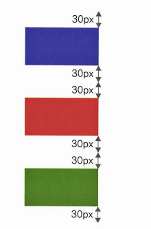

# 레이아웃을 구성하는 CSS 박스 모델 (08장)
## 08-1 CSS와 박스 모델
- CSS 박스 모델이란 웹 문서의 내용을 박스 형태로 정의하는 방법이다. 이 박스 모델이 모여 웹 문서를 이루는 것이다. 박스 모델에는 마진과 패딩, 테두리 등 박스가 여러 겹 들어 있다


### 블록 레벨 요소와 인라인 레벨 요소
- 박스 모델은 블록 레벨 요소인지 인라인 레벨 요소인지에 따라 나열 방법이 달라진다.
- 블록 레벨 요소
	- 태그를 사용해 요소를 삽입했을 때 혼자 한줄을 차지하는 것이다. 한줄을 차지한다는 것은 해당 요소의 너비가 100%라는 뜻이다. 따라서 블록 레벨 요소의 왼쪽이나 오른쪽에 다른 요소가 올수 없다. 블록 레벨 요소를 만드는 대표적인 태그로 \<h1>, \<div>, \<p> 등이 있다.
	- 
- 인라인 레벨 요소
	- 한줄을 차지하지 않는다. 콘텐츠만큼만 영역을 차지하고 나머지 공간에는 다른 요소가 올 수 있다. 한줄에 인라인 레벨 요소를 여러개 표시할 수 있다. 인라인 레벨 요소를 만드는 태그로 \<span>, \, \<strong> 등이 있다.

### 박스 모델의 기본 구성
- 앞에서 배운 웹 문서의 블록 레벨 요소는 모두 박스 형태입니다. 스타일 시트에서는 이렇게 박스 형태인 요소를 박스 모델(box model)요소 라고 한다. 웹 문서 안에서 여러 요소를 원하는 위치에 배치하려면 CSS 박스 모델을 잘 알고 있어야 한다.
- 박스 모델은 콘텐츠 영역, 박스와 콘텐츠 영역 사이의 여백인 패딩(padding), 박스의 테두리(border), 그리고 여러 박스 모델 사이의 여백인 마진(margin)등의 요소로 구성된다. 이때 마진 이나 패딩은 웹 문서에서 다른 콘텐츠 사이의 간격이나 배치 등을 고려할 때 필요한 개념이다.
	- 

### 콘텐츠 영역의 크기를 지정하는 width, height 속성
- 박스 모델에서 콘텐츠 영역의 크기를 지정할 때 너비는 width, height 속성을 사용한다
|종류|설명|
|:---:|-----|
|크기|너비나 높이의 값을 px이나 em단위로 지정한다.
|백분율|박스 모델을 포함하는 부모 요소를 기준으로 너빗값이나 높이값을 백분율(%)로<br> 지정한다.
|auto|박스 모델의 너빗갑소가 높잇값이 콘텐츠 양에 따라 자동으로 결졍된다. 기본값|
- 
```html
<!DOCTYPE html>
<html lang="ko">
<head>
    <meta charset="UTF-8">
    <title>Document</title>
</head>
<style>
    #a {
        width: 200px;
        height: 200px;
    }
</style>
<body>
    <input type="text" id="a"><br>
    <input type="text">
</body>
</html>
```

### 박스 모델의 크기를 계산하는 box-sizing 속성
- width 속성과 height 속성은 박스 모델에서 콘텐츠 주변의 여백이나 테두리를 뺀 콘텐츠 영역의 크기를 가리킨다. 그래서 웹 문서에 여러가지 요소를 배치할 때 실제 박스 모델이 차지하는 크기는 콘텐츠 영역 외에도 콘텐츠와 테두리 사이의 여백, 테두리 두께까지 계산해야 한다.
- 웹 문서에서 텍스트와 이미지 등의 다양한 요소를 배치할 때 매번 패딩과 테두리의 값을 계산해서 박스 모델의 크기를 넣어야한다. 하지만 box-sizing 속성을 사용하면 너비와 높이를 어떻게 결정할 것인지에 따라 border-box와 content-box 를 사용해 boxsize를 계산할 수 있다.
- border-box
	- 테두리까지 포함해서 너빗값을 지정
	- 
- content-box
	- 콘텐츠 영역만 너빗값을 지정
	-  

### box-shadow 속성
- CSS에서 box-shadow 속성을 사용하면  그림자 효과를 줄 수 있다. 그림자는 이미지 또는 \<div>와 같이 전체 영역에 지정하여 넣을수 있는데 box-shadow에서 그림자 위치나 색상, 흐림 정도 등을 지정하려면 다음과 같은 형식으로 사용한다.
```
	기본형 box-shadow: <수평 거리> <수직 거리> <흐림 정도> <번짐 정도> <색상> inset
```
- box-shadow의 속성값에서 수평 거리와 수직 거리는 반드시 지정해야 한다.
- 
|종류|설명|
|:---:|-----|
|수평 거리|그림자가 가로로 얼마나 떨어져 있는지를 나타낸다. 양숫값은 요소의<br> 오른쪽에,음숫값은 요소의 왼쪽에 그를 만든다.|
|수직 거리|그림자가 세로로 얼마나 떨어져 있는지를 나타낸다. 양숫값은 요소의<br> 아래쪽에, 음숫값은 요소의 위쪽에 그림자를 만든다.
|흐림 정도|이 값을 생략하면 0을 기본값으로 하여 진한 그림자를 표시한다.<br> 값이 커질수록 부드러운 그림자를 표시하며, 음숫값은 사용할 수 없다.
|번짐 정도|양숫값을 사용하면 모든 방향으로 그림자가 퍼져서 박스보다 그림<br>자가 크게 표시된다. 반대로 음숫값은 모든 방향으로 그림자가 축소되어 보인다.
|색상|한가지만 지정할 수도 있고, 공백으로 구분해서 여러 개의 색상을 지정할 수도<br> 있다.
|inset|그림자를 안쪽으로 표시한다.|

## 테두리 스타일 지정
- 박스 모델을 사용해 웹 문서에 요소를 배치하려면 각 박스 모델의 크기와 여백, 테두리 스타일 등을 고려해야 한다. 네 방향 모두 같은 테두리를 사용할 수도 있고 각각 다르게 사용할 수도 있다

### 박스 모델의 방향
- 박스 모델은 상하좌우 4개의 방향이 있어서 테두리나 마진, 패딩 등을 지정할 때 한꺼번에 똑같이 지정하거나, 모두 다르게 지정할 수도 있다.
- 박스 모델의 방향을 맨 윗부분은 top, 오른쪽은 right, 아랫부분은 bottom 왼쪽은 left라고 한다.

### border-style
테두리 스타일을 지정하는 border-style 속성의 기본값은 none이므로 속성값을 따로 지정하지 않으면 테두리 색상이나 두께를 지정하더라고 화면에 표시되지 않는다.
- border-style 속성 종류
|종류|설명|
|:---:|------|
|none|테두리가 없다. 기본값|
|hidden|테두리를 감춘다. border-collapse: collapse일 경우 다른 테두리도 표시되지 않는다.|
|solid|테두리를 실선으로 표시한다.|
|dotted|테두리를 점선으로 표시한다.|
|dashed|테두리를 짧은 직석으로 표시한다.|
|double|테두리를 이중선으로 표시한다. 두사이의 간격이 border-width값이 된다|
|groove|테두리를 창에 조각한 것처럼 표시한다. 홈이 파인 듯 입체 느낌니 난다.|
|inset|표에서 border-collapse: spperate일 경우 전체 박스 테두리가 창에 박혀 있는 것처럼 표시되고, 표에서 border-collapse: collapse일 경우 groove와 똑같이 표시된다.
|outset|표에서 border-collapse: spperate일 경우 전체 테두리가 창에서 튀어나온 것처럼 표시되고, 표에서 border-collapse: collapse일 경우 ridge와 똑같이 표시된다.|
|ridge|테두리가 창에서 튀어나온 것처럼 표시된다.
- 

### border-width
- border-width 속성을 사용하면 테두리 두께를 지정할수 있다.
- 직접 크기를 입력할 수도 있고 thin, medium, thick같은 예약어를 사용할 수도 있다.
```
	기본형 border-width: <크기> | thin | medium | thick
```
- 테두리 두께를 4방향 모두 다르게 지정하고 싶다면 border-top-width, border-right-width처럼 border와 width사이에 방향을 넣는다.


### border-color
- border-color 속성은 박스 모델에서 테두리 색상을 지정할 수 있다.

### border
테두리 스타일과 두께, 색상을 한꺼번에 표현할 수 있다. border-top이나 border-right처럼 속성 이름에 방향을 함께써서 따로 지정할 수도 있다.

### border-radius
- border-radius 속성을 사용하면 꼭짓점 윗부분에 원이 있다고 가정해서 둥글게 처리힌다. 원의 반지름을 이용하면 둥근 정도를 나타낼 수 있다.
```
	기본형 border-radius: <크기> | <백분율>
```
- border-top-radius 처럼 border와 radius 사이에 위치를 넣으면 꼭짓점마다 따로 둥글게 처리할 수 있다.

## 여백을 조절하는 속성
두 박스 모델 사이의 여백은 마진, 한 박스 모델에서 테두리와 내용사이의 여백은 패딩이라고 한다.

### margin
- 마진은 요소 주변의 여백을 의미한다. 따라서 마진을 이요하면 요소와 요소 사이의 간격을 조절할 수 있다. 
```
	기본형 margin: <크기> | <백분율> | auto
```
- 마진 속성에서 값을 하나만 지정하면 4방향 모두 같이 지정되지만 값이 여러개면  top -> right -> bottom -> left순으로 적용된다.

### margin 속성을 사용하여 웹 문서를 가운데 정렬하기
- margin 속성을 사용해 웹 문서의 내용을 화면 중앙에 배치하려면 우선적으로 배치할 요소의 너빗값이 정해져 있어야 한다. 그리고 margin-left와 margin-right의 속성값을 auto로 지정한다. 이렇게 지정하면 CSS는 웹 브라우저 화면의 너비에서 요소 너빗값을 뺀 나머지 영역을 좌우 마진으로 자동 계산한다.

### 마진 중첩
- 박스 모델에서 마진을 지정할 때 주의해야 할 것이 있다. 요소를 세로로 배치할 경우에 각 요소의 마진과 마진이 서로 만나면 마진값이 큰 쪽으로 겹쳐지는 문제인다, 이런 형상을 마진 중첩 또는 마진 상쇄라고 한다
- 
- 

### padding
- 패딩이란 콘텐츠 영역과 테두리 사이의 여백을 말한다. 패딩과 마진은 여백의 위치만 박스 모델에서 패딩을 지정하는 방법은 마진과 거의 같다.

## 웹 문서의 레이아웃 만들기

### display 속성
- display 속성을 사용하면 블록 레벨 요소와 인라인 레벨 요소를 서로 바꿔서 사용할 수 있다. display 속서은 주로 웹 문서의 내베게이션을 만들면서 메뉴 항목을 가로로 배치할 때 많이 사용하고, 이미지를 표 형태로 배치 할 수도 있다.
|종류|설명|
|:---:|-----|
|block|인라인 레벨 요소를 블록 레벨 요소로 만든다.|
|inline|블록 레벨 요소를 인라인 레벨 요소로 만든다.|
|inline-block|인라인 레벨 요소와 블록 레벨 요소의 속성을 모두 가지고 있으면 마진과 패딩을 지정할 수 있다.|
|none|해당 요소를 화면에 표시하지 않는다.|

### float
- 웹 문서를 만들다 보면 \<p> 태그처럼 문단의 왼쪽이나 오른쪽에 이미지를 나란히 표시해야 할 경우가 있다. 그런데 \<p> 태그는 블록 레벨 요소이므로 이미지와 나란히 한 줄에 배치할수 없다. 이럴 때는 float 속성을 사용하여 이미지를 표시하고 그 주변에 텍스트가 둘러 싸도록 할 수 있다.
- float 속성은 웹 요소를 문서 위에 떠 있게 만든다. 떠 있다는 의미는 요소가 왼쪽 구석이나 오른쪽 구석에 배치된다는 것을 말한다.
- float 속성값
|종류|설명|
|:---:|-----|
|left|해당 요소를 문서의 왼쪽에 배치한다.|
|right|해당 요소를 문서의 오른쪽에 배치한다.|
|none|좌우 어느 쪽에도 배치하지 않는다.|

### clear
float 속성을 사용해 웹의 요소를 왼쪽이나 오른쪽에 배치하면 그 다음에 넣는 다른 요소에도 똑같은 속성이 전달된다. 따라서 float 속성이 더 이상 유용하지 않다고 알려 주는 속성이 필요한데 그것이 바로 clear 속성이다


## 웹 요소의 위치 지정하기

### left, right, top, bottom 속성
- postion 속성으로 기준 위치를 정한 뒤 요소의 위치를 left, right, top, bottom 속성에서 선택하고 속성값을 지정한다
|종류|설명|
|:---:|-----|
|left|기준 위치와 요소 사이에 왼쪽으로 얼마나 떨어져 있는지 지정|
|right|기준 위치와 요소 사이에 오른쪽으로 얼마나 떨어져 있는지 지정
|top|기준 위치와 요소 사이에 위쪽으로 얼마나 떨어져 있는지 지정
|bottom|기준 위치와 요소 사이에 아래쪽으로 얼마나 떨어져 있는지 지정

### position
- position 속성을 이용하면 텍스트나 이미지 요소를 나란히 배치할 수도 있고 원하는 위치를 선택할 수 있습니다.
- position 속성값
|종류|설명|
|:---:|-----|
|static|문서의 흐름에 맞춰 배치한다|
|relative|위칫값을 지정할 수 있다는 점을 제외하면 static과 같다|
|absolute|relative값을 사용한 상위 요소를 기준으로 위치를 지정해 배치한다.|
|fixed|브라우저 창을 기준으로 위치를 지정해 배치한다.|
