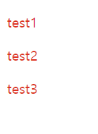
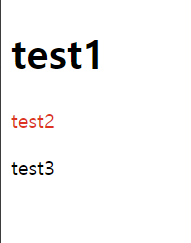
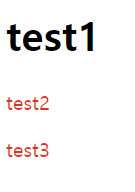

## 10-CSS 고급 선택자

### 10-1  연결 선택자
- 연결 선택자는 둘 이상의 선택자를 연결해서 스타일이 적용될 요소가 어느 부분인지 지정한다. 선택자를 둘 이상 조합하므로 '조합 선택자' 라고도 하고 '콤비네이션 선택자', '콤비네이션 셀렉터' 등으로도 부른다.


#### 하위 선택자, 자식 선택자
- 특정 요소를 기준으로 그 안에 포함된 요소를 하위 요소라고 한다. 그리고 현재 요소를 기준으로 바로 한 단계 아래 요소는 자식 요소라고 하며, 그 자식 요소의 한 단계 아래는 손자 요소라고 한다.
##### 하위 선택자
- 하위 선택자를 사용하면 부모 요소에 포함된 하위 요소를 모두 선택하며 자손 선택자라고도 한다. 자식 요소뿐만 아니라 손자 요소, 손자의 손자 요소 등 모든 하위 요소까지 적용된다. 하위 선택자는 상위 요소와 하위 요소를 공백으로 구분한다.
```
	기본형 상위요소 하위요소
```
```html
<!DOCTYPE html>
<html lang="ko">
<head>
    <meta charset="UTF-8">
    <title>Document</title>
</head>
<style>
    section p {
        color: red;
    }
</style>
<body>
    <section>
        <p>test1<p>test2</p></p>
        <p>test3</p>
    </section>
</body>
</html>
```
- 
##### 자식 선택자
- 자식 선택자는 하위 선택자와 다르게 자식 요소에만 스타일을 적용하는 선택자로, 다음과 같이 두 요소 사이에 '>' 기호를 표시해 부모 요소와 자식 요소를 구분한다.
```
	기본형 부모요소 > 자식요소
```
- 자식 선택자는 바로 한 단계 아래의 요소, 즉 자식 요소에만 스타일이 적용된다.

#### 인접 형제 선택자, 형제 선택자
- 웹 문서에서 부모 요소가 같을 경우 형제 관계라고 하고, 형제 관계인 요소에서 먼저 나오는 요소를 형 요소, 나중에 나오는 요소를 동생 요소라고 한다.

##### 인접 형제 선택자
- 형제 요소 중에서 첫 번째 동생 요소만 성택하는 것을 인접 형제 선택자 라고 한다. 인접 형제 선택자를 정의할 때는 다음 기본형과 같이 요소1과 요소2 사이에 '+' 기호를 표시한다. 요소1과 요소2는 같은 레벨이면서 요소1 이후 가장 먼저오는 요소2를 선택한다.
```
	기본형 요소1 + 요소2
```
```html
<!DOCTYPE html>
<html lang="ko">
<head>
    <meta charset="UTF-8">
    <title>Document</title>
</head>
<style>
    h1 + p {
        color: red;
    }
</style>
<body>
    <h1>test1</h1>
    <p>test2</p>
    <p>test3</p>
</body>
</html>
```
- 
- h1요소와 형제인 p요소 중에서 첫 번째 p 요소만 글자을 바꾸는 예제.

##### 형제 선택자
- 형제 선택자는 형제 요소의 스타일을 정의하는데 인접 형제 선택자와 달리 모든 형제 요소에 적용된다. 형제 선택자를 정의할 때는 첫 번째 요소와 두 번째 요소 사이에 '~'기호를 표시한다.
```
	기본형 요소1 ~ 요소2
```
```html
<!DOCTYPE html>
<html lang="ko">
<head>
    <meta charset="UTF-8">
    <title>Document</title>
</head>
<style>
    h1 ~ p {
        color: red;
    }
</style>
<body>
    <h1>test1</h1>
    <p>test2</p>
    <p>test3</p>
</body>
</html>
```
- 
- h1 요소의 형제인 p요소를 모두 선택해 배경색과 글자색을 바꾸는 예제

### 10-2 속성 선택자
- 속성 선택자는 태그 안에서 사용하는 속성값에 따라 요소를 선택하는 역할을 한다. 속성값의 조건에 따라 특정 부분만 선택하기 쉬우므로 상황에 맞는 스타일을 지정하기도 쉽다.

#### \[속성] 선택자
- 속성값에 따라 원하는 요소를 선택할 수도 있다. 이때 사용하는 것이 \[속성] 선택자인데, 대괄호 ([])사이에 원하는 속성을 입력하면 된다. 예를 들어 요소중에서 herf 속성이 있는 요소를 선택하려면 다음과 같이 작성한다.
```
	ex) a[herf] {.....}
```

#### \[속성 = 속성값] 선택자
- \[속성 = 속성값] 선택자는 주어진 속성과 속성값이 일치하는 요소를 찾아 스타일을 지정할 때 사용한다. 이 형식은 대괄호([ ])안에 속성과 속성값을 넣고 그 사이에 '=' 기호를 표시한다.
- 예를 들어 a요소 중에서 target 속성값이 '\_blank'인 것만 선택하고 싶다면 다음과 같이 작성한다.
```html
	ex) a[target = _blank] {.....}
```

#### \[속성 ~= 값] 선택자
- \[속성 ~= 값] 선택자는 여러 속성값 중에서 해당 속성값이 포함된 요소를 선택한다. 이 선택자는 속성이 하나면서 속성값이 여러 개일 때 특정 속성값을 찾는데 편리하다.
- 예를 들어 하나의 요소에 클래스 스타일을 여러 개 적용할 수 있는데, 그 중에 button 스타일이 있는 요소를 찾으려면 다음과 같이 작성한다.
```
	ex) [class ~= button]
```

#### \[속성 |= 값] 선택자
- \[속성 |= 값] 선택자는 특정 속성값이 포함된 속성에 스타일을 적용한다. 이때 속성값은 한 단어로 일치해야 한다
- \[속성 ~= 값] 선택자와 비슷해 보이지만, \[속성 ~= 값]은 하이픈(-) 으로 연결한 단어에 스타일을 적용하지 않는다는 점에서 \[속성 |= 값] 선택자와 차이가 있다.
- \[속성 |= 값] 선택자는 지정한 갑소가 정확하게 일치하거나 지정한 값을 포함해서 하이픈(-) 으로 연결된 단어도 선택한다.
- 예를 들어 title 속성값에 us가 있거나 us-로 연결된 속성값이 있는 a 요소를 찾는다면 다음과 같이 작성한다
```
	ex) a[title |= us] {.....}
```

\[속성 ^= 값] 선택자
- 속성값이 정확하게 일치하지 않더라도 지정한 속성값으로 시작하는 요소를 찾으려면 \[속성 ^= 값] 선택자를 사용한다.
- 예를 들어 title 속성값이 eng로 시작하는 a요소를 찾는다면 다음과 같이 작성한다.
```
	ex) a[title ^= eng] {.....}
```

\[속성 $= 값] 선택자
- \[속성 ^= 값]이 지정한 속성값으로 시작하는 요소를 선택했다면, \[속성 $= 값] 선택자는 지정한 속성값으로 끝나는 요소를 선택한다.
- 예를 들어 링크한 파일 이름의 마지막 단어가 xls인 요소를 찾는다면 다음과 같이 작성한다.
```
	ex) [href $= xls]
```

\[속성 \*= 값] 선택자
- \[속성 \*= 값] 선택자는 속성값이 어느 위치에 있든지 지정한 속성값이 포함되어 있다면 해당 요소를 선택한다.
- 예를 들어 herf 속성값 중에 'w3'가 포함된 요소를 선택한다면 다음과 같이 작성한다.

### 10-3 가상 클래스와 가상 요소

#### 가상 클래스
- 사용자가 웹 요소를 클릭하거나 마우스 포인터를 올려놓는 등 특정 동작을 할 때 스타일이 바뀌도록 만들고 싶다면 가상 클래스 선택자를 사용한다.
	- :link 가상 클래스 선택자
		- 웹 문서의 링크 중에서 사용자가 아직 방문하지 않은 링크에 스타일을 적용한다. 텍스트 링크는 기본적으로 파란색 글자와 밑줄로 표시된다. 이때 링크의 밑줄을 없애거나 색상을 바꾸려면 :link 선택자를 사용한다.
	- :visited 가상 클래스 선택자
		- 웹 문서의 링크 중에서 한 번 이상 방문한 링크에 스타일을 적용한다. 한 번 이상 방문한 텍스트 링크는 보라색이 기본값이다. 이때 사용자가 방문한 텍스트 링크와 색상이 달라지지 않게 하려면 :visited 선택자를 사용해 조절한다.
	- :hover 가상 클래스 선택자
		- :hover 선택자는 웹 요소 위로 마우스 포인터를 올려놓을 때 스타일을 적용한다. 이 가상 클래스 선택자를 응용하면 마우스 포인터를 올려놓았을 때 다른 이미지로 바뀌거나, 메인 메뉴 위로 마우스 포인터를 올려 놓았을때 서브메뉴가 나타나는 효과를 만들 수 있다.
	- :active 가상 클래스 선택자
		- :active 선택자는 웹 요소의 링크나 이미지 등을 활성화 했을때, 즉 클릭했을 때 스타일을 지정한다. 예를 들어 웹 요소의 링크를 클릭하는 순간의 스타일을 지정할 수 있다.
	- :focus 가상 클래스 선택자
					- :focus 선택자는 웹 요소에 초점이 맞추어졌을 때 스타일을 적용한다. 예를 들어 텍스트 필드 안에 마우스 포인터를 올려 놓거나, 웹 문서에서 tab을 눌러 입력 커서를 이동했을 때 스타일을 지정한다.

#### 요소 상태에 따른 가상 클래스
- 웹 사이트나 애플리케이션 화면에서 요소의 상태에 따라 스타일을 적용할 수 있는데, 이때 가상 클래스 선택자를 사용한다.

##### :target 가상 클래스 선택자
- 문서에서 같은 사이트나 다른 사이트 페이지로 이동할 때에는 링크를 이용하고, 같은 문서안에서 다른 위치로 이동할 때에는 앵커를 ㅣ용한다. 이때 :target 선택자를 사용하면 앵커로 연결된 부분, 즉 앵커의 목적지가 되는 부분의 스타일을 쉽게 적용할 수 있다.

##### :enabled, :disabled 가상 클래스 선택자
- 해당 요소가 사용할 수 있는 상태일 때 스타일을 지정하려면 :enabled 선택자를 사용하고, 반대로 사용할 수 없는 상태일 때 스타일을 지정하려면 :disabled 선택자를 사용한다.
- 예를 들어 텍스트 영역 필드(textarea)를 사용해 회원 약관을 보여 줄 때는 사용자가 입력할수 없도록 disable 속성을 지정해야 한다. 이때 :disabled 선택자를 사용하면 이런 텍스트 영역 필드의 스타일을 쉽게 적용할 수 있다.

##### :checked 가상클래스 선택자
- 폼의 라이도 박스나 체크 박스에서 선택된 항목에는 checked라는 속성이 추가된다. 이렇게 checked 속성이 있는 요소의 스타일을 지정할 때 :checked 선택자를 사용하면 편리하다.

:not 가상 클래스 선택자
- :not  선택자는 이름에서도 알 수 있듯이 부정의 의미가 있다. 여기서 not은 '괄호 안에 있는 요소를 제외한' 이라는 의미이다.

### 구조 가상 클래스
- 구조 가상 클래스란 웹 문서의 구조를 기준으로 특정 위치에 있는 요소를 찾아 스타일을 적용할 때 사용하는 가상 클래스 선택자 이다.

#### 특정 위치의 자식 요소 선택하기
- 웹 문서에서 특정 요소에 스타일을 적용하려면 보통 class나 id선택자를 사용한다. 하지만 요소가 여러 개 나열되어 있는 경우에는 class나 id를 사용하지 않고도 스타일을 지정할 요소가 몇 번째인지를 따져서 스타일을 적용할 수 있다.
|종류|설명|
|:---:|-----|
|:only-child|부모 안에 자식 요소가 하나뿐일 때 자식 요소를 선택한다.|
|A:only-type-of|부모 안에 A 요소가 하나뿐일 때 선택한다.|
|:first-child|부모 안에 있는 모든 요소 중에서 첫 번째 자식 요소를 선택한다.|
|:last-child|부모 안에 있는 모든 요소 중에서 마지막 자식 요소를 선택한다.|
|A:first-of-type|부모 안에 있는 A 요소 중에서 첫 번째 요소를 선택한다.|
|A:last-of-type|부모 안에 있는 A 요소 중에서 마지막 요소를 선택한다.|
|:nth-child(n)|부모 안에 있는 모든 요소 중에서 n번째 자식 요소를 선택한다.|
|:nth-last-child(n)|부모 안에 있는 모든 요소 중에서 끝에서 n번째 자식 요소를 선택한다.|
|A:nth-of-thpe(n)|부모 안에 있는 A 요소 중에서 n번째 요소를 선택한다.|
|A:nth-last-of-type(n)|부모 안에 있는 A 요소 중에서 끝에서 n번째 요소를 선택한다.|

#### 수식을 사용해 위치 지정하기
- 위치를 지정할 때 :nth-child(n) 선택자처럼 위치를 정확히 알려 줄 수도 있지만 1, 3, 5번째 처럼 위치가 계속 바뀐다면 반복된 규칙을 찾아내서 an+b처럼 수식을 사용할 수도 있습니다. 이때 n값은 0부터 시작한다. 또는 홀수 번째에 스타일을 줄 때는 :nth-child(odd), 짝수 번째에 스타일을 줄 때는 :nth-child(even)을 사용할 수 있다.


#### 가상 요소
- 가상 클래스가 웹 문서의 여러 요소 중에서 원하는 요소를 선택한다면, 가상 요소는 문서 안의 특정 부분에 스타일을 지정하기 위해 가상으로 요소를 만들어 추가한다. 가상 요소를 만들어 사용하는 이유는 특별히 화면에 보이는 부분을 꾸밀 때 불필요한 태그를 사용하지 않도록 하기 위한 것이다. 가상 요소는 가상 클래스와 구별하도록 가상 요소 이름 앞에 콜론 2개(::)를 붙여서 표시한다.

##### ::first-line, first-letter
- ::first-line, first-letter요소를 사용하면 지정한 요소의 첫 번째 줄이나 첫 번째 글자에 스타일을 적용할 수 있다. ::first-letter 요소는 해당 요소의 첫 번째 글자를 가리키는데, 첫 번째 글자는 반드시 첫 번째 줄에 있어야 한다. 만약 \<p> 태그 안에 \<br>태그가 있어서 첫 번째 글자가 첫 번째 줄에 없을 경우에는 적용할 수 없다.

##### ::before, ::after
- ::before요소와, ::after 요소를 사용하면 지정한 요소의 내용 앞뒤에 스타일을 넣을 수 있습니다. 이 요소를 사용하면 요소의 앞뒤에 텍스트나 이미지 등을 추가할 수 있다.


## 11-트랜지션과 애니메이션

### 11-1 변형 알아보기
- 일반적으로 물체의 크기나 형태의 위치를 바꾸는 것을 변형, 또는 트랜스폼(transform)이라고 한다. 웹 문서에서 CSS 변형을 이용하면 사용자의 동작에 반응해 텍스트나 이미지 등을 움직이게 할 수 있다.

#### transfrom과 변형 함수
- CSS에서 변형을 적용하려면 transfrom속성과 변형 함수 이름을 함께 작성해야 한다.
```
	기본형 transfrom: 함수
```
- 웹 요소를 이동시키는 변형 함수는 translate( )인데, 예를 들어 웹 요소를 x축으로 50px, y축으로 100px 이동하는 클래스 선택자 .photo를 정의하려면 다음과 같이 사용한다.
```
	.photo { transform: translate(50px, 100px); }
```

##### 2차원 변형과 3차원 변형
- 2차원 변형은 웹 요소를 평면에서 변형한다. 예를 들어 수평 방향으로 이동하거나 수직 방향으로 왜곡한다. 이렇게 평면에서 변형할 때는 2차원 좌표를 사용하는데, x축은 오른쪽으로 갈수록 값이 커지고 y축은 아래로 내려갈수록 값이 커진다.
- 3차원 변형은 x축과 y축에 원근감을 주는 z축을 추가해서 변형한다. 3차원 변형에서 z축은 앞뒤로 이동하며, 보는 사람 쪽으로 다가올수록 값이 커지고 뒤로 갈수록 값이 작진다. 

##### 2차원 변형 함수
|종류|설명|
|:---:|-----|
|translate(tx, ty)|지정한 크기만큰 x축, y축으로 이동한다.|
|translateX(tx)|지정한 크기만큼 x축으로 이동한다.|
|translateY(ty)|지정한 크기만큼 y축으로 이동한다.|
|scale(sx, sy)|지정한 크기만큼 x축과 y축으로 확대, 축소 한다.|
|scaleX|지정한 크기만큼 x축으로 확대, 축소 한다.|
|scaleY|지정한 크기만큼 y축으로 확대, 축소 한다.|
|rotate(각도)|지정한 각도만큼 회전한다.|
|skew(ax, ay)|지정한 각도만큼 x축과 y축으로 왜곡한다.|
|skewX(ax)|지정한 각도만큼 x축으로 왜곡한다.|
|skewY(ay)|지정한 각도만큼 y축으로 왜곡한다.|

##### 3차원 변형 함수
|종류|설명|
|:---:|-----|
|translate3d(tx, ty, tz)|지정한 크기만큼 x축, y축, z축으로 이동한다.|
|translate(tz)|지정한 크기만큼 z축으로 이동한다.|
|scale3d(sx, sy, sz)|지정한 크기만큼 x축, y축, z축으로 확대, 축소 한다.|
|rotate(rx, ry,  각도)|지정한 각도만큼 회전한다.|
|rotate3d(rx, ry, rz, 각도)|지정한 각도만큼 회전한다.|
|rotateX(각도)|지정한 각도만큼 x축으로 회전한다.|
|rotateY(각도)|지정한 각도만큼 y축으로 회전한다.|
|rotateZ(각도)|지정한 각도만큼 z축으로 회전한다.|
|perspective(길이)|입체적으로 보일 수 있도록 깊잇값을 지정한다.|

#### translate( ) 함수
- translate( ) 함수는 x축이나 y축 또는 양쪽 방향으로 이동할 거리를 지정하면 해당 요소가 지정한 크기만큼 이동한다. translate( ) 함수에서 사용하는 형식은 다음과 같다.
```
	기본형 transform: translate(tx, ty)
```

#### scale( ) 함수
- scale( ) 함수는 웹 요소를 지정한 크기만큼 확대하거나 축소한다. scale( ) 함수를 사용하는 형식은 다음과 같다. 괄호 안의 값(sx, sy, sz)이 1보다 크면 확대되고 1보다 작으면 축소된다.
```
	기본형 transform: scale(sx, sy)
```

#### rotate( ) 함수
- 요소를 회전시키는 rotate( )함수는 2차원 회전과 3차원 회전에서 모두 사용할 수 있다. rotate( ) 함수를 2차원에서 사용할 때는 각도만 지정하면 된다. 함수는 웹 요소를 지정한 각도만큼 오른쪽(시계 방향)이나 왼쪽(시계 반대 방향)으로 회전시킨다.
```
	기본형 transform: rotate(각도)
```
- rotate( ) 함수에서 지정할 수 있는 각도의 값은 일반적인 각도나 래디안을 사용한다.

#### 3차원 rotate( ) 함수
- 3차원 rotate( )함수는 다음과 같이 x축이나 y축, z축을 기준으로 회전시킨다.
```
	기본형 transform: rotate(rx, ry, 각도)
```
- 이때 perspective 속성을 사용해서 원근감을 추가해 주면 회전 형태를 입체적으로 표현 할 수 있다. perspective 속성은 3차원 변형에서 사용하는데, 원래 있던 위치에서 사용자가 있는 방향이나 혹은 반대 방향으로 잡아당기거나 밀어내어 원근감을 표현한다.
- perspective 속성에서 사용하는 값은 0보다 커야 하며, 원래 있던 위치에서 사용자가 있는 쪽으로 얼마나 이동하는지를 픽셀 크기로 나타낸다. 값이 클수록 사용자로부터 멀어진다.
- perspective 속성은 변형하는 요소가 아니라 변형하는 요소의 부모 요소에 정의해야 한다.

#### skew( ) 함수
- skew( ) 함수는 지정한 각도만큼 요소를 비틀어 왜곡한다. 이때 양쪽 방향으로 비틀거나 한쪽 방향으로만 비틀 수도 있다.
```
	기본형 transform: skew(x각도, y각도)
```


### 11-2트랜지션 알아보기
- 트랜지션은 하나의 스타일을 완전히 다른 스타일로 바꾼다. 트랜지션에서는 스타일이 바뀌는 시간을 조절하여 자바스크립트를 사용하지 않고도 애니메이션 효과를 낼 수 있다.

#### 트랜지션이란
- 트랜지션은 웹 요소의 배경색을 바꾸거나 도형의 테두리를 사각형에서 원형으로 바꾸는 것처럼 스타일 속성이 바뀌는 것을 말한다.

#### 트랜지션과 속성
|종류|설명|
|:---:|-----|
|transition-property|트랜지션의 대상을 지정한다.|
|transition-duration|트랜지션을 실행할 시간을 지정한다.|
|transition-timing-function|트랜지션의 실행 형태를 지정한다.|
|transition-delay|트랜지션의 지연 시간을 지정한다.|
|transition|위 속성을 한꺼번에 정의할 수 있다.|

#### transition-property 속성
- 트랜지션을 만들려면 맨 먼저 transition-property 속성을 사용하여 어떤 속성에 트랜지션을 적용할 것인지 대상을 지정해야 한다.
```
	기본형 transition-property: all | none| <속성 이름>
```
|종류|설명|
|:---:|-----|
|all|all값을 사용하거나 transition-property를 생략할 경우 요소의 모든 속성이<br>트랜지션 대상이 된다. 기본값|
|none|트랜지션을 하는 동안 아무 속성도 바뀌지 않는다.|
|속성 이름|트랜지션 효과를 적용할 속성을 지정한다.|

#### transition-duration 속성
- transition-property에서 트랜지션 대상을 지정했다면 다음으로 진행 시간을 지정해야 속성이 자연스럽게 바뀌는 애니메이션 효과를 만들 수 있다. 진행 시간은 transition-duration 속성으로 지정할 수 있다. 지정할수 있는 시간 단위는 초 또는 밀리초 이고 트랜지션의 대상 속성이 여러 개라면 진행 시간도 쉼표(,)로 구분해서 여러 개를 지정할 수 있다.
```
	기본형 transition-duration: <시간>
```

transition-timing-function 속성
- transition-timing-function 속성을 사용하면 트랜지션 효과의 시작, 중간, 끝에서 속도를 지정해 전체 속도 곡선을 만들 수 있다. 속도 곡선은 미리 정해진 키워드나 베지에 곡선을 이용해 표시한다.
```
	기본형 transition-timing-function: linear | ease | ease-in | ease-out | ease-in- 
           out | cubic-bezier(n, n, n, n) 
```
|종류|설명|
|:---:|-----|
|ease|처음에는 천천히 시작하고 점점 빠라지다가 마지막엔 천천히 끝낸다.|
|linear|시작부터 끝까지 똑같은 속도로 진행한다.
|ease-in|느리게 시작한다.|
|ease-out|느리게 끝낸다.
|ease-in-out|느리게 시작하고 느리게 끝낸다.
|cubic-bezier(n, n, n, n)|베지에 함수를 정의해서 사용한다. 이때 n 값은 0~1 사이만 사용할 수 있다.|

#### transition-delay 속성
- transition-delay 속성은 트랜지션 효과를 언제부터 시작할 것인지 설정한다. 이 속성을 사용하면 지정한 시간만큼 기다렸다가 트랜지션이 시작된다. 사용할 수 있는 값은 초(s)나 밀리초(ms)이며, 기본값은 0이다.
```
	기본형 transition-delay: <시간>
```

#### transition 속성
- 트랜지션의 적용 대상이 전체이고 각각의 진행 시간이 같다면 transition 속성으로 한꺼번에 지정하는 것이 편리하다.
```
	기본형 transition: <transition-property값> | <transition-duration값>
		    | <transition-timing-function값> | <transition-delay값>
```
- 속성값을 작성하는 순서는 상관없지만 시간값을 사용하는 속성이 2개(진행 시간, 지연 시간)이므로 시간값이 2개 있다면 앞에 오는 시간값을 transition-duration속성으로, 뒤에 오는 시간값은 transition-delay 속성으로 간주한다.


### 11-3 애니메이션 알아보기
- 트랜지션을 활용하여 부드러운 애니메이션 효과를 만들 수 있지만 CSS3의 animation속성을 이용하면 트랜지션보다 더 쉽게 애니메이션을 만들 수 있다.

#### CSS 애니메이션에서 사용하는 속성
- CSS의 animation 속성을 사용하면 자바스크립트를 사용하지 않고도 웹 요소에 애니메이션을 추가할 수 있다. animation 속성은 특정 지점에서 스타일을 바꾸면서 애니메이션을 만드는데, 이렇게 중간에 스타일이 바뀌는 지점을 키프레임 이라고 한다. 키프레임은 @keyframes 속성으로 정의하고, animation 속성과 그 하위 속성을 이용해서 애니메이션의 실행 시간이나 반복 여부 등을 지정한다.
|종류|설명|
|:---:|-----|
|@keyframes|애니메이션이 바뀌는 지점을 지정한다.|
|animation-delay|애니메이션의 시작 시간을 지정한다.|
|animation-direction|애니메이션을 종료한 뒤 처음부터 시작할지, 역방향으로 진행할지 지정한다.|
|animation-duration|애니메이션의 실행 시간을 지정한다.|
|animation-iteration-count|애니메이션의 반복 횟수를 지정한다.|
|animation-name|@keyframs로 설정해 놓은 중간 상태를 지정한다.
|animation-timing-function|키프레임의 전환 형태를 지정한다.
|animation|animation 속성을 한꺼번에 묶어서 지정한다.

#### @keyframs 속성, animation-name속성
- 애니메이션의 시작과 끝을 비롯하여 상태가 바뀌는 부분이 있다면 @keyframs 속성을 이용해 바뀌는 지점을 설정한다.
```
	기본형 @keyframe <이름> {
			<선택자> { <스타일> }
	}
```
- 또한 웹 문서에서는 애니메이션을 여러 개 정의할 수 있으므로 이름을 이용해 애니메이션을 구별해야 한다. 이때 animation-name 속성으로 어떤 애니메이션을 사용할지 이름으로 구분한다.
```
	기본형 animation: <키프레인 이름> | none
```
- @keyframes 속성에서 사용하는 선택자는 스타일 속성값이 바뀌는 지점을 가리킨다. 

#### animation-duration 속성
- animation-duration 속성은 애니메이션을 얼마 동안 재생할 것인지 설정한다.
```
	기본형 animation-duration: <시간>
```
- animation-duration 속성에서 사용할 수 있는 값은 초(s)나 밀리초(ms)와 같은 시간 단위이다. 기본값은 0이므로 animation-duration 속성값을 정하지 않으면 애니메이션은 실행되지 않는다.

#### animation-direction 속성
- 애니메이션은 기본적으로 keyframes에서 정의한 from에서 to 순서로 진행하는데 animation-direction 속성을 사용해서 진행 방향을 바꿀 수 있다.
```
	기본형 animation-direction: normal | reverse | alternate| alternate-reverse
```
|종류|설명|
|:---:|-----|
|normal|애니메이션을 from에서 to로 진행한다.|
|reverse|애니메이션을 to에서 from으로 반대로 진행한다.|
|alternate|홀수 번째는 normal로, 짝수 번째는 reverse로 진행한다.
|alternate-reverse|홀수 번째는 reverse로, 짝수 번째는 normal로 진행한다.|

#### animation-iteration-count 속성
- 상황에 따라 애니메이션을 반복해서 보여 줘야 할 때는 animation-iteration-count 속성을 사용해 반복 횟수를 정한다.
```
	기본형 animation-iteration-count: <숫자> | infinite
```
|종류|설명|
|:---:|-----|
|숫자|애니메이션의 반복 횟수를 정한다.|
|infinite|애니메이션을 무한 반복한다.|

#### animation-timing-function 속성
- 트랜지션과 마찬가지로 animation에서도 애니메이션의 시작, 중간, 끝에서 속도를 지정하여 전체 속도 곡선을 만들 수 있다.
```
	기본형 animation-timing-function: linear | ease | ease-in | ease-out
			| ease-in-out | cubic-bezier(n, n, n, n)
```

#### animation 속성
- animation 관련 속성을 한 줄씩 따로따로 작성하지 않고 한꺼번에 표기할 수 있다.
- 애니메이션 속성을 사용할 때 animation-duration 속성을 반드시 표기해야 한다.
```
	기본형 animation: <animation-name> | <animation-duration> |
					 <animation-timing-function> | <animation-delay>
					 <animation-iteration-count> | <animation-direction> 
```

