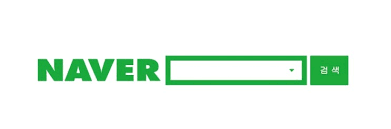
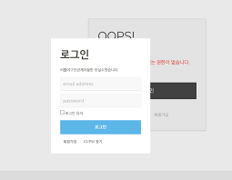

# 3주차 - HTML form 태그

## Contents

[05-1 폼 삽입하기](05.md#05-1-폼-삽입하기)\
[05-2 사용자 입력을 위한 input 태그](05.md#05-2-사용자-입력을-위한-input-태그)\
[05-3 input 태그의 주요 속성](05.md#05-3-input-태그의-주요-속성)\
[05-4 폼에서 사용하는 여러 가지 태그](05.md)\
\


## 입력 양식 작성하기

입력 양식이란 특정 항목에 사용자가 뭔가를 입력할 수 있게 만든 것으로 `'폼'`이라고 합니다.

대표적 예시\


 검색창

\
로그인 창

\
이와 같은 검색 창이나, 로그인 창이 대표적이다.

HTML에서 지원하는 다양한 태그와 속성을 알아보자

## 05-1 폼 삽입하기

폼의 경우 사용자 의견이나 정보를 알기 위해 입력할 큰 틀을 만드는 데 사용된다.

 쇼필몰 사이트에서 볼 수 있는 주문서 폼


폼과 관련된 작업은 정보를 저장하거나, 검색, 수정하는 것이 대부분이며 이는 데이터베이스를 기반으로 작동한다.

#### 폼 태그 동작 과정

1. 폼이 있는 웹 페이지를 방문합니다.
2. 폼 내용을 입력합니다.
3. 폼 안에 있는 모든 데이터를 웹 서버로 보냅니다.
4. 웹 서버는 받은 폼 데이터를 처리하기 위해 웹 프로그램으로 넘깁니다.
5. 웹 프로그램은 폼 데이터를 처리합니다.
6. 처리결과에 따른 새로운 html 페이지를 웹 서버에 보냅니다.
7. 웹 서버는 받은 html 페이지를 브라우저에 보냅니다.
8. 브라우저는 받은 html 페이지를 보여줍니다.

### 폼을 만드는 `<form>` 태그

```html
기본형 <form [속성="속성값"]여러 폼 요소</form>
```

#### `<form>` 태그에 어떤 속성과 속성값이 있는지 확인해보자

|       종류       | 설명                                                                                                                                                                                                                                                               |
| :------------: | ---------------------------------------------------------------------------------------------------------------------------------------------------------------------------------------------------------------------------------------------------------------- |
|     method     | <p>사용자가 입력한 내용을 서버 쪽 프로그램으로 어떻게 넘겨줄 것인지 지정합니다. method에서 사용할 수 있는 속성 값은 <code>get</code>과 <code>post</code>입니다.<br>- get: 데이터를 256~4,096byte까지만 서버로 넘길 수 있습니다. 주소 표시줄에 사용자가 입력한 내용이 그대로 드러나는 단점이 있습니다.<br>- post: 입력한 내용의 길이에 제한받지 않고 사용자가 입력한 내용도 드러나지 않습니다.</p> |
|      name      | 자바스크립트로 폼을 제어할 때 사용할 폼의 이름을 지정합니다.                                                                                                                                                                                                                               |
|     action     | 태그 안의 내용을 처리해줄 서버 프로그램을 지정합니다.                                                                                                                                                                                                                                   |
|     target     | action 속성에서 지정한 스크립트 파일을 현재 창이 아닌 다른 위치에서 열도록 합니다.                                                                                                                                                                                                               |
| accept-charset | 폼 전송에 사용할 문자 인코딩을 지정합니다.                                                                                                                                                                                                                                         |
|  autocomplete  | 자동 완성 기능을 제공, 기본 속성값은 "on"으로 기능을 끄고 싶다면 "off"로 지정하면 된다.                                                                                                                                                                                                          |

#### 폼 속성 사용 예시

```html
...
<html>
    <head>
    </head>

    <body>
        <form action = "http://localhost:8080/form.jsp" accept-charset="utf-8" 
              name = "person_info" method = "get"> 
        </form>
    </body>
<html>
...
```

전송할 http 메소드 종류인 GET과 POST는 브라우저에서 폼 데이터를 가져와 서버로 보내는 똑같은 기능을 수행하지만, 방식은 다릅니다. GET은 폼 데이터를 URL 끝에 붙여서 눈에 보이게 보내지만 POST 방식은 내부적으로 보이지 않게 보냅니다.  위 그림 2 위쪽은 GET 방식이고 아래쪽은 POST 방식입니다.

URL 끝에 데이터를 붙여 보내는 GET 방식은 데이터가 외부에 노출되어 보안에 취약합니다. 그래서 보내려는 데이터가 개인정보나 보안을 해야 하는 경우는 POST 방식을 사용해야 합니다. 또한, HTTP 메소드 정의에서 GET 방식은 지정된 리소스에서 데이터를 요청하는 경우인 읽을 때 사용하는 메소드입니다. 반면 POST 방식은 지정된 리소스에서 데이터를 처리할 경우인 쓰고, 수정, 삭제할 때 사용합니다.

보안이 필요하지 않으면서 지정된 리소스에서 자원을 읽을 경우에는 GET 방식을 사용하고, 그렇지 않다면 POST 방식을 사용하면 됩니다.\
\


입력한 폼을 서버로 보내기

```html
<form action="register.php">
  /* 여러 폼 요소 */
</form>
```

자동 완성 기능 끄기

```html
<form action="" autocomplete="off>
  /* 여러 폼 요소 */
</form>
```

### 폼 요소를 그룹으로 묶는 `<fieldset>`, `<legend>` 태그

하나의 폼 안에서 여러 구역을 나누어 표시할 때 `<fieldset>` 태그를 사용한다.

```html
기본형 <fieldset [속성="속성값"]></fieldset>
```

`<legend>` 태그는 `<fieldset>` 태그로 묶은 그룹에 제목을 붙일 때 사용

```html
기본형 <fieldset [속성="속성값"]></fieldset>
```

#### `<fieldset>`과 `<legend>` 태그를 사용하여 상품 선택과 배송 정보를 나타내어 보자


### 폼 요소에 레이블을 붙이는 `<label>` 태그

`<lable>` 태그는 `<input>` 태그와 같은 폼 요소에 레이블을 붙일 때 사용, 이를 통해 폼 요소와 레이블 텍스트가 서로 연결되었다는 것을 웹 브라우저가 알 수 있다.

> 레이블이란?\
> 입력란 가까이에 아이디나 비밀번호처럼 붙여 놓은 텍스트를 의미한다.

\


`<label>` 태그의 2가지 사용법\
첫 번째

```html
기본형 <label>레이블명<input></label>
```

두 번째

```html
기본형 <label for="id명">레이블명<input id="id명"></label>
```


lable과 input을 연결하지 않으면 어떻게 될까?  별 차이가 느껴지지 않는다. 그렇다면 연결했을 때와 연결하지 않았을 때 어떤 차이가 있는지 알아보자.

`<label>` 을 `<input>` 요소와 연결하면 몇 가지 이점이 있습니다:

* label 텍스트는 텍스트 입력과 시각적으로 관련이 있을뿐만 아니라 프로그래밍적으로도 관련이 있습니다. 예를 들어, 화면리더기(screenreader) 는 폼 입력(form input)에서 label 을 읽어서 보조기술(assistive technology) 사용자가 입력해야하는 텍스트가 무엇인지 더 쉽게 이해할 수 있게 합니다.
* 관련 label 을 클릭해서 input 자체에 초점을 맞추거나 활성화를 시킬 수 있습니다. (활성되어서)늘어난 누를 수 있는 영역(hit area)은 터치스크린 사용자를 포함해 입력하려하는 모든 사람에게 이점을 줍니다.

[`<label>`에 대한 인터넷 자료](https://developer.mozilla.org/ko/docs/Web/HTML/Element/label)

## 05-2 사용자 입력을 위한 input 태그

아이디나 검색어를 입력하는 검색 상자나 로그인 버튼처럼 사용자가 입력할 부분은 `<input>` 태그

### 웹 폼의 다양한 곳에서 사용하는 `<input>` 태그

 `<input>` 태그는 다양한 폼에서 사용자가 입력한 정보를 받을 때 사용한다는 것을 기억해두자

### `<input>` 태그의 type 속성 한눈에 살펴보기

`<input>` 태그의 다양한 type 속성

|       종류       | 설명                                                     |
| :------------: | ------------------------------------------------------ |
|      text      | 한 줄짜리 텍스트를 입력할 수 있는 텍스트 박스를 넣습니다                       |
|    password    | 비밀번호를 입력할 수 있는 필드를 넣습니다.                               |
|     search     | 검색할 때 입력하는 필드를 넣습니다.                                   |
|       url      | URL 주소를 입력할 수 있는 필드를 넣습니다.                             |
|      email     | 이메일 주소를 입력할 수 있는 필드를 넣습니다.                             |
|       tel      | 전화번호를 입력할 수 있는 필드를 넣습니다.                               |
|    checkbox    | 주어진 여러 항목에서 2개 이상 선택할 수 있는 체크 박스을 넣습니다.                |
|      radio     | 주어진 여러 항목에서 1개만 선택할 수 있는 라디오 버튼을 넣습니다.                 |
|     number     | 숫자를 조절할 수 있는 스핀 박스를 넣습니다                               |
|      range     | 숫자를 조절할 수 있는 슬라이드 막대를 넣습니다.                            |
|      date      | 사용자 지역을 기준으로 날짜(연, 월, 일)을 넣습니다.                        |
|      month     | 사용자 지역을 기준으로 날짜(연, 월)을 넣습니다.                           |
|      week      | 사용자 지역을 기준으로 날짜(연, 주)을 넣습니다.                           |
|      time      | 사용자 지역을 기준으로 날짜(시, 분, 초, 분할 초)을 넣습니다.                  |
|    datetime    | 국제 표준시(UTC)로 설정된 날짜와 시간(연, 월, 일, 시, 분, 초, 분할 초)을 넣습니다. |
| datetime-local | 사용자가 있는 지역을 기준으로 날짜와 시간(연, 월, 일, 시, 분, 초, 분할 초)을 넣습니다. |
|     submit     | 전송 버튼을 넣습니다.                                           |
|      reset     | 리셋 버튼을 넣습니다.                                           |
|      image     | submit 버튼 대신 사용할 이미지를 넣습니다.                            |
|     button     | 일반 버튼을 넣습니다.                                           |
|      file      | 파일을 첨부할 수 있는 버튼을 넣습니다.                                 |
|     hidden     | 사용자에게 보이지 않지만 서버로 넘겨주는 값이 있는 필드를 만듭니다.                 |

### 텍스트와 비밀번호를 나타내는 type="text"와 type="password"

```html
기본형 <input type="text">
     <input type="password">
```

* 텍스트 필드: 주로 아이디나 이름, 주소 등 한 줄짜리 일반 텍스트를 입력할 때 사용
* 비밀번호 필드: 입력하는 내용을 화면에 보여 주지 않아야 해서 '\*'나 '•'로 표시합니다.

텍스트 필드와 비밀번호 필드에서 사용하는 속성을 알아보자\


|     종류    | 설명                                                                                                                                                      |
| :-------: | ------------------------------------------------------------------------------------------------------------------------------------------------------- |
|    size   | 텍스트와 비밀번호 필드의 길이를 지정합니다. 즉, 화면에 몇 글자가 보이도록 할 것인지를 지정합니다. 예를 들어 최대로 입력할 수 있는 글자 수가 10개인데 size 속성값을 5로 지정하면 필드 크기는 5개 글자 크기에 맞추고 나머지 5개 글자는 화면에 보이지 않습니다. |
|   value   | 텍스트 필드 요소가 화면에 표시될 때 텍스트 필드 부분에 보여 주는 내용입니다. 이 속성을 사용 하지 않으면 빈 텍스트 필드가 표시됩니다. 비밀번호 필드에서 사용하지 않는 속성입니다.                                                  |
| maxlength | 텍스트 필드와 비밀번호 필드에 입력할 수 있는 최대 문자 수를 지정합니다.                                                                                                               |


### 다양한 용도에 맞게 입력하는 type="search", type="url", type="email", type="tel"

* type="search": 텍스트와 똑같이 보이지만, 웹 브라우저에서 검색을 위한 텍스트 필드로 인식한다.\
  웹 브라우저에서 위 필드에 검색어를 입력하면 오른쪽에 ❎가 표시되어 입력한 검색어를 지울 수 있다.
* type="url": 웹 주소를 입력하는 필드
* type="email": 이메일 주소를 입력하는 필드

> HTML5 이전까지는 이메일 주소인지 URL 주소인지 확인하기 위해 자바스크립트를 이용하여 확인해야 했다.\
> 현재 type="email"처럼 이메일 주소 필드로 지정하기만 해도 웹 브라우저가 알아서 확인하며 입력값이 포맷과 다를 경우 오류 메시지를 띄운다.

* type="tel": 전화번호를 나타내는 필드

> 전화번호의 경우 지역마다 형식이 드릭 때문에 입력한 값이 전화번호인지는 알 수 없으나 모바일 페이지의 경우 이 값을 이용하여 바로 전화를 걸 수 있다.


### 체크 박스와 라디오 버튼을 나타내는 type="checkbox", type="radio"

체크 박스는 항목을 2개 이상 선택할 수 있고 라디오는 1개의 버튼만 사용한다는 점만 빼면 사용법은 비슷합니다.

|    종류   | 설명                                                                                                   |
| :-----: | ---------------------------------------------------------------------------------------------------- |
|  value  | 선택한 체크 박스나 라디오 버튼을 서버에게 알려 줄 때 넘겨줄 값을 지정합니다. 이 값은 영문이거나 숫자여야 하며 필수 속성입니다.                            |
| checked | 체크 박스나 라디오 버튼의 항목은 처음에 아무것도 선택되지 않은 상태로 화면에 표시되는데, 여러 항목 중에서 기본으로 선택해 놓고 싶은 항목에 사용합니다. 속성값은 따로 없습니다. |


> 간혹 HTML 소스 코드를 보면 라디오 버튼에 name 속성이 포함된 것을 볼 수 있습니다. name 속성은 PHP와 같은 웹 프로그래밍에서 폼 요소를 제어할 때 자주 사용합니다. 라디오 버튼에서 하나의 버튼만 선택할 수 있게 하려면 다음과 같이 모든 라디오 버튼의 name값을 똑같이 지정해야 합니다.\
> 다르게 지정되어 있을 경우 다른 영역으로 판단하여 중복 체크가 된다. 한번 누르면 다시 해제하는 기능은 없는 듯 하다.

#### Do it! 회원가입 신청서 만들기

1단계 `<form>` 태그 입력하고 `<field>`에 내용 채워 넣기 \
\
2단계 첫 번째 필드 세트에 텍스트 추가하기 \
\
3단계 두 번째 필드 세트에 라디오 버튼 추가하기 \
\
4단계 버튼 삽입하기 

### 숫자 입력 필드를 나타내는 type="number", type="range"

* type="number": 스핀박스가 나타나면서 숫자를 선택할 수 있다.
* type="range": 슬라이스 막대를 움직여 숫자를 입력할 수 있다.

|   속성  | 설명                                       |
| :---: | ---------------------------------------- |
|  min  | 필드에 입력할 수 있는 최솟값을 지정합니다. 기본 최솟값은 0입니다.   |
|  max  | 필드에 입력할 수 있는 최댓값을 지정합니다. 기본 최댓값은 100입니다. |
|  step | 숫자 간격을 지정할 수 있습니다. 기본값은 1입니다.            |
| value | 필드에 표시할 초깃값입니다.                          |


### 날짜 입력을 나타내는 type="date", type="month", type="week"

```html
기본형 <input type="date | month | week">
```

1. type="date": 달력에서 날짜를 선택해서 입력할 수 있습니다 .날짜를 선택하면 필드에 "yyyy-mm-dd" 형식으로 연도, 월, 일이 표시됩니다.
2. type="month": 달력에서 월을 선택해서 입력할 수 있습니다. 월을 선택하면 "yyyy-mm" 형식으로 연도, 월까지만 입력됩니다.
3. type="week": 주를 선택해서 입력할 수 있습니다. 주를 선택하면 1월 첫째 주를 기준으로 몇 번째 주인지 표시됩니다.


### 시간 입력을 나타내는 type="time", type="datetime", type="datetime-local"

```html
기본형 <input type="time | datetime | datetime-local">
```

1. type="tiem": 폼에서 시간을 입력하게 합니다. 시간 입력 필드는 웹 브라우저마다 조금씩 다르게 나타나는데 항목이 3개로 구성된다는 점은 같습니다. 첫 번째 항목부터 '오전'과 '오후'를 의미하고 나머지는 '시'와 '분'을 의미합니다.
2. type="datetime" or type="datetime-local": 사용자가 웹 문서를 보고 있는 지역에 맞는 날짜와 시간을 함께 입력할 수 있습니다.


> 날짜나 시간의 범위 또한 number와 range의 속성과 같이 제한할 수 있습니다.  책의 예시와는 다르지만 2020-02-01 아래이거나 2020-02-15 위의 날짜는 선택되지 않는다. 이러한 차이는 브라우저별로 생기는 듯하다.

### 전송, 리셋 버튼을 나타내는 type="submit", type="reset"

* type="submit": 폼에 입력한 정보를 서버로 전송\
  submit 버튼으로 전송된 정보는 `<form>` 태크의 action 속성에서 지정한 폼 처리 프로그램에 넘겨집니다.
* type="reset": `<input>` 요소에 입력된 모든 정보를 재설정해서 사용자가 입력한 내용을 모두 지우는 역할을 합니다.

```html
기본형 <input type="submit | reset" value="버튼에 표시할 내용">
```


### 이미지 버튼을 나타내는 type="image"

* type="image": submit 버튼과 같은 기능을 하는 이미지 버튼을 나타냅니다.

```html
기본형 <input type="image" src="이미지 경로" alt="대체 텍스트">
```


### 기본 버튼을 나타내는 type="button"

* type="button": submit이나 reset 버튼과 같은 기능이 없고 오직 버튼 형태만 삽입합니다.

```html
기본형 <input type="button" value="버튼에 표시할 내용">
```


### 파일을 첨부할 때 사용하는 type="file"

* type="file": 폼에서 사진이나 문서를 첨부해야 하는 경우, 파일을 첨부할 수 있게 도와주는 속성이다.

```html
기본형 <input type="file">
```


### 히든 필드 만들 때 사용하는 type="hidden"

히든 필드는 화면의 폼에서 보이지 않지만 사용자가 입력을 마치면 폼과 함께 서버로 전송되는 요소입니다.\
사용자에게 굳이 보여 줄 필요는 없지만 관리자가 알아야 하는 정보는 히든 필드로 입력합니다.

```html
기본형 <input type="hidden" name="이름" value="서버로 넘길 값">
```

 거상의 홈페이지에서 `hidden`이 많이 사용되어 있는 것을 확인할 수 있다.


## 05-3 input 태그의 주요 속성

HTML5 들어서 폼 태그에 강력한 기능들이 추가되었는데, 예를 들면 입력란에 커서나 힌트를 표시할 수 있고, 꼭 입력해야 하는 필드도 지정할 수 있게 되었스빈다.\
이처럼 예전에는 자바스크립트로 실행한 것을  태그의 속성만으로도 처리할 수 있게 되었습니다.

### 자동으로 입력 커서를 갖다 놓는 `autofocus` 속성

\`autofocus 속승을 사용하면 페이지를 불러오자마자 폼에서 원하는 요소에 마우스 포인터를 표시할 수 있습니다.

```html
기본형 <input type=텍스트-입력-필드 autofocus required>
```

> autofocus 속성은 웹 문서를 열면 텍스트 필드에 바로 입력할 수 있도록 만들어 줍니다.

\


### 힌트를 표시해 주는 placeholder 속성

입력 필드에 사용자가 적절한 값을 입력할 수 있도록 도와주는 짧은 도움말을 명시합니다.

이러한 도움말은 사용자가 입력할 수 있는 값에 대한 견본 값이나 입력 형식에 대한 간단한 설명 등이 사용되며, 사용자가 입력하기 전까지 입력 필드에 표시되다가 사용자가 입력을 시작하면 사라집니다.

placeholder 속성이 제대로 동작하는 `<input>` 요소의 type 속성값은 다음과 같습니다.

* email, password, search, tel, text, url

#### Do it! autofocus와 placeholder 속성 사용하기


### 읽기 전용 필드를 만들어 주는 readonly 속성

`<input>` 요소의 입력 필드가 읽기 전용임을 명시

읽기 전용으로 설정된 입력 필드는 사용자가 수정할 수는 없지만, 해당 내용을 하이라이트하거나 복사할 수는 있습니다. 따라서 이 속성을 사용하면 특정 조건이 충족될 때까지 사용자가 입력 필드의 내용을 수정할 수 없도록 설정하고, 특정 조건이 충족되면 자바스크립트 등으로 readonly 속성값을 삭제하여 사용자가 입력 필드를 수정할 수 있도록 조절할 수 있습니다.

disabled 속성이 명시된 입력 필드의 값은 서버로 제출되지 않지만, readonly 속성이 명시된 입력 필드의 값은 서버로 제출됩니다.

readonly 속성은 불리언(boolean) 속성입니다. 불리언 속성은 해당 속성을 명시하지 않으면 속성값이 자동으로 false 값을 가지게 되며, 명시하면 자동으로 true 값을 가지게 됩니다.

\


### 필수 입력 필드를 지정하는 required 속성

폼 데이터(form data)가 서버로 제출되기 전 반드시 채워져 있어야 하는 입력 필드를 명시합니다.

required 속성이 제대로 동작하는 `<input>` 요소의 type 속성값은 다음과 같습니다.

* checkbox, date, email, file, number, password, pickers, radio, search, tel, text, url

required 속성은 불리언(boolean) 속성입니다. 불리언 속성은 해당 속성을 명시하지 않으면 속성값이 자동으로 false 값을 가지게 되며, 명시하면 자동으로 true 값을 가지게 됩니다.


#### Do it! 실습 회원 가입 신청서에 속성 지정하기

1단계 autofocus와 placeholder 속성 넣기 2단계 checked 속성 넣기 3단계 브라우저에서 확인하기

## 05-4 폼에서 사용하는 여러 가지 태그

### 여러 줄을 입력하는 텍스트 영역 `<textarea>` 태그

`<textarea>` 태그는 사용자가 여러 줄의 텍스트를 입력할 수 있는 텍스트 입력 영역을 정의할 때 사용합니다.

텍스트 입력 영역에는 개수의 제한 없이 문자를 입력할 수 있으며, 입력된 문자는 고정폭 글꼴로 렌더링됩니다. 텍스트 입력 영역의 크기는 `<textarea>` 요소의 cols 속성과 rows 속성으로 지정할 수 있으며, CSS에서 height 속성과 width 속성을 사용하면 더욱 손쉽게 지정할 수 있습니다.

```html
기본형 <textarea>내용</textarea>
```


#### 드롭다운 목록을 만들어 주는 `<select>`, `<option>` 태그

`<select>` 태그는 옵션 메뉴를 제공하는 드롭다운 리스트(drop-down list)를 정의할 때 사용합니다.

`<select>` 요소 내부의 `<option>` 요소는 드롭다운 리스트(drop-down list)에서 사용되는 각각의 옵션을 정의합니다. 이러한 `<select>` 요소는 사용자로부터 입력을 받기 위한 폼(form)에 사용될 수 있습니다.

```html
...
<select>
    <option value="americano">아메리카노</option>
    <option value="caffe latte">카페라테</option>
    <option value="cafe au lait">카페오레</option>
    <option value="espresso">에스프레소</option>
</select>
...
```

#### `<select>` 태그의 속성 알아보기

`<select>` 태그를 사용해 만든 드롭다운 목록은 기본적으로 옵션이 하나만 표시되는데, 옆에 있는 화살표를 클릭해 나머지 옵션을 살펴본 후 필요한 항목을 선택할 수 있습니다. 이때 size 속성이나 multiple 속성을 이용하면 드롭다운 목록의 크기나 선택할 항목의 개수를 조절할 수 있습니다.

|    종류    | 설명                               |
| :------: | -------------------------------- |
|   size   | 화면에 표시할 드롭다운 항목의 개수를 지정합니다.      |
| multiple | 드롭다운 목록에서 둘 이상의 항목을 선택할 때 사용합니다. |

#### `<option>` 태그의 속성 알아보기

|    종류    | 설명                                        |
| :------: | ----------------------------------------- |
|   value  | 해당 항목을 선택할 때 서버로 넘겨줄 값을 지정합니다.            |
| selected | 드롭다운 메뉴를 삽입할 때 기본적으로 선택해서 보여 줄 항목을 지정합니다. |

### 데이터 목록 만들어 주는 `<datalist>`, `<option>` 태그

`<datalist>` 태그는 `<input>` 요소에서 사용하기 위한 옵션들의 리스트를 미리 정의할 때 사용합니다.

`<datalist>` 요소는 사용자가 `<input>` 요소에 데이터를 입력할 때 미리 정의된 옵션을 드롭다운 리스트로 보여줌으로써 자동완성 기능을 제공합니다. `<input>` 요소의 list 속성값으로 `<datalist>` 요소의 id 속성값을 명시하면, 해당 `<datalist>` 요소에서 미리 정의한 옵션들을 `<input>` 요소에서 사용할 수 있습니다.


### 버튼을 만들어 주는 `<button>` 태그

`<input>` 태그의 필드를 사용하여 버튼을 삽입한 내용과 비슷하지만 `<button>` 태그를 이용하여 폼을 전송하거나 리셋하는 버튼을 삽입할 수 있습니다.

```html
기본형 <button type="submit">내용</button>
     <button type="reset">내용</button>
     <button type="button">내용</button>
```

|   종류   | 설명                                                            |
| :----: | ------------------------------------------------------------- |
| submit | 폼을 서버로 전송합니다. `<imput type="submit">`과 같은 기능을 합니다.            |
|  reset | 폼에 입력한 내용을 초기화합니다. `<input type="reset">`과 같은 기능을 합니다.        |
| button | 버튼 형태만 만들 뿐 자체 기능은 없습니다. `<input type="button">`과 같은 기능을 합니다. |
