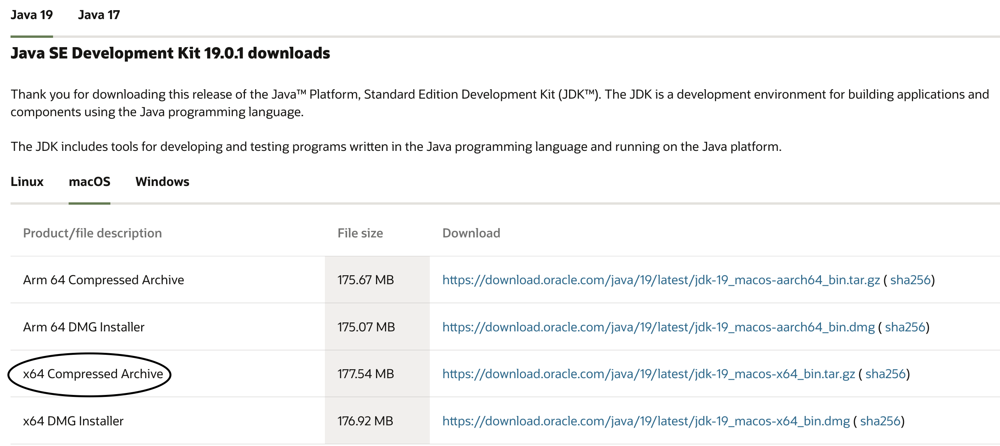
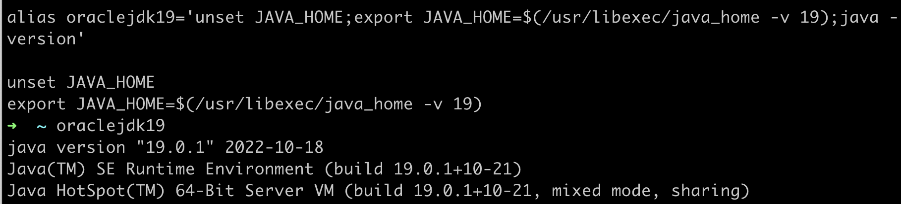
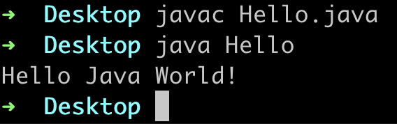
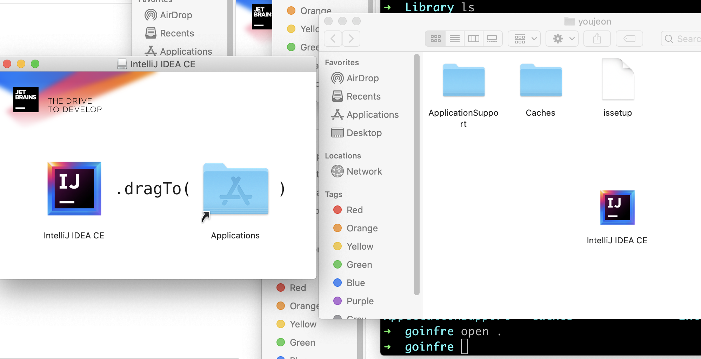
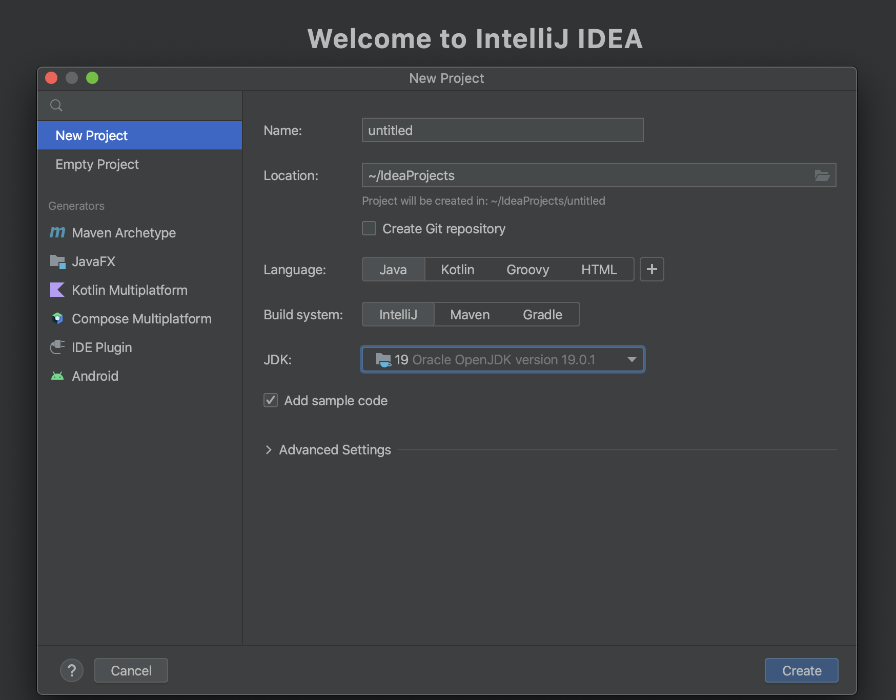
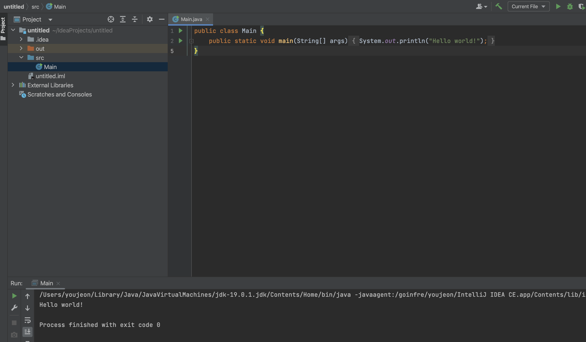
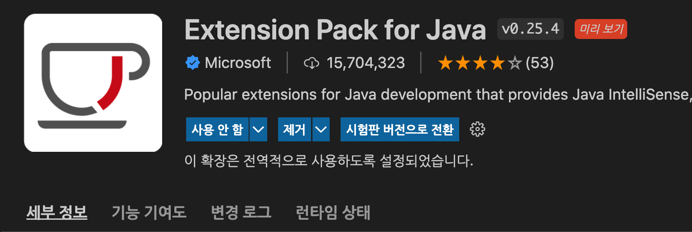
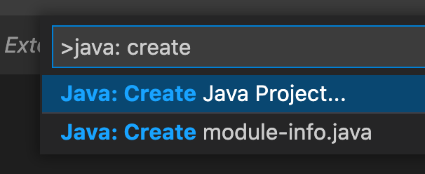
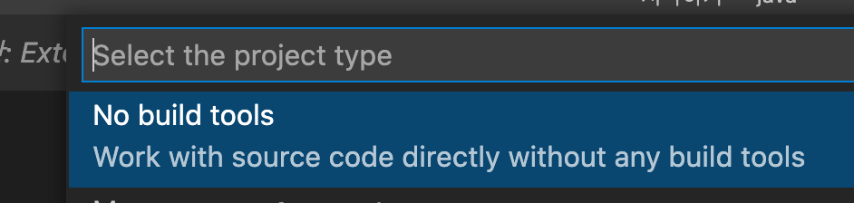
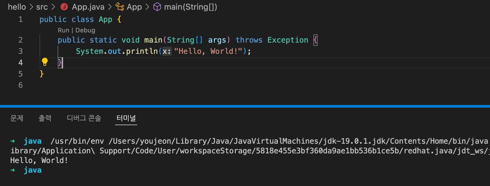

# JAVA

- 설치
    
    [[MacOS 개발환경 #16] Oracle JDK 14 ~ 17 설치 / 환경설정](https://tlo-developer.tistory.com/296)
    
    [[MacOS 개발환경 #5] JDK 버전 변경하기](https://tlo-developer.tistory.com/290)
    
    [Microsoft Visual Studio Code에서 Java 개발 환경 설정하기](https://offbyone.tistory.com/437)
    
    
    
    우선 JAVA JDK를 설치한다. 19나 17 중에 용도에 맞게 x64 Compressed Archive 버전으로 다운로드를 한다.
    
    [https://www.oracle.com/java/technologies/downloads/#jdk19-mac](https://www.oracle.com/java/technologies/downloads/#jdk19-mac)
    
    DMG 는 인스톨러를 실행해서 설치하는 방식이고 Compressed 는 압축파일을 받아서 내가 직접 설치하는건데, 클러스터 아이맥에서는 관리자 권한을 취득하지 못하다보니 DMG로 설치할수가없다. 그래서 윈도우 같은 느낌으로 환경변수등을 직접 설정해줘야 한다.
    
    다운로드 되는동안 Library > Java > JavaVirtualMachines 폴더를 만들어주고, JDK 설치가 다 되면 압축을 풀어서 방금 만든 폴더 안에 집어넣는다.
    
     19 설치시 ~/.zshrc 에 아래 설정을 추가한다. 17 설치시엔 19라고 쓰인 부분을 17로 수정하면 동일하다.
    
    ```Java
    alias oraclejdk19='unset JAVA_HOME;export JAVA_HOME=$(/usr/libexec/java_home -v 19);java -version'
    
    unset JAVA_HOME
    export JAVA_HOME=$(/usr/libexec/java_home -v 19)
    ```
    
    
    
    
    vi 로 [Hello.java](http://Hello.java) 를 만들어서 아래 코드를 집어넣고 javac 로 컴파일 후 java로 컴파일 한 파일을 실행해서 정상적으로 동작하는지 살펴보자 
    
    ```Java
    public class Hello {
        public static void main(String[] args) {
            System.out.println("Hello Java World!");
        }
    }
    ```
    
    
    
    그 다음엔 인텔리제이를 설치하거나 VSCode에서 Extension Pack for Java 를 설치해서 개발환경을 셋팅해야한다. 
    
    우선 인텔리제이는 용량을 많이먹기때문에 goinfre에 설치해줘야 한다. 아래 링크에서 커뮤니티 버전을 다운로드 받는다.
    
    [https://www.jetbrains.com/ko-kr/idea/download/#section=mac](https://www.jetbrains.com/ko-kr/idea/download/#section=mac)
    
    
    
    설치된걸 실행해보면 인텔리제이 파일을 Applications에 넣으라고 하는데, 클러스터 아이맥 특성상 이런 큰 파일을 설치하기엔 용량이 부족한 경우가 많으니 goinfre에 넣어준다.
    
    
    
     
    
    goinfre에 옮긴 인텔리제이 실행시 바로 자바 프로젝트를 만들수있다.
    
    
    
    프로젝트를 만들었을때 자동으로 만들어주는 Hello World를 실행하여 정상적으로 컴파일과 실행이 되는지 확인할수있다.
    
    
    
    VSCode에서는 위에서 말한것처럼 자바 익스텐션을 우선 설치해준다.
    
    
    
    해당 익스텐션에서는 JAVA_HOME 환경변수를 이용하여 프로젝트를 만든다고 되어있는데, zshrc 설정에서 이미 해당 환경변수를 만들었으므로 다른 설정은 필요없다
    
    [https://github.com/redhat-developer/vscode-java#setting-the-jdk](https://github.com/redhat-developer/vscode-java#setting-the-jdk)
    
    
    
    커맨드 + 쉬프트 + P를 눌러서 명령팔렛트를 열고 java: create라고 치면 자바 프로젝트를 만들수있다. 지금 단계에선 다른 빌드툴은 필요없으므로 no build tools 를 선택하면 프로젝트를 만들수있다.
    
    
    
    
    
    처음에 자동으로 Hello World가 생기는데 F5를 눌러서 컴파일을 해보면 정상적으로 출력되는걸 확인할수있다.
    
    
    

- 배우기 전에 익숙해지기
    
    [어려운 것을 쉽게 배우는 방법 : 슈퍼 파워를 장착하기 위한 3단계 학습법](https://www.moreagile.net/2016/02/learning-new-stuff.html?m=1)
    
    이미 자바를 어느정도 사용해본적이 있어서 뭘 알고 뭘 모르는지를 확실하게 하면서 배워야 할 내용을 정리하기 위해 우선 점프 투 자바의 예제들을 직접 입력해보면서 어느 부분을 모르는지 표시하기로 했다.
    
    - 구구단
        
        [https://wikidocs.net/5749](https://wikidocs.net/5749)
        
        ```Java
        public class Main {
            public static void main(String[] args) {
                int n = 4;
        
                System.out.println(n * 1);
                System.out.println(n * 2);
                System.out.println(n * 3);
                System.out.println(n * 4);
                System.out.println(n * 5);
                System.out.println(n * 6);
                System.out.println(n * 7);
                System.out.println(n * 8);
                System.out.println(n * 9);
            }
        }
        ```
        
        int 변수에 숫자를 저장하고 그걸 콘솔에 출력해보았다.
        
        ```Java
        public class Main {
            public static void gugudan(int n) {
                System.out.println(n * 1);
                System.out.println(n * 2);
                System.out.println(n * 3);
                System.out.println(n * 4);
                System.out.println(n * 5);
                System.out.println(n * 6);
                System.out.println(n * 7);
                System.out.println(n * 8);
                System.out.println(n * 9);
        
            }
            public static void main(String[] args) {
                int n = 4;
        
                Main.gugudan(n);
            }
        }
        ```
        
        위에서 만든 코드 중 출력 부분을 함수로 빼서 모듈화했다.
        
        처음에는 gugudan 함수에 static이 없었는데, 그러면 컴파일이 되지않았다. 클래스의 함수인 메소드를 클래스 선언없이 사용하기위해서 static 키위드를 붙여줘야한다는건 cpp와 동일하였다. 
        
        ```Java
        class test {
            static void gugudan(int n) {
                System.out.println(n * 1);
                System.out.println(n * 2);
                System.out.println(n * 3);
                System.out.println(n * 4);
                System.out.println(n * 5);
                System.out.println(n * 6);
                System.out.println(n * 7);
                System.out.println(n * 8);
                System.out.println(n * 9);
            }
        }
        
        public class Main {
            public static void main(String[] args) {
                int n = 4;
                test.gugudan(n);
            }
        }
        ```
        
        gugudan 함수에는 public을 쓰지 않아도 정상적으로 컴파일 되었는데, 접근 지정자를 쓰지 않으면 public으로 되는건가 싶어서 해당 함수를 다른 클래스에 선언한 다음에 컴파일을 하자 정상적으로 실행이 되었다. 혹시나 싶어서 접근 지정자없이 변수를 만든다음 초기화하지않고 실행하자 0을 반환했다.
        
        cpp의 클래스에서는 접근지정자 없이 변수나 함수를 지정하면 private이고, 구조체는 public으로 되었던걸로 기억나는데 자바에서는 구조체가 따로 없고 클래스가 cpp의 구조체처럼 동작한다는 추측을 하게되었다. **(→ 접근 제한자와 패키지)**
        
        ```Java
        class test {
            static int i;
            static void gugudan(int n) {
                for (i = 1; i < 10; i++) {
                    System.out.println(n * i);
                }
            }
        }
        
        public class Main {
            public static void main(String[] args) {
                for (int i = 2; i < 10; i++) {
                    test.gugudan(i);
                    System.out.println();
                }
            }
        }
        ```
        
        for 문을 써봤는데 cpp와 비교했을때 똑같다고 느꼈다.
        
    - 3과 5의 배수 합하기
        
        [https://wikidocs.net/237](https://wikidocs.net/237)
        
        ```Java
        10 미만의 자연수에서 3과 5의 배수를 구하면 3, 5, 6, 9이다. 이들의 총합은 23이다.
        1000 미만의 자연수에서 3의 배수와 5의 배수의 총합을 구하라.
        ```
        
        직접 푼 풀이
        
        ```Java
        public class Main {
            public static void main(String[] args) {
                int n = 1;
                int ret = 0;
        
                while (n < 1000) {
                    if (n % 3 == 0)
                        ret = ret + n;
                    else if (n % 5 == 0)
                        ret = ret + n;
                    n++;
                }
                System.out.println("Result: ");
                System.out.println(ret);
            }
        }
        
        Result: 
        233168
        ```
        
        문법을 안읽고 cpp 라고 생각하고 풀었는데, 별다른 문제없이 컴파일이 되었다. while 이나 if else if 는 동일하게 사용해도 되는것 같은데, 전위연산자 후위연산자가 cpp 처럼 동작하는지를 따로 확인해보았다.
        
        ```Java
        public class Main {
            public static void main(String[] args) {
                int n = 0;
                int ret = 0;
        
                while (++n < 1000) {
                    if (n % 3 == 0)
                        ret = ret + n;
                    else if (n % 5 == 0)
                        ret = ret + n;
                }
                System.out.println("Result: ");
                System.out.println(ret);
            }
        }
        Result: 
        233168
        
        public class Main {
            public static void main(String[] args) {
                int n = 0;
                int ret = 0;
        
                while (n++ < 1000) {
                    if (n % 3 == 0)
                        ret = ret + n;
                    else if (n % 5 == 0)
                        ret = ret + n;
                }
                System.out.println("Result: ");
                System.out.println(ret);
            }
        }
        Result: 
        234168
        ```
        
        추측한것과 동일하게 전위 연산자와 후위 연산자는 cpp와 동일하게 동작하는것 같다. 결과값을 보면 n 이 1000일때에도 반복문 안에 들어가서 값이 한번 더 추가되었다는걸 알수있다. 
        
        답지
        
        ```Java
        public class Problem1 {
            public static void main(String[] args) {
                int result = 0;
                for (int n = 1; n < 1000; n++) {
                    if (n % 3 == 0 || n % 5 == 0) {
                        result += n;
                    }
                }
                System.out.println(result);
            }
        }
        
        233168
        ```
        
        정답은 동일하게 출력되었고, or 문(’||’) 과 += 연산자도 cpp와 동일하게 동작할것이라고 추측해볼수있었다.
        
    
- 궁금한 내용 정리
    - (구구단 →)접근 제한자와 패키지
        
        [https://gyrfalcon.tistory.com/entry/JAVA-접근-제한자](https://gyrfalcon.tistory.com/entry/JAVA-%EC%A0%91%EA%B7%BC-%EC%A0%9C%ED%95%9C%EC%9E%90)
        
        [https://kephilab.tistory.com/53](https://kephilab.tistory.com/53)
        
        [https://wikidocs.net/231](https://wikidocs.net/231)
        
        [https://mozi.tistory.com/549](https://mozi.tistory.com/549)
        
        구구단을 따라서 만들다가 다른 클래스나 클래스 안의 객체변수나 메소드에 public을 붙이지 않아도 정상적으로 동작하는걸 보고 정확한 이유가 궁금해서 찾아봤는데, 추측한것처럼 default 접근 제한자가 public인게 아니라 접근 제한자가 없을때에(혹은 default 를 직접 적어서) 사용하는 default 키워드가 따로 있었다.
        
        public 은 어디서든 접근할수있지만 default 는 ‘같은 패키지 안에서만’ 자유롭게 접근할수있다고한다. 즉 구구단의 예제에서는 test 클래스가 같은 패키지 안에 있었기 때문에 public을 지우더라도 문제없이 컴파일이 되었다. 해당 클래스가 다른 패키지로 이동되면 import 한다고 하더라도 접근할수없게된다.
        
        패키지란 자바에서 사용하는 하나의 작업 단위로 비슷한 성격의 클래스들을 하나의 폴더에 담는 역할을 한다. 선언은 `package src;` 형태로 하며, 다른 클래스의 클래스를 가져올때에는 `import src2.*;`  혹은 `import src2.test;` 라고 적어서 사용한다.
        
        구구단을 이용한 예제
        
        ```Java
        package src2;
        
        public class test {
            public static int i;
            public static void gugudan(int n) {
                for (i = 1; i < 10; i++) {
                    System.out.println(n * i);
                }
            }
        }
        ```
        
        ```Java
        package src;
        
        import src2.test;
        
        public class Main {
            public static void main(String[] args) {
                for (int i = 2; i < 10; i++) {
                    test.gugudan(i);
                    System.out.println();
                }
            }
        }
        ```
